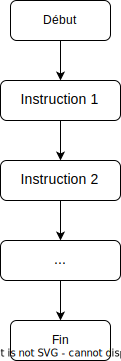
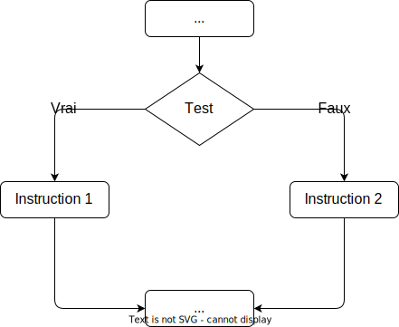
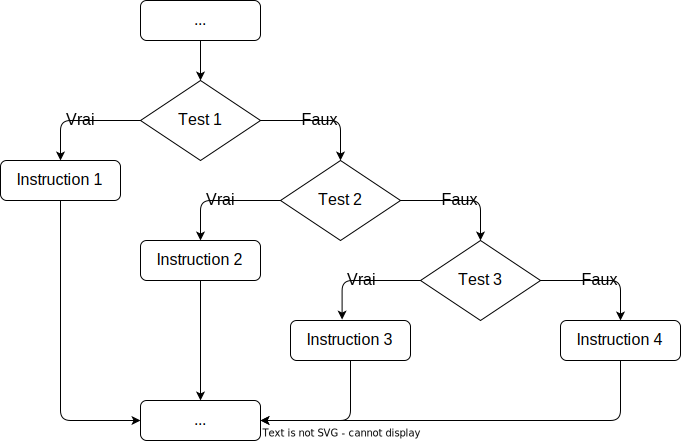
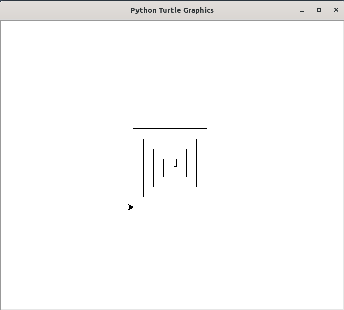

## 1. Introduction

Python est un **langage de programmation**, il s'agit donc d'un ensemble d'**instructions** qui va nous permettre d'écrire des **programmes** informatiques. 

Un programme est une suite d'instructions données à un **ordinateur** afin qu'il effectue une tâche déterminée.

Nous prendrons garde à différencier les termes _programme_ et _algorithme_. Observons pour cela les définitions données dans l'encyclopédie Wikipedia :

:octicons-info-16: **algorithme**

: Un algorithme est une suite finie et non ambiguë d'instructions et d'opérations permettant de résoudre un type de problèmes.

:octicons-info-16: **programme informatique**

: Un programme informatique est un ensemble d'instructions et d'opérations destinées à être exécutées par un ordinateur.

Un algorithme ne relève donc pas a priori du domaine de l'informatique. Cependant, la plupart des programmes informatiques sont la traduction d'un algorithme dans un certain langage de programmation.

Remarquons enfin que le mote _algorithme_ vient d'Al-Khwârizmî (en arabe : الخوارزمي), nom d'un mathématicien persan du IXe siècle. 

Il existe de nombreux langages de programmation et, même en utilisant un même langage, un algorithme peut être programmé de différentes façons. Un algorithme donné peut donc correspondre à de très nombreux programmes informatiques différents.

Cependant, un ordinateur n'est qu'une machine électrique qui ne peut comprendre directement que des suites d'instructions exprimées en langage machine par des suites de 0 et de 1. Le rôle d'un langage de programmation est de fournir au programmeur une **syntaxe** et une **grammaire** pour lui permettre d'exprimer des instructions de manière plus facilement compréhensible pour un être humain. Ce programme est ensuite traduit en langage machine, puis exécuté.

Cette traduction est faite, suivant les langages, par un **compilateur** (programme qui crée un fichier exécutable à partir du code source) ou par un **interpréteur** (programme qui lit, traduit et exécute immédiatement une à une les instructions du code source).

En NSI, nous allons nous focaliser sur le langage **Python**.


Le langage Python a été créé en 1989 par l'informaticien néerlandais [Guido van Rossum](https://fr.wikipedia.org/wiki/Guido_van_Rossum){ target=_blank} qui l'a nommé ainsi en hommage à la série télévisée des [Monty Python](https://fr.wikipedia.org/wiki/Monty_Python){target=_blank} dont il était fan.


Pour installer et utiliser Python voir [cette page](../../../ressources/python_IDE.md).

## 2. Variables et affectation

Dans un programme, on utilise des variables pour stocker des données.

Une variable est déterminée par un nom de variable que l'on peut choisir librement. Il est néanmoins conseillé de choisir un nom **court et auto-descriptif** afin de comprendre à la lecture le rôle de cette variable. 

Un nom de variable ne peut pas commencer par un chiffre et ne doit pas contenir de caractères spéciaux autres que "_" ou d'espace.

Il est conseillé d'utiliser plutôt des lettres minuscules, en séparant les mots par le caractère ”_” ou en utilisant des majuscules à l'intérieur du nom. Une variable prévue pour contenir un prix de revient pourra par exemple être nommée `prix_de_revient` ou `prixDeRevient`. Des recommendations précises de style de programmation Python sont rassemblées à cette adresse : [https://peps.python.org/pep-0008/](https://peps.python.org/pep-0008/){target=_blank}.

!!! info "À retenir"
	Pour affecter une valeur à une variable, on utilise simplement le signe ”=”.

L'instruction `pi = 3.14` a pour effet de :

1. créer le nom de variable `pi` dans la mémoire de l'ordinateur ;
2. créer la valeur `3.14` dans la mémoire de l'ordinateur ;
3. établir un lien entre le nom `pi` et l'emplacement de la valeur `3.14` dans la mémoire de l'ordinateur.

On dira donc qu'une variable est l'association d'un nom et d'une valeur

En mode interactif, il suffit de taper le nom d'une variable et de valider pour afficher sa valeur. En mode programme, on utilisera la fonction `print()`pour afficher le contenu d'une variable à l'exécution.

Il est possible d'affecter des valeurs à plusieurs variables simultanément.

La commande `a, b, c = 2, 2.5, "toto"` affecte par exemple la valeur `2` à la variable `a`, la valeur `2.5` à la variable `b` et la valeur `”toto”` à la variable `c`
.
Ces trois variables sont de **types** différents : `a` est un entier, `b` est un nombre à virgule et `c` est une chaîne de caractères.

Lors de la définition d'une variable, ou lors d'une nouvelle affectation, python détecte automatiquement le type de variable à définir en fonction de la valeur affectée. On parle de **typage dynamique**. D'autres langages de programmation imposent que les noms des variables et leur type soient déclarés avant toute affectation : on parle alors de **typage statique**.

La fonction `type()` permet de connaître le type d'une variable déjà définie.

!!! info "À retenir"
	Les types de base sont :

	* type `int` : ce sont les nombres entiers (integer). Ils supportent les opérations +, −, \*, /, \** (puissance), // (quotient entier), % (reste entier), abs() (valeur absolue) ;
	* type `float` : ce sont les nombres à virgule (on parle de virgule flottante), qui supportent les opérations usuelles ;
	* type `string` : ce sont les chaines de caractères.

**Remarque** : on peut effectuer un calcul et en même temps affecter le résultat à une variable, ou en même temps afficher le résultat en composant les instructions. Par exemple, la commande `prix = 64 * (1 + 19.6 / 100)` effectue d'abord le calcul indiqué après le signe `=`, puis affecte le résultat à la variable `prix`. On peut aussi exécuter la commande `print("Le prix est : ", 64 * (1 + 19.6 / 100))`.

**Remarque** : en Python, il est très facile d'échanger le contenu de deux variables, en utilisant une double affectation :

```py linenums="1"
a = "Bonjour"
b = "NSI"
a, b = b, a
```

Après l'exécution de ces trois lignes, la variable `a` renvoie la valeur `"NSI"` et `b` correspond à `"Bonjour"`.

!!! note "Méthode utile"
	Pour bien comprendre un programme, on peut dresser un **tableau d'état** dans lequel on affiche les valeurs successives des variables.

	Le tableau d'état du programme ci-dessus s'écrit : 

	| Etape | `a` | `b` |
	| --- | --- | --- |
	| 1 | `"Bonjour"` | |
	| 2 | `"Bonjour"` | `"NSI"` |
	| 3 | `"NSI"` | `"Bonjour"` |

## 3. Opérations sur les chaînes de caractères

L'utilisation du signe + ne se limite pas à l'addition. Appliqué à des chaînes de caractères, il réalise l'opération de **concaténation**.

:octicons-info-16: **Concaténation**

: Le terme concaténation (substantif féminin), du latin cum («avec») et catena(«chaîne, liaison»), désigne l'action de mettre bout à bout au moins deux chaînes. ((Wikipédia))

Si on considère le programme suivant :

```python
a = "Hello"
b = "World"
mon_expression = a + b
```
après l'exécution de ce programme, la variable `mon_expression` aura pour valeur  `"HelloWorld"`.

Il est aussi possible de concaténer une chaîne de caractères et une ou plusieurs variables de type `str` :

```python
ma_chaine_1 = "Bonjour "
ma_chaine_2 = "le "
res = ma_chaine_1 + ma_chaine_2 + "monde !"
```
Après l'exécution de ce programme, la variable  `res`  aura pour valeur `"Bonjour le  monde !`.

Les deux noms `ma_chaine_1` et `ma_chaine_2` sont associés à deux chaînes de caractères, nous avons donc bien ici une concaténation.

Que se passe-t-il si nous avons ce cas de figure :

```python
a = "Nombre de pommes : "
b = 4 
c = a + b
```

`a` est de type `str`, alors que `b` est de type `int`. Le signe `+` représente une addition ou une concaténation ? Ni l'un, ni l'autre, puisque Python vous renverra une erreur : il ne peut pas concaténer, ni additionner un entier et une chaîne de caractère.

La solution : transformer le nombre 4 en caractère 4 à l'aide de la fonction `str()` :

```python
a = "Nombre de pommes : "
b = 4 
c = a + str(b)
```
Nous avons maintenant une concaténation, car `str(4)` est de type `string`.

Autre solution pour faire cohabiter des variables de type `int` ou `float` avec des variables de type `str` : les **fstring** (attention les **fstring** sont uniquement disponible à partir de Python 3.5)

Il est possible d'écrire :

```python
a = "Nombre de pommes :"
b = 4 
c = f"{a} {b}"
```

après l'exécution du programme ci-dessus, la variable `c` aura pour valeur `"Nombre de pommes : 4"`.

Dans la chaîne de caractère, `{a}` sera remplacé par la valeur de la variable `a`, c'est-à-dire `"Nombre de pommes :"`. Même chose avec `{b}` qui sera remplacé par la valeur de `b`, c'est-à-dire 4.

Autre exemple d'utilisation des fstring :

```python
num_train = 4232
dest = "Paris" 
c = f"Le train n°{num_train} à destination de {dest} entre en gare" 
```

Après l'exécution du programme ci-dessus, la variable `c` aura pour valeur `"Le train n°4232 à destination de Paris entre en gare"`.

Notez la présence du "f" juste avant le guillemet et des accolades qui encadrent le nom de la variable. Il est nécessaire d'ajouter ce "f" pour avoir une fstring.

!!! danger "Entrées utilisateurs avec `input()`"
	La fonction `input()` permet de demander à l'utilisateur d'entrer une valeur dans la console et de récupérer cette valeur en l'affectant à une variable.

	On pourra par exemple tester le script suivant :

	````py
	nom = input("Quel est votre nom ? : ")
	print("Bonjour", nom, " ! ")
	````

	Une erreur courante consiste à demander l'entrée d'une valeur numérique et à l'utiliser directement dans un calcul. Le script suivant, par exemple : 

	````py
	rayon = input("Entrer le rayon du cercle : ")
	peri = 2 * 3.14 * rayon
	print("La longueur du cercle est :", peri)
	````

	conduit à : 

	````pycon
	TypeError: can't multiply sequence by non-int of type 'float'
	````

	La fonction `input()` retourne toujours **une chaîne de caractères**. Pour une entrée numérique, cette chaîne de caractère doit être **évaluée**, par exemple avec la fonction `eval()` qui retournera un type numérique `int` ou `float` selon les cas.

	Le script ci-dessous produit le résultat attendu :

	````py
	rayon = eval(input("Entrer le rayon du cercle : "))
	peri = 2 * 3.14 * rayon
	print("La longueur du cercle est :", peri)
	````

!!! question "Exercices"
	:octicons-link-16: [Fiche d'exercices sur les variables, les affectations et les chaînes de caractères](python_bases_exos_1.md){target=_blank}.

## 4. Booléens

Pour l'instant nous avons vu deux grands types de données : les nombres (entier ou flottant) et les chaînes de caractères, il existe un troisième type tout aussi important que les deux premiers : les booléens. Un booléen est un type de données qui ne peut prendre que deux valeurs : vrai (`True`) ou faux (`False`). Une expression est soit `True`, soit `False`.

Les opérateurs de comparaison renvoient des booléens.

!!! note "Opérateurs de comparaison"
	* `a == 0` : teste si `a` est **égal** à 0 ;
	* `a != 0` : teste si `a` est **différent** de 0 ;
	* `a < 0` : teste si `a` est **strictement inférieur à** 0 ;
	* `a > 0` : teste si `a` est **strictement supérieur à** 0 ;
	* `a <= 0` : teste si `a` est **inférieur ou égal à** 0 ;
	* `a >= 0` : teste si `a` est **supérieur ou égal à** 0.

!!! danger "ATTENTION"
	Notez le double égal `==` qui permet de distinguer un test d'égalité d'une affectation (association d'une valeur à un nom (variable). Le fait de confondre le "simple égal" et le "double égal" est une erreur classique qu'il faut éviter.

Il est aussi possible de combiner plusieurs opérateurs booléens grâce aux opérateurs logiques `or` et `and`. On peut représenter le fonctionnement de ces opérateurs dans un tableau, appelé **table de vérité** :

Table de vérité pour `or`

| exp1 | exp2  | exp1  or  exp2 |
| --- | --- | --- |
| True  | True | True |
| True  | False | True |
| False  | True | True |
| False  | False | False |

Table de vérité pour `and`

| exp1 | exp2  | exp1  and  exp2 |
| --- | --- | --- |
| True  | True | True |
| True  | False | False |
| False  | True | False |
| False  | False | False |

On trouve aussi `not` comme opérateur logique de négation avec la table de vérité suivante :

| exp | not (exp) |
| --- | --- |
| True | False |
| False | True |

!!! danger "Attention !"
	On peut combiner des opérateurs arithmétiques,  de comparaison  et logiques pour créer des expressions booléennes complexes. Il faut prêter attention aux **règles de priorité**. Les parenthèses sont prioritaires sur tous les autres opérateurs donc on peut les utiliser quand on n'est pas certain des règles de priorité ou pour s'en affranchir.

Nous reviendrons sur les booléens en cours d'année dans une séquence ultérieure.

## 5. Instructions conditionnelles

Dans les scripts précédents, les séquences d'instructions sont exécutées ligne après ligne, dans l'ordre où elles sont écrites, suivant un organigramme simple du type ci-dessous.



Une instruction conditionnelle permet d'indiquer à python de ne pas exécuter une suite de commandes dans l'ordre où elles sont écrites, mais de suivre différents chemins selon les circonstances.

L'idée de base est la suivante :

```py
if test:
	instruction1
else:
	instruction2
```

Si "test" est True alors "instruction1" est exécuté et "instruction2" est ignoré.

Sinon (sous-entendu que "test" est False) "instruction2" est exécuté et "instruction1" est ignoré.



Plusieurs conditions peuvent être testées : on utilise pour cela le mot-clef `elif`, contraction de _else if_ :

```py
if test1:
	instruction1
elif test2:
    instruction2
elif test3:
    instruction3
else:
	instruction4
```

Dans ce cas, si `test1` est True, `instruction1` est exécutée et tout le reste est ignoré. Sinon, si `test2` est True, alors `instruction2` est exécutée et tout le reste est ignoré. Si `test1` et `test2` sont False et `test3` True, alors `instruction3` est exécutée. Si les trois tests sont False, c'est `instruction4` qui est exécutée.



!!! note "Remarques"
	* Seul `if` est nécessaire dans une instruction conditionnelle. Les commandes `elif` et `else` sont optionnelles.
	* Le bloc d'instructions conditionnelles est introduit par une ligne se terminant par une instruction `if`, `elif` ou `else` suivie d'un double point.
	* Ce bloc est délimité par une **indentation** spécifique : décalage de 4 espaces vers la droite.
	* Dans tout éditeur de programme digne de ce nom, cette indentation se fait automatiquement quand on tape "Entrée" à la fin d'une ligne se terminant par un double point.

Si on considère le programme suivant :

```python
a = 4
b = 7
if a < b:
	print("Je suis toto.");
	print("Je n'aime pas titi.")
else:
	print("Je suis titi.")
	print("Je n'aime pas toto.")
print("En revanche, j'aime le Python.")
```
nous avons `a < b` qui est True, nous allons donc exécuter les  2 lignes 

```python
print("Je suis toto.");
print("Je n'aime pas titi.")
```
les lignes 

```python
print("Je suis titi.")
print("Je n'aime pas toto.")
```
seront ignorées.

En revanche la ligne 
```python
print("En revanche, j'aime le Python.")
```
sera systématiquement exécutée.

L'exécution de ce programme permettra d'afficher à l'écran :

```pycon
Je suis toto.
Je n'aime pas titi.
En revanche, j'aime le Python.
```

Si maintenant on considère ce programme :

```python
a = 8
b = 7
if a < b:
	print("Je suis toto.");
	print("Je n'aime pas titi.")
else:
	print("Je suis titi.")
	print("Je n'aime pas toto.")
print("En revanche, j'aime le Python.")
```
L'exécution de ce programme entraînera l'affichage suivant  :

```pycon
Je suis titi.
Je n'aime pas toto.
En revanche, j'aime le Python.
```

!!! question "Exercices"
	:octicons-link-16: [Fiche d'exercices sur les instructions conditionnelles](python_bases_exos_2.md){target=_blank}.

## 6. Boucle conditionnelle

La notion de boucle est fondamentale en informatique. Une boucle permet d'exécuter plusieurs fois des instructions qui ne sont présentes qu'une seule fois dans le code.

Deux types de boucles sont à distinguer : la **boucle conditionnelle**, introduite par le mot-clef `while` et le **boucle bornée**, introduite par le mot-clef `for`.

La structure de la boucle `while` est la suivante :

```py
while expression:
	instruction1
	instruction2
suite programme
```

Tant que `expression` sera `True`, on exécutera encore et encore `instruction1` et `instruction2`. Après chaque exécution de `instruction1` et `instruction2` (on dit souvent "après chaque tour de boucle"), `expression` sera de nouveau évaluée (pour savoir si elle est toujours `True` ou si elle est devenue `False`)

Quand `expression` deviendra `False` on passera directement à `suite programme` (sans entrer de nouveau dans la boucle),  la  boucle sera terminée.

{width=30%}

Que se passe-t-il si `expression` ne devient jamais `False` ?  On entre alors dans  une boucle "infinie" : c'est une erreur classique en programmation (aucun programme "bien fait" ne tombe dans une boucle infinie, s'il y a une boucle infinie, c'est qu'il y a forcement une erreur dans votre programme). C'est la raison pour laquelle je n'appelle pas ces boucles des boucles _non bornées_ comme on le trouve souvent : en effet, une boucle `while` est bornée, mais **on ne sait pas à l'avance combien de fois on va passer dans la boucle**. Ce nombre de passages dans la boucle dépend de l'évaluation de `expression`.

Considérons le programme suivant :

```python
i = 0
while i < 3  :
	print(i)
	i = i + 1
print("FIN")
```

Voici comment analyser ce programme :

* Au début de l'exécution de ce programme nous avons la variable i qui a pour valeur 0. 

* Nous arrivons ensuite au niveau du while :  l'expression i < 3  est True, on "entre" donc dans la boucle : on  affiche la valeur de i : 0 et on incrémente  i de 1 (i a maintenant pour valeur 1)

* Nous passons au  2e tour de boucle : l'expression i < 3  est True, on "entre" donc dans la boucle : on affiche la valeur de i : 1 et on incrémente  i de 1 (i a maintenant pour valeur 2).

* Nous passons au  3e tour de boucle : l'expression i < 3  est True, on "entre" donc dans la boucle : on affiche la valeur de i :  2 et on incrémente  i de 1 (i a maintenant pour valeur 3).

* Nous passons au  4e tour de boucle : l'expression i < 3  est False (3 n'est pas strictement inférieur à 3), on n'entre pas dans la  boucle et on passe à l'instruction qui suit immédiatement la boucle : on exécute `print("FIN")` et le programme s'arrête (il n'y a plus d'instruction après)

Après l'exécution de ce programme, nous aurons à l'écran :

```pycon
0
1
2
FIN
```

Il est très important que vous soyez capable d'effectuer l'analyse d'un programme comme nous venons de la faire ci-dessus, cela vous permettra d'éviter beaucoup d'erreurs. Cette analyse peut se faire à l'aide d'un tableau d'état (étape 0 : initialisation, étape 1 : état du programme **après** le premier passage dans la boucle): 

| Etape | `i` | `i<3` |
| --- | --- | --- |
|0 | 0 | `True`|
|1|1|`True`|
|2|2|`True`|
|3|3|`False`|

## 7. Boucle bornée

Une **boucle bornée** `for` peut être utilisée lorsque l'**on connaît le nombre d'itérations** au moment de la programmation.

La structure de la boucle `for` est la suivante :

```python
for truc in machin:
	instruction1
	instruction2
suite programme
```

Les instructions `instruction1` et `instruction2` sont exécutées autant de fois qu'il y a de `truc` dans `machin`. `machin` doit être un _objet itérable_, c'est-à-dire à partir duquel on peut générer une suite de valeurs bien déterminées. Pour l'instant, nous nous contenterons de deux situations :

* itération sur une chaîne de caractère : la variable `truc` prend alors successivement pour valeur tous les caractères de la chaîne `machin` ;

```python
for lettre in "ciao":
    print(lettre)
```

* itération sur une séquence d'entiers générée par la fonction `range()` : par exemple si `machin` est `range(10)`, alors `truc` prendra successivement toutes les valeurs entières de 0 à 9.

```python
for i in range(5):
    print(3*i)
```

!!! note "Utilisation de la fonction `range()`"
	* `range(n)` génère une séquence de nombres entiers en commençant par 0 et jusqu'à $n$ **exclu** ;
	* `range(k, n)` génère une séquence de nombres entiers en commençant par $k$ et jusqu'à $n$ **exclu** ;
	* `range(k, n, p)`génère une séquence de nombres entiers en commençant par $k$ et jusqu'à $n$ **exclu**, avec un pas de $p$ ;

Si $p$ est négatif et $k>n$, on peut définir une séquence décroissante d'entiers.

**Remarques**

* Une boucle `for` peut toujours être remplacée par une boucle `while`. Le programme suivant est équivalent au précédent :

```python
i = 0
while i<5:
    print(3*i)
	i = i + 1
```

* La réciproque est fausse : pourquoi ?
* Les boucles peuvent être **imbriquées**. Par exemple, le programme ci-dessous affichera la liste des couples d'entiers $(i;j)$ avec $0\leqslant i<j\leqslant 4$.

```python
for i in range(5):
	for j in range(i+1,5):
		print(i, j)
```

!!! question "Exercices"
	:octicons-link-16: [Fiche d'exercices sur boucles](python_bases_exos_3.md){target=_blank}.

## 8. Fonctions

Lors du développement d'un projet informatique, de nombreuses lignes de programme sont souvent nécessaires.

Pour clarifier le code et rendre sa compréhension, et donc sa correction, plus faciles, il est possible de le décomposer en plusieurs sous-programmes plus simples qui peuvent être étudiés séparément.

D'autre part, il arrivera souvent qu'une même séquence d'instructions doive être utilisée à plusieurs reprises dans un programme, et on souhaitera bien évidemment ne pas avoir à la reproduire systématiquement.

Pour cela, nous pouvons définir de nouvelles **fonctions**, c'est-à-dire donner un nom à un groupe d'instructions, qui pourra être appelé à plusieurs reprises dans le programme principal. Cela revient à définir de nouvelles instructions.

En python, la syntaxe est la suivante :

```python
def ma_fonction(liste des arguments de la fonction) :
	...
	# groupe d'instructions
	...
```

Remarquez les deux points et l'indentation. La première ligne, introduite par `def` est l'**entête** ou la **signature** de la fonction.

Voici un premier exemple de fonction qui prend en paramètre un nombre entier $n$ :

```python
def table(n) :
	for k in range(11) :
		print(n, "fois", k, "font", n * k)
```

Pour exécuter cette fonction, il suffit d'écrire par exemple `table(4)` et on obtient l'affichage suivant :

```pycon
4 fois 0 font 0
4 fois 1 font 4
4 fois 2 font 8
4 fois 3 font 12
4 fois 4 font 16
4 fois 5 font 20
4 fois 6 font 24
4 fois 7 font 28
4 fois 8 font 32
4 fois 9 font 36
4 fois 10 font 40
```

Une fonction peut avoir plusieurs paramètres. Ils doivent alors être séparés par des virgules.

Par exemple, la fonction ci-dessous affiche le prix TTC en fonction du prix hors taxes et du taux de la taxe, donné en pourcentage :

```python
def prixTTC(prixHT, taux) :
	print(prixHT*(1+taux/100))
```

On a souvent besoin de définir une fonction qui calcule une valeur ou qui retourne le résultat d'un algorithme. Il faut alors utiliser l'instruction `return` suivie du nom de la variable contenant la valeur à retourner.

```python
# definition d'une fonction
def aire_triangle(base, hauteur) :
	aire = base * hauteur / 2
	return aire

# programme principal
a = aire_triangle(2, 3)
print(a)
```

**Remarque** : Python propose des fonction prêtes à être utilisées par le programmeur : les fonctions natives (**built-in function** en anglais). Nous avons déjà eu l'occasion d'en voir deux avec `type` (qui renvoie le type d'une variable) et `str` qui renvoie la chaîne de caractère obtenue à partir d'un nombre (`str(4)` renvoie le caractère "4"). Il existe beaucoup d'autres fonctions natives Python (il en existe plus de 50). Nous pouvons en citer deux autres :

- la fonction `len` prend en paramètre une chaîne de caractères et renvoie le nombre de caractères présents dans cette chaîne de caractères (par exemple `len("azerty")` renvoie 5)

- la fonction `print` permet d'afficher à l'écran la valeur qui lui est passée en paramètre.

!!! info "Point de vocabulaire"
	Dans ce qui précède, nous avons utilisé le terme **fonction** de manière très générale. Nous devons différencier deux types de "fonctions".

	* un groupe d'instruction qui **retourne** une valeur au programme principal est appelé une **fonction**. Une fonction **ne réalise pas d'affichage** : elle communique avec le programme principal par ses arguments et la valeur retournée.
	* un groupe d'instruction qui **ne retourne pas de valeur** et qui peut éventuellement effectuer des affichages sera appelé une **procédure**.

	Par exemple, le script ci-dessus qui affiche une table de multiplication et celui qui est nommé `prixTTC` sont des procédures. Par contre `aire_triangle` est une fonction.

## 9. Utilisation de bibliothèques

Il est possible d'utiliser d'autres fonctions "prêtes à l'emploi" en important des bibliothèques, aussi appelées **modules**. Un module est un fichier contenant des fonctions qui pourront être utilisées dans d'autres programmes.

De nombreuses bibliothèques sont fournies avec une installation standard de Python, d'autres doivent être installées séparément.

Le module `math` est un module très important puisqu'il comporte toutes les fonctions mathématiques classiques : cosinus, sinus, exposant, racine carrée...

Pour utiliser les fonctions présentes dans un module, il est nécessaire d'**importer** le module dans notre programme. Par exemple, pour pouvoir utiliser les fonctions du module `math` il faudra écrire :

```python
import math
```
au début de son programme.

Pour utiliser une fonction d'un module importé, il faudra préciser le nom du module qui propose cette fonction. Par exemple, pour déterminer le sinus de 3.14, il faudra écrire :

```python
math.sin(3.14)
```    
Voici une série de calculs qui fait appel à des fonctions issues du module maths :

```python
import math

a = 5
b = 16
c = 3.14
puis = math.pow(a,3)
racine = math.sqrt(b)
s = math.sin(c)
```
Après l'exécution de ce programme :

- la variable `puis` aura pour valeur $5^3 = 125$ ;
- la variable `racine` aura pour valeur $\sqrt{16}=4$ :
- la variable `s` aura pour valeur $\sin(3.14)\approx 0.05$.

Pour alléger l'écriture, on peut aussi importer toutes les fonctions du module directement dans notre programme en tapant : `from math import *`. Il n'est alors plus nécessaire de spécifier `math.` devant chaque fonction utilisée.

Parmi les modules que nous utiliserons pour débuter se trouvent : 

* le module `math` déjà cité ;
* le module `random` introduisant des fonctions permettant de générer des nombres aléatoires ;

| Fonction | Effet |
| --- | --- |
| `randrange(a,b)`|renvoie un entier aléatoire dans $[a;b[$|
| `randint(a,b)`|renvoie un entier aléatoire dans $[a;b]$|
| `random()`|renvoie un flottant aléatoire dans $[0;1[$|
| `uniform(a,b)`|renvoie un flottant aléatoire dans $[a;b]$|

* le module `turtle` est une implémentation en Python du langage [Logo](https://fr.wikipedia.org/wiki/Logo_(langage)) créé dans les années 1970 pour l'enseignement de l'informatique à l'école. Il est disponible dans la distribution standard de Python. En déplaçant une pointe de stylo qui peut être matérialisée par une tortue, on peut tracer des figures géométriques dans un repère cartésien dont l'origine est au centre de la fenêtre et dont l'unité par défaut est le pixel. Lorsqu'on déplace le crayon, il laisse une trace s'il est baissé ou pas de trace s'il est levé. Nous utiliserons les fonctions suivantes de turtle :

|Fonction| Effet|
| --- | --- |
| goto(x,y) |déplace la tortue jusqu'au point de coordonnées (x, y)|
| penup() |lever le crayon|
| pendown()| baisser le crayon|
| setheading(angle) |choisir l'angle d'orientation de la tortue en degrés|
| forward(n) |avancer de n pixels selon l'orientation de la tortue|
| left(a)| tourne à gauche de a degrés|
| right(a)| tourne à droite de a degrés|
| color("red") |choisir la couleur rouge (ou "black", "green", "blue" . . . )|

Pour connaître toutes les fonctions contenues dans une bibliothèque, on peut, après avoir tapé `import math` dans la console interactive, taper ensuite `help(math)`. On peut aussi consulter [la documentation officielle](https://docs.python.org/3/library/math.html).

Voici par exemple un programme qui génère la figure ci-dessous :

```python linenums="1"
import turtle as tt

def spirale(n):
    tt.penup()
    tt.goto(0,0)
    tt.pendown()
    c = 5
    for i in range(4):
        for j in range(4):
            tt.forward(c)
            c = 10 + c
            tt.left(90)
spirale(4)
tt.exitonclick()
```
{ width=40% }

Quelques remarques complémentaires sur ce programme : 

* à la ligne 1, on importe le module `turtle` en le renommant `tt` afin d'alléger l'appel aux fonctions de cette bibliothèque. Cette pratique est très courante.
* à la ligne 14, la fonction `exitonclick()` permet de fermer la fenêtre graphique en cliquant une fois à l'intérieur.

!!! danger "Création d'une bibliothèque personnelle"
	Il est aussi possible de créer un module personnel, regroupant toutes les fonctions que vous avez créées pour un projet particulier.

	Supposons par exemple que nous avons créé un fichier `MesFonc.py` dans lequel nous avons mis les définitions des fonctions `fonc1` et `fonc2`.

	Pour réutiliser ces fonctions dans un autre programme, on pourra importer le module `MesFonc` en tapant :

	* `from MesFonc import *` : import de toutes les fonctions du module, utilisables sans préfixe.
	* `from MesFonc import fonc1` : import uniquement de la fonction `fonc1`, utilisable sans préfixe.
	* `import MesFonc` : import de toutes les fonctions du module, utilisables avec préfixe. Pour appeler la fonction `fonc1`, on tapera `MesFonc.fonc1()`.
	* `import MesFonc as MF` : import de toutes les fonctions du module, utilisables avec préfixe alias, par commodité. Pour appeler la fonction `fonc1`, on tapera `MF.fonc1()`.

	Les deux dernières possibilités sont intéressantes, par exemple, lorsqu'une fonction du module a le même nom qu'une autre fonction Python.
	

## 10. Variables locales et variables globales

Considérons le programme suivant:

```python
def ma_fonc():
	i = 5
ma_fonc()
print (i)
```
Nous commençons par définir une fonction `ma_fonc` qui ne prend aucun paramètre et qui ne renvoie aucune valeur (absence du mot-clef `return`). Cette fonction attribue juste la valeur 5 a la variable ayant pour nom `i`.

A la 3e ligne du programme, nous exécutons la fonction `ma_fonc`. 

Rappelons que la fonction `print` permet d'afficher à l'écran la valeur qui lui est passée en paramètre. La 4e ligne de ce programme permet donc d'afficher la valeur de la variable `i` à l'écran.

On pourrait penser que ce programme va donc afficher 5 ! Pas du tout, nous avons le droit à l'erreur suivante :

```pycon
NameError: name 'i' is not defined
```

Le message d'erreur est suffisamment parlant, inutile de s'attarder dessus : la variable i n'est pas définie. A noter que cette erreur est déclenchée par la 4e ligne (le `print`).

Pourquoi cette erreur, la variable i est bien définie dans la fonction `ma_fonc` et la fonction `ma_fonc` est bien exécutée, où est donc le problème ?

En fait, la variable i est une variable dite **locale** : elle a été définie dans une fonction et elle "restera" dans cette fonction. Une fois que l'exécution de la fonction sera terminée, la variable i sera "détruite" (supprimée de la mémoire). Elle n'est donc pas accessible depuis "l'extérieur" de la fonction (ce qui explique le message d'erreur que nous obtenons, car le `print` est en dehors la fonction `ma_fonc`, la variable `i` n'est donc plus accessible).

Étudions maintenant un cas un peu plus complexe :

```python
i = 3
def ma_fonc():
	i = 5
ma_fonc()
print (i)  
```
On pourrait s'attendre à voir s'afficher la valeur 5 à l'écran. Pas du tout, nous ne rencontrons pas d'erreur cette fois, mais c'est la valeur 3 qui s'affiche à l'écran.

En fait dans cet exemple nous avons 2 variables i différentes : la variable i "**globale**" (celle qui a été définie en dehors de toute fonction) et la variable i "**locale**" (celle qui a été définie dans la fonction). Ces 2 variables portent le même nom, mais sont différentes (elles correspondent à des cases mémoire différentes). Au moment de l'exécution du `print` à la 5e ligne seule la variable globale existe encore (celle définie à la première ligne du programme), d'où l'affichage du 3.

Une variable globale peut être "utilisée" à l'intérieur d'une fonction :

```python
i = 3
def ma_fonc():
	print (i)
ma_fonc()
```
Attention, le `print` se situe dans la fonction (la ligne du `print` est bien indentée)

Ce programme permet d'afficher la valeur 3 à l'écran.

Quand on cherche à utiliser une variable dans une fonction, le système va d'abord chercher si cette variable se "trouve" dans l'espace local de la fonction, puis, s'il ne la trouve pas dans cet espace local, le système va aller rechercher la variable dans l'espace global. Pour le `print(i)` situé dans la fonction le système ne trouve pas de variable i dans l'espace local de la fonction `ma_fonc`, il passe donc à l'espace global et trouve la variable i (nous avons donc 3 qui s'affiche). 

Il est important de bien comprendre que dans la programme ci-dessous le système trouve une variable i dans l'espace local de la fonction, la "recherche" de la variable i se serait arrêtée là :

```python
i = 3
def ma_fonc():
	i = 5
	print (i)
ma_fonc()
```
et ce programme affiche la valeur 5 à l'écran. `i` a été trouvée dans l'espace local de la fonction `ma_fonc`, la recherche ne va donc pas plus loin (inutile de remonter jusqu'à l'espace global)

En revanche le programme ci-dessous génère une erreur : "UnboundLocalError: local variable 'i' referenced before assignment"

```python
i = 3
def ma_fonc():
	i = i + 1
ma_fonc()
print(i)
```

Il n'est à priori pas possible de modifier une variable globale (ici la variable `i`) dans une fonction.

Pour pouvoir modifier une variable globale dans une fonction, il faut le déclarer **explicitement** en utilisant le mot-clef `global` :

```python
i = 3
def ma_fonc():
	global i
	i = i + 1
ma_fonc()
print(i)
```
Ici, aucune erreur la valeur 4 est bien affichée à l'écran.

Il est fortement déconseillé de donner le même nom à une variable locale et à une variable globale pour éviter ce genre de confusions.

On évitera également l'emploi du mot-clef `global` car cette utilisation peut entraîner des "effets de bord".

!!! note "À retenir"
	Lorsqu'on écrit un programme, python crée un **espace de noms** ( _namespace_ ) dans lequel les noms des variables et des fonctions définies dans ce programme sont stockés.

	À l'intérieur de chaque fonction, il est possible de définir aussi des variables. Un nouvel espace de noms, **complètement indépendant** de l'espace de noms principal est crée pour chaque fonction.

	Par conséquent, une variable définie à l'intérieur d'une fonction n'est pas accessible depuis le programme principal et elle n'existe plus lorsque l'exécution de la fonction est terminée (même si elle porte le même nom qu'une variable du programme principal). On dit qu'il s'agit d'une variable **locale**.

On parle d'effet de bord quand une fonction modifie l'état d'une variable globale. Dans notre exemple ci-dessus, la fonction `ma_fonc` modifie bien la valeur de `i` : avant l'exécution de `ma_fonc`, `i` a la valeur 3, après l'exécution de la fonction `ma_fonc`, `i` est associé à la valeur 4. Nous avons donc bien un effet de bord.

Les effets de bords provoquent parfois des comportements non désirés par le programmeur (évidemment dans des programmes très complexes, pas dans des cas simplistes comme celui que nous venons de voir). Ils rendent aussi parfois les programmes difficilement lisibles (difficilement compréhensibles). À cause des effets de bord, on risque de se retrouver avec des variables qui auront des valeurs qui n'étaient pas prévues par le programmeur. On dit aussi qu'à un instant donné, l'état futur des variables est difficilement prévisible à cause des effets de bord. En résumé, on évitera autant que possible l'utilisation du "global".

!!! question "Exercices"
	:octicons-link-16: [Fiche d'exercices sur fonctions et la portée des variables](python_bases_exos_4.md){target=_blank}.
