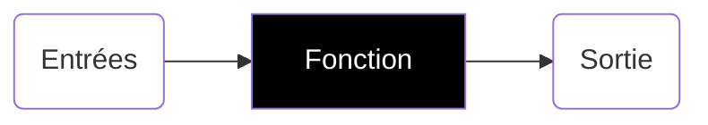
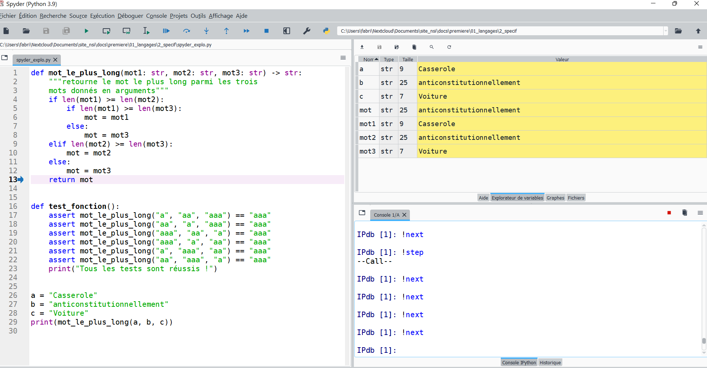

## 1. Prototyper une fonction

### Fonction comme boîte noire

Une fonction peut être considérée comme une **boîte noire** qui, à partir de **données**, renvoie une **sortie**.



La fonction ne gère pas la provenance des entrées ni la destination des sorties (variable, affichage, fichier, ...) : elle peut donc être utilisée dans différentes configurations d'entrées/sorties.

!!! info "À savoir"
    Les entrées d'une fonction sont appelées ses **paramètres** ou ses **arguments**.

### Spécifications d'une fonction

!!! note "Définition"
    Spécifier une fonction, c'est la documenter en :

    * décrivant ce qu'elle fait
    * énumérant les entrées attendues et leur type
    * précisant des conditions sur les entrées : on parle de **préconditions**
    * donnant le type de la valeur retournée
    * précisant des conditions sur la valeur retournée : on parle de **postconditions**

En Python, la spécification d'une fonction se fait juste sous sa signature sous la forme d'une chaîne de caractères encadrée de triples guillemets (appelée en anglais **docstring**), comme dans l'exemple ci-dessous :

````Python
def add_trois_nombres(m, n, p):
    """
    Renvoie la somme des trois entiers m, n et p

    Parameters
    ----------
    m : type int
    n : type int
    p : type int

    Returns
    -------
    type int

    """
    return m + n + p
````

!!! info
    Dans l'éditeur Spyder, des spécifications suivant le schéma ci-dessus peuvent être automatiquement générées juste après avoir tapé les triples guillemets `"""`.

Depuis la version 3.5 de Python, on peut préciser les types attendus pour les entrées et le type de la sortie avec des annotations simples. Cela permet d'alléger la spécification et d'écrire une docstring plus compacte.

````py
def add_trois_nombres(m: int, n: int, p: int) -> int:
    """Renvoie la somme des trois entiers m, n et p"""
    return m + n + p
````

La chaîne de documentation d'une fonction est utilisée par la fonction `help` de Python pour renseigner l'utilisateur.

````pycon
>>>help(add_trois_nombres)
Help on function add_trois_nombres in module __main__:

add_trois_nombres(m: int, n: int, p: int) -> int
    Renvoie la somme des trois entiers m, n et p
````

Les fonctions Python prédéfinies possèdent également une spécification que l'on peut consulter avec la fonction `help`.

### Vérification des préconditions

La spécification d'une fonction telle qu'elle est présentée ci-dessus est juste indicative et n'empêche pas un utilisateur de notre fonction de l'appeler avec des paramètres qui ne vérifient pas les préconditions, ce qui peut, dans la suite du programme, engendrer des erreurs.

Il est possible de vérifier les préconditions à l'intérieur de la fonction avec l'instruction `#!py assert`.

Une telle instruction se compose d'une condition (une expression booléenne) éventuellement suivie d'une virgule et d'une phrase en langue naturelle, sous forme d'une chaîne de caractères. L'instruction `#!py assert` teste si sa condition est satisfaite. Si c'est le cas, elle ne fait rien et sinon elle **arrête immédiatement l'exécution du programme** en affichant éventuellement la phrase qui lui est associée.

Tester par exemple la fonction ci-dessous avec des arguments entiers, puis avec des arguments non entiers.

````py
def add_trois_nombres(m: int, n: int, p: int) -> int:
    """Renvoie la somme des trois entiers n, m et p"""
    assert type(m) == int, 'm doit être un entier'
    assert type(n) == int, 'n doit être un entier'
    assert type(p) == int, 'p doit être un entier'
    return m + n + p
````

!!! info
    Lorsqu'on vérifie les préconditions sur les arguments au début du code d'une fonction, on parle de **programmation défensive**.

## 2. Mise au point de programmes

### Jeux de tests

Lors du développement d'un programme, il est nécessaire de savoir localiser les erreurs afin d'en comprendre l'origine et de pouvoir les corriger.

Outre les messages d'erreurs standard retournés pas Python, l'utilisation d'assertion sur des jeux de tests permet aussi d'aider à la mise au point d'une fonction ou d'un programme.

Il s'agit de tester les postconditions de la fonction sur une série d'exemples bien choisis. On parle alors de **tests unitaires**. Si l'un des tests unitaires est faux, alors il y a une erreur dans la fonction. Si tous les tests unitaires sont validés, il reste des risques de bugs car un **jeu de tests** ne peut en général pas couvrir toutes les possibilités existantes.

On peut rassembler ces tests unitaires dans une fonction ou un module.

````py
def add_trois_nombres(m: int, n: int, p: int) -> int:
    """Renvoie la somme des trois entiers n, m et p"""
    assert type(m) == int, 'm doit être un entier'
    assert type(n) == int, 'n doit être un entier'
    assert type(p) == int, 'p doit être un entier'
    return m + n + p


def test_add():
    """Jeu de tests unitaires pour la fonction add_trois_nombres"""
    assert add_trois_nombres(1, 2, 3) == 6
    assert add_trois_nombres(4, 5, 6) == 15
    assert add_trois_nombres(7, 8, 9) == 24
    print("Tests unitaires réussis")


test_add()
````

!!! note "Remarques et compléments"
    Si l'une des instructions `#!python assert` n'était pas vérifiée, alors l'exécution de la fonction de test serait interrompue et le message final se serait pas affiché.

    On peut traiter de façon plus fine les erreurs dans un script Python en utilisant les instructions du type :

    ````py
    try:
        instruction1
    except nom_de_l_exception:
        instruction2
    ````

    où `nom_de_l_exception` est une des exceptions (erreurs) natives de Python dont la liste se trouve dans la [documentation](https://docs.python.org/fr/3/library/exceptions.html#concrete-exceptions){target=_blank}.

    Pour plus d'informations sur `try ... except`, voir [la documentation](https://docs.python.org/3/tutorial/errors.html){target=_blank}.

### Utilisation des fonctionnalités de l'IDE

Selon l'éditeur utilisé pour écrire le programme, il est souvent possible d'exécuter un programme an mode débogage (debug), pas à pas, et d'observer en temps réel l'évolution du contenu des variables. Ces fonctionnalités facilitent grandement la mise au point d'un programme.



### Documentation du programme

Lors du développement d'un programme ou d'un projet, il est souvent utile, pour comprendre et corriger des erreurs, d'ajouter dans le code des sorties et des affichages (fonction `print`) qui peuvent permettre de connaître l'état d'une variable particulière à un endroit précis du programme.