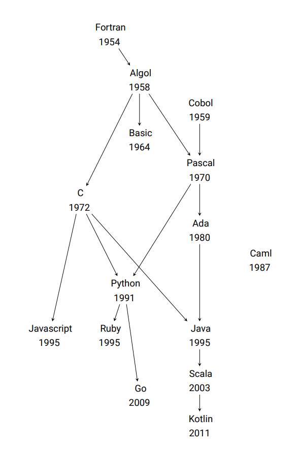
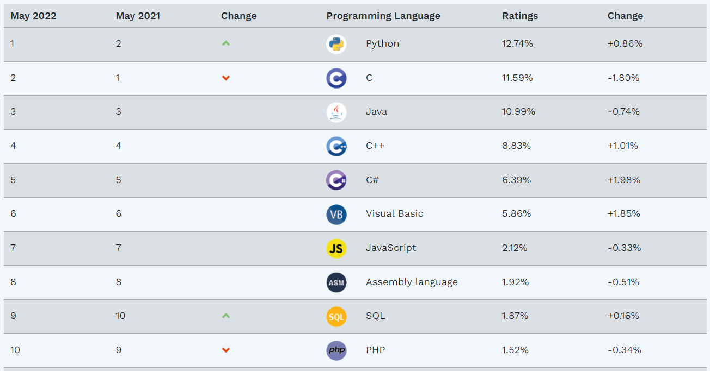
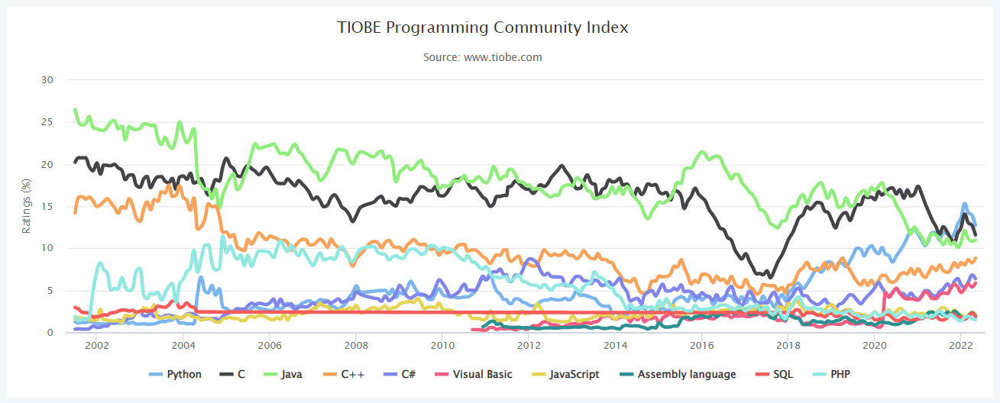

Il existe de très nombreux langages de programmation différents. Chaque langage a ses particularités propres, mais certaines ressemblances peuvent également être observées.

Voici un arbre généalogique des principaux langages, tiré des documents d'accompagnement du programme de première :



## 1. Popularité des principaux langages

L'entreprise néerlandaise TIOBE propose un indice de popularité des principaux langages de programmation. Voici comment cet indice est présenté sur [son site](https://www.tiobe.com/tiobe-index/) :

!!! cite "Citation"
    L’indice TIOBE Programming Community est un indicateur de la popularité des langages de programmation. L’indice est mis à jour une fois par mois. Les évaluations sont basées sur le nombre d’ingénieurs qualifiés dans l'utilisation de chaque langage dans le monde entier, de cours et de fournisseurs tiers. Les moteurs de recherche populaires tels que Google, Bing, Yahoo!, Wikipedia, Amazon, YouTube et Baidu sont utilisés pour calculer les évaluations. Il est important de noter que l’indice TIOBE ne concerne pas le meilleur langage de programmation ou le langage dans lequel la plupart des lignes de code ont été écrites.

    L’indice peut être utilisé pour vérifier si vos compétences en programmation sont toujours à jour ou pour prendre une décision stratégique sur le langage de programmation à adopter lorsque vous commencez à construire un nouveau système logiciel. La définition de l’indice TIOBE peut être trouvée [ici](https://www.tiobe.com/tiobe-index/programminglanguages_definition/).

Voici le classement des dix premiers langages selon l'indice TIOBE en mai 2022 et le graphique de son évolution :





## 2. Différentes implémentations d'un même algorithme

Pour découvrir et comparer quelques langages de programmation, nous allons nous intéresser à l'algorithme suivant dont l'objet est de tester si un nombre entier positif $n$ donné en argument est premier ou non. On procède pour cela en testant la divisibilité par les entiers inférieurs ou égaux à $\sqrt{n}$. Si $n$ ne possède aucun diviseur (autre que 1) inférieur ou égal à $\sqrt{n}$, alors $n$ est premier.

L'algorithme représenté ci dessous (on traite directement le cas $n=2$ et on élimine tous les multiples de 2):

!!! Example "Algorithme en pseudo-code"
    ```` title="Pseudo-code"
    Fonction is_prime(n)
        Début
            Si n = 2, Alors
                Retourne Vrai
            FinSi
            Si n < 2 ou 2 divise n, Alors
                Retourne Faux
            FinSi
            Pour k variant de 3 à la partie entière de racine_carrée(n), avec un pas de 2, Faire
                Si k divise n, alors
                    Retourne Faux
                FinSi
            FinPour
            Retourne Vrai
        Fin
    ````

Voici maintenant sa traduction dans quelques langages de programmation. À chaque fois, nous avons essayé de suivre au plus près la structure de programmation de l'algorithme en pseudo-code.

````py
from math import sqrt

def is_prime(n):
    if n == 2:
        return True
    if n < 2 or n % 2 == 0:
        return False
    for k in range(3, int(sqrt(n))+1, 2):
        if n % k == 0:
            return False
    return True
````

Dans le script ci-dessous, écrit en C, on retrouve le même algorithme. Le code fonctionne en C ou en C++ (on peut considérer que C est un sous-ensemble de C++). [(Fichier complet à télécharger pour tester)](../../../assets/autres/primes.cpp) :

````C title="C ou C++"
#include <math.h>

bool is_prime(unsigned int n)
{
    unsigned int k;
    if (n == 2) return true;
    if (n < 2 || n % 2 == 0) return false;
    for (k = 3; k <= sqrt(n) + 1; k += 2)
        if (n % k == 0) return false;
    return true;
}
````

La même chose en C# [(fichier complet à télécharger pour tester)](../../../assets/autres/primes.cs) :

````C#
using static System.Math;

static bool is_Prime(int n)
        {
            if (n == 2) return true;
            if (n < 2 || n % 2 == 0) return false;
            for (int k = 3; k <= Math.Sqrt(n) + 1; k += 2)            
                if (n % k == 0) return false;            
            return true;
        }
````

Passons à Java [(fichier complet à télécharger pour tester)](../../../assets/autres/primes.java) :

````Java
public static boolean is_prime(long n){
    if(n == 2){
        return true;
    }
    else if(n < 2 || n % 2 == 0){
        return false;
    }
    for(long k= 3; k <= Math.sqrt(n) + 1; k+= 2){
        if(n % k == 0){ return false; }
    }
    return true;
}
````

Voici maintenant un peu de Javascript [(fichier complet à télécharger pour tester)](../../../assets/autres/primes.js) :

````javascript
function is_prime(n) {
  if (n == 2) {
    return true;
  } else if ((n < 2) || (n % 2 == 0)) {
    return false;
  } else {
    for (var k = 3; k <= Math.sqrt(n); k += 2) {
      if (n % k == 0)
        return false;
    }
    return true;
  }
}
````

En Basic (version visual Basic) [(fichier complet à télécharger pour tester)](../../../assets/autres/primes.vb) :

````vbscript
Function is_prime(n)
    If n = 2 Then
        is_prime = True
    ElseIf n < 2 Or n Mod 2 = 0 Then
        is_prime = False
    Else
        is_prime = True
        For k = 3 To Int(Math.Sqrt(n)) + 1 Step 2
            If n Mod k = 0 Then
                is_prime = False
                Exit For
            End If
        Next
    End If
End Function
````

En Fortran [(fichier complet à télécharger pour tester)](../../../assets/autres/primes.f90) :

````fortran
FUNCTION is_prime(n)
    LOGICAL :: is_prime
    INTEGER, INTENT(IN) :: n
    INTEGER :: k

    IF(n==2) THEN
    is_prime = .TRUE.
    ELSE IF(n < 2 .OR. MOD(n,2) == 0) THEN
    is_prime = .FALSE.
    ELSE
    is_prime = .TRUE.
    DO k = 3, INT(SQRT(REAL(n))) + 1, 2
        IF(MOD(n,k) == 0) THEN
            is_prime = .FALSE.
            EXIT
        END IF
    END DO
    END IF
END FUNCTION is_prime
````

En Pascal [(fichier complet à télécharger pour tester)](../../../assets/autres/primes.pas) :

````pascal title="Pascal"
function is_prime(n: integer): boolean;
var
  k: integer;
begin
  if n = 2 then
    is_prime := true
  else if (n < 2) or (n mod 2 = 0) then
    is_prime := false
  else begin
    is_prime := true; k := 3;
    while k <= sqrt(n) + 1 do begin
      if n mod k = 0 then begin
       is_prime := false; exit
      end;
      k := k + 2
    end
  end
end;
````

Pour finir, en OCaml [(fichier complet à télécharger pour tester)](../../../assets/autres/primes.ml) :

````ocaml
let is_prime n =
  if n = 2 then true
  else if n < 2 || n mod 2 = 0 then false
  else begin
    let reponse = ref true in 
    for k = 3 to 1 + int_of_float (sqrt (float_of_int n)) do
        if n mod k = 0 then
            reponse := false;
    done;
    !reponse;
    end;
;;
````

!!! question "Exercice"
    Notre langage d'étude est Python. Repérer, dans les dix programmes ci-dessous des points communs et des différences. Vous présenterez vos résultats dans un tableau et vous compléterez ce travail en présentant brièvement chacun des langages cités (date de création, domaine d'application, ...).

## Compléments

* Le site [RosettaCode.org](http://rosettacode.org/wiki/Rosetta_Code) propose un très grand nombre d'algorithmes traduits dans un très grand nombre de langages. Les programmes présentés ici en sont inspirés, avec quelques modifications.
* La page Wikipedia ["Hello, World!" program](https://en.wikipedia.org/wiki/%22Hello,_World!%22_program) présente le fameux programme affichant la phrase "Hello, World!" à l'écran dans de très nombreux langages de programmation.