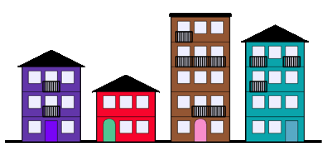

!!! success "Objectifs"
    * Explorer l'utilisation d'une bibliothèque (exemple de la bibliothèque `turtle`).
    * Utiliser la documentation d'une bibliothèque.
    * Appliquer les connaissances du cours : création de fonctions, spécifications, ...
    * Travailler en autonomie, travailler en groupe.

L'objectif de ce T.P. est de construire un programme qui génère une illustration du type ci-dessous.

Le travail doit se faire en groupes. Il y a beaucoup de fonctions à coder, il faut donc se partager le travail ! À vous de vous organiser sachant que :

* le diagramme présent dans l'énoncé vous permet de comprendre quelles fonctions dépendent les unes des autres ;
* il faut prendre garde à ne pas programmer deux fois la même chose : bien comprendre ce qui est déjà fait quand on appelle une fonction et ce qu'il reste à faire ;
* vous devrez vous documenter sur la librairie turtle : cela fait partie de l'exercice ! Rien ne vaut [la documentation officielle](https://docs.python.org/fr/3/library/turtle.html?highlight=turtle#module-turtle) !
* le dossier joint au TP contient :
    * l'énonce en PDF ;
    * une fiche de synthèse sur le module turtle ;
    * des fichiers Python à compléter : les entêtes et les spécifications des fonctions sont déjà préparées ;
    * des images représentant le rendu attendu pour chaque fonction.

!!! danger "Critères d'évaluation"
    * Capacité à s'organiser et à travailler en groupe.
    * Respect des contraintes du sujet.
    * Concision du code : plus c'est long, moins c'est bon.

[:fontawesome-solid-file-zipper: Dossier zip à télécharger :fontawesome-solid-file-zipper: ](../../../assets/zip/TP_Collectif_Turtle.zip){ .md-button .md-button--primary }

 <iframe src="../../../assets/pdf/TP_Collectif_Turtle.pdf" width="100%" height="500px"> </iframe>

**Source** : [MathémaTICE n°80](http://revue.sesamath.net/spip.php?article1476), mai 2022, d'après une idée d'[Adrien Willm](http://www.ostralo.net/), avec quelques modifications effectuées par l'équipe d'Aurillac.