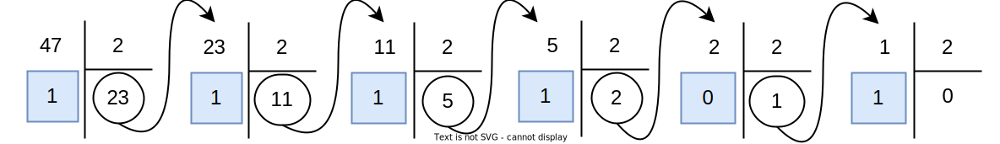

## 1. Introduction

Un ordinateur est une machine qui traite de l'information. Pour comprendre comment, nous devons d'abord expliquer comment l'information est représentée.

En effet, il faut bien faire la différence entre l'information et sa représentation. Par exemple, si on considère la valeur 17, tout le monde pensera à représenter cette valeur par les chiffres 1 et 7.

Mais on peut imaginer beaucoup d'autres possibilités, par exemple, les chiffres romains, la numération inca, ou encore le binaire. Et bien d'autres...

## 2. La base 10
La représentation usuelle des nombres est une représentation *décimale*
et *positionnelle*. Cela signifie :

1.  que les nombres sont représentés par une séquence de *chiffres* de
    $0$ à $9$ inclus. Il y a bien *dix* chiffres différents utilisés,
    d'où le terme *décimal* ;

2.  que la *position* de chaque chiffre dans la séquence permet
    d'associer ce chiffre à une *puissance de 10*.

Dans cette représentation usuelle, 10 est appelé la *base*. On parle
aussi de représentation en base 10.

!!! tip "Exemple"
    Par exemple, la représentation : 

    $$1234$$

    signifie que le nombre est composé de:

    * $4$ unités, ou $4\times 10^0$;
    * $3$ dizaines, ou $3\times 10^1$;
    * $2$ centaines, ou $2\times 10^2$;
    * $1$ millier, ou $1\times 10^3$;

    Ce qui s'écrit : $1234 = 1\times 10^3 + 2\times 10^2 + 3\times 10^1 + 4\times 10^0$

On voit donc que les puissances de $10$ associées aux différentes
positions (aux différents chiffres) vont en décroissant quand on lit le
nombre de gauche à droite, et que la puissance $10^0$ correspond au
chiffre des unités. 

On note également que la base donne le nombre de chiffres que l'on peut
utiliser pour représenter les nombres. En base 10, on peut utiliser 10
chiffres différents, à savoir les chiffres de $0$ à $9$ inclus.

## 3. Généralisation

Ces idées se généralisent dans n'importe quelle base. Fixons à partir
de maintenant une base $b\geq 2$. 

Nous allons maintenant rencontrer des nombres écrits dans différentes bases. Pour éviter les confusions, nous indiquerons la base utilisée en indice. Le nombre de l'exemple ci-dessous s'écrit donc $1234_{10}$.

En base $b$, nous utiliserons $b$ chiffres : $0$, $1$, $2$, ..., $b-1$.

Le nombre :

$${d_n\cdots d_0}_b$$

représente la valeur :

$$N = d_n\times b^n + d_{n-1}\times b^{n-1}+\cdots+d_0\times b^0$$

où tous les $d_i$ sont des chiffres dans $\{0,\ldots b-1\}$.

!!! tip "Exemple"
    En base 5, il y a cinq chiffres : 0, 1, 2, 3 et 4.

    Comptons un peu en base 5 : 

    | Base 10 | Base 5 | |
    |:---:|:---:|:---:|
    |0| 0| Pas de différence ... |
    |1| 1| Pas de différence ... |
    |2| 2| Pas de différence ... |
    |3| 3| Pas de différence ... |
    |4| 4| Pas de différence ... |
    |5| 10| Plus de possibilité pour les unités, on ajoute un chiffre à gauche |
    |6| 11| On augmente les unités |
    |7| 12| On augmente les unités |
    |8| 13| On augmente les unités |
    |9|14| On augmente les unités |
    |10| 20| On ne peut plus augmenter les unités, on augmente le chiffre de rang suivant |

!!! question "Exercice"
    Quel sera le premier entier, en base 10, qui s'écrit en base 5 avec trois chiffres ? Avec quatre chiffres ?

### Passage de la base $b$ à la base 10

Pour passer de la base $b$ à la base 10, c'est facile, ils suffit d'utiliser la définition : 

$${d_n\cdots d_0}_b = (d_n\times b^n + d_{n-1}\times b^{n-1}+\cdots+d_0\times b^0)_{10}$$

!!! tip "Exemple"
    Exemple avec la base 5.

    Considérons le nombre $N=134_5$. Par définition, on a : 

    $$N=4\times 5^0 + 3\times 5^1 + 1\times 5^2 = 4+15+25=44_{10}$$

### Passage de la base 10 à la base $b$

C'est un peu plus difficile. Pour convertir un nombre donné en base 10 dans une base $b$, on procède par **divisions euclidiennes successives par $b$**. Les restes obtenus sont les chiffres de l'écriture du nombre en base $b$.

!!! tip "Exemple"
    On reste avec $b=5$. Soit $N=64_{10}$ : on souhaite écrire $N$ en base 5.

    On effectue pour cela la suite de divisions suivante : 

    

    On continue les divisions successives jusqu'à obtenir un quotient nul.

    Les restes successifs (sur fond bleu) forment le nombre en base 5, **en les lisant de la droite vers la gauche** : $64_{10}=224_5$.

Voyons maintenant les exemples de la base 2 et de la base 16 qui sont les plus utilisées en informatique.

## 4. La base 2

En base 2, nous ne disposons donc que des deux chiffres 0 et 1. On parle de système **binaire**.

Un chiffre binaire, _binary digit_ en anglais est appelé en abrégé un **bit**.

Voir [cet article du blog](https://www.flallemand.fr/wp/2022/06/19/mesurer-la-quantite-dinformation/){ target=_blank } au sujet des unités de mesures binaires.

Voici comment compter jusqu'à 10 en base 2 :

|Nombre en décimal|Nombre en binaire| |
|:---:|:---:|:---:|
|0|0|Pas de différence ...|
|1|1|Pas de différence ...|
|2|10|Le premier rang ayant été rempli, on passe au suivant !|
|3|11|On re-remplit le rang 1.|
|4|100|Le rang 2 est plein, le rang 1 aussi, qu'à cela ne tienne, on passe au suivant.|
|5|101|On continue en suivant la même méthode.|
|6|110|On continue en suivant la même méthode.|
|7|111|On continue en suivant la même méthode.|
|8|1000|On commence le rang 4.|
|9|1001|On continue comme tout à l'heure.|
|10|1010|On continue comme tout à l'heure.|
|...|...|...|

Les nombres en base 2 ont très vite beaucoup de chiffres. Pour faciliter la lecture, on a l'habitude de regrouper ces chiffres par paquets de 4 à partir de la droite.

### Conversion de la base 2 à la base 10

Dans ce sens, la conversion est facile, il suffit d'appliquer la définition.

Prenons le nombre $1101\; 0011_2$. Il s'étale sur 8 bits, on applique la méthode générale :

$1101\; 0011_2 = 1\times 2^7 + 1\times 2^6 + 0\times 2^5 + 1\times 2^4 + 0\times 2^3 + 0\times 2^2 + 1\times 2^1 + 1\times 2^1 = 211_{10}$.

### Conversion de la base 10 à la base 2

On procède par divisions euclidiennes successives.

Convertissons $47_{10}$ en base 2 :

On a donc $47_{10}=10\;1111_2$.

## 5. La base 16

Comme nous l'avons déjà vu, l'écriture d'un nombre en base 2 est longue. Pour avoir des nombres plus "compacts" tout en restant lié au binaire, les informaticiens utilisent souvent la base 16 : c'est le système hexadécimal.

En base 16, on utilise 16 chiffres, alors que notre numération usuelle, en base 10, n'en possède que 10. Quels symboles choisir pour les 6 chiffres manquants ? On utilise les six premières lettres de l'alphabet !

|Binaire (base 2)|Décimal (base 10)|Hexadécimal (base 16)|
| :---: | :---: | :---: |
|0|0|0|
|1|1|1|
|10|2|2|
|11|3|3|
|100|4|4|
|101|5|5|
|110|6|6|
|111|7|7|
|1000|8|8|
|1001|9|9|
|1010|10|A|
|1011|11|B|
|1100|12|C|
|1101|13|D|
|1110|14|E|
|1111|15|F|

On observe que **tous** les chiffres de la base 16 sont **tous** les nombres que l'on peut coder en binaire sur 4 bits. Dans l'écriture en base 2 d'un nombre, on a vu que les bits sont regroupés par quatre pour plus de lisibilité : $1101\; 0011_2$. Chaque groupe de quatre correspond donc à un chiffre en base 16. On a donc $1101\; 0011_2 = D3_{16}$.

Les méthodes de conversion restent les mêmes.

## 6. Quelques remarques pour finir

### Chiffres de poids fort, de poids faible

Dans la représentation positionnelle usuelle, le chiffre le plus à
gauche est associé à une puissance plus élevée de la base. On parle donc
de chiffre de "poids fort" ; le chiffre étant associé à la puissance la
plus faible est appel chiffre de "poids faible". En particulier, en
binaire, on parle de **bit de poids fort** et **bit de poids faible**.

### Multiplier par la base

Dans toutes les bases, on peut aisément multiplier par la
base en ajoutant des zéros à droite :

!!! note "À retenir"
    Dans toute base $b$, ajouter $k$ zéros **à droite** revient à **multiplier** par $b^k$.

Par exemple, en binaire, multiplier par 2 revient à ajouter un zéro à la fin du nombre tout comme on ajoute un zéro à la fin du nombre écrit en base 10 quand on la multiplie par 10.

### Combien de nombres représentables sur $n$ bits ?

Enfin, l'observation suivante aura toute son importance dans la suite.

Considérons par exemple la base 2 : combien de nombres différents peut-on écrire avec $n$ bits ?

Chaque bit ayant deux valeurs possibles (0 ou 1), nous obtenons $2^n$ nombres distincts.

$$\underbrace{0\cdots 0_2}_{n\text{ chiffres}} = 0$$

à:

$$\underbrace{1\cdots 1_b}_{n\text{ chiffres}} = 2^n-1.$$

!!! note "À retenir"
    En base $2$, il y a $2^n$ nombres (entiers positifs) représentables sur
    $n$ bits : les nombres de $0$ à $2^n-1$.

!!! question "Exercice"
    Démontrer que $\underbrace{1\cdots 1_2}_{n\text{ chiffres}} = 2^n-1.$

??? success "Réponse"
    Nous allons démontrer le résultat général en base $b$.
    
    On a : $\underbrace{(b-1)\cdots (b-1)_b}_{n\text{ chiffres}} = (b-1)\times b^{n-1}+\ldots+(b-1)\times b^1+(b-1)\times b^0$. D'où, en développant chacun des produits :

    $$\underbrace{(b-1)\cdots (b-1)_b}_{n\text{ chiffres}} = b^{n}-b^{n-1}+b^{n-1}-b^{n-2}+\ldots+b^2-b+b-1.$$

    Les termes se simplifient tous, sauf le premier et le dernier. On a donc :

    $$\underbrace{(b-1)\cdots (b-1)_b}_{n\text{ chiffres}} = b^n-1.$$

## 7. Addition posée en binaire

On peut poser une addition en base 2 avec la même technique que pour l'addition des nombres écrits en base 10. L'addition des bits suit les règles suivantes :

* $0+0$ donne $0$ avec une retenue égale à $0$ ;
* $0+1$ donne $1$ avec une retenue égale à $0$ ;
* $1+0$ donne $1$ avec une retenue égale à $0$ ;
* $1+1$ donne $0$ avec une retenue égale à $1$.

Exemple de l'addition de $11_{10}=1011_2$ et de $13_{10}=1101_2$ (les retenues sont en rouge) : 

La somme obtenue $1\;1000_2$ correspond bien à l'entier $24_{10}$ codé en binaire. On remarque qu'il a fallu un bit supplémentaire pour coder la somme. Si on travaille avec une taille d'entiers fixe de 4 bits, alors le bit de poids fort sera ignoré, et on obtiendra seulement $1000_2$ comme résultat, c'est-à-dire 8. Autrement dit, sur 4 bits, quand on dépasse la capacité de $2^4-1=15$, on repart de zéro : $24=2^4+8$. On dit que le calcul se fait **modulo $2^4$**.

En complément, vous pouvez regarder la vidéo "Le binaire, c'est quoi ?" dans cet [article](https://www.flallemand.fr/wp/2022/07/02/la-chaine-youtube-codeur-pro/).