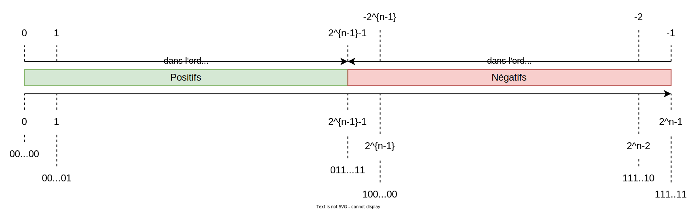

Nous allons maintenant étudier la représentation des entiers relatifs en base 2.

Tout le problème est de coder le **signe** du nombre, et plus seulement sa valeur.

## 1. Première idée : le bit de signe

Une première idée consiste à décider que : lorsqu'on travaille avec une représentation binaire sur $n$ bits, on réserve le bit de poids fort pour coder le signe. 1 va coder le signe $-$ et 0 le signe $+$. Les $n-1$ bits restants codent la valeur absolue du nombre.

!!! tip "Exemple"
    En travaillant sur 8 bits (soit 1 octet), l'entier positif $5_{10}$ sera codé par $0000\;0101_2$ et l'entier négatif $-5_{10}$ sera codé par $1000\;0101_2$.

Cette première idée est une mauvaise idée ! En effet, que dire des deux entiers $0000\;0000_2$ et $1000\;0000_2$ ? Ils sont égaux, respectivement à $+0$ et à $-0$, donc ils sont égaux.  Il n'est pas souhaitable qu'un même nombre possède deux représentations différentes.

De plus, cette représentation pose un autre problème plus grave ! Considérons par exemple le codage de $3_{10}$ sur 4 bits. On a $3_{10} = 0011_2$ et donc $-3_{10} = 1011_2$. Calculons maintenant leur somme : on s'attend à trouver zéro :

mais le résultat correspond à la représentation de $-4$ !

## 2. Le complément à 2

### Le principe

Pour représenter un entier relatif $R$ en base 2, on commence par choisir le nombre de bits $n$ de la représentation.

!!! info "Définition et règles de représentation"
    * Le complément à $2$ d'un nombre $R$ est le nombre $2^n-R$.
    * Les nombres positifs sont représentés par leur codage binaire usuel.
    * Les nombres négatifs sont représentés par le complément à $2$ de leur valeur absolue.

!!! tip "Exemple"
    Considérons le codage de l'entier $+12$ sur 8 bits. Il s'agit d'un entier positif, on le code donc comme vu précédemment et on obtient : $+12_{10} = 0000\;1100_2$.

    Considérons $-12$ maintenant. Son complément à 2 vaut $2^8-12=244$ dont la représentation binaire est $1111\;0100_2$. $-12$ est donc représenté par le nombre $1111\;0100_2$ en binaire sur 8 bits.

**"Truc" pratique** : pour obtenir la représentation d'un nombre négatif, par exemple de $-12$ :

* on commence par coder sa valeur absolue 12 : $0000\;1100$ ;
* on inverse tous les bits : $1111\;0011$ ;
* on ajoute 1 (attention aux retenues !) : $1111\;0100$.

De plus, ce truc fonctionne dans les deux sens : en partant d'un nombre négatif, on retrouve aussi son opposé : 

* on considère $-12$ : $1111\;0100$ ;
* on inverse tous les bits : $0000\;1011$ ;
* on ajoute 1 : $1111\;1100$. On retrouve bien 12.

Avec cette convention, zéro n'a plus qu'une seule représentation. De plus, on peut poser des additions de façon habituelle.

Reprenons l'exemple de l'entier $3_{10} = 0011_2$ codé sur 4 bits. $-3_{10}$ sera codé par $2^4-3=13$, donc par $1101_2$. On obtient bien zéro en les additionnant (on oublie la dernière retenue car on reste sur 4 bits) : 

### Combien de nombres ?

Nous savons que, sur $n$ bits, nous pouvons représenter $2^n$ entiers naturels : tous les entiers de $0$ à $2^n-1$. 

Avec le complément à 2 : 

* la première moitié de ces entiers va représenter les $2^{n-1}$ premiers entiers positifs : de $0$ à $2^{n-1}-1$, 
* la seconde moitié va représenter les $2^{n-1}$ premiers entiers négatifs : de $-1$ à $-2^{n-1}$.

Avec le complément à deux, $-1$ sera représenté par $2^n-1$, soit $11111\ldots 1111$.

Sur un axe gradué, voici comment les nombres relatifs s'organisent : 

On remarque que : 

* la représentation d'un nombre positif commence par un bit de poids fort égal à 0.
* la représentation d'un nombre négatif commence par un bit de poids fort égal à 1.

## 3. Cas concrets

Couramment, les entiers sont codés sur 8, 16, 32 ou 64 bits dans les langages de programmation usuels.

| En codant sur ... | On peut aller de ... | jusqu'à ... |
| :---: | :---: | :---: |
| 8 bits | -128 | 127 |
| 16 bits | -32 768 | 32 767 |
| 32 bits | -2 147 483 648 | 2 147 483 647 |
| 64 bits | -9 223 372 036 854 775 808 | 9 223 372 036 854 775 807 |

En Python, la taille des entiers avec lesquels on peut travailler n'est limitée que par la mémoire disponible. Dans d'autres langages, il faut déclarer des variables de types différents en fonction des limites de valeurs envisagées. Par exemple en C, un `char` codera sur un octet un entier compris entre $-128$ et $127$, et un `short int` codera sur 2 octets un entier compris entre $-32\; 768$ et $32\;767$. `long int` utilisera 4 octets.