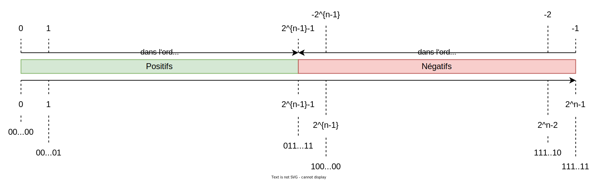

# S2 - Représentation de données - Types et valeurs de base

# 2. Représentation des entiers relatifs : L'essentiel

On représente les nombres entiers relatifs en binaire en utilisant le **complément à 2**.

Pour représenter un entier relatif $R$ en base 2, on commence par choisir le nombre de bits $n$ de la représentation.

!!! info "Définition et règles de représentation"
    * Le complément à $2$ d'un nombre $R$ est le nombre $2^n-R$.
    * Les nombres positifs sont représentés par leur codage binaire usuel.
    * Les nombres négatifs sont représentés par le complément à $2$ de leur valeur absolue.

**"Truc" pratique** : pour obtenir la représentation d'un nombre négatif, par exemple de $-12$ sur 8 bits :

* on commence par coder sa valeur absolue 12 : $0000\;1100$ ;
* on inverse tous les bits : $1111\;0011$ ;
* on ajoute 1 (attention aux retenues !) : $1111\;0100$.

En appliquant ce "truc" à nouveau, on retrouve le nombre de départ.

Cette représentation permet de poser des opérations de manière naturelle (addition et multiplication).

Sur un axe gradué, voici comment les nombres relatifs s'organisent : 

On remarque que : 

* la représentation d'un nombre positif commence par un bit de poids fort égal à 0.
* la représentation d'un nombre négatif commence par un bit de poids fort égal à 1.
