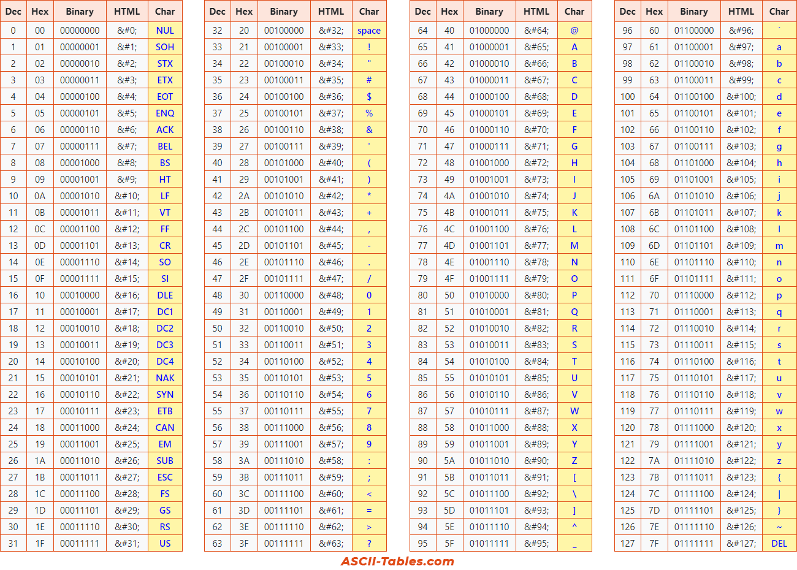
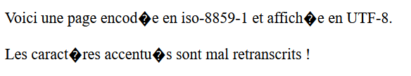
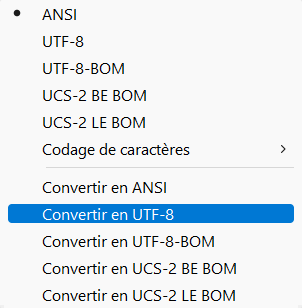

Une chaîne de caractères est une suite ordonnée de caractères. Ces caractères peuvent être :

* des lettres minuscules ou majuscules ;
* des symboles de ponctuation ou autres  ;
* des chiffres.

En machine, les caractères, comme toute autre _information_, est codée de façon numérique par un nombre binaire.

Le problème qui se pose est que les lettres de l'alphabet, par exemple, ne sont pas les mêmes dans toutes les langues et des caractères. Il faut pouvoir coder des caractères aussi divers que : é, à, ô, ß, $\Delta$, ﺾ, ネ, 乻.

Différents systèmes d'**encodage** des caractères existent.

!!! danger "À retenir"
    Une représentation informatique des caractères nécessite d'associer à chaque caractère une unique séquence d'octets. Cette conversion s'effectue à l'aide d'une **table de codage** et d'un **encodage**.

    * Une table de codage ou jeu de caractères ou charset, associe un entier nommé point de code à un
    caractère.
    * Un encodage associe à un point de code une séquence d'octets.

Pour une table de codage, il peut exister plusieurs encodages : ce sera le cas pour la table Unicode, présentée ci-dessous, pour laquelle plusieurs encodages existent (UTF-8, UTF-16, ...).

## 1. Le code ASCII

Dans les premiers temps de l'informatique, de nombreux systèmes de codage, incompatibles entre eux, existaient.

En 1960, l'organisation internationale de normalisation (International Standard Office : ISO) a créé la norme ASCII (American Standard Code for Information Interchange) pour écrire des textes en anglais.

La table ASCII fournit la correspondance entre 128 caractères et leur représentation binaire. Les caractères sont numérotés de 0 à 127. Comme $2^7=128$,il suffit de 7 bits par caractère. Cependant, un octet est le plus souvent utilisé, le bit de poids fort, inutilisé, étant toujours égal à 0.

Dans le code ASCII, les codes des lettres minuscules et des lettres majuscules diffèrent d'un bit, le cinquième. Par exemple "G" est codé par $71_{10}=0100\;0111_2$ et "g" est codé par $103_{10}=0101\;0111_2$. Cela revient à ajouter $32=2^5$ pour passer du code de la majuscule au code de la minuscule.

Les chiffres sont codés par le nombre binaire $0011\;XXXX_2$ où $XXXX_2$ est la valeur du chiffre en binaire. Par exemple 5 est codé par $0011\;0101_2$.

Le code ASCII d'un caractère étant composé de 8 bits, il peut aussi être représenté par un nombre hexadécimal à deux chiffres.

Voici la table ASCII complète : 



Le code ASCII est suffisant pour écrire un texte en anglais ou pour écrire un programme informatique et il est encore très largement utilisé de nos jours car il a l'avantage d'être léger.

Cependant, il est insuffisant pour représenter d'autres langues que l'anglais : pas de caractères accentués, de c-cédille, pas de caractères grecs, hébreux, arabes, chinois, ...

## 2. Le code ISO-8859-1

Pour encoder les langues européennes occidentales, plusieurs extensions du code ASCII ont été définies par l'ISO, comme notamment la norme ISO-8859-1 (appelée aussi ISO-Latin-1). Avec cette norme :

* le codage des caractères présents dans la table ASCII est conservé ;
* chaque caractère est toujours codé sur un octet.

On exploite le bit de poids fort inutilisé par le codage ASCII : cela permet de coder $2^8=256$ caractères, soir deux fois plus qu'avec le code ASCII.

## 3. Le code Unicode

Ces extensions du code ASCII ne suffisent évidemment pas à encoder les caractères des langues non latines. Il a donc fallu créer une autre norme internationale : la norme **Unicode**, apparue au début des années 90.

Dans sa version 14.0 publiée en septembre 2021, la table Unicode compte 144 697 caractères couvrant plus de 150 écritures.

Unicode est une table qui regroupe tous les caractères existant au monde mais ne s'occupe pas de la façon dont les caractères sont codés dans la machine. Il existe pour cela plusieurs formats différents, le plus répandu étant l'encodage **UTF-8**.

**UTF-8** est un code à taille variable dans lequel les caractères sont représentés sur 1, 2, 3 ou 4 octets.

Les 128 premiers caractères de la table UTF-8 sont compatibles avec le codage ASCII. Ainsi le codage UTF-8 d'un texte ne comportant que des caractères présents dans la table ASCII sera le même que le codage ASCII de ce texte.

Ce ne sera pas vrai pour un texte ISO-8859-1.

Il importe donc, quand on veut décoder un texte, de savoir quel est le codage utilisé sous peine de décoder improprement les caractères, ce qui arrive par exemple lorsque l'encodage d'une page web n'est pas bien reconnu par le navigateur :



On représente en général un code UTF-8 sous la forme `U+XXXX` où XXXX est un nombre écrit en hexadécimal.

En voici quelques exemples :

| Code UTF-8 | Caractère | Écriture |
| :---: | :---: | :---: |
| U+FEBE | ﺾ | Arabe |
| U+05E6 | צ | Hébreu |
| U+30CD | ネ | Japonais katakana 
| U+4E7B | 乻 | Chinois |

Les site [unicode-table.com/fr](unicode-table.com/fr) liste tous les caractères de la table Unicode.

!!! note "Remarque"
    Depuis sa version 3, Python utilise l'encodage UTF-8 pour les chaînes de caractères.

    Nous disposons en Python de deux fonctions liées à ce codage :

    * `chr(x)` : retourne le caractère codé par l'entier $x$ écrit en base 10 ;
    * `ord(c)` : retourne l'entier correspondant au caractère c (de type str).

    ````pycon
    >>> chr(244)
    'ô'
    >>> ord("€")
    8364
    ````

## 4. Convertir un fichier d'un encodage à un autre

Pour convertir un fichier d'un encodage à un autre, on peut utiliser l'éditeur Notepad++ dans lequel on trouve un menu "Encodage" comprenant par exemple une commande "convertir en UTF-8".



## 5. Ouverture d'un fichier texte en Python

Une bonne compréhension du problème de l'encodage des caractères permet d'éviter certaines erreurs lors de l'utilisation de fichiers textes en Python.

Considérons par exemple deux fichiers textes `texte_ascii.txt` et `texte_utf-8.txt` contenant le même texte, l'un étant encodé en ASCII étendu (c'est-à-dire en ISO-8859-1) et l'autre en UTF-8.

Le programme ci-dessous ouvre ces fichiers l'un après l'autre et affiche leur contenu dans la console interactive.

````python
from io import open

f = open("texte_ascii.txt")
for ligne in f.readlines():
    print(ligne)
f.close()

print("---------")

f = open("texte_utf-8.txt")
for ligne in f.readlines():
    print(ligne)
f.close()
````

Tout d'abord, le programme est exécuté sous Windows :

````pycon
Ceci est un fichier texte

encodé au format ASCII étendu

Voici quelques mots avec des caractères spéciaux

comme par exemple forçat ou encore Niño ...
---------
Ceci est un fichier texte

encodé au format UTF-8 étendu

Voici quelques mots avec des caractères spéciaux

comme par exemple forçat ou encore Niño ...
````

Et maintenant sous Linux :

````pycon
Traceback (most recent call last):
  File "/usr/lib/python3.10/idlelib/run.py", line 578, in runcode
    exec(code, self.locals)
  File "/home/fabrice/windows/lecture_fichier.py", line 4, in <module>
    for ligne in f.readlines():
  File "/usr/lib/python3.10/codecs.py", line 322, in decode
    (result, consumed) = self._buffer_decode(data, self.errors, final)
UnicodeDecodeError: 'utf-8' codec can't decode byte 0xe9 in position 32: invalid continuation byte
````

Pourquoi cette différence ? La fonction `open` de Python essaie de lire le fichier texte en utilisant l'encodage du système d'exploitation dans lequel Python est utilisé. 

* Sous Windows, l'encodage du système est un dérivé de ISO-8859-1. Le fichier ASCII est donc bien lu et affiché, le fichier UTF-8, lui, est bien lu, mais les caractères ne sont pas affichés correctement.
* Sous Linux, l'encodage du système est UTF-8. Le fichier ASCII provoque une erreur en lecture car Python s'attend par défaut à lire des caractères encodés en UTF-8.

Pour éviter ce type de problème et assurer la portabilité d'un programme d'un système d'exploitation à un autre, il est préférable de toujours indiquer l'encodage à la fonction `open`. Le programme suivant fonctionnera sous les deux systèmes et provoquera l'affichage attendu.

````python
from io import open

f = open("texte_ascii.txt", encoding="ISO-8859-1")
for ligne in f.readlines():
    print(ligne)
f.close()

print("---------")

f = open("texte_utf-8.txt", encoding="UTF-8")
for ligne in f.readlines():
    print(ligne)
f.close()
````

````pycon
Ceci est un fichier texte

encodé au format ASCII étendu

Voici quelques mots avec des caractères spéciaux

comme par exemple forçat ou encore Niño ...
---------
Ceci est un fichier texte

encodé au format UTF-8 étendu

Voici quelques mots avec des caractères spéciaux

comme par exemple forçat ou encore Niño ...
````
