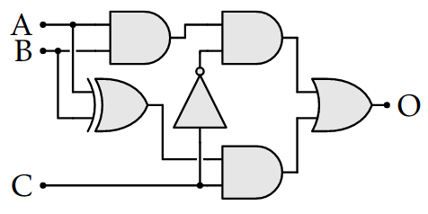

# T.P. : circuits logiques

Les exercices de cette page sont à réaliser à l'aide du simulateur inclus dans la page.

**Une fois les exercices terminés, imprimer la page dans un fichier PDF et la déposer dans le dossier réseau prévu à cet effet.**

## :fontawesome-solid-computer: Exercice 1 

Réaliser un circuit logique à 4 entrées, à l'aide des portes disponibles à gauche, telle que Sortie vaut 1 si, et seulement si, au moins une des entrées est non nulle.

<logic-editor mode="design" showonly="not or and">

</logic-editor>

## :fontawesome-solid-computer: Exercice 2

Dessiner un circuit logique qui a 4 entrées A, B, C et D et dont la sortie O vaut 1 si, et seulement si, toutes les entrées sont nulles.

  <logic-editor mode="design" showonly="not and or">
    
  </logic-editor>

## :fontawesome-solid-computer: Exercice 3

Dessiner un circuit logique correspondant à la table ci-dessous.

| A | S | O |
| --- | --- | --- |
|0|0|0|
|1|0|1|
|0|1|1|
|1|1|0|

L'objectif est de renvoyer la valeur de A si S = 0 et de renvoyer (non A) sinon.

  <logic-editor mode="design" showonly="not and or">
    
  </logic-editor>

## :fontawesome-solid-computer: Exercice 4

On considère le circuit suivant : 

1. Reproduire ce circuit dans le simulateur ci-dessous.
2. En vous aidant du simulateur, établir la table de vérité de ce circuit.
3. Que fait ce circuit ?

Votre réponse ci-dessous : 

<textarea style="border: solid;" cols="100" rows="20">Votre réponse ici ...</textarea>

  <logic-editor mode="design" showonly="not and or xor in out">
    
  </logic-editor>

## :fontawesome-solid-computer: Exercice 5

On peut faire une porte NON avec une porte NAND.

En rajoutant les fils manquants, utilisez la porte NAND (non-et) pour que la valeur de Sortie soit la même que celle de Témoin, quelle que soit la valeur de Entrée.

* Pour rajouter un fil, il suffit de cliquer sur la sortie d'une porte et de faire glisser le fil jusqu'à l'entrée d'une autre porte.
* Pour changer la valeur de Entrée, il suffit de cliquer dessus.
        

  <logic-editor mode="connect">
    
  </logic-editor>

## :fontawesome-solid-computer: Exercice 6
	
En rajoutant des portes NAND, disponibles à gauche, faites des circuits équivalents aux portes ET et OU déjà installées.

* En cas d'erreur de manipulation, vous pouvez réinitialiser en utilisant le bouton à droite.

  <logic-editor mode="design" showonly="nand">
    
  </logic-editor>

## :fontawesome-solid-computer: Exercice 7
      
Faire un circuit équivalent à une porte XOR à l'aide de portes ET, OU et NON.

*  Vous pouvez rajouter une porte XOR et une nouvelle sortie pour tester votre circuit.
* *optionnel* Il y a 2 façons de faire une porte XOR, donc vous pouvez chercher la deuxième construction.
* *optionnel* Pour les plus courageux, vous pouvez essayer de faire le même circuit avec uniquement des portes NAND.
            

  <logic-editor mode="design" showonly="and or not xor out nand">
    
  </logic-editor>

