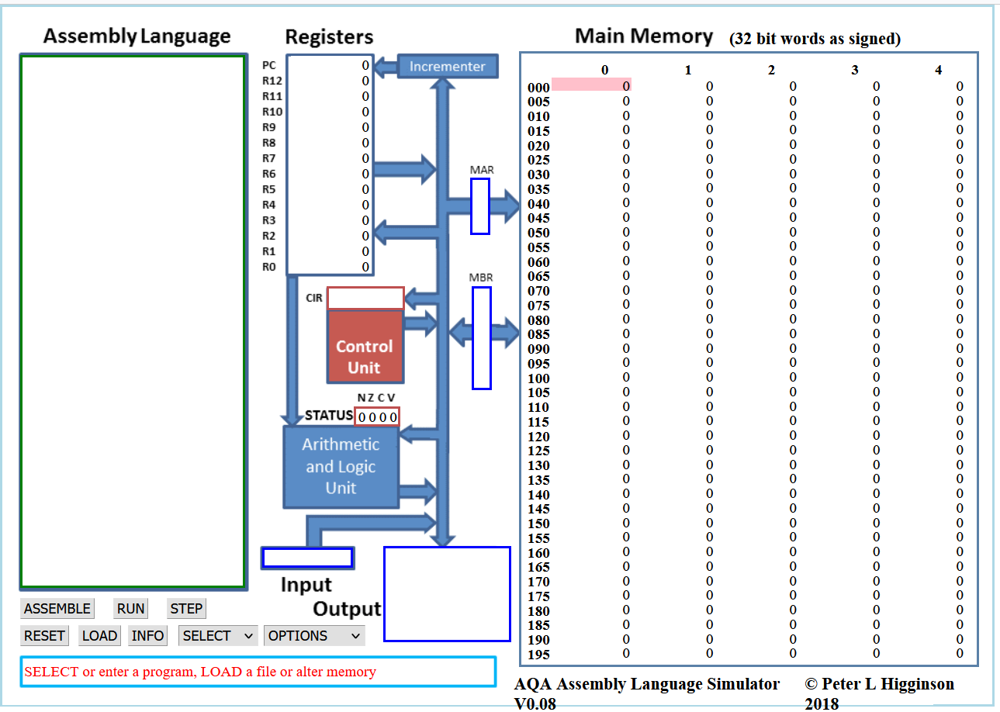

!!! success "Objectifs"
    * [X] Utiliser un simulateur d'architecture de von Neumann
    * [X] Comprendre une séquence d'instructions donnée en langage machine
    * [X] Traduire un programme Python simple en assembleur et visualiser son exécution.

!!! danger "Critères d'évaluation"
    * [ ] Autonomie dans la réalisation du travail demandé.
    * [ ] Qualité du compte-rendu (précision des réponses aux questions).

 <iframe src="../../../../assets/pdf/23_TP_Assembleur.pdf" width="100%" height="500px"> </iframe>