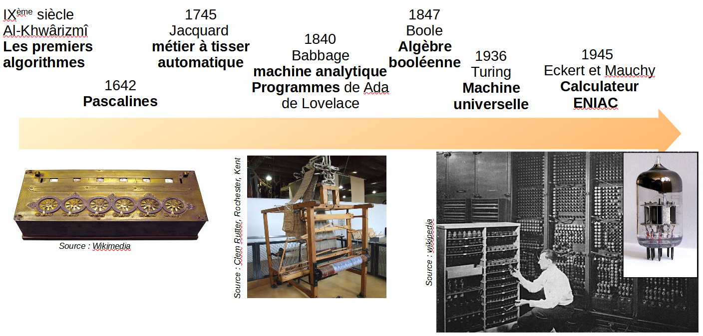
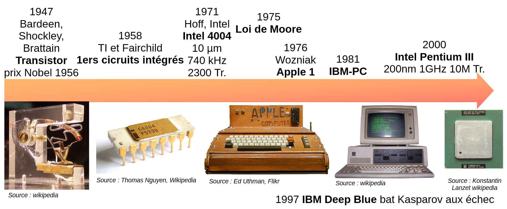

Ce panorama rapide est issu, à quelques modifications près, du cours de Anthony Juton, Professeur agrégé en Physique appliquée (MOOC NSI : les fondamentaux).

## 1. Jusqu'à 1945

Une première date est la publication par le mathématicien [Muhammad Al-Khwârizmî](https://fr.wikipedia.org/wiki/Al-Khw%C3%A2rizm%C3%AE){ target=_blank } d'une classification des algorithmes existants au 9ème siècle. Le mot algorithme est issu de son nom.

 Au 17ème siècle, le philosophe et scientifique [Blaise Pascal](https://fr.wikipedia.org/wiki/Blaise_Pascal){ target=_blank } développe une machine d'arithmétique capable de faire mécaniquement des additions et soustractions et, par répétition, des multiplications et divisions. On la nomme aujourd'hui pascaline.

 Au 18ème siècle, l'inventeur français [Joseph Marie Jacquard](https://fr.wikipedia.org/wiki/Joseph_Marie_Jacquard){ target=_blank } automatise les métiers à tisser mécanique. Le motif est codé sous la forme d'une séquence d'instructions décrite par une carte perforée.

 En 1840, le mathématicien anglais [Charles Babbage](https://fr.wikipedia.org/wiki/Charles_Babbage){ target=_blank } conçoit une machine à calculer mécanique, à vapeur, dont la séquence d'instruction est fournie par une carte perforée. La machine fonctionnant en décimal est complexe et jamais il ne terminera sa construction. Cependant, c'est pour cette machine, majoritairement théorique, que [Ada Lovelace](https://fr.wikipedia.org/wiki/Ada_Lovelace){ target=_blank }, comtesse anglaise, écrira les premiers programmes informatiques.

 Dans les mêmes temps, [Georges Boole](https://fr.wikipedia.org/wiki/George_Boole){ target=_blank }, mathématicien et philosophe britannique, formalise une algèbre binaire s'appuyant sur deux uniques états, 1 et 0. Elle est nommée depuis algèbre booléenne et, bien adaptée au relais, tubes et transistor, elle simplifiera beaucoup la réalisation de calculateurs.

 En 1936, [Alan Turing](https://fr.wikipedia.org/wiki/Alan_Turing){ target=_blank }, mathématicien britannique, propose un modèle théorique de machine permettant d'exécuter toute opération mathématique calculable à partir de quelques instructions simples, la machine de Turing universelle. Une machine est alors dite Turing-complète si elle permet de faire tout ce que le modèle théorique décrit.
Suivent alors plusieurs tentatives de réalisation, d'abord avec des relais mécaniques. Le premier ordinateur Turing-complet serait l'ordinateur électromécanique allemand binaire [Zuse 3](https://fr.wikipedia.org/wiki/Zuse_3){ target=_blank }, détruit pendant la guerre.

 En 1945, sous la conduite du physicien américain [John William Mauchly](https://fr.wikipedia.org/wiki/John_William_Mauchly){ target=_blank } et de son compatriote ingénieur [Presper Eckert](https://fr.wikipedia.org/wiki/John_Eckert){ target=_blank }, est développée une autre réalisation matérielle Turing-complète, cette fois utilisable durablement. L'[ENIAC](https://fr.wikipedia.org/wiki/ENIAC){ target=_blank } (Electronic Numerical Integrator And Computer) est financé par l'armée américaine pour résoudre des problèmes de balistique. Contrairement au Z3, il est décimal, ce qui augmente sa complexité, et utilise des tubes à vides, plus rapides que les relais.
 
L'ENIAC dispose de 17 000 tubes à vides, consomme 150 kW et est capable de 5000 additions, 357 multiplications ou 38 divisions par seconde. Les tubes étaient peu fiables, un insecte, parmi les premiers bugs informatiques, venant souvent mourir sur un tube brûlant pendant la journée, provoquant sa destruction.

## 2. Après 1945

 En 1947 commence l'histoire moderne de l'informatique. 3 physiciens américains des laboratoires Bell, [William Shockley](https://fr.wikipedia.org/wiki/William_Shockley){ target=_blank }, [John Bardeen](https://fr.wikipedia.org/wiki/John_Bardeen){ target=_blank }, [Walter Brattain](https://fr.wikipedia.org/wiki/Walter_Houser_Brattain){ target=_blank } découvrent l'effet transistor. Dans un semi-conducteur au germanium, un courant électrique permet de contrôler l'ouverture d'un circuit électrique. Il devient alors possible de remplacer les coûteux et peu fiables tubes à vide. Le transistor permet rapidement un bond en avant pour l'informatique, l'électronique, les télécommunications et est à l'origine de la création de l'électronique de puissance. Cette découverte est saluée par l'attribution du prix Nobel de physique en 1956.

Avec le transistor, complexe à fabriquer, apparaît la différenciation entre concepteur de processeur et développeur de programme.

 Dès 1958, la société Fairchild semi-conducteurs, fondée notamment par [Gordon Moore](https://fr.wikipedia.org/wiki/Gordon_Earle_Moore){ target=_blank } pour développer des semi-conducteurs à base de silicium, sort les premiers circuits intégrés regroupant de nombreux transistors gravés sur la même puce de silicium pour assurer des fonctions logiques.

 En 1968, Gordon Moore encore et 2 associés fondent la société Intel (pour Integrated Electronic) dans la naissante Silicon Valley et en 1971 commercialisent le premier processeur monolithique (sur une seule puce), l'Intel 4004, avec 2300 Transistors. La largeur de grille des transistors, ici 10 µm, caractérise la finesse de gravure des transistors. 

 Peu de temps après, Gordon Moore, toujours lui, annonce un doublement du nombre de transistors par circuit intégré tous les 2 ans. C'est la [loi de Moore](https://fr.wikipedia.org/wiki/Loi_de_Moore){ target=_blank }. A la fois anticipation et feuille de route de l'industrie micro-électronique, cette loi continue d'être vérifiée 46 ans après, soit une multiplication par $2^23 \approx 8$ Millions du nombre de transistors sur une puce.

 1976 marque l'apparition de l'apple 1, rapidement remplacé par l'apple 2. Conçu pour être produits massivement à un prix raisonnable, ils contribuent à la diffusion de l'informatique. L'interface graphique facilitant son utilisation apparaîtra en 1986.

 En 1981, IBM lance le PC (Personal Computer) basé sur une architecture ouverte qui sera reprise par de nombreux autres constructeurs.

Le développement des PC avec processeur Intel et dans une moindre mesure des ordinateurs Apple avec processeurs Motorola est tel qu'ils orientent l'évolution des technologies. Les processeurs généralistes progressent rapidement et les investissements pour suivre en terme de fabrication deviennent colossaux. Les autres architectures plus spécialisées comme les machines-langage, optimisés pour un langage, ne peuvent suivre et disparaissent.

Le millénaire se termine avec la victoire aux échecs du calculateur [Deep Blue](https://fr.wikipedia.org/wiki/Deep_Blue){ target=_blank } contre le champion du monde et l'apparition du processeur Intel Pentium 3, comprenant 10 Millions de transistors de largeur de grille 200 nm. Il fonctionne avec une horloge à 1 GHz.

Pour en savoir plus sur l'évolution des ordinateurs, voir [cet article](https://www.flallemand.fr/wp/2022/07/02/histoire-de-linformatique/).