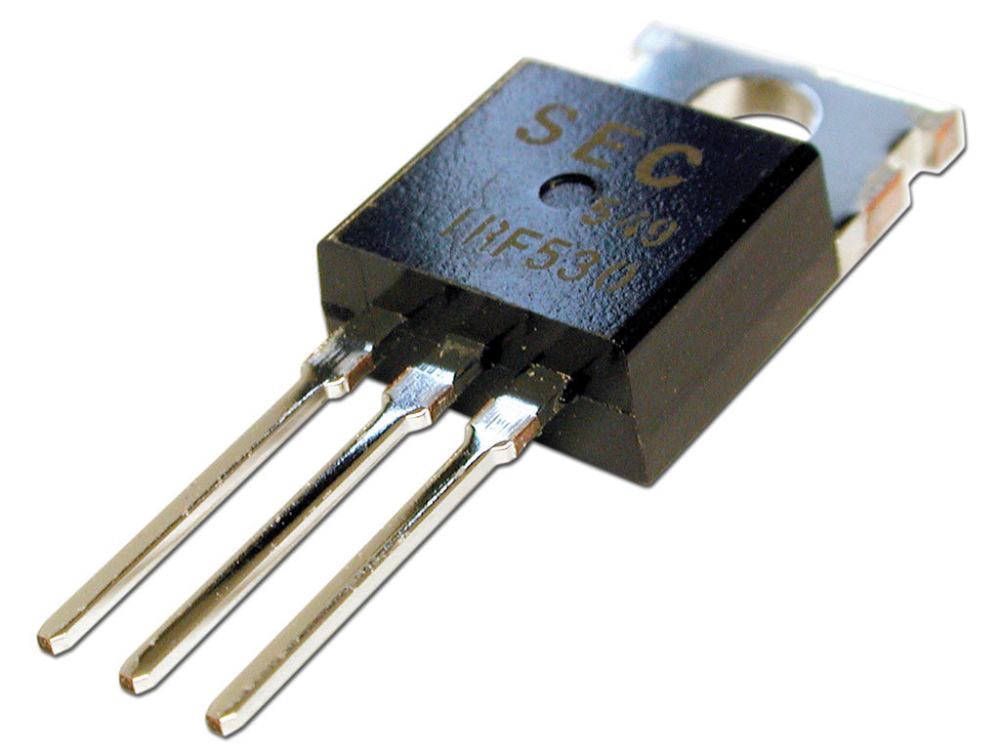
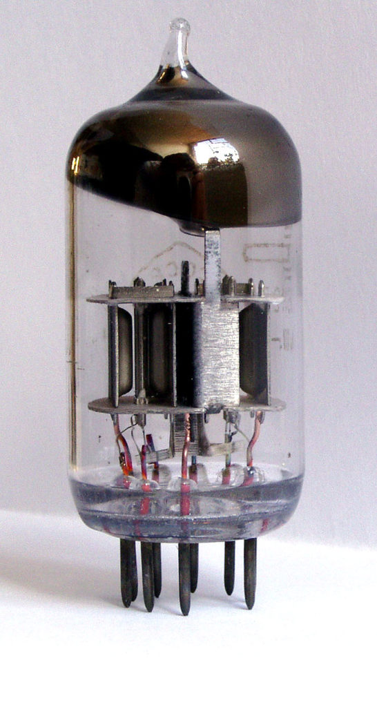
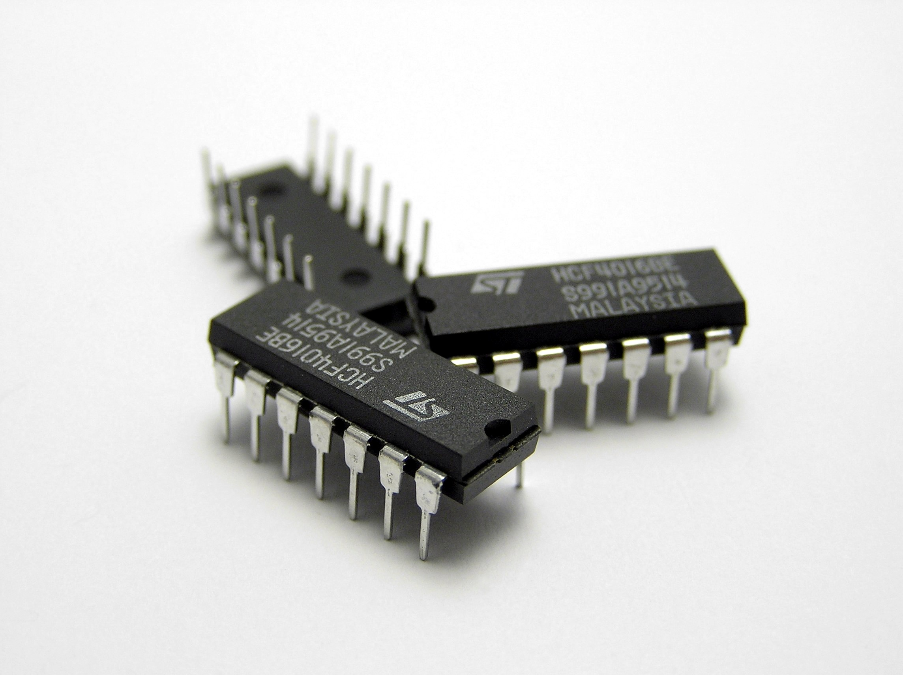
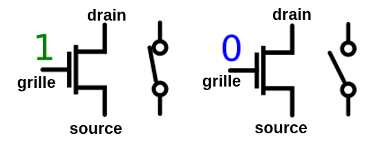
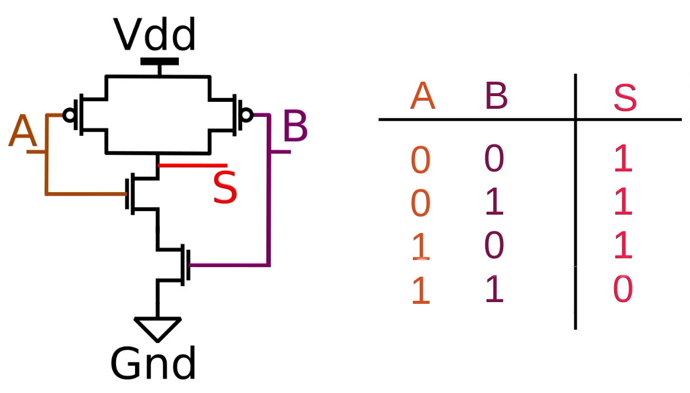
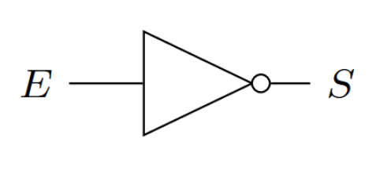
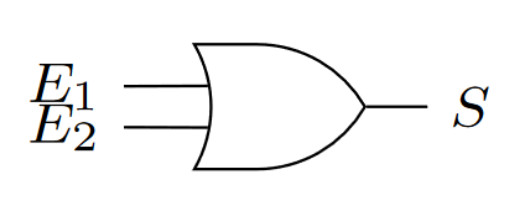
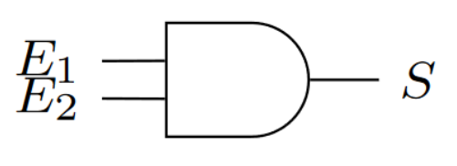
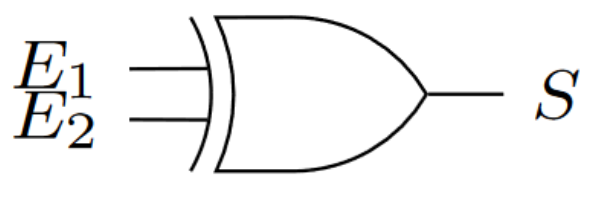

Dans cette partie, nous allons décrire comment on peut, à partir de transistors, réaliser des opérations logiques.

### 1. Du transistor au circuit logique

On entend souvent dire qu'"un ordinateur utilise uniquement des "1" et des "0"". Cette affirmation mérite d'être précisée.

À la base de la plupart des composants d'un ordinateur, on retrouve le transistor. Ce composant électronique a été inventé fin 1947 par les Américains John Bardeen, William Shockley et Walter Brattain. L'invention du transistor a été un immense progrès, mais les premiers ordinateurs sont antérieurs à cette invention. En effet, ces premiers ordinateurs, par exemple le Colossus qui date de 1943, étaient conçus à base de tubes électroniques (on parle aussi de tubes à vide) qui, bien que beaucoup plus gros et beaucoup moins fiable que les transistors fonctionnent sur le même principe que ce dernier.

un transistor : 

un tube électronique : 

Autre aspect historique qu'il est important de préciser : on ne trouve plus, depuis quelque temps déjà, de transistors en tant que composant électronique discret (comme le transistor de la photo ci-dessus). Dans un ordinateur, les transistors sont regroupés au sein de ce que l'on appelle des circuits intégrés. Dans un circuit intégré, les transistors sont gravés sur des plaques de silicium, les connexions entre les millions de transistors qui composent un circuit intégré sont, elles aussi, gravées directement dans le silicium. Les processus mis en jeu lors de ces gravures dépassent largement le cadre de ce cours, si ce sujet vous intéresse, je vous invite à visionner cette vidéo : https://www.youtube.com/watch?v=NFr-WyytNfo

un circuit intégré : 

Il n'est pas question de nous pencher en détail sur le fonctionnement d'un transistor, mais vous devez tout de même savoir que dans un ordinateur les transistors se comportent comme des interrupteurs : soit le transistor laisse passer le courant électrique (interrupteur fermé), soit il ne le laisse pas passer (interrupteur ouvert). Et c'est tout, il n'y a pas d'autre état possible pour un transistor dans un ordinateur : le courant passe ou le courant ne passe pas. Globalement l'ordinateur fonctionne uniquement avec deux états. On parle d'un état "haut" et d'un état "bas". On symbolise souvent l'état "haut" par le chiffre "1" et l'état "bas" par le chiffre "0", mais il faut bien avoir conscience qu'il n'y a pas dans un ordinateur des "petits 1" ou des "petits 0" qui se "baladent", c'est juste une histoire de "courant qui passe" ou de "courant qui ne passe pas". On travaille donc uniquement avec 2 chiffres, voilà pourquoi un ordinateur travaille en base 2 (en binaire) et non pas en base 10 comme dans la vie courante.

Plus précisément, un transistor  se comporte comme un interrupteur commandé électriquement, sans partie mécanique. Il dispose de trois bornes : le drain, la grille et la source. Soumise à une tension suffisante (état 1), la grille permet le passage du courant entre le drain et la source (interrupteur fermé). Dans le cas contraire (état 0), le courant est bloqué (interrupteur ouvert).

Voyons maintenant comment un circuit composé de plusieurs transistors peut effectuer des opérations logiques.

On considère le circuit ci-dessous. Il comporte quatre transistors et les deux transistors du haut sont inversés (ils laissent passer le courant quand l'entrée est à 0 et le bloquent quand l'entrée est à 1). Vdd est la tension d'alimentation (1,5 V) et Gnd la terre (0 V).

En réfléchissant un peu, nous pouvons justifier la table de vérité de ce circuit, donnée à côté.

Il s'agit de l'opérateur logique NAND, NON ET.

On peut de la même façon créer des circuits réalisant toutes les opérations logiques.

Pour en savoir plus sur les transistors voir [cet article](https://www.flallemand.fr/wp/2022/07/02/les-transistors-expliques/).

### 2. Les circuits logiques

Le transistor est donc l'élément de base des circuits logiques. Un circuit logique permet de réaliser une opération booléenne. Il prend en entrée un ou des signaux électriques (chaque entrée est dans un état "haut" (symbolisé par un "1") ou à un état "bas" (symbolisé par un "0") et donne en sortie un ou des signaux électriques (chaque sortie est aussi dans un état "haut" ou à un état "bas"). Il existe deux catégories de circuits logiques :

* les circuits combinatoires (les états en sortie dépendent uniquement des états en entrée)

* les circuits séquentiels (les états en sortie dépendent des états en entrée ainsi que du temps et des états antérieurs)

Dans la suite nous nous intéresserons principalement aux circuits combinatoires.

#### la porte NON (NOT)

Le plus simple des circuits combinatoires est la porte "NON" ("NOT" en anglais) qui inverse l'état en entrée : si l'entrée de la porte est dans un état "bas" alors la sortie sera dans un état "haut" et vice versa. Si on symbolise l'état "haut" par un "1" et l'état "bas" pour un "0", on retrouve la table de vérité de l'opérateur booléen "NON" :

| E (Entrée) | S (Sortie) |
| :---: | :---: |
| 1 | 0 |
| 0 | 1 |

La porte "NON" est symbolisée par le schéma suivant (les schémas ci-dessous utilisent les symboles étasuniens, les plus utilisés) :

#### la porte OU (OR)

La porte "OU" a deux entrées (E1 et E2) et une sortie S

Table de vérité porte "OU" :

| E1 | E2 | S |
| :---: | :---: | :---: |
| 0 | 0 | 0 |
| 0 | 1 | 1 |
| 1 | 0 | 1 |
| 1 | 1 | 1 |

#### la porte ET (AND)

La porte "ET" ("AND") a deux entrées (E1 et E2) et une sortie S

Table de vérité porte "ET" :

| E1 | E2 | S |
| :---: | :---: | :---: |
| 0 | 0 | 0 |
| 0 | 1 | 0 |
| 1 | 0 | 0 |
| 1 | 1 | 1 |

#### la porte OU EXCLUSIF (XOR)

La porte "OU EXCLUSIF" ("XOR") a deux entrées (E1 et E2) et une sortie S

Table de vérité porte "XOR" :

| E1 | E2 | S |
| :---: | :---: | :---: |
| 0 | 0 | 0 |
| 0 | 1 | 1 |
| 1 | 0 | 1 |
| 1 | 1 | 0 |

#### L'additionneur

En combinant les portes logiques, on obtient des circuits plus complexes. Par exemple en combinant 2 portes "OU EXCLUSIF", 2 portes "ET" et une porte "OU" on obtient un additionneur :

Comme son nom l'indique, l'additionneur permet d'additionner 2 bits (E1 et E2) en tenant compte de la retenue entrante ("Cin" "carry in" en anglais). En sortie on obtient le résultat de l'addition (S) et la retenue sortante ("Cout").

| E1 | E2 | Cin | Cout | S |
| :---: | :---: | :---: | :---: | :---: |
| 0 | 0 | 0 | 0 | 0 |
| 0 | 0 | 1 | 0 | 1 |
| 0 | 1 | 0 | 0 | 1 |
| 0 | 1 | 1 | 1 | 0 |
| 1 | 0 | 0 | 0 | 1 |
| 1 | 0 | 1 | 1 | 0 |
| 1 | 1 | 0 | 1 | 0 |
| 1 | 1 | 1 | 1 | 1 |

En combinant plusieurs fois le type de circuit décrit ci-dessus, on obtient des additionneurs capables d'additionner des nombres sur X bits.

Une chose est très importante à bien comprendre : à la base nous avons le transistor, une combinaison de transistors (sous forme de circuit intégré) permet d'obtenir des circuits logiques, la combinaison de circuits logiques permet d'obtenir des circuits plus complexes (exemple : l'additionneur), et ainsi de suite...

Au sommet de cet édifice, nous allons trouver la mémoire vive (RAM) et le microprocesseur (CPU).

Pour en savoir plus sur les portes logiques voir la vidéo "Les portes logiques" dans cet [article](https://www.flallemand.fr/wp/2022/07/02/la-chaine-youtube-codeur-pro/).