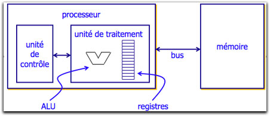

[John von Neumann](https://fr.wikipedia.org/wiki/John_von_Neumann){ target=_blank } (mathématicien et physicien américano-hongrois 1903-1957) a eu l'idée en 1945 d'utiliser une structure de stockage (mémoire) unique pour les données et les instructions : on parle d'architecture de von Neumann

La première innovation est la séparation nette entre l'unité de commande, qui organise le flot de séquencement des instructions, et l'unité arithmétique, chargée de l'exécution proprement dite de ces instructions. La seconde innovation, la plus fondamentale, est l'idée du programme enregistré : les instructions, au lieu d'être codées sur un support externe (ruban, cartes, tableau de connexions), sont enregistrées dans la mémoire selon un codage conventionnel. Un compteur ordinal contient l'adresse de l'instruction en cours d'exécution ; il est automatiquement incrémenté après exécution de l'instruction, et explicitement modifié par les instructions de branchement.

Un emplacement de mémoire peut contenir indifféremment des instructions et des données, et une conséquence majeure (dont toute la portée n'avait probablement pas été perçue à l'époque) est qu'un programme peut être traité comme une donnée par d'autres programmes. Cette idée, présente en germe dans la machine de Turing, trouvait ici sa concrétisation

Pour en savoir plus sur l'aspect historique du modèle, voir [cet article du site interstices](https://interstices.info/le-modele-darchitecture-de-von-neumann/){ target=_blank }.

### 1. Le modèle

L'architecture de Von Neumann est un modèle d'architecture d'ordinateur dans lequel une unité de stockage (mémoire) unique sert à conserver **à la fois les instructions et les données** demandées ou produites par le calcul. Les ordinateurs actuels sont tous basés sur des versions améliorées de cette architecture. 

L'architecture de Von Neumann décompose l'ordinateur en 4 parties distinctes : 

* L'unité arithmétique et logique (UAL ou ALU en anglais) ou unité de traitement : son rôle est d'effectuer les opérations de base ; 
* L'unité de contrôle (ou de commande), chargée du « séquençage » des opérations ; 
* La mémoire qui contient à la fois les données et le programme qui indiquera à l'unité de contrôle quels sont les calculs à faire sur ces données ; 
* Les dispositifs d'entrée-sortie, qui permettent de communiquer avec le monde extérieur.

De nos jours, le modèle a évolué : 

* Les entrées-sorties, initialement commandées par l'unité centrale, sont depuis le début des années 1960 sous le contrôle de processeurs autonomes (canaux d'entrée-sortie et mécanismes assimilés). Associée à la multiprogrammation (partage de la mémoire entre plusieurs programmes), cette organisation a notamment permis le développement des systèmes en temps partagé.
* Les ordinateurs comportent maintenant des processeurs multiples, qu'il s'agisse d'unités séparées ou de « cœurs » multiples à l'intérieur d'une même puce. Cette organisation permet d'atteindre une puissance globale de calcul élevée sans augmenter la vitesse des processeurs individuels, limitée par les capacités d'évacuation de la chaleur dans des circuits de plus en plus denses.

### 2. Le processeur

De nos jours, l'unité arithmétique et logique et l'unité de commande sont regroupées au sein d'une même puce : le processeur (CPU : Central Processing Unit).

Le processeur comporte en réalité schématiquement trois parties : 

* L'**unité arithmétique et logique** est chargée de l'exécution de tous les calculs que peut réaliser le microprocesseur ;
* Les **registres** permettent de mémoriser de l'information (donnée ou instruction) au sein même du CPU, en très petite quantité ;
* L'**unité de contrôle** (ou de commande) . C'est le coordinateur général qui lit les instructions du programme en mémoire et commande l'UAL pour exécuter ces instructions.

Les microprocesseurs sont cadencés par un signal d'horloge (signal oscillant régulier imposant un rythme au transfert entre circuit). Au milieu des années 1980, ce signal avait une fréquence de 4 à 8 MHz. Dans les années 2000, cette fréquence atteint 3 GHz. Plus cette fréquence est élevée, plus le microprocesseur peut exécuter à un rythme élevé les instructions de base des programmes.

### 3. La mémoire

La mémoire permet de stocker des données et des programmes. Elle se divise entre mémoire volatile donc non permanente (programmes et données en cours de fonctionnement) et mémoire permanente (programmes et données de base de la machine).

Dans la plupart des mémoires, les informations sont classées par adresses : chaque octet est accessible par une adresse unique.

Pour des raisons économiques, les mémoires sont en général divisées en plusieurs familles (les ordres de grandeurs sont indiqués pour donner une idée, mais ils évoluent constamment) :

* **Une mémoire de masse ou mémoire de stockage (permanente)**

    Cette mémoire sert à stocker à long terme des grandes quantités d'informations. Les technologies les plus courantes de mémoires de masse sont électromécaniques (disques durs - HDD) ou à semi-conducteurs (SSD, clefs USB, …). Elles visent à obtenir une capacité de stockage élevée à faible coût et ont généralement une vitesse inférieure aux autres mémoires.

    **Ordres de grandeur :**

    * Capacité : jusqu'à 10 To (HDD)
    * Vitesse : jusqu'à 500 Mo/s (SSD)

    

* **La mémoire vive ou RAM : Random Access Memory (non permanente)**

    Espace principal de stockage du microprocesseur, mais dont le contenu disparaît lors de la mise hors tension de l'ordinateur.

    **Ordres de grandeur :**

    * Capacité : jusqu'à 32 Go
    * Vitesse : jusqu'à 2 Go/s

    
 
* **La mémoire cache**

    Sert à conserver un court instant des informations fréquemment consultées. Les technologies des mémoires caches visent à accélérer la vitesse des opérations de consultation. Elles ont une très grande vitesse, et un coût élevé pour une faible capacité de stockage. Cette mémoire est intégrée au microprocesseur. Il existe des mémoires caches à différents niveaux (L1, L2, ...), qui possèdent des caractéristiques différentes.

    **Ordres de grandeur :**
    
    * Capacité : quelques ko (L1) à quelques Mo (L2)
    * Vitesse : jusqu'à 5 Go/s

    

* **Les registres du processeur**

    Intégrés au processeur. Ce type de mémoire est très rapide mais aussi très cher et est donc réservé à une très faible quantité de données.

    **Ordres de grandeur :**
    
    * Capacité : quelques dizaines d'octets
    * Vitesse : jusqu'à 30 Go/s

    

#### 4. Les bus

Pour que les données circulent entre les différentes parties d'un ordinateur (mémoire, CPU et les entrées/sorties), il existe des systèmes de communication appelés bus (c'est le squelette de l'architecture). Il en existe de 3 grands types :

* Le bus d'adresse permet de faire circuler des adresses. Par exemple, l'adresse d'une donnée à aller chercher en mémoire ;
* Le bus de données permet de faire circuler des données ;
* Le bus de contrôle permet de spécifier le type d'action. Par exemple : écriture d'une donnée en mémoire, lecture d'une donnée en mémoire.

Pour en savoir plus, voir la vidéo "Comment fonctionne un ordinateur ?" dans [cet article](https://www.flallemand.fr/wp/2022/07/02/la-chaine-youtube-codeur-pro/).