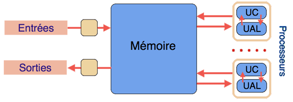

# S3 - Architectures matérielles et systèmes d'exploitation

# 1. Modèle d'architecture de von Neumann

## 1. Évolution des ordinateurs

On retiendra que des machines automatiques ont très tôt été imaginées par les scientifiques.

Les premières machines électriques ont été mises au points vers 1945 et, à la même époque, des mathématiciens ont élaboré une théorie abstraite de l'ordinateur et de l'information (Turing, Shannon, ...).

L'invention du **transistor** marque un tournant décisif et, tout au long de la seconde moitié du XXème siècle, la miniaturisation et le parallélisme n'ont cessé de permettre de mettre au point des machines toujours plus performantes.

## 2. Du transistor au processeur

Un transistor se comporte comme un interrupteur commandé électriquement : le courante passe (état 1), le courant ne passe pas (état 0).

Tous les opérateurs booléens de base peuvent être réalisés à l'aide d'un circuit comportant plusieurs transistors.

L'association de nombreux circuits de ce type permet de réaliser des opérations complexes et, in fine, on aboutit aux mémoires et aux processeurs.

## 3. Architecture de von Neumann

L'architecture de Von Neumann est un modèle d'architecture d'ordinateur dans lequel une unité de stockage (mémoire) unique sert à conserver **à la fois les instructions et les données** demandées ou produites par le calcul. Les ordinateurs actuels sont tous basés sur des versions améliorées de cette architecture. 

L'architecture de Von Neumann décompose l'ordinateur en 4 parties distinctes : 

* L'unité arithmétique et logique (UAL ou ALU en anglais) ou unité de traitement : son rôle est d'effectuer les opérations de base ; 
* L'unité de contrôle (ou de commande), chargée du « séquençage » des opérations ; 
* La mémoire qui contient à la fois les données et le programme qui indiquera à l'unité de contrôle quels sont les calculs à faire sur ces données ; 
* Les dispositifs d'entrée-sortie, qui permettent de communiquer avec le monde extérieur.

Les ordinateurs comportent maintenant des processeurs multiples, qu'il s'agisse d'unités séparées ou de « cœurs » multiples à l'intérieur d'une même puce. Cette organisation permet d'atteindre une puissance globale de calcul élevée sans augmenter la vitesse des processeurs individuels, limitée par les capacités d'évacuation de la chaleur dans des circuits de plus en plus denses.

### Le processeur

Le processeur comporte en réalité schématiquement trois parties : 

* L'**unité arithmétique et logique** est chargée de l'exécution de tous les calculs que peut réaliser le microprocesseur ;
* Les **registres** permettent de mémoriser de l'information (donnée ou instruction) au sein même du CPU, en très petite quantité ;
* L'**unité de contrôle** (ou de commande) . C'est le coordinateur général qui lit les instructions du programme en mémoire et commande l'UAL pour exécuter ces instructions.

### La mémoire

La mémoire permet de stocker des données et des programmes. Elle se divise entre mémoire volatile donc non permanente (programmes et données en cours de fonctionnement) et mémoire permanente (programmes et données de base de la machine).

Différents types de mémoire : mémoire de masse, persistante (HDD, SSD) ; mémoire vive, non persistante (RAM) ; mémoire cache, non persistante, intégrée à la CPU ; registres de la CPU.

### Le bus

Les bus permettent la circulation de l'information entre les différents composants de la machine.

## 4. Langage machine - Assembleur

L'ensemble des instructions exécutables directement par le microprocesseur (instructions machines) constitue ce que l'on appelle le "langage machine" du processeur.

Chaque instruction machine correspond à une configuration électronique binaire composée principalement de 2 parties :

* Le champ "code opération" (opcode) qui indique au processeur le type de traitement à réaliser. Par exemple, sur un certain modèle de processeur, le code "00100110" donne l'ordre d'effectuer une multiplication.
* Le champ "opérandes" indique la nature des données sur lesquelles l'opération désignée par le "code opération" doit être effectuée.

Programmer en langage machine est extrêmement difficile (très longue suite de 0 et de 1), pour pallier cette difficulté, les informaticiens ont remplacé les codes binaires abscons par des symboles mnémoniques (plus facile à retenir qu'une suite de "1" et de "0"), cela donne l'assembleur. 

Par exemple un "ADD R1,R2,#125" sera équivalent à "11100010100000100001000001111101".

Les instructions des langages de haut niveau, comme Python, plus faciles à manipuler pour un être humain, sont transformées en langage machine par un interpréteur (langage interprété) ou un compilateur (langage compilé) avant d'être exécutées par le processeur.