## 1. À quoi sert un système d'exploitation ?

Un système informatique a pour objectif d'automatiser le traitement de l'information. Il est constitué de deux entités: le matériel (hardware) et le logiciel (software).

Du côté matériel, un ordinateur est composé de:

* L'Unité Centrale (UC) pour les traitements
* La Mémoire Centrale (MC) pour le stockage
* Les Périphériques: disque dur, clavier, souris, , carte réseau... accessibles via des pilotes de périphériques

Du côté logiciel, il existe deux niveaux bien distincts: le système d'exploitation et les applications.

L'objectif de la partie logicielle est d'offrir aux utilisateurs des fonctionnalités adaptées à leurs besoins.

!!! danger "Objectifs d'un système d'exploitation :"

    Les trois objectifs majeurs d'un système d'exploitation sont:

    * faire l'interface entre le matériel et l'utilisateur (et par "utilisateur" on entend aussi bien l'utilisateur humain que des applications non système) ; exemple :
        * communication de l'utilisateur vers le matériel : on appuie sur une touche du clavier et on s'attend à ce que le caractère concerné apparaisse à l'écran ;
        * communication du matériel vers l'utilisateur : si un fichier qu'on essaye d'atteindre n'existe pas, on a un message d'erreur.
    * isoler le code utilisateur du matériel, permettant ainsi par exemple :
        * de changer le matériel de façon transparente (ou presque) pour l'utilisateur (il faudra parfois installer des modules ou drivers supplémentaires, mais une fois cela fait, on continue à fonctionner comme précédemment) ;
        * d'assurer l'intégrité des données : par exemple le système assure qu'un utilisateur autre ne peut accéder à des données pour lesquelles il n'a pas les droits d'accès ; mais il assure aussi qu'aucun utilisateur ne puisse détruire la cohérence de l'ensemble des données ;
    * faire en sorte que tous les programmes puissent s'exécuter de façon équitable (un programme qui demande l'utilisation d'une ressource y aura accès en un temps "raisonnable").

Le troisième point sera approfondi en terminale.

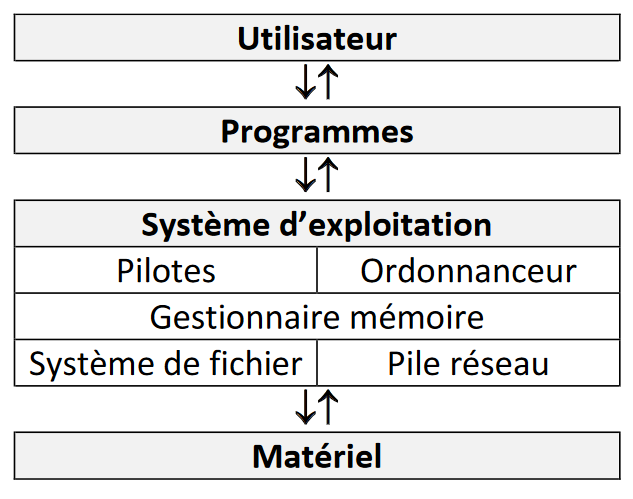

On abrégera "Système d'exploitation par SE (en français) ou pas OS (operating system en anglais).

Le système d'exploitation est le premier logiciel qui démarre quand on allume un ordinateur. Aujourd'hui, il est installé sur le disque dur ou le disque SSD de l'ordinateur. Dans les années 80-90 du 20ème siècle, les ordinateurs personnels n'avaient souvent pas de disque dur. Le SE était fourni sur une ou plusieurs disquettes de démarrage, support de mémoire amovible qui a disparu depuis, qui devait être insérée dans le lecteur de disquette à chaque démarrage.

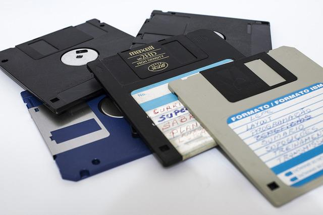

## 2. Différents systèmes d'exploitation

Nous distinguerons les OS **propriétaires** et les OS **libres**.

Voyons comment la notion de **logiciel libre** est définie par la Free Software Foundation (ONG américaine dont la mission est la promotion du logiciel libre et la défense des utilisateurs) : 

!!! info "Logiciel libre"

    Un logiciel est considéré comme libre, au sens de la Free Software Foundation, s'il confère à son utilisateur quatre libertés (numérotées de 0 à 3) :

    * la liberté d'exécuter le programme, pour tous les usages ;
    * la liberté d'étudier le fonctionnement du programme et de l'adapter à ses besoins ;
    * la liberté de redistribuer des copies du programme (ce qui implique la possibilité aussi bien de donner que de vendre des copies) ;
    * la liberté d'améliorer le programme et de distribuer ces améliorations au public, pour en faire profiter toute la communauté.

    L'accès au code source est une condition d'exercice des libertés 1 et 3. 

Un logiciel **propriétaire**, est tout simplement un logiciel qui n'est pas libre, c'est-à-dire qui ne respecte pas l'une ou plusieurs des quatre libertés énoncées ci-dessus.

Attention à ne pas confondre **libre** et **gratuit** : un logiciel libre peut très bien être payant tout comme un logiciel propriétaire peut être gratuit. La confusion vient souvent de l'anglais où le terme **free** signifie à la fois _libre_ et _gratuit_.

Les systèmes d'exploitations les plus répandus sont :

* Unix (1970) : l'un des premiers OS multi-utilisateurs. Il s'agit d'un OS propriétaire : le code source n'est pas accessible.
* GNU-Linux (1991) : système d'exploitation libre, imitant Unix.
* MS-DOS (1981) : de l'entreprise Microsoft, OS propriétaire qui connaîtra différentes évolutions.
* Windows (1985) : de l'entreprise Microsoft, OS propriétaire qui connaîtra différentes évolutions. D'abord simple extension de MS-DOS, Windows est devenu un système d'exploitation indépendant avec les années et a connu de nombreuses évolutions.
* MacOS (1998) : de l'entreprise Apple, OS propriétaire qui a connu différentes évolutions.

**Compléments** : 

* voir sur le blog la vidéo "Un système d'exploitation, c'est quoi ?" dans cet [article](https://www.flallemand.fr/wp/2022/07/02/la-chaine-youtube-codeur-pro/).
* des explications plus poussées dans [cette vidéo](https://youtu.be/SpCP2oaCx8A).
* vidéo présentant l'[histoire d'Unix](https://www.youtube.com/watch?v=Za6vGTLp-wg).
* vidéo présentant l'[histoire de Linux](https://www.youtube.com/watch?v=Uq5ddTUtDkM).
* vidéo plus complète pour approfondir l'[histoire de GNU-Linux](https://www.youtube.com/watch?v=KvGN1SrNwAo).

Le programme de NSI nous incite à utiliser un système d'exploitation libre. Nous allons donc dans le paragraphe suivant étudier de plus près le système Linux.


## 3. La ligne de commande

Aux débuts des systèmes d'exploitation, ces derniers étaient dépourvus d'**interface graphique** (système de fenêtres "pilotables" à la souris), toutes les interactions "système d'exploitation - utilisateur" se faisaient par l'intermédiaire de **lignes de commandes** (suites de caractères saisies par l'utilisateur). Aujourd'hui, même si les interfaces graphiques modernes permettent d'effectuer la plupart des opérations, il est important de connaître quelques-unes de ces lignes de commandes.

Les utilisateurs avancés, notamment ceux qui utilisent Linux, trouvent en effet un grand intérêt à la ligne de commande qui permet indubitablement, quand on en maîtrise la syntaxe, de réaliser certaines opérations plus rapidement qu'avec la souris, de manière plus contrôlée et sûre.

Pour saisir des lignes de commandes, nous allons utiliser une **console**, ou **terminal**. Tous les OS en possèdent une. Derrière ce logiciel s'en cache un autre : le **shell** qui est en fait l'interpréteur des lignes de commandes. Il s'agit d'un langage de programmation. Sous Linux, **bash** est un **shell** très répandu.

Sous Windows, nous avons par exemple le terminale PowerShell

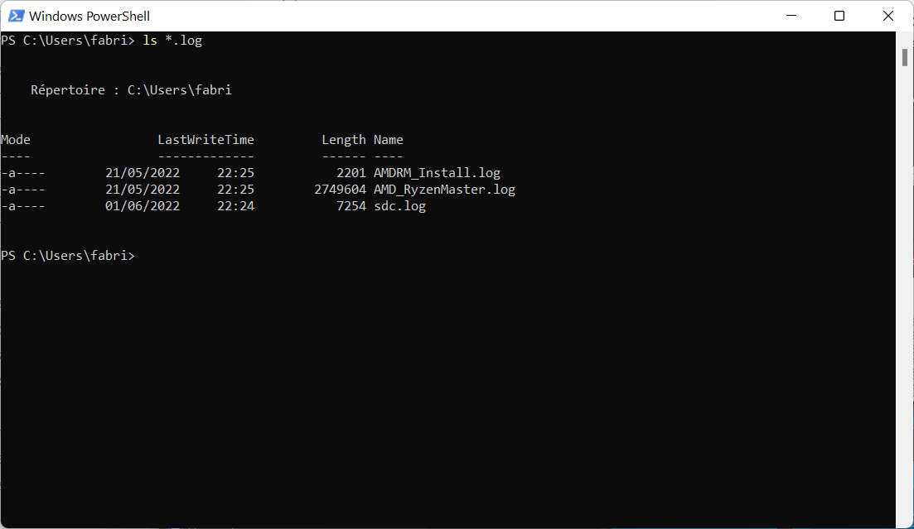

Sous Linux, suivant la distribution utilisée, le terminal peut posséder des noms différents (Terminal, Konsole, ...). L'image ci-dessous montre le terminal de la distribution Lubuntu, appelé Qterminal :

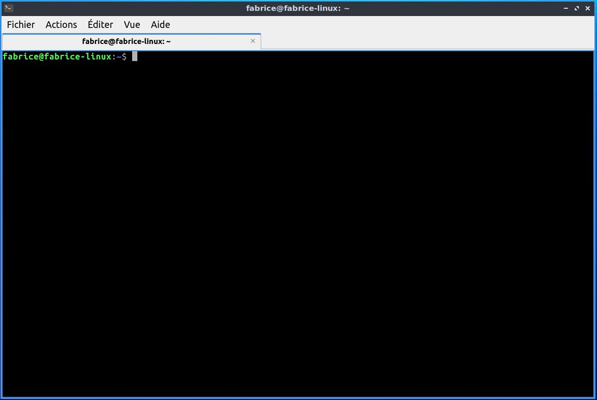

**Remarque** : les commandes que nous allons étudier sont des commandes de base du shell pour Linux. Cependant, dans les versions récentes de Windows, PowerShell est capable d'interpréter ces commandes et elles fonctionneront donc parfaitement aussi.

Sur l'image ci-dessus, nous voyons ci-dessus le terminal de l'utilisateur "fabrice" qui utilise un ordinateur qui se nomme "fabrice-linux" ("fabrice@fabrice-linux").

## 4. Arborescence du système de fichier

On a l'habitude de dire que **sous Linux, tout est fichier**. Les différents fichiers, répertoires, périphériques, liens sont en effet tous représentés par des fichiers de différents types rangés dans une arborescence bien précise de répertoires. Cette organisation est héritée du système Unix et se retrouve dans tous les systèmes apparentés, comme par exemple MacOs.

Sur la figure ci-dessous, une partie de l'arborescence est présentée.


Dans le schéma ci-dessus on trouve des répertoires (noms entourés d'un rectangle, exemple : "home") et des fichiers (uniquement des noms "grub.cfg").

On parle d'arborescence, car ce système de fichier ressemble à un arbre à l'envers.

Comme vous pouvez le constater, la base de l'arbre s'appelle la racine de l'arborescence et se représente par un "/"

### Chemin absolu et chemin relatif

Pour indiquer la position d'un fichier (ou d'un répertoire) dans l'arborescence, il existe 2 méthodes : indiquer un chemin absolu ou indiquer un chemin relatif. 

* Le chemin absolu doit indiquer "le chemin" depuis la racine. Par exemple le chemin absolu du fichier compte_rendu.odt sera : /home/marie/Documents/compte_rendu.odt

    Remarquez que nous démarrons bien de la racine / (attention les symboles de séparation sont aussi des /)

* Le chemin relatif indique le chemin non pas depuis la racine, mais depuis un répertoire quelconque : le chemin relatif permettant d'accéder au fichier "img_486.jpg" depuis le répertoire "home" est : "fabrice/Images/img_486.jpg"

    Remarquez l'absence du / au début du chemin (c'est cela qui nous permettra de distinguer un chemin relatif et un chemin absolu).

    Imaginons maintenant que nous désirions indiquer le chemin relatif pour accéder au fichier "mon_film.mp4" depuis le répertoire "Documents". Il faut "remonter" d'un "niveau" dans l'arborescence pour se retrouver dans le répertoire "marie" et ainsi pouvoir repartir vers la bonne "branche". Pour ce faire il faut utiliser 2 points : ..

    On écrira : "../Vidéos/mon_film.mp4".

    Il est tout à fait possible de remonter de plusieurs "crans" : "../../" depuis le répertoire "Documents" permet de "remonter" dans le répertoire "home".

Comme déjà évoqué plus haut, les systèmes de type "Unix" sont des systèmes "multi-utilisateurs" : chaque utilisateur possède son propre compte. Chaque utilisateur possède un répertoire à son nom, ces répertoires personnels se situent traditionnellement dans le répertoire "home". Dans l'arborescence ci-dessus, nous avons 2 utilisateurs : "fabrice" et "marie". Par défaut, quand un utilisateur ouvre une console, il se trouve dans son répertoire personnel.

!!! info "À retenir"
    Le symbole ``~`` représente le dossier personnel de l'utilisateur connecté. Par exemple, si l'utilisateur "marie" est connecté, ``~``` représente ``/home/marie/``.

Attention : les systèmes de type "Unix" sont "sensibles à la casse" (il faut différencier les caractères majuscules et les caractères minuscules) : le répertoire "Documents" et le répertoire "documents" sont 2 répertoires différents.

Il est important de savoir que si le double point ("../") permet de remonter d'un cran dans l'arborescence, le simple point "./" représente le répertoire courant. Si vous vous trouvez dans le répertoire "home" un "./document" représente le répertoire "document" qui se trouve dans le répertoire "home".

!!! tip "Touche Tab"
    Dans un terminal, on peut compléter automatiquement une commande ou un chemin en utilisant la touche de tabulation :octicons-tab-24:.

## 5. Les commandes pour manipuler les fichiers et les répertoires

### a) la commande cd

La commande ``cd`` permet de changer le répertoire courant (cd = change directory). Il suffit d'indiquer le chemin (relatif ou absolu) qui permet d'atteindre le nouveau répertoire.

Par exemple (en utilisant l'arborescence ci-dessous) :

* si le répertoire courant est le répertoire "marie" et que vous "voulez vous rendre" dans le répertoire "Documents", il faudra saisir la commande : ``cd Documents`` (relatif) ou ``cd /home/marie/Documents`` (absolu).
* si le répertoire courant est le répertoire "Documents" et que vous "voulez vous rendre" dans le répertoire "Vidéos", il faudra saisir la commande : ``cd ../Vidéos`` (relatif) ou ``cd /home/marie/Vidéos`` (absolu)
* si le répertoire courant est le répertoire "Images" et que vous "voulez vous rendre" dans le répertoire "fabrice", il faudra saisir la commande : ``cd ..`` (relatif) ou ``cd /home/fabrice`` (absolu)

### b) la commande ls

La commande ``ls`` permet de lister le contenu du répertoire courant.

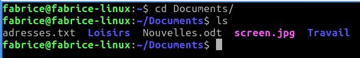

Dans l'exemple ci-dessus, depuis le répertoire personnel de l'utilisateur "fabrice", nous passons dans le répertoire "Documents" à l'aide d'un ``cd Documents``, puis nous affichons le contenu de ce répertoire "Documents" à l'aide de la commande ``ls``. Nous trouvons dans le répertoire "Documents" : 3 fichiers (*adresses.txt*, *Nouvelles.odt* et *screen.jpg*) et deux répertoires (*Travail* et *Loisirs*).

### c) la commande pwd

La commande ``pwd`` permet de connaître le répertoire courant (permet d'afficher le chemin d'accès vers le répertoire courant depuis la racine, pwd = path to working directory).

### d) La commande mkdir

La commande ``mkdir`` permet de créer un répertoire dans le répertoire courant. La commande est de la forme ``mkdir nom_du_répertoire``.

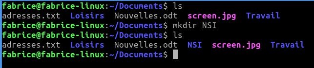

Remarque : il est préférable de ne pas utiliser de caractères accentués dans les noms de répertoire (ou de fichier). Il en est de même pour les espaces (à remplacer par des caractères tirets bas "_").

### e) La commande rm

La commande ``rm`` permet de supprimer un fichier ou un répertoire. La commande est de la forme ``rm nom_du_répertoire_ou_nom_du_fichier``.

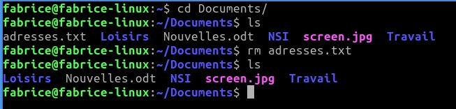

La plupart des commandes Linux peuvent être utilisées avec une ou des options. Par exemple, pour supprimer un répertoire non vide, il est nécessaire d'utiliser la commande ``rm`` avec l'option ``-r`` : ``rm -r nom_du_répertoire``.

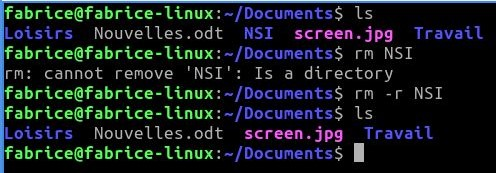

En fait l'option -r permet de supprimer un répertoire et ses sous répertoire.

**ATTENTION** : cette commande est relativement "dangereuse", il faut donc la manipuler prudemment. Par exemple la commande ``rm *`` efface tous les fichiers du répertoire courant (le * signifie tous les fichiers et tous les répertoires). Pour effacer tous les fichiers et tous les répertoires présents dans le répertoire courant il faut donc utiliser ``rm -r *``.

### f) La commande touch

La commande ``touch`` permet de créer un fichier vide. La commande est de la forme ``touch nom_du_fichier_à_créer``.

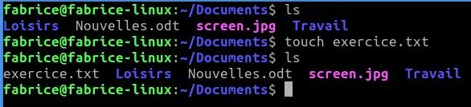

### g) La commande cat

La commande ``cat`` permet d'afficher dans la console le contenu d'un fichier.

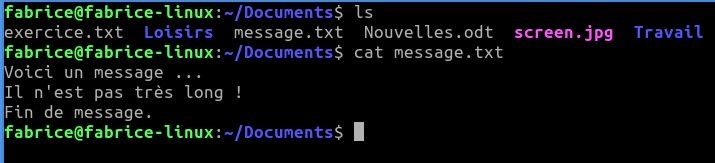

### h) La commande cp

La commande ``cp`` permet de copier un fichier. La commande est de la forme ``cp /répertoire_source/nom_fichier_à_copier /répertoire_destination/nom_fichier``.

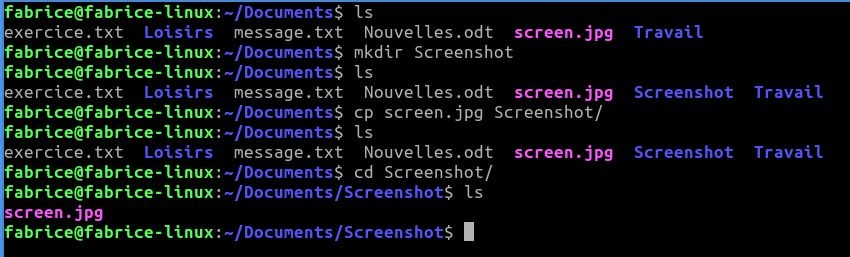

### i) La commande mv

La commande ``mv`` (move) permet de déplacer un fichier dans un répertoire. Par exemple un ``mv toto.txt titi`` déplacera le fichier ``toto.txt`` dans le répertoire ``titi`` (attention on parle bien de déplacement pas de copie).

### j) La commande man

La commande ``man`` permet d'obtenir la documentation d'une autre commande. Par exemple, ``man ls`` vous donnera la documentation de la commande ``ls``.

## 6. Gestion des utilisateurs et des groupes

Les systèmes de type "Unix" sont des systèmes multi-utilisateurs, plusieurs utilisateurs peuvent donc partager un même ordinateur, chaque utilisateur possédant un environnement de travail qui lui est propre.

Chaque utilisateur possède certains droits lui permettant d'effectuer certaines opérations et pas d'autres. Le système d'exploitation permet de gérer ces droits très finement. Un utilisateur un peu particulier est autorisé à modifier tous les droits : ce **super utilisateur** est appelé **administrateur** ou **root**. L'administrateur pourra donc attribuer ou retirer des droits aux autres utilisateurs. Au lieu de gérer les utilisateurs un par un, il est possible de créer des groupes d'utilisateurs. L'administrateur attribue des droits à un groupe au lieu d'attribuer des droits particuliers à chaque utilisateur.

Comme nous venons de le voir, chaque utilisateur possède des droits qui lui ont été octroyés par le "super utilisateur". Nous nous intéresserons ici uniquement aux droits liés aux fichiers, mais vous devez savoir qu'il existe d'autres droits liés aux autres éléments du système d'exploitation (imprimante, installation de logiciels...).

Les fichiers et les répertoires possèdent 3 types de droits :

- les **droits en lecture** (symbolisés par la lettre r pour Read) : est-il autorisé de lire le contenu de ce fichier ?
- les **droits en écriture** (symbolisés par la lettre w pour Write) : est-il autorisé de modifier le contenu de ce fichier ?
- les **droits en exécution** (symbolisés par la lettre x pour eXecute) : est-il autorisé d'exécuter le contenu de ce fichier (quand le fichier contient du code exécutable) ?

Il existe 3 types d'utilisateurs pour un fichier ou un répertoire :

- le **propriétaire** du fichier (par défaut c'est la personne qui a créé le fichier), il est symbolisé par la lettre u (User) ;
- le **groupe**, tous les utilisateurs appartenant à ce groupe possèdent des droits particuliers sur ce fichier. Le groupe est symbolisé par la lettre g ;
- les autres utilisateurs (ceux qui ne sont pas le propriétaire du fichier et qui n'appartiennent pas au groupe associé au fichier). Ces utilisateurs sont symbolisés la lettre o (Other).

Il est possible d'utiliser la commande ``ls`` avec l'option ``-l`` afin d'avoir des informations supplémentaires concernant les droits des fichiers.

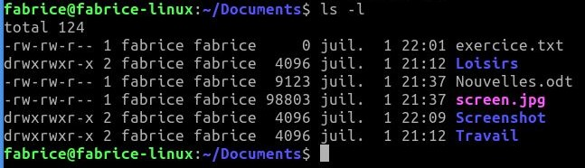

Prenons la première ligne :

``` title="Terminal"
-rw-rw-r-- 1 fabrice fabrice     0 juil.  1 22:01 exercice.txt
```

Lisons cette ligne de gauche à droite :

- le premier symbole "-" signifie que l'on a affaire à un fichier, dans le cas d'un répertoire, nous aurions un "d" (voir la 2e ligne) ;
- les 3 symboles suivants "rw-"donnent les droits du propriétaire du fichier : lecture autorisée (r), écriture autorisée (w), exécution interdite (- à la place de x) ;
- les 3 symboles suivants "rw-"donnent les droits du groupe lié au fichier : lecture autorisée (r), écriture autorisée (w), exécution interdite (- à la place de x) ;
- les 3 symboles suivants "r--"donnent les droits des autres utilisateurs : lecture autorisée (r), écriture interdite (- à la place de w), exécution interdite (- à la place de x) ;
- le caractère suivant "1" donne le nombre de liens (nous n'étudierons pas cette notion ici) ;
- le premier "fabrice" représente le nom du propriétaire du fichier ;
- le second "fabrice" représente le nom du groupe lié au fichier ;
- le "0" représente la taille du fichier en octet (ici notre fichier est vide) ;
- "juil.  1 22:01" donne la date et l'heure de la dernière modification du fichier ;
- "exercice.txt" est le nom du fichier.

Prenons la deuxième ligne :

``` title="Terminal"
drwxrwxr-x 2 fabrice fabrice  4096 juil.  1 21:12 Loisirs
```

Lisons cette ligne de gauche à droite :

- le premier symbole "d" signifie que l'on a un répertoire ;
- les 3 symboles suivants "rwx" donnent les droits du propriétaire du répertoire : lecture du contenu du répertoire autorisée (r), modification du contenu du répertoire autorisée (w), il est possible de parcourir le répertoire (voir le contenu du répertoire) (x) ;
- les 3 symboles suivants "rwx" donnent les mêmes droits au groupe lié au répertoire ;
- les 3 symboles suivants "r-x"donnent les droits des autres utilisateurs : modification du contenu du répertoire interdite (- à la place de w) ;
- le caractère suivant "2" donne le nombre de liens (nous n'étudierons pas cette notion ici) ;
- le premier "fabrice" représente le nom du propriétaire du répertoire ;
- le second "fabrice" représente le nom du groupe lié au répertoire ;
- le "4096" représente la taille du répertoire en octets ;
- "juil.  1 21:12" donne la date et l'heure de la dernière modification du contenu du répertoire ;
- "Loisirs" est le nom du répertoire

Il est important de ne pas perdre de vu que l'utilisateur **root** a la possibilité de modifier les droits de tous les utilisateurs.

Le propriétaire d'un fichier peut modifier les permissions d'un fichier ou d'un répertoire à l'aide de la commande ``chmod``. Pour utiliser cette commande, il est nécessaire de connaître certains symboles :

- les symboles liés aux utilisateurs : "u" correspond au propriétaire, "g" correspond au groupe lié au fichier (ou au répertoire), "o" correspond aux autres utilisateurs et "a" correspond à "tout le monde" (all : permet de modifier "u", "g" et "o" en même temps) ;
- les symboles liés à l'ajout ou la suppression des permissions : "+" on ajoute une permission, "-" on supprime une permission, "=" les permissions sont réinitialisées (permissions par défaut) ;
- les symboles liés aux permissions : "r" : lecture, "w" : écriture, "x" : exécution.

La commande ``chmod`` à cette forme :

``` title="Terminal"
chmod [u g o a] [+ - =] [r w x] nom_du_fichier
```

par exemple

``` title="Terminal"
chmod o+w toto.txt
```

attribuera la permission "écriture" pour le fichier "toto.txt" "aux autres utilisateurs".

Il est possible de combiner les symboles :

``` title="Terminal"
chmod g-wx toto.txt
```

La commande ``chmod`` ci-dessus permet de supprimer la permission "écriture" et la permission "exécution" pour le fichier *toto.txt* "au groupe lié au fichier".

Une fois de plus, "root" a tous les droits sur l'ensemble des fichiers et des répertoires, il peut donc utiliser la commande ``chmod`` sur tous les répertoires et tous les fichiers.
