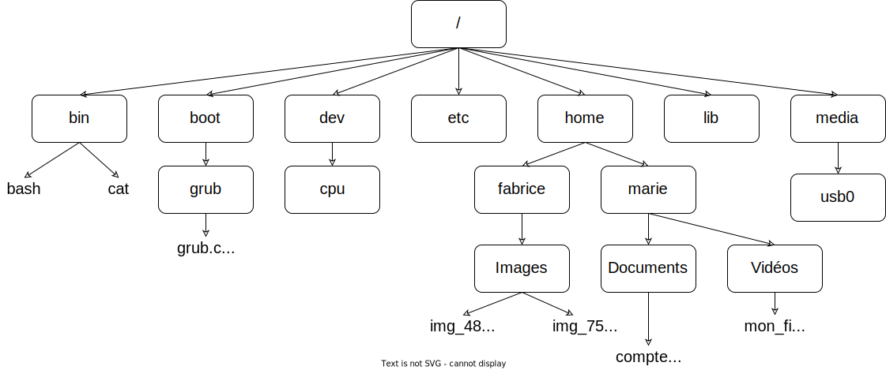

# S3 - Architectures matérielles et systèmes d'exploitation

# 2. Systèmes d'exploitation

## 1. À quoi sert un système d'exploitation ?

!!! danger "Objectifs d'un système d'exploitation :"

    Les trois objectifs majeurs d'un système d'exploitation sont:

    * faire l'interface entre le matériel et l'utilisateur ;
    * isoler le code utilisateur du matériel ;
    * faire en sorte que tous les programmes puissent s'exécuter de façon équitable.

## 2. Différents systèmes d'exploitation

!!! info "Logiciel libre"

    Un logiciel est considéré comme libre, au sens de la Free Software Foundation, s'il confère à son utilisateur quatre libertés (numérotées de 0 à 3) :

    * la liberté d'exécuter le programme, pour tous les usages ;
    * la liberté d'étudier le fonctionnement du programme et de l'adapter à ses besoins ;
    * la liberté de redistribuer des copies du programme (ce qui implique la possibilité aussi bien de donner que de vendre des copies) ;
    * la liberté d'améliorer le programme et de distribuer ces améliorations au public, pour en faire profiter toute la communauté.

    L'accès au code source est une condition d'exercice des libertés 1 et 3. 

Un logiciel **propriétaire**, est tout simplement un logiciel qui n'est pas libre, c'est-à-dire qui ne respecte pas l'une ou plusieurs des quatre libertés énoncées ci-dessus.

## 3. La ligne de commande

Les lignes de commande sont entrée dans le terminal, appelé aussi console ou, abusivement, shell.

## 4. Arborescence du système de fichier

Les systèmes dérivés de Unix partagent une organisation des dossiers en **arborescence**.

* Le chemin absolu doit indiquer "le chemin" depuis la racine. Par exemple "/home/marie/Documents/compte_rendu.odt".
* Le chemin relatif indique le chemin non pas depuis la racine, mais depuis un répertoire quelconque. Par exemple : "fabrice/Images/img_486.jpg".

    Remarquez l'absence du / au début du chemin (c'est cela qui nous permettra de distinguer un chemin relatif et un chemin absolu).

    Pour "remonter" d'un "niveau" dans l'arborescence,  il faut utiliser 2 points : .., par exemple "../../marie/Vidéos/mon_film.mp4".

## 5. Les commandes pour manipuler les fichiers et les répertoires

| Commande | Effet |
| :---: | :---: |
| cd| changer de répertoire |
| ls (ls -l)| afficher le contenu du répertoire |
| pwd| afficher le nom du répertoire courant |
| mkdir| créer un répertoire dans le répertoire courant |
| rm (rm -r)| supprimer un fichier ou un répertoire|
| touch| créer un fichier vide |
| cat| afficher le contenu d'un fichier |
| cp| copier un fichier dans un répertoire|
| mv| déplacer un fichier dans un répertoire|
| man|afficher la documentation d'une autre commande|

## 6. Gestion des utilisateurs et des groupes

Pour un fichier ou un répertoire, Linux distingue le **propriétaire** (u), le **groupe** (g) et les **autres** utilisateurs (o).

Les droits associés sont la **modification** (w), la **lecture** ( r ) et l'**exécution** (x).

La commande ``ls -l`` permet d'afficher la liste des fichiers et des répertoires avec les droits associés.

La commande ``chmod [u g o a] [+ - =] [r w x] nom_du_fichier`` permet de modifier les droits associés à un fichier ou à un répertoire.