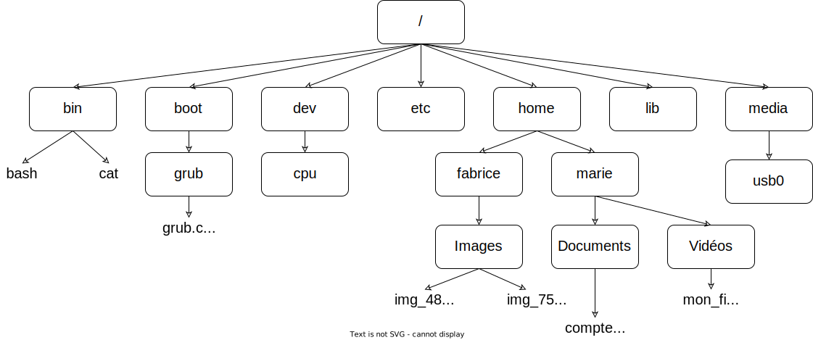

_Les exercices précédés du symbole :fontawesome-solid-computer: sont à faire sur machine, en sauvegardant le fichier si nécessaire._

_Les exercices précédés du symbole :octicons-pencil-16: doivent être résolus par écrit._

## :octicons-pencil-16: QCM

<iframe src="https://www.flallemand.fr/wp/wp-admin/admin-ajax.php?action=h5p_embed&id=28" width="959" height="380" frameborder="0" allowfullscreen="allowfullscreen" title="linux 1"></iframe>

<iframe src="https://www.flallemand.fr/wp/wp-admin/admin-ajax.php?action=h5p_embed&id=29" width="959" height="380" frameborder="0" allowfullscreen="allowfullscreen" title="linux 2"></iframe>

<iframe src="https://www.flallemand.fr/wp/wp-admin/admin-ajax.php?action=h5p_embed&id=30" width="959" height="340" frameborder="0" allowfullscreen="allowfullscreen" title="linux 3"></iframe>

<iframe src="https://www.flallemand.fr/wp/wp-admin/admin-ajax.php?action=h5p_embed&id=31" width="959" height="420" frameborder="0" allowfullscreen="allowfullscreen" title="linux 4"></iframe>

<iframe src="https://www.flallemand.fr/wp/wp-admin/admin-ajax.php?action=h5p_embed&id=32" width="959" height="340" frameborder="0" allowfullscreen="allowfullscreen" title="linux 5"></iframe>

## :octicons-pencil-16: Exercice 1

En utilisant l'arborescence ci-dessous, quelle est la commande à saisir si le répertoire courant est le répertoire "home" et que vous "voulez vous rendre" dans le répertoire "Documents" (vous utiliserez d'abord un chemin absolu puis un chemin relatif).

-----------------------------------------

!!! caution "Consignes pour les exercices 2 et 3"

    Les exercices 2 et 3 doivent être réalisés sur un système Linux. Ne disposant pas d'ordinateurs sous Linux au lycée, nous utiliserons un simulateur de terminale en ligne disponible à l'adresse suivante : https://bellard.org/jslinux/vm.html?url=alpine-x86.cfg&mem=192

    Une fois l'émulateur démarré, entrer la commande `cd /` pour vous rendre à la racine de l'arborescence du système de fichier Linux. Tapez `ls` pour vérifier la liste des dossiers qui s'affiche.

    Vous pouvez maintenant faire les exercices.

    **Remarque** : dans le terminale, la flèche "montante" du clavier permet de remonter dans l'historique des commandes et la touche de tabulation permet la complétion automatique des commandes et des chemins.

----------------------------------------

## :fontawesome-solid-computer: Exercice 2

Faites les actions suivantes en utilisant des lignes de commande. **Pour chaque question, recopier la liste des commandes utilisées**.

* Rendez-vous dans votre répertoire personnel `/home` ;
* Créez un répertoire ``doc`` ;
* Placez-vous dans le répertoire ``doc`` ;
* Créez un répertoire ``texte`` ;
* Créez un répertoire ``mesDoc`` ;
* Placez-vous dans le répertoire ``texte`` ;
* Créez un fichier ``toto.txt`` ;
* Ouvrez l'éditeur de texte `nano` pour éditer le fichier ``toto.txt`` : pour cela, entrer la commande `nano toto.txt` dans le terminal.
* Entrez le texte "Bonjour Linux !", enregistrez (CTRL O et valider) et quittez (CTRL X) `nano`.
* Affichez dans le terminal le contenu du fichier `toto.txt`.
* Placez-vous dans le répertoire ``doc`` ;
* Copiez le fichier ``toto.txt`` dans le répertoire ``mesDoc`` ;
* Placez-vous dans le répertoire ``mesDoc`` et vérifiez que le fichier ``toto.txt`` est bien présent dans ce répertoire ;
* Placez-vous dans le répertoire ``doc`` ;
* Effacez le fichier ``toto.txt`` du répertoire ``texte`` ;
* Déplacez le fichier ``toto.txt`` du répertoire ``mesDoc`` vers le répertoire ``doc`` ;
* Effacez le répertoire ``mesDoc`` ;
* Effacez le répertoire ``texte`` ;
* Effacez le fichier ``toto.txt``.

-------------------------------------

## :fontawesome-solid-computer: Exercice 3

Faites les actions suivantes en utilisant des lignes de commande (en partant de votre répertoire de travail). Recopier la liste des commandes utilisées.

* Créez un répertoire ``doc`` ;
* Placez-vous dans le répertoire ``doc`` et créez un fichier ``toto.txt`` ;
* Listez les droits (r, w et x) pour les différents utilisateurs (u, g et o) sur le fichier ``toto.txt`` ;
* Supprimez le droit en lecture pour les utilisateurs g sur le fichier ``toto.txt``.
