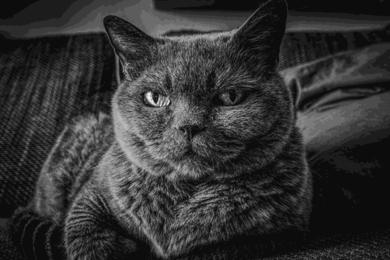
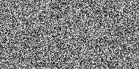
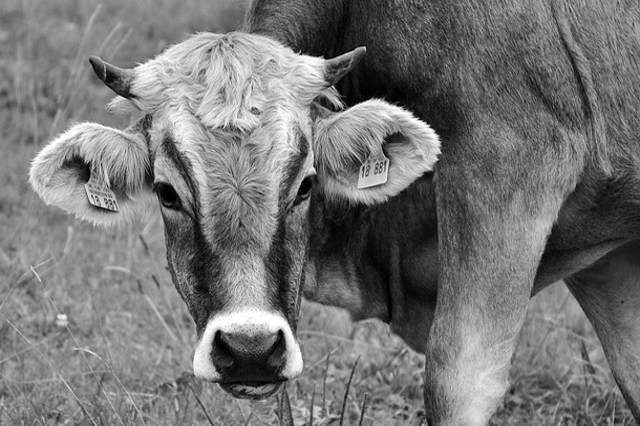

Mini-projet : Stéganographie {#mini-projet--stéganographie}
============================

Cette activité est fortement inspirée du dossier paru sur le site
[bibmath](http://www.bibmath.net/crypto/index.php?action=affiche&quoi=stegano/index).

Les images utilisées sont toutes issues du site
[Pixabay](https://pixabay.com/) et libres de droits.

La **stéganographie**, du grec *stegano* (dissimuler), est une méthode
de cryptographie qui consiste, plutôt que de crypter un message, à le
cacher dans une image selon un procédé plus ou moins complexe.

On s'intéresse en particulier à la dissimulation d'une image dans une
autre image.

Avant de commencer, il est nécessaire de prendre en main le module
Python PIL (Python Imaging Library) qui permet de manipuler des images.

## 1. Le module PIL {#1-le-module-pil}


### Qu'est-ce que la librairie PIL ? {#quest-ce-que-la-librairie-pil-}

PIL est l'acronyme pour Python Imaging Library. Il s'agit d'une
librairie additionnelle qui fournit des fonctions de traitement
d'images et de manipulations graphiques à Python. Elle supporte de
nombreux formats d'images.

La "véritable" bibliothèque PIL, c'est-à-dire la bibliothèque
d'origine, n'a jamais été portée pour Python 3. Nous
utiliserons donc une version dérivée, nommée Pillow (les informaticiens
ont beaucoup d'humour\...) qui est, elle, compatible avec les dernières
versions de Python 3. On pourra consulter [le site de
Pillow](https://python-pillow.org/). La bibliothèque Pillow est déjà
installée dans la distribution EduPython.

!!! danger "Attention"

    **Toutes les images utilisées dans ce mini-projet sont téléchargeables en cliquant ici : [images.zip](./images.zip)**

    **Pour faire ce travail, il est nécessaire d'avoir téléchargé les images et de les avoir placées dans le même dossier que votre programme.**

    **Le travail pourra être fait dans EduPython, ou dans la console Python accessible dans le menu ci-dessus. Dans ce cas, les images devront être chargées dans la console en utilisant le bouton représentant un dossier.**


### Commandes utiles pour une utilisation de base

Avant toute chose, on importera la bibliothèque en ajoutant la ligne
suivante en début de programme :


 
``` {.python}
from PIL import Image
```


 
-   Exemple d'ouverture d'un fichier et accès à ses informations


 
``` {.python}
# ouverture du fichier image
img = Image.open("chat.png")
# nom du fichier
print(img.filename)
# taille du fichier
print(img.size)
print(img.width)
print(img.height)
```


 
``` {.python}
# Affichage de l'image
img.show()
```




 
-   Un fichier image peut avoir trois **modes** différents :

    -   "l" (lettre l minuscule) pour un fichier en noir et blanc
        (uniquement deux couleurs) ;
    -   "L" pour un fichier en niveaux de gris ;
    -   "RGB" pour une image en couleur.

    Une image est représentée par un tableau de pixels. Chaque pixel est
    repéré par ses coordonnées $(x;y)$ où $x$ est la ligne où se trouve
    le pixel et $y$ la colonne. Chaque pixel possède une **valeur**.

    Dans le cas d'une image en noir et blanc, la valeur d'un pixel est
    0 (blanc) ou 1 (noir).

    Dans le cas d'une image en niveaux de gris, la valeur d'un pixel
    est un entier compris entre 0 (noir) et 255 (blanc).

    Dans le cas d'une image en couleurs RGB, la valeur d'un pixel est
    un **3-uplet** $(R, G, B)$ dans lequel chaque élément est un entier
    compris entre 0 et 255 qui représente respectivement la prorportion
    de rouge, de vert et de bleu dans la couleur du pixel en question.

-   Accéder à la valeur d'un pixel : `img.getpixel((x, y))`. Cette
    fonction retourne un entier (dans le cas d'une image noir et blanc
    ou en niveaux de gris) ou un triplet (dans le cas d'une image en
    couleurs). Attention à la syntaxe : il n'y a qu'un seul argument,
    qui est un couple de coordonnées (donc doubles parenthèses).


 
``` {.python}
print(img.mode)
img.getpixel((48,75)) # attention aux parenthèses !
```


 
-   Commandes pour créer un fichier image et définir la valeur de ses
    pixels :


  
``` {.python}
largeur = 200
hauteur = 100
# Création d'une nouvelle image en niveaux de gris en mémoire
nouvelle_image = Image.new("L", (largeur, hauteur))
# Définition de la valeur d'un pixel particulier
nouvelle_image.putpixel((48,75), 189)

# Double boucle pour parcourir tous les pixels et affecter une valeur aléatoire
from random import randint

for i in range(largeur):
    for j in range(hauteur):
        nouvelle_image.putpixel((i,j), randint(0,255))

# Enregistrement du fichier
nouvelle_image.save("mon_image.png")

# Affichage dans le notebook
nouvelle_image.show()
```


 
## 2. Stéganographie dans une image en niveaux de gris {#2-stéganographie-dans-une-image-en-niveaux-de-gris}


Le principe
-----------

Considérons deux images en niveau de gris. Chaque pixel est donc codé
par un entier compris en 0 et 255. Nous supposons de plus ces deux
images de même taille.

La première image `image1.pgm` est la suivante (dimensions : 640x426) :


La seconde image `image2.pgm` est la suivante (dimensions : 640x426) :



Nous utilisons des images au format PGM qui est non compressé.
L'utilisation d'un format compressé du type JPG ou PNG empêcherait
notre méthode de fonctionner. Ce type d'image s'affiche dans le logiciel GIMP.

L'objectif est de cacher l'image 2 dans l'image 1. Comment faire ?

Chaque pixel de chacune des deux images est codé par un entier compris
entre 0 et 255. Écrit en base 2, cet entier s'écrit avec 8 chiffres (en
ajoutant éventuellement des zéros inutiles au début du nombre). Prenons
par exemple un pixel de la première image codé par le nombre binaire
`1011 0101` : les quatre premiers chiffres ont plus de poids dans la
valeur de ce nombre que les quatre derniers puisqu'ils sont associés à
de plus grandes puissances de 2. Nous les appellerons **bits de poids
lourds**. Les quatre derniers sont donc des **bits de poids faible**.

Si on remplace ce nombre par un nombre dont on ne modifie que les quatre
bits de poids faible (les quatre derniers), alors l'image sera assez
peu modifiée. C'est cette remarque qui permet de cacher l'image 2 dans
l'image 1. Il suffit de créer une nouvelle image dont chaque pixel est
formé des bits de poids lourd de chacune des deux images de départ.

Pour chaque pixel des deux images :

| Image 1 | Image 2 | Image cryptée |
|---------|---------|---------------|
| **1011** 0101 | *0110* 1100 | **1011** *0110* |


Comme on n'a modifié que les bits de poids faible de l'image 1,
l'image cryptée ressemblera beaucoup à l'image 1, mais un programmeur
averti saura en extraire l'image 2 \...

Voici, à gauche, l'image 1 et, à droite, l'image cryptée (la pauvre
vache est perdue dans la ville !).

| Image 1 | Image cryptée |
|---------|------------|
|  |  |
 
Mini-projet
-----------

Ta mission, si tu l'acceptes, consiste en deux choses :

1.  Programmer un algorithme permettant de créer l'image cryptée à
    partir des deux images de départ. Il s'agit de définir une
    **fonction** qui prend en **arguments** deux images de mêmes
    dimensions et qui **retourne** l'image cryptée.
2.  Programmer un algorithme permettant de retrouver l'image cachée
    dans une image cryptée. Il s'agit de définir une **fonction** qui
    prend en **argument** une image cryptée et qui **retourne** l'image
    cachée.

En cas de besoin, quelques indications :

-   La fonction `bin()` permet de convertir un entier en sa
    représentation binaire sous forme de chaîne de caractères.
    Cependant, le résultat ne contient pas les zéros inutiles en début
    de chaîne !!! Par exemple `bin(45)` retourne `'0b101101'`.
-   Pour accéder aux éléments d'une chaîne de caractères, on utilise
    les crochets comme pour les tableaux. Un indice négatif indique que
    l'on part de la fin de la chaîne. Par exemple, si
    `mot = "indication"`, `mot[2:-2]` retourne `"dicati"`.


 
Une première étape dans la réalisation de ce projet consiste donc en
l'écriture d'une fonction permettant d'obtenir la représentation
binaire d'un entier compris entre 0 et 255 sous la forme d'une chaîne
de caractères de longueur exactement 8. Tu peux compléter la fonction
ci-dessous.


 
``` {.python}
def bin_8_car(x):
    """x est un entier compris entre 0 et 255
    la fonction renvoie une chaîne de 8 caractères
    représentant x en binaire"""
    nb = bin(x)
    nb = nb[2:] # on enlève '0b'
    # on ajoute des zéros pour arriver à 8 caractères
    while ... :
        nb = ... + nb
    return nb
```


 
Exécute les tests ci-dessous pour vérifier la fonction.


 
``` {.python}
# tests de la fonction bin_8_car
assert bin_8_car(54) == "00110110"
assert bin_8_car(255) == "11111111"
print("Tests réussis !")
```


 
Compléte ci-dessous la fonction `crypte` réalisant la première tâche
demandée :


 
``` {.python}
def crypte(img1, img2):
    """Cette fonction cache l'image 2 dans l'image 1"""
    largeur, hauteur = img1.size
    imgCrypt = Image.new("L", (largeur, hauteur))
    for i in range(...):
        for j in range(...):
            pixel_img1 = img1.getpixel((i,j))
            pixel_img2 = img2.getpixel((i,j))
            ...
            ...
            ...
            imgCrypt.putpixel((i,j), ...)
    return imgCrypt
```


 
``` {.python}
# test de la fonction crypte : il est normal que cela prenne quelques secondes
# ici, on cache l'image de la vache dans l'image de la ville
img1 = Image.open('image1.pgm')
img2= Image.open('image2.pgm')
image_cryptee = crypte(img1, img2)
image_cryptee.save("vache_perdue.pgm")
image_cryptee
```


 
Compléte ci-dessous la fonction `decrypte` réalisant la seconde tâche
demandée :


 
``` {.python}
def decrypte(imgCrypt):
    """Cette fonction retourne l'image cachée dans imgCrypt"""
    largeur, hauteur = imgCrypt.size
    img = Image.new("L", (largeur, hauteur))
    ...
    return img
```


 
Pour tester cette fonction, voici une image en niveaux de gris qui
contient un message secret. Le fichier est nommé `image_crypte.pgm`.


 
``` {.python}
# test de la fonction decrypte
# ou ouvre une image qui contient une image cryptée
imageCryptee = Image.open("image_crypte.pgm")
# on décrypte
image = decrypte(imageCryptee)
# on affiche l'image qui était cachée
image
```


 
Maintenant, tu peux t'amuser à créer d'autres images cryptées et à les
décrypter pour tester tes fonctions sur plusieurs exemples.


 
## Défi !!! {#défi-}


Dans une image en couleur au format `RGB`, chaque pixel est codé par
trois entiers compris entre 0 et 255.

On peut donc y cacher trois images en niveaux de gris différentes : une
dans chaque composante de couleur.

En suivant cette idée, j'ai caché trois messages dans l'image
ci-dessous, nommée `defi_steg.ppm`. Sauras-tu retrouver les trois
messages cachés ?


 
``` {.python}
### à compléter ...
def decrypte_image_couleurs(img):
    pass
```

