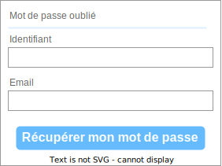

!!! danger "Objectifs de cette activité"
    À l'issue de cette activité, vous saurez :

    * créer un formulaire simple ;
    * comprendre son fonctionnement ;
    * distinguer les transmissions de paramètres par les méthodes GET et POST.    
<!--  -->

## Que sont les formulaires Web ?

Les formulaires Web sont l'un des principaux points d'interaction entre un utilisateur et un site Web. Les formulaires permettent aux utilisateurs de saisir des données, qui sont généralement envoyées à un serveur Web pour traitement et stockage, ou utilisées côté client pour mettre à jour immédiatement l'interface d'une manière ou d'une autre (par exemple, ajouter un autre élément à une liste, ou afficher ou masquer une fonctionnalité de l'interface utilisateur).

Le code HTML d'un formulaire Web est composé d'un ou plusieurs contrôles de formulaire (parfois appelés widgets), ainsi que d'éléments supplémentaires pour aider à structurer le formulaire global. Les contrôles peuvent être des **champs de texte** à une ou plusieurs lignes, des **listes déroulantes**, des **boutons**, des **cases à cocher** ou des **boutons radio**, et sont principalement créés à l'aide de l'élément **`<input>`**.

## Création d'un formulaire simple

Avant de commencer à coder, il est toujours préférable de prendre du recul et de prendre le temps de réfléchir à votre formulaire. La conception d'une maquette rapide est toujours une bonne démarche.

Dans cette activité, nous allons créer un formulaire de récupération de mot de passe oublié. Faisons un croquis :



Notre formulaire contiendra deux champs de texte et un bouton. Nous demandons à l'utilisateur son identifiant et son e-mail. Appuyer sur le bouton enverra les données à un serveur Web.

## Implémentation de notre formulaire HTML

Tout d'abord, créons le HTML pour notre formulaire. Nous utiliserons les éléments HTML suivants : `<form>`, `<label>`, `<input>`, et `<button>`.

Cliquer sur [ce lien pour accéder au Replit dans lequel cette activité sera réalisée](https://replit.com/team/premiere-nsi/Formulaire-web).

Tous les formulaires commencent par un élément **`<form>`** de la forme :

```html
<form action="" method="post">…</form>
```

Cet élément définit un formulaire. C'est un élément **conteneur**, mais spécifiquement pour contenir des formulaires ; il prend également en charge certains attributs spécifiques pour configurer le comportement du formulaire. Tous ses attributs sont facultatifs, mais il est courant de toujours définir au moins les attributs **action** et **method**

* L'attribut **action** définit l'emplacement (URL) où les données collectées du formulaire doivent être envoyées lors de sa soumission. Pour l'instant, nous avons laissé cet attribut vide.
* L'attribut **method** définit la méthode HTTP avec laquelle envoyer les données (généralement GET ou POST).

Pour l'instant, ajoutez le code HTML ci-dessous dans le fichier `index.html`.

```html
<form action="" method="get">
    <p>Mot de passe oublié</p>
    <label for="identifiant">Identifiant</label><br>
    <input type="text" id="identifiant" name="user_id" /><br>
    <label for="mail">E-mail:</label><br>
    <input type="email" id="mail" name="user_email" /><br>
</form>
```

Notre formulaire de contact n'est pas complexe : la partie saisie de données contient deux champs de texte **`<input>`**, chacun avec un **`<label>`** correspondant :

* Le champ de saisie l'identifiant est un champ de texte sur une seule ligne.
* Le champ de saisie de l'e-mail est une entrée de type email : un champ texte d'une seule ligne qui n'accepte que les adresses e-mail.

Pour la convivialité et l'accessibilité, nous incluons une étiquette explicite **`<label>`** pour chaque contrôle de formulaire. Notez l'utilisation de l'attribut **`<for>`** sur tous les éléments **`<label>`**, qui prend comme valeur l'identifiant du contrôle de formulaire auquel il est associé — c'est ainsi que l'on associe un contrôle de formulaire à son libellé.

Il y a un grand avantage à faire cela, car on associe ainsi l'étiquette au contrôle de formulaire, permettant aux utilisateurs de souris, de trackpad et d'appareils tactiles de cliquer sur l'étiquette pour activer le contrôle correspondant.

Dans l'élément **`<input>`**, l'attribut le plus important est l'attribut **type**. Cet attribut est extrêmement important car il définit la façon dont l'élément **`<input>`** apparaît et se comporte.

* Dans notre exemple simple, nous utilisons le type **text** pour le premier **`<input>`** — la valeur par défaut pour cet attribut. Il représente un champ de texte de base sur une seule ligne qui accepte tout type de saisie de texte.
* Pour le deuxième **`<input>`**, nous utilisons le type **email**, qui définit un champ de texte sur une seule ligne qui n'accepte qu'une adresse e-mail bien formée. Cela transforme un champ de texte de base en une sorte de champ "intelligent" qui effectuera des contrôles de validation sur les données saisies par l'utilisateur. Cela entraîne également l'apparition d'une disposition de clavier plus appropriée pour la saisie d'adresses e-mail (par exemple, avec un symbole @ par défaut) sur les appareils dotés de claviers dynamiques, comme les smartphones.

## Ajout du bouton

Le balisage de notre formulaire est presque terminé ; il suffit d'ajouter un bouton pour permettre à l'utilisateur d'envoyer, ou "soumettre", ses données une fois qu'il a rempli le formulaire. Ceci est fait en utilisant l'élément **`<button>`**.

Ajoutez ce qui suit juste avant la balise de fermeture **`</form>`** :

```html
<button type="submit">Récupérer mon mot de passe</button>
```

L'élément **`<button>`** accepte également un attribut **type** — celui-ci accepte l'une des trois valeurs : submit, reset, ou button.

* Un clic sur un bouton **submit** (la valeur par défaut) envoie les données du formulaire vers la page web définie par l'attribut **action** de l'élément **`</form>`**.
* Un clic sur un bouton **reset** réinitialise immédiatement tous les widgets du formulaire à leur valeur par défaut.
* Un clic sur un bouton **button** ne fait rien ! Cela semble idiot, mais c'est incroyablement utile pour créer des boutons personnalisés - vous pouvez définir la fonctionnalité choisie avec JavaScript.

## Mise en forme du formulaire

Pour le moment, le formulaire a l'air plutôt moche.

Nous allons utiliser un fichier de style au format CSS pour le rendre plus agréable.

Tout d'abord, créer dans le Replit un fichier nommé `style.css` et lier ce fichier au fichier HTML en ajoutant la ligne suivante dans l'entête de celui-ci :

```HTML
<link rel="stylesheet" href="style.css">
```

Dans le fichier `style.css`, ajoutez le CSS suivant :

```css
form {
  /* Centre le formulaire sur la page */
  margin: 0 auto;
  width: 400px;
  /* Bordure du formulaire */
  padding-left: 1em;
  padding-right: 1em; 
  border: 1px solid #ccc;
}

form p {
    border-bottom: 1px solid #99c1f1;
    padding-bottom: 1em;
}

label {
  display: inline-block;
  width: 90px;
  text-align: left;
  padding-bottom: 0.5em;
  padding-top: 0.5em;
}

input {
  font: 1em sans-serif;
  width: 390px;
  box-sizing: border-box;
  border: 1px solid #999;
}

input:focus {
  /* S'applique quand le widget est activé */
  border-color: #0000ff;
}

button {
    display: block;
    margin: 1em auto;
    background-color: #66bbff;
    color: white;
    font-weight: bold;
}
```

Enregistrez et rechargez : votre formulaire devrait avoir l'air beaucoup moins laid.

## Envoi des données de formulaire à votre serveur Web

La dernière partie, et peut-être la plus délicate, consiste à gérer les données du formulaire côté serveur. L'élément **`<form>`** définit où et comment envoyer les données grâce aux attributs **action** et **method**.

Nous fournissons un attribut **name** pour chaque contrôle de formulaire. Les noms sont importants à la fois côté client et côté serveur ; ils indiquent au navigateur quel nom donner à chaque donnée et, côté serveur, ils laissent le serveur gérer chaque donnée par son nom. Les données du formulaire sont envoyées au serveur sous forme de paires nom/valeur.

Pour nommer les données dans un formulaire, vous devez utiliser l'attribut **name** sur chaque widget de formulaire qui collectera une donnée spécifique. 

Regardons notre code de formulaire : modifiez comme indiqué ci-dessous la valeur de l'attribut **action** afin que les données soient envoyées à la page `http://nsi.flallemand.fr/divers/acti4_forms.php` :

```html
<form action="http://nsi.flallemand.fr/divers/acti4_forms.php" method="get">
  <p>Mot de passe oublié</p>
  <label for="identifiant">Identifiant</label><br>
  <input type="text" id="identifiant" name="user_id" /><br>
  <label for="mail">E-mail:</label><br>
  <input type="email" id="mail" name="user_email" /><br>
  <button type="submit">Récupérer mon mot de passe</button>
</form>
```

Dans notre exemple, le formulaire enverra 2 données nommées "user_id" et " user_email". Ces données seront envoyées à l'URL `http://nsi.flallemand.fr/divers/acti4_forms.php` en utilisant la méthode HTTP GET.

Côté serveur, le script à l'URL `http://nsi.flallemand.fr/divers/acti4_forms.php` recevra les données sous la forme d'une liste de 2 éléments clé/valeur contenus dans la requête HTTP. La façon dont ce script traitera ces données dépend de vous. Chaque langage côté serveur (PHP, Python, Ruby, Java, C#, etc.) possède son propre mécanisme de gestion des données de formulaire. Nous n'allons pas approfondir ce sujet ici.

Pour notre exemple, c'est le langage PHP qui est utilisé.

Voici, pour information, le contenu du fichier `acti4_forms.php` (remarque : les éléments CSS sont ici directement inclus dans le fichier, ce qui n'est pas une bonne habitude) :

```php
<!DOCTYPE html>
<html lang="fr">

<head>
    <title>Activité 4 : Formulaires </title>
    <meta charset="utf-8">
</head>

<body style="width: 70%; margin: 0 auto;">
    <h1 style="text-align: center;"> 
        <?php
        echo "Bienvenue " . $_GET['user_id'] . " !";
        ?>
    </h1>
    <h1 style="text-align: center;">Alors ? Tu as encore oublié ton mot de passe ?</h1>
    <h1 style="text-align: center;">Quelle tête en l'air !</h1>
    <?php
    echo "<h1 style='text-align: center;'>Bon, je te pardonne pour cette fois<br> et je t'envoie ton mot de passe à l'adresse<br>". $_GET['user_email'] . "</h1>";
    ?>
    
</body>

</html>
```

Tester le formulaire, à partir du Replit : entrer un nom et une adresse e-mail, puis cliquer sur le bouton. Observer ce qu'il se passe.

Observer l'URL affichée dans la barre d'adresse du navigateur. Que constatez-vous ?

Pour éviter cet affichage dans la barre d'adresse, on utilise plutôt la méthode HTTP POST pour l'envoi de données de formulaires.

Pour cela, modifier l'attribut **method** dans le fichier `index.html` :

```html
<form action="http://nsi.flallemand.fr/divers/acti4_forms_bis.php" method="gpost">
```

On modifie aussi l'attribut **action** car le code PHP pour extraire les données transmises par la méthode POST n'est pas exactement le même.

Tester à nouveau cette nouvelle version du formulaire et observer l'URL affiché dans la barre d'adresse.

!!! danger "Remarque"
    En réalité, la méthode POST n'est pas plus sécurisée que la méthode GET. Certes, les entrées du formulaire ne sont plus affichées dans l'URL, mais elles sont transmises dans le corps de la requête en clair : l'utilisation des outils de développement du navigateur vous le montrera.

    Pour une vraie sécurité et empêcher que ces données puissent être interceptées, il faut les crypter et utiliser le protocole sécurisé HTTPS (programme de terminale).
<!--  -->