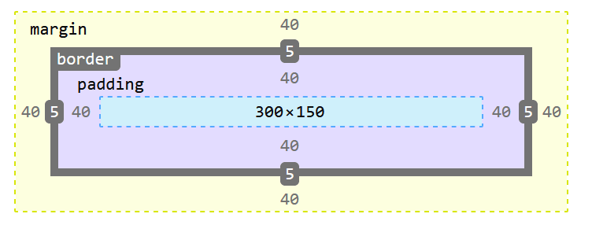
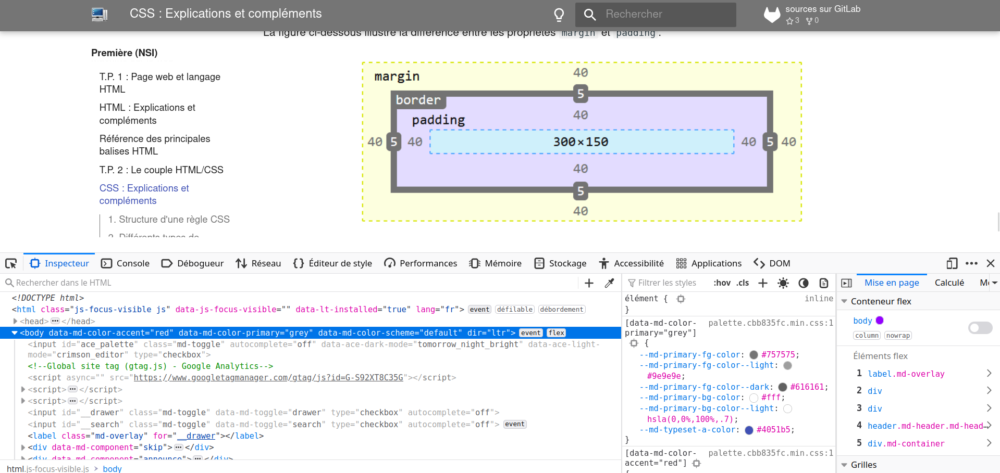

<!-- Introduction avec historique -->

{width="15%" style="float: right"}

Le principe du couple HTML/CSS est de bien séparer la définition du **contenu** d'une page Web de la définition de son **apparence**.

Ce langage est apparu au milieu des années 1990 et les règles CSS sont couramment utilisées et reconnues par les navigateurs depuis le début des années 2000.

L'un des objectifs majeurs des CSS est de permettre la mise en forme en dehors du code HTML. Il est par exemple possible de ne décrire que la structure d'un document en HTML, et de décrire toute la présentation dans une feuille de style CSS séparée. Les styles sont appliqués au dernier moment, dans le navigateur web des visiteurs qui consultent le document. Cette séparation fournit un certain nombre de bénéfices, permettant d'améliorer l'accessibilité, de changer plus facilement de présentation, et de réduire la complexité de l'architecture d'un document.

Ainsi, les avantages des feuilles de style sont multiples :

* La structure du document et la présentation peuvent être gérées dans des fichiers séparés ;
* La conception d'un document se fait dans un premier temps sans se soucier de la présentation, ce qui permet d'être plus efficace ;
* Dans le cas d'un site web, la présentation est uniformisée : les documents (pages HTML) font référence aux mêmes feuilles de styles. Cette caractéristique permet de plus une remise en forme rapide de l'aspect visuel ;
* Un même document peut donner le choix entre plusieurs feuilles de style, par exemple une pour l'impression et une pour la lecture à l'écran. Certains navigateurs web permettent au visiteur de choisir un style parmi plusieurs ;
* Le code HTML est considérablement réduit en taille et en complexité, puisqu'il ne contient plus de balises ni d'attributs de présentation.

## 1. Structure d'une règle CSS

CSS est un langage basé sur des règles — on définit des règles de styles destinées à des éléments ou des groupes d'éléments particuliers dans la page. Par exemple, « Je veux que le titre principal de ma page s'affiche en rouge en gros caractères. »

Dans le code suivant, une règle CSS élémentaire réalise cette mise en forme :

```CSS
h1 {
  color: red;
  font-size: 5em;
}
```


La règle commence par un **sélecteur**, l'élément HTML mis en forme. Ici, le style s'applique aux titres de niveau 1 (`<h1>`).

Suivent **une paire d'accolades** { } à l'intérieur desquelles on trouve une ou plusieurs déclarations, sous la forme d'une paire `propriété: valeur`. Chaque paire précise une propriété de l'élément sélectionné, suivie de la valeur choisie pour cette propriété ; la propriété et la valeur sont **séparées par deux points**. Chaque déclaration **se termine par un point-virgule**. À chaque propriété définie par CSS correspondent différentes valeurs possibles. Dans l'exemple, la propriété `color` peut prendre différentes valeurs. La propriété `font-size` accepte différentes tailles comme valeurs.

Une feuille de style CSS est constituée d'une succession de telles règles :

```CSS
h1 {
  color: red;
  font-size: 5em;
}

p {
  color: black;
}
```

Le lien entre le fichier HTML et la feuille de style CSS est fait dans le fichier HTML en insérant un élément `<link>` dans la section `<head>` de la page : 

```html
<link rel="stylesheet" href="styles.css">
```

Une même feuille de style peut ainsi servir à plusieurs fichiers HTML.

## 2. Différents types de sélecteurs

Le sélecteur peut être :

* le nom d'une balise : toutes les balises de ce type sont alors affectées par la règle CSS ;
* plusieurs noms de balise séparés par une virgule pour sélectionner toutes les balises de tous ces types ;
* un identifiant précédé du symbole `#` pour sélectionner **l'unique** élément HTML possédant cet identifiant ;

    ```CSS
    #mon-id {
    background-color: black;
    }
    ```

* une classe précédée d'un point `.`pour sélectionner **tous** les éléments HTML possédant cette classe ;

    ```CSS
    .ma_classe {
    background-color: black;
    }
    ```

Beaucoup d'autres possibilités existent, se reporter aux ressources indiquées en bas de page pour approfondir.

Citons juste un exemple de **pseudo-classe** : la règle ci-dessous ne s'appliquera par exemple aux liens (balise `<a>`) que lorsque la souris les survolera :

```css
a:hover {
    color: blue;
}
```

## 3. Les grands types de mise en forme

Les règles CSS permettent en particulier :

* La mise en forme basique du texte : couleur, taille, alignement, police de caractères, ...
* La mise en forme globale des paragraphes et des différents blocs de contenu à travers le modèle de boîte.
* L'alignement des images, des divers éléments.

Plus précisément, la notion de modèle de boîte est importante à comprendre.

En CSS, tout élément est contenu dans une boîte.

Pour une boîte de type bloc, toute la largeur disponible est utilisée et il est possible de définir des marges :

* extérieures avec les propriétés `margin`, `margin-left`, `margin-top`, etc.
* intérieures avec les propriétés `padding`, `padding-left`, `padding-top`, etc.

Les boîtes peuvent aussi recevoir une bordure grâce à la propriété `border`.

Les éléments HTML `<a>`, `<span>`, `<em>` et `<strong>` sont des éléments qui s'affichent "en ligne" par défaut. Pour leur attribuer des propriétés d'éléments de type bloc, on peut utiliser la propriété `display: block;`.

La figure ci-dessous illustre la différence entre les propriétés `margin` et `padding`.




## 4. Utilisation des outils de développement du navigateur

Les navigateurs modernes possèdent une fonctionnalité bien utile : les outils de développement, usuellement activés en appuyant sur la touche F12.

{width="70%"}

On peut, à partir de cet outil, modifier les règles CSS du document afficher et voir de manière interactive les effets produits. Cet outil sera également utile pour l'utilisation de scripts Javascript dans la page Web.

## 5. Ressources pour approfondir

Pour aller plus loin avec le langage CSS :

* Excellente ressource pour apprendre le HTML, le CSS et JavaScript : [MDN Web Docs de Mozilla](https://developer.mozilla.org/fr/){target="_blank"}. Cerise sur le gâteau : le site est disponible en français.
* Incontournable, mais en anglais, les tutoriels de [w3Schools](https://www.w3schools.com/){target="_blank"}.
* Le cours classique, gratuit et en français du site [OpenClassroom](https://openclassrooms.com/fr/courses/1603881-apprenez-a-creer-votre-site-web-avec-html5-et-css3){target="_blank"}.