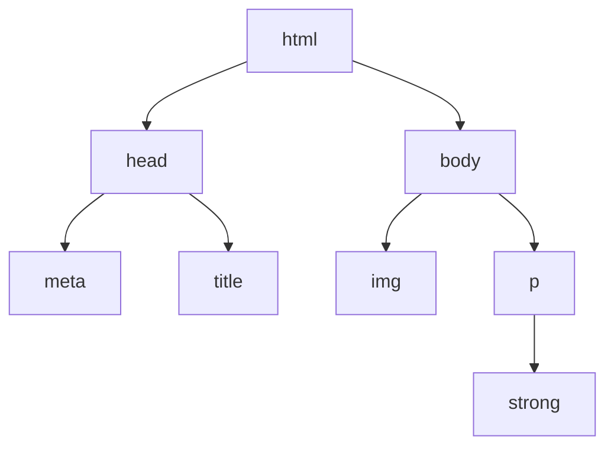

<!-- Introduction avec historique -->

HTML signifie « HyperText Markup Language » que l'on peut traduire par « langage de balises pour l'hypertexte ». Il est utilisé afin de créer et de représenter le contenu d'une page web et sa structure. D'autres technologies sont utilisées avec HTML pour décrire la présentation d'une page (CSS) et/ou ses fonctionnalités interactives (JavaScript).

L'« hypertexte » désigne les liens qui relient les pages web entre elles, que ce soit au sein d'un même site web ou entre différents sites web. Les liens sont un aspect fondamental du Web. Ce sont eux qui forment cette « toile » (ce mot est traduit par web en anglais).

Le langage HTML utilise des « balises » pour annoter du texte, des images et d'autres contenus afin de les afficher dans un navigateur web. Les balises possèdent des noms réservés tels que `<head>`, `<title>`, `<body>`, `<header>`, `<footer>`, `<section>`, `<p>`, `<div>`, `<span>`, ``, `<audio>`, `<ul>`, `<ol>`, `<li>` et bien d'autres.

En HTML, les balises sont insensibles à la casse et peuvent aussi bien être écrites en minuscules, en majuscules, voire avec un mélange des deux. Autrement dit, la balise `<title>` pourrait très bien être écrite comme `<Title>`, `<TiTle>` ou d'une autre façon.

Le langage HTML a vu le jour en 1991 et fut créé à partir d'un autre langage de description appelé SGML par l'informaticien Tim Berners-Lee et ses équipes.

Plusieurs évolutions du langage ont ensuite été développées. Depuis 2014, la version HTML5 est la version officiellement recommandée pour la rédaction de pages Web.

{width="20%"}

## 1. Notion de balise

Une balise HTML possède la structure suivante :

```html
<p>Mon chat est très grincheux</p>
```


Les composants principaux de notre élément sont :

* **La balise ouvrante** : celle-ci se compose du nom de l'élément (ici « p »), entre deux chevrons. Cela indique le début de l'élément, soit l'endroit à partir duquel celui-ci prend effet. Pour notre exemple, cela indique le début du paragraphe.
* **La balise fermante** : ici on a également des chevrons et le nom de l'élément, auxquels on ajoute une barre oblique avant le nom de l'élément. Cela indique la fin de l'élément. Pour notre exemple, cela indique la fin du paragraphe. Oublier la balise fermante est une erreur courante de débutant et peut conduire à de curieux résultats.
* **Le contenu** : C'est le contenu de l'élément. Ici, c'est simplement du texte.
* **L'élément** : Il est composé de la balise ouvrante, de la balise fermante et du contenu.

Les éléments peuvent être imbriqués les uns dans les autres :

```html
<p>Mon chat est <strong>très</strong> grincheux.</p>
```

Toutefois, il faut faire attention à ce que les éléments soient bien imbriqués les uns dans les autres. Dans l'exemple précédent, on ouvre l'élément `<p>`, puis l'élément `<strong>`. Nous devrons donc fermer l'élément `<strong>` d'abord, puis l'élement `<p>`. Le code suivant est incorrect :

```html
<p>Mon chat est <strong>très grincheux.</p></strong>
```

Les éléments doivent être ouverts et fermés correctement de façon à ce qu'ils soient clairement à l'intérieur ou à l'extérieur les uns des autres. S'ils se chevauchent, le navigateur essaiera de choisir la meilleure option, qui ne sera peut-être pas ce que vous vouliez dire et pourrait conduire à des résultats inattendus. Donc ne le faites pas !

!!! info "Remarque"
    Certains éléments sont vides : ils ne nécessitent pas de balise fermante.

    Les plus fréquents sont : 

    * L'élément `` :

        ```html
        
        ```

        Cet élément contient deux **attributs** mais les balises ouvrante `` et fermante `</img>` sont remplacées par une balise auto-fermante `` et il n'y a aucun contenu interne. En effet, l'élément image n'embarque pas de contenu, son but est d'intégrer une image dans la page HTML, à l'endroit où l'élément est placé.

        L'attribut `src` indique le chemin vers le fichier de l'image et l'attribut `alt` contient un texte *alternatif*, texte descriptif de l'image à l'intention des utilisateurs qui ne peuvent pas voir l'image.

    * L'élément '<br /> : pour créer un saut de ligne dans le texte.
    * Les éléments `<link>` et `<meta>` présents dans l'élément `<head>` en début de fichier.

    Pour toutes ces balises auto-fermantes, la barre oblique avant la dernier chevron `>`est optionnelle.
<!--  -->

## 2. Attributs d'une balise

Les balises HTML peuvent être dotées d'**attributs** définis à l'intérieur de la balise ouvrante.

Nous avons déjà vu que la balise ``, par exemple, possédait un attribut `src=...` désignant le chemin ou l'adresse de l'image à afficher.

Certains attributs sont spécifiques à des balises particulières, d'autres sont des **attributs universels** : ils peuvent s'appliquer à toute balise. En particulier, les attributs suivants seront souvent utilisés :

* `class=...` : une ou plusieurs **classes**, séparées par des espaces, qui permettent de catégoriser l'élément pour pouvoir le manipuler dans une feuille de style CSS ou un script JavaScript.
* `id=...` : un **identifiant**, **unique au sein de tout le document**, pour un élément. Il doit permettre d'identifier cet élément lorsqu'on crée un lien vers lui et/ou lorsqu'on le manipule avec des scripts ou avec CSS.

!!! warning "Attention !"
    * Plusieurs éléments HTML peuvent appartenir à une même classe : cela permet par exemple de leur appliquer le même style CSS.
    * Un identifiant, par contre, est unique : deux éléments HTML ne doivent pas avoir le même identifiant.

## 2. Structure générale du fichier HTML

La structure globale d'une page HTML est toujours la même (l'indentation est utilisée pour la lisibilité du code, mais elle n'est pas nécessaire):

```html
<!DOCTYPE html>
<html>
  <head>
    <meta charset="utf-8">
    <title>Ma page de test</title>
  </head>
  <body>
    
    <p>Voici la photo de mon chat <strong>Félix</strong>.</p>
  </body>
</html>
```

Nous y trouvons :

* `<!DOCTYPE html>` — le doctype. Au début de HTML, dans les années 1991-1992, les doctypes étaient utilisés pour faire référence à des ensembles de règles qu'on pouvait utiliser pour dire qu'un document était du HTML « valide » et détecter les erreurs de balisage. Cependant, ceux-ci ne sont plus utilisés aujourd'hui et sont juste présents pour s'assurer que la page puisse fonctionner y compris sur les anciens navigateurs. C'est tout ce qu'il y a à savoir à propos des doctypes.
* `<html></html>` — l'élément `<html>`. Cet élément **encadre tout le contenu** de la page. Cet élément est parfois appelé l'**élément racine**.
* `<head></head>` — l'élément `<head>`. Cet élément est utilisé comme un conteneur pour toutes les choses qui font partie de la page HTML, mais **qui ne sont pas du contenu affiché**. C'est dans cet élément qu'on mettra des mots-clés, une description de la page qui apparaîtra sur les moteurs de recherche, les liens vers les fichiers CSS à utiliser pour la mise en forme, les déclarations des jeux de caractères à utiliser et ainsi de suite.
* `<body></body>` — l'élément `<body>`. Cet élément est celui qui contient **tout le contenu que vous souhaitez afficher** pour qu'il soit vu par les visiteurs : cela peut être du texte, des images, des vidéos, des jeux, des pistes audio jouables, et ainsi de suite.

Cette structure peut être représentée sous forme d'arbre. Chaque élément $B$ situé dans un élément $A$ est considéré comme le **fils** de cet élément $A$.

Voici l'arbre représentant le fichier HTML ci-dessus :



## 3. Ressources pour approfondir

* Excellente ressource pour apprendre le HTML, le CSS et JavaScript : [MDN Web Docs de Mozilla](https://developer.mozilla.org/fr/){target="_blank"}. Cerise sur le gâteau : le site est disponible en français.
* Incontournable, mais en anglais, les tutoriels de [w3Schools](https://www.w3schools.com/){target="_blank"}.
* Le cours classique, gratuit et en français du site [OpenClassroom](https://openclassrooms.com/fr/courses/1603881-apprenez-a-creer-votre-site-web-avec-html5-et-css3){target="_blank"}.