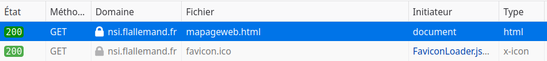
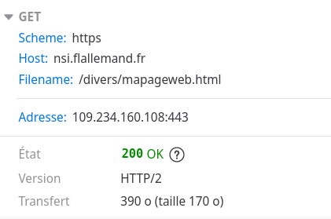

{width="15%" style="float: right"}

**HTTP** signifie *HyperText Transfer Protocol* : avec le langage HTML et les adresses web (URL), ce protocole est l'une des trois fondations du World Wide Web.

**HTTP** est un **protocole** servant à transmettre des documents hypermédias, comme HTML. Il a été conçu pour la communication entre les navigateurs web et les serveurs web, mais peut également être utilisé à d'autres fins. Il suit le modèle classique **client-serveur** : un client ouvre une connexion, effectue une requête et attend jusqu'à recevoir une réponse. Il s'agit aussi d'un protocole **sans état**, ce qui signifie que le serveur ne conserve aucune donnée (on parle d'état) entre deux requêtes.

Un protocole est tout simplement un ensemble de règles. Dans un contexte réseau, un protocole est un ensemble de règles qui régissent les échanges de données.

## 1. Architecture client-serveur et HTTP

De façon schématique, Internet fonctionne selon le modèle d'architecture client-serveur. 

* le client envoie des requêtes (des demandes) et attend une réponse ; la requête, par exemple, peut consister à demander le chargement d'une page web ;
* le serveur reçoit les requêtes et envoie une réponse ; par exemple, il envoie la page HTML ou encore un message spécifique si la page demandée n'existe pas.

Remarquons que le serveur reçoit simultanément des requêtes de plusieurs clients.

{width="50%"}

**Le protocole HTTP est donc l'ensemble des règles qui permettent le dialogue entre le serveur et les cliens.**

!!! info "Remarque"
    En réalité le client et le serveur sont des *logiciels* et non des *ordinateurs*. On appelle cependant couramment serveur la machine sur laquelle tourne le programme serveur et client la machine sur laquelle tourne le programme client.

    Dans le cadre de ce cours le client est le navigateur internet.
<!--  -->

Par défaut, le protocole HTTP n'est pas sécurisé, les données (texte de la requête et réponse) circulent donc de façon ouverte dans le réseau. Il peut cependant être sécurisé en utilisant un protocole de cryptage SSL ou TLS et il s'appelle dans ce cas **HTTPS**. 

!!! info "Remarque"
    En réalité, le client est également connecté à plusieurs serveurs. Un document complet est construit à partir de différents sous-documents qui sont récupérés, par exemple du texte, des descriptions de mise en page, des images, des vidéos, des scripts et bien plus. Ces différents éléments proviennent souvent de différents serveurs.

    

    Autre simplification effectuée dans ce cours : en réalité, plusieurs machines se trouvent sur le chemin de l'information entre le client et le serveur. Ces machines sont désignées de façon générique sous le terme **proxies**. Celles-ci exécutent différentes opérations et agissent comme passerelles ou comme caches par exemple.

    
<!--  -->

## 2. Requêtes et réponses

**Côté client**, le navigateur envoie une requête initiale pour récupérer le document HTML depuis la page. Ensuite, il analyse le fichier et récupère les requêtes additionnelles qui correspondent aux scripts, aux informations de mise en page (CSS) et les sous-ressources contenues dans la page (généralement des images et des vidéos). Le navigateur web assemble alors ces ressources pour présenter un document complet à l'utilisateur : c'est la page web. Les scripts exécutés par le navigateur peuvent permettre de récupérer plus de ressources par la suite afin de mettre à jour la page web.

Une page web est un document hypertexte. Cela signifie que certaines parties sont des liens qui peuvent être activés (généralement avec un clic de souris) afin de récupérer une nouvelle page web, permettant à l'utilisateur de diriger son agent utilisateur et de naviguer sur le Web. Le navigateur traduit ces instructions en requêtes HTTP et interprète les réponses HTTP pour présenter une réponse claire à l'utilisateur.

**Côté serveur**, le serveur *sert* (envoie) le document demandé par le client. Bien qu'on présente virtuellement le serveur comme un seul ordinateur, en réalité, il peut s'agir d'un ensemble de serveurs se répartissant la charge (load balancing) ou d'une architecture logicielle complexe qui interroge d'autres serveurs (par exemple un cache, un serveur de base de données, serveur d'e-commerce…), qui génèrent totalement ou partiellement le document à la demande.

D'une part, un serveur n'est pas nécessairement une machine unique et d'autre part, plusieurs serveurs peuvent être hébergés sur une même machine.

### Anatomie d'une requête

Voici un exemple de requête : 

{width="50%"}

On trouve les éléments suivants : 

* la méthode HTTP, ici `GET`. On utilisera aussi la méthode `POST` avec les formulaires ;
* le chemin de la ressource : ce chemin est calculé par le navigateur à partir de l'URL ;
* la version du protocole `HTTP/1.1` ou `HTTP/2`.
* les en-têtes optionnels qui transmettent des informations supplémentaires pour les serveurs ;

Considérons la page web `mapageweb.html` suivante, hébergée en ligne [à cette adresse](https://flallemand.fr/nsi/premiere/06_web/mapageweb.html){target="_blank"}. : 

```html
<html>
  <head>
    <title> Ma page web </title>
  </head>
  <body>
    <p id="p1">Bonjour</p>
    <p id="p2">Bonsoir</p>
    <p id="p3">Au revoir !</p>
  </body>
</html>
```

Lorsque cette page est chargée dans le navigateur, les outils de développement (F12, puis onglet Réseau) permettent de visualiser les requêtes envoyées :





Nous voyons qu'en fait deux requêtes ont été envoyées, car le navigateur charge automatiquement l'icône du site.

### Anatomie d'une réponse

Voici un exemple de réponse :

{width="50%"}

On trouve les éléments suivants :

* la version du protocole ;
* un code de statut, qui indique si la requête a réussi ou non. Les plus courants sont 200 (ok), 404 (not found), 500 (Internal Server Error). [La liste complète est disponible ici](https://developer.mozilla.org/fr/docs/Web/HTTP/Status){target="_blank"}.
* un message de statut qui est une description rapide, informelle, du code de statut ;
* les en-têtes HTTP, comme pour les requêtes ;
* éventuellement un corps contenant la ressource récupérée.

Dans l'exemple du chargement de la page `mapageweb.html` suivante, hébergée en ligne [à cette adresse](https://flallemand.fr/nsi/premiere/06_web/mapageweb.html){target="_blank"}, voici la réponse du serveur :

```http
HTTP/1.1 200 OK
Accept-Ranges: bytes
Connection: keep-alive
Content-Length: 170
Content-Type: text/html
Date: Thu, 03 Nov 2022 10:25:22 GMT
Last-Modified: Thu, 03 Nov 2022 09:46:27 GMT
Server: o2switch-PowerBoost-v3

<html>
  <head>
    <title> Ma page web </title>
  </head>
  <body>
    <p id="p1">Bonjour</p>
    <p id="p2">Bonsoir</p>
    <p id="p3">Au revoir !</p>
  </body>
</html>
```

## 3. Pour aller plus loin

* Excellente ressource pour tout savoir sur HTTP : [MDN Web Docs de Mozilla](https://developer.mozilla.org/fr/docs/Web/HTTP){target="_blank"}. Cerise sur le gâteau : le site est disponible en français.
* Plus difficile, mais très complet (se limiter à la partie 1) : [le cours de Pierre Giraud](https://www.pierre-giraud.com/http-reseau-securite-cours/){target="_blank"}. Attention, seule la version en ligne est gratuite !

