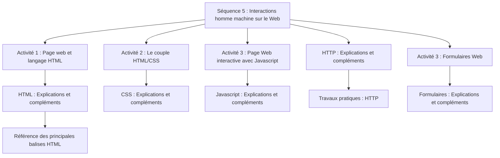

## 1. Le programme

Lors de la navigation sur le Web, les internautes interagissent avec leur machine par le biais
des pages Web.

L'Interface Homme-Machine (IHM) repose sur la gestion d'événements associés à des
éléments graphiques munis de méthodes algorithmiques.

La compréhension du dialogue client-serveur déjà abordé en classe de seconde est
consolidée, sur des exemples simples, en identifiant les requêtes du client, les calculs puis
les réponses du serveur traitées par le client.

Il ne s'agit pas de décrire exhaustivement les différents éléments disponibles, ni de
développer une expertise dans les langages qui permettent de mettre en œuvre le dialogue
tels que PHP ou JavaScript.

|Contenus |Capacités attendues |Commentaires|
|-----|------|-------|
|Modalités de l'interaction entre l'homme et la machine Événements| Identifier les différents composants graphiques permettant d'interagir avec une application Web. Identifier les événements que les fonctions associées aux différents composants graphiques sont capables de traiter.| Il s'agit d'examiner le code HTML d'une page comprenant des composants graphiques et de distinguer ce qui relève de la description des composants graphiques en HTML de leur comportement (réaction aux événements) programmé par exemple en JavaScript.|
|Interaction avec l'utilisateur dans une page Web|Analyser et modifier les méthodes exécutées lors d'un clic sur un bouton d'une page Web.| |
|Interaction client-serveur. Requêtes HTTP, réponses du serveur|Distinguer ce qui est exécuté sur le client ou sur le serveur et dans quel ordre. Distinguer ce qui est mémorisé dans le client et retransmis au serveur. Reconnaître quand et pourquoi la transmission est chiffrée.| Il s'agit de faire le lien avec ce qui a été vu en classe de seconde et d'expliquer comment on peut passer des paramètres à un site grâce au protocole HTTP.|
|Formulaire d'une page Web|Analyser le fonctionnement d'un formulaire simple. Distinguer les transmissions de paramètres par les requêtes POST ou GET.| Discuter les deux types de requêtes selon le type des valeurs à transmettre et/ou leur confidentialité.|

## 2. Plan de travail

