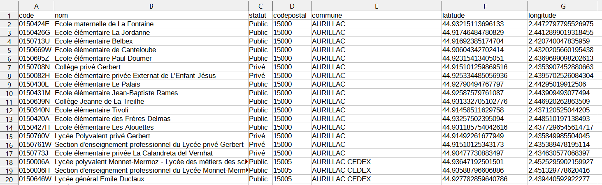

## 1. Table de données et indexation

### 1.1. Vocabulaire

!!! info "Définition"
    Des données, numériques ou non, sont souvent représentées sous forme de tableaux, ou **tables**.

    **Vocabulaire :**

    * Une __table__, représentée sous forme de tableau, est une collection d'éléments qui sont les lignes du tableau.
    * Chaque élément de la __table__, ou ligne de sa représentation sous forme de tableau, s'appelle un __enregistrement__.    
    * Tous les  __enregistrements__ d'une même __table__ sont des  __p-uplets nommés__ qui partagent les mêmes __descripteurs__, appelés aussi __attributs__. Dans une représentation de la __table__ sous forme de tableau, chaque __attribut__ correspond à une colonne. Chaque __attribut__ est caractérisé par son __type__ et son  __domaine de valeurs__ (les valeurs que peut prendre cet attribut).    
    * Dans une représentation sous forme de tableau, les __descripteurs__ ou __attributs__ sont en général placés comme en-tête de colonnes sur la première ligne.




!!! example "Exemple"
    La table représentée ci-dessus est affichée dans un tableur. Nous voyons les 20 premiers enregistrements de cette table qui rassemble des données sur tous les établissements scolaires primaires et secondaires dans le Cantal (source : https://www.data.gouv.fr/fr/). 
    
    Les attributs de cette table sont :

    * le _code_ UAI (Unité Administrative Immatriculée) avec un domaine de valeurs particulier ;
    * le _nom_ avec pour domaine de valeur les chaînes de caractères ;
    * le _statut_ avec pour domaine de valeur les deux chaînes {"Public", "Privé"} ;
    * le _codepostal_ avec un domaine de valeurs particulier ;
    * la _commune_ avec pour domaine de valeur les chaînes de caractères ;
    * la _latitude_ et la _longitude_ avec pour domaine de valeur les flottants.

### 1.2. Échange de table de données avec un fichier CSV

Pour échanger des __données tabulaires__  entre les programmes qui doivent les manipuler, on les exporte puis les importe sous la forme de fichiers textes, c'est-à-dire lisibles par l'être humain.  

Afin d'assurer l'interopérabilité entre différents programmes, un fichier doit respecter un __format__ normalisé.

L'un des formats les plus répandus pour l'échange de __données tabulaires__ est le format [CSV](https://fr.wikipedia.org/wiki/Comma-separated_values) pour _Comma Separated Values_ :

* un fichier [CSV](https://fr.wikipedia.org/wiki/Comma-separated_values) est un fichier texte donc éditable avec un éditeur de textes comme [Notepad++](https://notepad-plus-plus.org/downloads/). On peut aussi l'éditer dans un tableur ;
* chaque ligne du fichier correspond à un __enregistrement__ de la table ;
* pour un  __enregistrement__ donné, les valeurs des différents __attributs__ sont séparées en __champs__ par un __délimiteur__ qui est en général l'un des symboles `,` ou `;` ou `:` ;
* la première ligne contient en général les noms des __attributs__.

Voici la même table que celle qui est affichée dans un tableur ci-dessus, au format CSV :

``` title="CSV"
code,nom,statut,codepostal,commune,latitude,longitude
0150424E,Ecole maternelle de La Fontaine,Public,15000,AURILLAC,44.93215113696133,2.4472797795526975
0150426G,Ecole élémentaire La Jordanne,Public,15000,AURILLAC,44.91746484780829,2.4412899019318455
0150713U,Ecole élémentaire Belbex,Public,15000,AURILLAC,44.91692385174704,2.420740047835959
0150669W,Ecole élémentaire de Canteloube,Public,15000,AURILLAC,44.90604342702414,2.4320205660195438
0150695Z,Ecole élémentaire Paul Doumer,Public,15000,AURILLAC,44.92315413405051,2.4369699098202613
0150708N,Collège privé Gerbert,Privé,15000,AURILLAC,44.915101259869516,2.4353907452880663
0150082H,Ecole élémentaire privée Externat de L'Enfant-Jésus,Privé,15000,AURILLAC,44.925334485056936,2.4395702526084304
0150430L,Ecole élémentaire Le Palais,Public,15000,AURILLAC,44.92790494767797,2.44295019912506
0150431M,Ecole élémentaire Jean-Baptiste Rames,Public,15000,AURILLAC,44.92587579761087,2.443909493077494
0150639N,Collège Jeanne de La Treilhe,Public,15000,AURILLAC,44.931332705102776,2.446920262863509
0150340N,Ecole élémentaire Tivoli,Public,15000,AURILLAC,44.91458511629758,2.437120525044205
0150420A,Ecole élémentaire des Frères Delmas,Public,15000,AURILLAC,44.93257502395094,2.448510197138493
0150427H,Ecole élémentaire Les Alouettes,Public,15000,AURILLAC,44.931185754042616,2.4377296545614717
0150760V,Lycée Polyvalent privé Gerbert,Privé,15000,AURILLAC,44.91492261677949,2.435849985504045
0150761W,Section d'enseignement professionnel du Lycée privé Gerbert,Privé,15000,AURILLAC,44.91510125343173,2.435389478195114
0150773J,Ecole élementaire privée La Calandreta del Vernhat,Privé,15000,AURILLAC,44.90477730883497,2.434630577068397
0150006A,Lycée polyvalent Monnet-Mermoz - Lycée des métiers des sciences et techniques appliquées à l'industrie et aux services,Public,15005,AURILLAC CEDEX,44.93647192501501,2.4525295902159927
0150036H,Section d'enseignement professionnel du Lycée Monnet-Mermoz,Public,15005,AURILLAC CEDEX,44.93588796606886,2.451329778620416
0150646W,Lycée général Emile Duclaux,Public,15005,AURILLAC CEDEX,44.927782859640786,2.439440592922277
```

On observe que le délimiteur de champ est le symbole `,` et que les champs peuvent contenir des espaces.

Dans un tel jeu de données, il peut y avoir des champs vides dans certains enregistrements et il se peut aussi que le nombre de champs pour un ne corresponde pas au nombre d'attributs ! Pour traiter un tel fichier avec un programme, il faut d'abord analyser sa structure, ses particularités et prévoir d'éventuelles irrégularités dans les données (absence, erreurs de type, de saisie, corruption du fichier ...). Le __contrôle de la  validité__ des données doit donc être une composante du programme de traitement : recherche de doublons, tests de cohérence.

### 1.3. Manipulation de fichiers CSV en Python

!!! info "Définition"   
    __L'indexation de table__ est la création d'une structure de données à partir d'une table de données.

    L'indexation d'une table extraite d'un fichier CSV peut se faire vers une structure de données du langage Python : **tableau de tableaux** ou (mieux) **tableau de dictionnaires**.

Dans cette section, on considère le fichier [CSV](https://fr.wikipedia.org/wiki/Comma-separated_values),  [`educ_cantal.csv`](../../assets/CSV/educ_cantal.csv),  contenant les enregistrements des établissements scolaires primaires et secondaires dans le Cantal.

Présentons deux méthodes de lecture de fichiers [CSV](https://fr.wikipedia.org/wiki/Comma-separated_values) qui utilisent les outils standards de Python. 

On fait les hypothèses suivantes :  la première ligne du fichier contient les attributs
et on connaît  le délimiteur, ici le symbole `,`.

### Avec un tableau de tableaux

*  **Lecture**

On peut extraire les attributs et la  table contenus dans le fichier `educ_cantal.csv`  avec le code ci-dessous :

~~~python
fichier = open('educ_cantal.csv', mode='r', encoding='utf8', newline='')  # ouverture du fichier en mode lecture
attributs = fichier.readline().rstrip().split(',')  # extraction de la ligne des attributs
table = [ligne.rstrip().split(',') for ligne in fichier]  # extraction des autres lignes
fichier.close()  # fermeture du fichier
~~~

La fonction `open` permet de créer un objet `fichier` qu'on peut parcourir ligne par ligne avec un curseur : d'abord la première ligne avec `fichier.readline()` puis les lignes suivantes en itérant sur `fichier`. Il est important de préciser __l'encodage du fichier__, par défaut c'est celui du système d'exploitation.

Chaque ligne est une chaîne de caractères découpée en liste de champs selon le délimiteur passé en paramètre à la méthode `split`. Le caractère de saut de lignes a d'abord été supprimé avec la méthode `rstrip`.

On récupère ainsi les attributs comme un tableau de type `list` et la table comme un tableau d'enregistrements qui sont eux-mêmes des tableaux. Notons que toutes les valeurs sont des chaînes de caractères et qu'il faudra convertir certaines pour les traiter !

~~~pycon
>>> attributs   # tableau des attributs
['code', 'nom', 'statut', 'codepostal', 'commune', 'latitude', 'longitude']
>>> table[18]   # tableau 19ième enregistrement
['0150646W', 'Lycée général Emile Duclaux', 'Public', '15005', 'AURILLAC CEDEX', '44.927782859640786', '2.439440592922277']
>>> table[:2]   # tableau de tableaux : extrait
[['0150424E', 'Ecole maternelle de La Fontaine', 'Public', '15000', 'AURILLAC', '44.93215113696133', '2.4472797795526975'], ['0150426G', 'Ecole élémentaire La Jordanne', 'Public', '15000', 'AURILLAC', '44.91746484780829', '2.4412899019318455']]
~~~

* **Écriture**

On peut ensuite recopier les attributs et la table dans un autre fichier `educ_cantal_copie.csv` avec le code ci-dessous :

~~~python
g = open('educ_cantal_copie.csv', mode='w', encoding='utf8', newline='') # ouverture du fichier en mode écriture
premiere_ligne = ','.join(attributs) + '\n'
g.write(premiere_ligne)
for enregistrement in table:
    g.write(','.join(enregistrement) + '\n')
g.close()
~~~

La méthode `join` permet de concaténer les éléments d'un tableau de chaînes de caractères avec un délimiteur.

* Avec ces méthodes, une table est donc représentée par **un tableau de tableaux**. On accède à un enregistrement par son index dans la table et à la valeur d'un attribut par son index dans le tableau des attributs (séparé de la table). C'est incommode et  le code produit est peu lisible. Ainsi, pour accéder à l'adresse mail du premier enregistrement il faut saisir `table[0][2]`. On aimerait écrire `table[0]['email']`. Pour cela, chaque enregistrement devrait être un p-uplet nommé que nous représenterons par dictionnaire avec pour clefs les attributs de la table. C'est possible en utilisant le [module `csv`](https://docs.python.org/fr/3/library/csv.html).

### Avec un tableau de dictionnaires

Le [module `csv`](https://docs.python.org/fr/3/library/csv.html)  est disponible dans la bibliothèque standard et peut donc être  utilisé sans installation spécifique. À partir de la table contenu dans le même fichier CSV `'educ_cantal.csv'`, ce module permet de créer une structure de données d'un accès plus facile.

* **Lecture**

Le code ci-dessous permet d'extraire directement la table d'un fichier CSV dans une structure de données qui est un __tableau de dictionnaires__ : chaque enregistrement est un dictionnaire dont les clefs sont les attributs listés sur la première ligne du fichier.

Remarque: pour les versions de Python 3.6 et 3.7 uniquement, les dictionnaires renvoyés sont spécifiques, de type `OrderedDict`, et on prendra soin de les convertir en dictionnaires standard avec `dict` en entrant : ``table = [dict(enregistrement) for ...]``.

~~~python
import csv

f = open('educ_cantal.csv', mode='r', encoding='utf8', newline='')
reader = csv.DictReader(f, delimiter=',')  # création d'un objet reader
table = [enregistrement for enregistrement in reader]
f.close()
~~~

La structure de données représentant la table est un __tableau de dictionnaires__ : l'accès aux enregistrements se fait par index et à leurs attributs par clef : très efficace (coût constant) et code lisible. Notons que toutes les valeurs restent des chaînes de caractères et qu'il faudra convertir certaines pour les traiter !

~~~pycon
>>> table[18]    # premier enregistrement de type dictionnaire
{'code': '0150646W', 'nom': 'Lycée général Emile Duclaux', 'statut': 'Public', 'codepostal': '15005', 'commune': 'AURILLAC CEDEX', 'latitude': '44.927782859640786', 'longitude': '2.439440592922277'}
>>> table[:2]    # tableu de dictionnaires : extrait
[{'code': '0150424E', 'nom': 'Ecole maternelle de La Fontaine', 'statut': 'Public', 'codepostal': '15000', 'commune': 'AURILLAC', 'latitude': '44.93215113696133', 'longitude': '2.4472797795526975'}, {'code': '0150426G', 'nom': 'Ecole élémentaire La Jordanne', 'statut': 'Public', 'codepostal': '15000', 'commune': 'AURILLAC', 'latitude': '44.91746484780829', 'longitude': '2.4412899019318455'}]
>>> len(table)
203
>>> table[18]["nom"]    # accès facile aux valeurs des attributs par clefs
'Lycée général Emile Duclaux'
~~~

* **Écriture**

L'écriture d'un tableau de dictionnaires partageant les mêmes clefs sous forme de table dans un fichier CSV, s'effectue de façon symétrique à travers un objet `DictWriter`. À titre, d'exemple, on recopie la table extraite précédemment dans un autre fichier CSV. Depuis Python 3.7, le parcours des clefs d'un dictionnaire est garanti dans le même ordre que celui d'insertion donc on peut récupérer la liste des attributs avec `list(table[0].keys())`

~~~python
g = open('educ_cantal_copie2.csv', mode='w', encoding='utf8', newline='')
attributs = list(table[0].keys())
writer = csv.DictWriter(g, delimiter=',', fieldnames=attributs)  # création de l'objet writer
writer.writeheader()  # écriture des attributs
for enregistrement in table:
    writer.writerow(enregistrement)  # écriture des enregistrements
g.close()
~~~

* **Remarque** 

Le module `csv` permet aussi d'extraire une table d'un fichier CSV sous forme de **tableau de tableaux** comme dans la méthode précédente. Le découpage des lignes/enregistrements selon le délimiteur est intégré ce qui simplifie le code.

~~~python
f = open('educ_cantal.csv', mode='r', encoding='utf8', newline='')
reader = csv.reader(f, delimiter=',')
table = [ligne for ligne in reader]
f.close()
~~~

## 2. Recherche dans une table

Pour accéder aux données, il faut les rechercher et les regrouper suivant différents critères.

!!! info "Définition"

    * Lorsqu'on souhaite accéder à un ou plusieurs enregistrements vérifiant un critère, on réalise une **sélection**.
    * Lorsqu'on souhaite accéder à toutes les données d'une colonne on réalise une **projection**.

### Exemple de sélection

Supposons qu'on dispose d'une table enregistrée dans une liste de dictionnaires :

````python
Table1 = [
    {'Nom': 'Joe', 'Anglais': '17', 'Info': '18', 'Maths': '16'},
    {'Nom': 'Zoé', 'Anglais': '15', 'Info': '17', 'Maths': '19'},
    {'Nom': 'Max', 'Anglais': '19', 'Info': '13', 'Maths': '14'},
    {'Nom': 'Bob', 'Anglais': '12', 'Info': '16', 'Maths': '10'}
]
````

On souhaite extraire la liste des enregistrements des élèves ayant eu au moins 16 en maths.

On peut le faire "à la main" :

````python
au_moins_16_en_maths = []
for enregistrement in Table1:
    if int(enregistrement['Maths']) >= 16:
        au_moins_16_en_maths.append(enregistrement)
````

Le résultat est encore une table :

````pycon
>>> au_moins_16_en_maths
[{'Nom': 'Joe', 'Anglais': '17', 'Info': '18', 'Maths': '16'}, {'Nom': 'Zoé', 'Anglais': '15', 'Info': '17', 'Maths': '19'}]
````

On peut le faire avec une liste en compréhension :

````python
au_moins_16_en_maths = [enre for enre in Table1 if int(enre['Maths']) >= 16]
````

Le résultat est identique.

### Exemple de projection

Cette fois, on souhaite récupérer toutes les valeurs pour un champ donné, par exemple toutes les notes de mathématiques.

L'approche est similaire, on crée une liste, on parcourt la table et on ajoute à la liste tous les éléments qui nous intéressent.

* à la main :

    ````python
    notes_maths = []
    for enregistrement in Table1:
        notes_maths.append(enregistrement['Maths'])
    ````

* par compréhension :

    ````python
    notes_maths = [enre['Maths'] for enre in Table1]
    ````

Dans les deux cas le résultat est la liste ['16', '19', '14', '10'].

!!! question "Exercices"

    1. Adapter la sélection afin de récupérer tous les enregistrements des élèves dont le nom comporte un "o".
    2. Projeter afin de construire la liste des noms puis celle des paires de notes d'info et de maths :

        [(18, 16), (17, 19), (13, 14), (16, 10)]

??? success "Solution"

    1. Avec une boucle :

        ````python
        nom_avec_o = []
        for enregistrement in Table1:
            if 'o' in enregistrement['Nom']:
                nom_avec_o.append(enregistrement)
        ````

        En compréhension :

        ````python
        nom_avec_o = [enre for enre in Table1 if 'o' in enre['Nom']]
        ````
    
    2. Liste des noms :

        ````python
        # avec une boucle
        liste_noms = []
        for enregistrement in Table1:
            liste_noms.append(enregistrement['Nom'])

        # avec une liste en compréhension
        liste_noms = [enre['Nom'] for enre in Table1]
        ````

        paires info/maths

        ````python
        # avec une boucle
        liste_paires = []
        for enregistrement in Table1:
            liste_paires.append((enregistrement['Info'], enregistrement['Maths']))

        # avec une liste en compréhension
        liste_paires = [(enre['Info'], enre['Maths']) for enre in Table1]
        ````

## 3. Tri d'une table

### 3.1. Tri d'une table selon une colonne

Il s'agit ici de trier les données d'une table selon un des attributs de la table, c'est-à-dire selon une colonne. Il faut bien sûr pour cela que les données de cet attribut soient "triables", c'est-à-dire qu'un ordre puisse être défini sur ces données. Pour des données numériques, on peut penser à l'ordre croissant ou à l'ordre décroissant. Pour des données textuelles, à l'ordre alphabétique. On peut aussi vouloir trier les données selon plusieurs champs.

Nous allons pour cela utiliser la fonction Python ``sorted`` qui s'applique à un objet de type ``list`` et qui renvoie une nouvelle ``list`` triée. Outre la table à trier, cette fonction peut prendre deux arguments nommés facultatifs :

* ``reverse = True`` pour un tri dans l'ordre inverse ;
* ``key = ...`` pour préciser selon quel critère une liste doit être triée.

Quelques exemples :

````pycon
>>> ma_liste = [10, 3, 71, 96]
>>> sorted(ma_liste)
[3, 10, 71, 96]
>>> sorted(ma_liste, reverse=True)
[96, 71, 10, 3]
>>> mes_couples = [('a', 3), ('d', 2), ('c', 5), ('b', 1)]
>>> sorted(mes_couples)     # tuples triés selon leur premier élément (par défaut)
[('a', 3), ('b', 1), ('c', 5), ('d', 2)]
>>> def y(couple):    # on définit une fonction qui retourne le second élément d'un tuple
        return couple[1]
>>> sorted(mes_couples, key=y) # tuples triés selon leur second élément
[('b', 1), ('d', 2), ('a', 3), ('c', 5)]
````

!!! danger

    Attention, ``sorted`` ne renvoie qu'une copie superficielle du tableau ! Si ses éléments sont des références et c'est le cas de l'implémentation des tables de données sous forme de tableaux de dictionnaires, il faut effectuer une copie profonde du tableau avec la fonction ``deepcopy`` du module ``copy`` pour obtenir une vraie copie triée du tableau initial : ``sorted(deepcopy(tab), key = clef_tri)``.

### 3.2. Tri suivant plusieurs colonnes

Considérons la table suivante : 

````python
table = [{'élève' : 'guido', 'langage' : 'python', 'note' : 19},
         {'élève' : 'monty', 'langage' : 'python', 'note' : 20},
         {'élève' : 'brian', 'langage' : 'c', 'note' : 20}]
````

On souhaite trier en fonction du langage dans l'ordre alphabétique, puis de la note dans l'ordre croissant. La fonction donnée en argument ``key`` doit alors retourner la couple ordonné des deux attributs voulus :

````pycon
>>> def cle_langage_note(enre):
        return (enre['langage'], enre['note'])
>>> sorted(table, key = cle_langage_note)
[{'élève': 'brian', 'langage': 'c', 'note': 20}, {'élève': 'guido', 'langage': 'python', 'note': 19}, {'élève': 'monty', 'langage': 'python', 'note': 20}]
````

Si l'on souhaite trier dans l'ordre croissant suivant l'attribut langage et décroissant suivant l'attribut note, on procède en deux étapes :

````pycon
>>> def cle_langage(enre):
        return enre['langage']
>>> def cle_note(enre):
        return enre['note']
>>> table_temp = sorted(table, key = cle_langage)
>>> sorted(table_temp, key = cle_note, reverse = True)
[{'élève': 'brian', 'langage': 'c', 'note': 20}, {'élève': 'monty', 'langage': 'python', 'note': 20}, {'élève': 'guido', 'langage': 'python', 'note': 19}]
````

## 4. Fusion de deux tables

Il est courant de travailler avec plusieurs tables de données. Nous avons alors parfois besoin de rassembler deux tables en une seule ou encore de construire une nouvelle table à partir de certains attributs de tables existantes.

### 4.1. Fusion de deux tables de même structure

Le cas le plus simple est lorsque nous disposons de deux tables, par exemple sous la forme de tableaux de dictionnaires, qui possèdent exactement les mêmes attributs.

Une simple **concaténation** des tableaux permet cette fusion, en prenant garde néanmoins :

* à ne pas conserver deux fois la définition des descripteurs ;
* à éviter les doublons : cas d'un enregistrement qui se trouverait dans les deux tables initiales.

Sous l'hypothèse qu'il n'y a pas de doublons, le code ci-dessous procède à cette fusion :

````python
def fusion_tables(table1: list, table2: list) -> list:
    """table 1 et table 2 ont les mêmes descripteurs
    il n'y a pas de doublons"""
    fusion = deepcopy(table1)
    for enreg in table2[1:]:    # on élimine la première ligne (descripteurs)
        fusion.append(deepcopy(enreg))
    return fusion
````

### 4.2. Fusion de deux tables pour un même attribut

On veut fusionner deux tables selon un attribut commun. On va sélectionner dans chaque table la ligne ayant la même valeur pour l'attribut choisi.

Reprenons le tableau ``Table1`` des exemples précédents :

|  Nom |	Anglais 	|Info|	Maths|
|:---:|:---:|:---:|:---:|
| 	Joe |	17| 	18| 	16|
|	Zoé |	15 |	17 |	19|
|Max |	19 |	13 	|14|

Définissons une seconde table, ``Table2`` donnant l'âge et le courriel de certains élèves :

|   Nom |	Age |	Courriel|
|:---:|:---:|:---:|
|Joe |	16 |	joe@info.fr|
|Zoé |	15 |	zoe@info.fr|

On voudrait regrouper les données des deux tables. Elles ont l'attribut ``Nom`` en commun. On veut obtenir la table suivante :

|    Nom |	Age| 	Courriel |	Anglais 	|Info |	Maths|
|:---:|:---:|:---:|:---:|:---:|:---:|
| 	Joe |	16 	|joe@info.fr |	17 |	18 |	16|
| 	Zoé |	15 	|zoe@info.fr |	15 |	17 	|19|

On choisit d'exclure la ligne concernant Max car il n'est pas présent dans la seconde table.

!!! info "Définition"

    En informatique, la **jointure** est l'opération permettant d'associer plusieurs tables par le biais d'un lien logique de données entre les différentes tables, le lien étant défini par une condition. Le résultat de l'opération est une nouvelle table.

La jointure s'obtient avec deux boucles imbriquées : on parcourt tous les couples constitués d'enregistrements de la première puis de la seconde table et on filtre à l'aide d'une instruction conditionnelle.

````python
from copy import deepcopy

Table1 = [{'Nom': 'Joe', 'Anglais': '17', 'Info': '18', 'Maths': '16'},
          {'Nom': 'Zoé', 'Anglais': '15', 'Info': '17', 'Maths': '19'},
          {'Nom': 'Max', 'Anglais': '19', 'Info': '13', 'Maths': '14'},
          {'Nom': 'Bob', 'Anglais': '12', 'Info': '16', 'Maths': '10'}]

Table2 = [{'Nom': 'Joe', 'Age': 16, 'Couriel': 'joe@info.fr'},
          {'Nom': 'Zoé', 'Age': 15, 'Couriel': 'zoe@info.fr'}]


def jointure_selon_attribut_commun(t1: list, t2: list, attr: str) -> list:
    """Effectue la jointure entre les tables t1 et t2 selon l'attribut commun attr"""
    jointure = []
    for item1 in t1:
        for item2 in t2:
            if item1[attr] == item2[attr]:
                # définition d'une ligne de la nouvelle table reprenant le contenu de la ligne en cours de t1
                new_line = deepcopy(item1)
                # boucle pour ajouter les champs de la ligne de t2 autres que attr
                for cle in item2:
                    if cle != attr:
                        new_line[cle] = item2[cle]
                # ajout de la nouvelle ligne à la nouvelle table
                jointure.append(new_line)
    return jointure


print(jointure_selon_attribut_commun(Table2, Table1, 'Nom'))
````

On obtient :

```` title="Sortie"
[{'Nom': 'Joe', 'Age': 16, 'Couriel': 'joe@info.fr', 'Anglais': '17', 'Info': '18', 'Maths': '16'}, {'Nom': 'Zoé', 'Age': 15, 'Couriel': 'zoe@info.fr', 'Anglais': '15', 'Info': '17', 'Maths': '19'}]
````

**Remarque** : dans la fonction ci-dessus, on suppose que le nom des attributs est toujours une chaîne de caractères.
