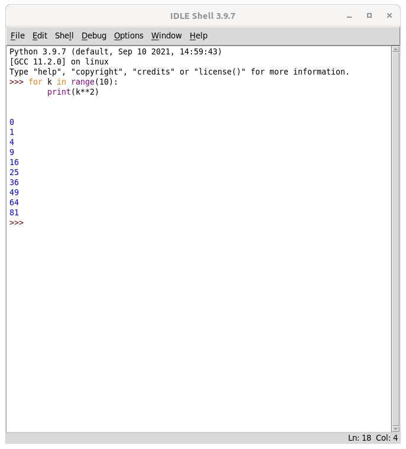
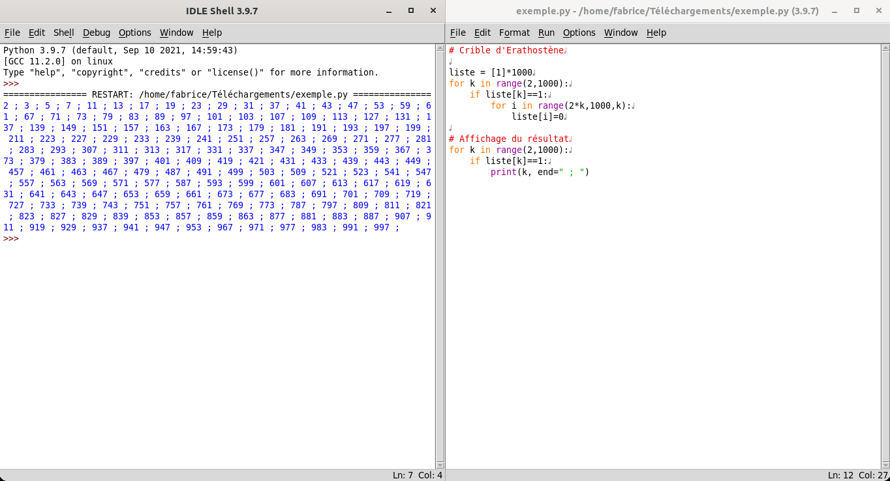
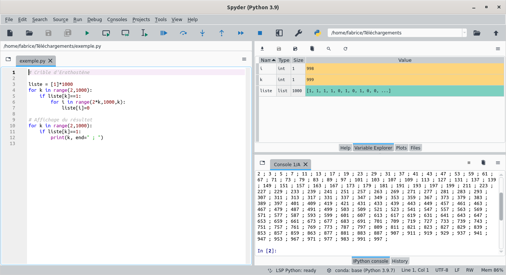

Remarquons tout d'abord que le langae Python existe sous plusieurs versions. Deux branches coexistent : la branche **Python 2** et la branche **Python 3**, qui ne sont pas (complètement) compatibles. Nous n'utiliserons que Python 3, a priori dans sa dernière version.

## Installation sur votre machine

### Idle

**Idle** est l'éditeur Python fourni avec la distribution officielle du langage Python, téléchargée depuis le site officiel : [Site officiel](https://www.python.org/downloads/).

Il s'agit d'un éditeur très basique qui peut suffire à notre usage. On trouvera cependant plus de confort à l'usage d'un éditeur plus sophistiqué.

À l'ouverture, on obtient une fenêtre contenant la console interactive Python dans laquelle chaque instruction est exécutée "à la volée" quand la touche :material-keyboard-return:`Entrée` est frappée. C'est utile pour faire des tests ou découvrir certaines fonctionnalités.

{width=50%}

Pour éditer un programme, on ouvre une fenêtre d'édition par le menu File :material-arrow-right: New File. Une fois le programme écrit, on l'exécute en pressant la touche :material-keyboard-f5: (le fichier doit toujours être enregistré auparavant). Les sorties du programme (affichages, messages d'erreurs, ...) apparaissent dans la fenêtre de la console interactive.

{width=100%}

### Anaconda Spyder

Pour une installation sur votre machine personnelle, je vous conseille [Anaconda](https://www.anaconda.com/). Cette distribution fournit un environnement très complet de logiciels et de bibliothèques pour les sciences et le calcul scientifique.

Une fois Anaconda installé, nous pouvons utiliser l'éditeur **Spyder** pour travailler avec Python.

Vous trouverez dans Spyder, à gauche, la zone d'édition du code du programme, à droite en haut l'explorateur de variables, outil très intéressant pour comprendre le fonctionnement du programme, et en bas la console interactive. Dans ces panneaux de droite peuvent aussi être affichées l'arborescence des fichiers ou la sortie graphique du programme, le cas échéant. La disposition de l'interface est très paramétrable.

Le logiciel fournit un mode de débogage qui permet d'exécuter un programme ligne après ligne en observant l'évolution des variables dans l'explorateur de variables. Cette fonctionnalité s'avère très utile lors de la mise au point d'un programme.

### Jupyter Notebook

Les notebooks Jupyter proposent une autre façon de travailler en Python, différente du couple "fenêtre d'édition"+"console interactive".

{width=20%}

Il s'agit d'une feuille composée d'une suite de cellules qui peuvent contenir du texte (dont la mise en forme peut se faire au format Markdown) ou du code Python exécutable en tapant Ctrl+Entrée dans la cellule, ou en cliquant sur le bouton ad-hoc.

Jupyter Notebook est inclu aussi dans la distribution Anaconda et on peut donc créer un notebook depuis Anaconda-Navigator. 

Cependant, cet outil n'est pas destiné à développer un programme, mais il peut servir à créer une démonstration d'un programme étape par étape ou pour ... rédiger un énoncé de T.P. ou d'exercice ! Vous serez donc amenés dans l'année à travailler sur des notebooks Jupyter.

Ces notebooks peuvent aussi être utilisés en ligne. Ce site propose d'ailleurs une implémentation (Bashton notebook) : [Jupyter Notebook (notebook.flallemand.fr)](https://notebook.flallemand.fr/#){target=_blank}.

## Utiliser Python en ligne

Il est aussi possible de programmer en Python, au moins au début, en utilisant des services en ligne qui évitent toute installation sur votre machine personnelle.

* **En premier lieu**, vous trouverez dans plusieurs pages de ce site un éditeur Python interactif. Il permet d'exécuter un programme et parfois aussi de tester sa validité.
* Les notebooks Jupyter permettent de travailler en ligne : [Jupyter Notebook (notebook.flallemand.fr)](https://notebook.flallemand.fr/#){target=_blank}. Accessible aussi à partir du menu en haut de cette page.
* Toujours sur ce site, une section permet aussi de travailler en Python avec la console et l'éditeur de programme : [Console Python (python.flallemand.fr)](https://python.flallemand.fr/){target=_blank}. Accessible aussi à partir du menu en haut de cette page.
* [Python Tutor](https://pythontutor.com/visualize.html#mode=edit){target=_blank} est un site intéressant qui permet d'éditer un programme et de l'exécuter pas à pas tout en observant l'évolution des variables.
* [Replit](https://replit.com/~) est un service permettant l'édition, l'exécution et le partage de programmes Python.

## Python sur votre smartphone

Sur un smartphone fonctionnant sous android, vous pouvez installer l'application **Pydroid3** qui permet de travailler avec Python, avec un éditeur de programmes, une console interactive et la possibilité d'installer des bibliothèques supplémentaires.

## Python au lycée

À l'heure actuelle, les postes sont tous pourvus de Python et donc de l'éditeur Idle présenté ci-dessus.

La distribution **Edupython** est également installée sur tous les postes du lycée.

L'éditeur associé, nommé **PyScripter**, propose une zone d'édition, une zone en bas de la fenêtre pour la console interactive et un explorateur de fichier.

L'installation de nouvelles bibliothèques et également possible, ainsi que le débogage pas à pas du programme.

EduPython ne fonctionne que sous Windows. Pour une installation personnelle, on lui préfèrera **Anaconda** (voir ci-dessus).

**Nouveauté prévue à la rentrée 2022** : Spyder sera disponible sur les postes du lycée.