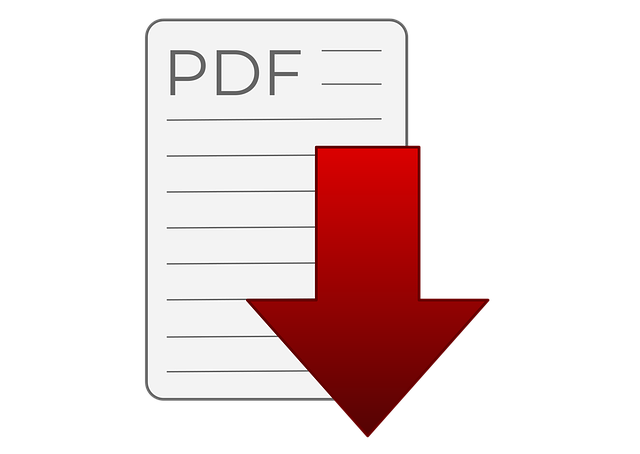
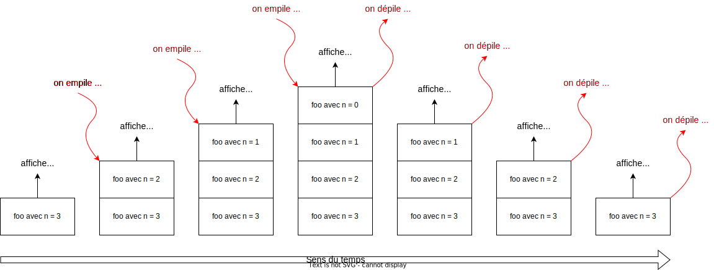

{ target=_blank }

## 1. Motivation et introduction du concept

Un algorithme est dit récursif s'il **s'appelle lui-même** directement ou
indirectement via l'appel d'une ou de plusieurs autres fonctions qui
elles-mêmes finissent par l'appeler.

## 2. Mécanisme

L'exécution d'une fonction récursive conduit à la construction d'une pile d'exécution dans laquel chacun des appels est conservé avec son contexte (ses variables locales, ...) : 

## 3. Écrire un algorithme récursif

!!! success "Les trois règles de récursivité"
    1. La fonction s'appelle elle-même !
    2. La fonction comporte un "cas de base" qui correspond à une condition d'arrêt.
    3. L'algorithme conduit vers le cas de base : il n'y a pas une infinité d'appels récursifs. (preuve de terminaison)

## 4. Fonction récursive et fonction itérative

Toute fonction récursive peut s'écrire sous forme itérative. La méthode récursive peut poser des problèmes d'occupation de la mémoire en cas d'un trop grand nombre d'appels récursifs.