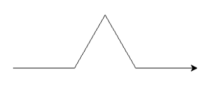

_Les exercices précédés du symbole :fontawesome-solid-computer: sont à faire sur machine, en sauvegardant le fichier si nécessaire._

_Les exercices précédés du symbole :octicons-pencil-16: doivent être résolus par écrit._

!!! warning "Attention !"
    Les exercices suivants comportent également quelques compléments de cours.

    Les exemples présentés dans ces exercices sont  des exemples très classiques qu'il faut connaître.

## :octicons-pencil-16: Exercice 1 : factorielle

On rappelle l'exemple du premier paragraphe du cours concernant le calcul de la factorielle $n!=1\times 2\times 3\times\ldots\times n$ d'un entier naturel $n$, dans sa version récursive.

```python
  def fact(n):
    """Renvoie la factorielle de n (méthode récursive)."""
    if n == 0:
      res = 1
    else:
      res = n*fact(n-1)
    return res
```

1. Dans cette fonction, quel est le cas de base ?
2. Démontrer que l'algorithme se termine (**preuve de terminaison**) dès lors que l'argument $n$ donné initialement est un entier naturel.
3. Que se passe-t-il si on appelle la fonction `fact` avec $n=-2$ ? Proposer une modification de la fonction pour traiter ce type de cas.
3. Pour démontrer que cet algorithme renvoie bien $n!$ lorsque $n$ est un entier naturel, on peut procéder par un **raisonnement par récurrence**.
    
    * ^^Cas de base^^ : pour $n=0$, la fonction renvoie-t-elle $0!$ ?
    * ^^Hypothèse^^ : on suppose que, pour une certaine valeur de l'entier naturel non nul $n$, `fact(n-1)` renvoie $(n-1)!$. Montrer que, sous cette hypothèse, `fac(n)` renvoie bien $n!$.
    * ^^Conclusion^^ : en déduire que `fac(n)` renvoie $n!$ pour tout entier naturel $n$.

4. Pour évaluer la **complexité** de cet algorithme, nous allons compter le nombre de multiplications et de comparaisons effectuées. Démontrer, à l'aide d'un raisonnement pas récurrence, que la complexité de cet algorithme est en $\mathcal{O}(n)$.

!!! example "À retenir ..."
    * Le principe de la preuve de terminaison.
    * Le principe du raisonnement pas récurrence

----------------------------------

## :octicons-pencil-16: :fontawesome-solid-computer: Exercice 2 : suite de Fibonacci

La suite de Fibonacci est une suite de nombres entiers notés $F_n$, définie par $F_0=0$, $F_1=1$ et dans laquelle chaque terme est égal à la somme des deux termes qui le précèdent.

1. Calculer $F_n$ à la main pour les valeurs de $n$ allant de 2 jusqu'à 5.
2. Recopier et compléter le code de la fonction `fibo_iter` qui retourne $F_n$ en utilisant un algorithme itératif.

    ````python
    def fibo_iter(n: int) -> int:
        """Suite de Fibonacci, version itérative"""
        if n == 0:
            return 0
        else:
            f0, f1 = 0, 1
            for k in range(1, n):
                f0, f1 = ...  # Ligne à compléter ...
            return f1


    for k in range(10):
        print(fibo_iter(k))
    ````

3. Évaluer la complexité en terme de nombre d'additions.
4. D'après la définition de la suite, on a, pour tout entier naturel $n\geqslant 2$ : 
    
    $$F_{n}=F_{n-2}+F_{n-1}$$
    
    En déduire une version **récursive** de l'algorithme de calcul de $F_n$. Cet algorithme a ceci de particulier que chaque fonction procède à **deux** appels récursifs. On pourra recopier et compléter le code ci-dessous.

    ````python
    def fibo_rec(n: int) -> int:
        """Suite de Fibonacci version récursive"""
        # Cas de base
        if ...:
            return n
        # Récursion
        else:
            return ...


    for k in range(10):
        print(fibo_rec(k))
    ````

6. Utiliser chacune des deux versions pour calculer la valeur de $F_{50}$. Que constate-t-on ? Expliquer.

??? tip "Remarques et compléments"
    La version récursive se révèle beaucoup moins efficace. Pour comprendre pourquoi, nous pouvons représenter par un arbre les appels récursifs nécessaires.

    ``` mermaid
    flowchart TD
        id1("fib_rec(5)") --> id2("fib_rec(3)");
        id1 --> id3("fib_rec(4)");
        id2 --> id4["fib_rec(1)"];
        id2 --> id5("fib_rec(2)");
        id3 --> id6("fib_rec(2)");
        id3 --> id7("fib_rec(3)");
        id5 --> id8["fib_rec(0)"];
        id5 --> id9["fib_rec(1)"];
        id6 --> id10["fib_rec(0)"];
        id6 --> id11["fib_rec(1)"];
        id7 --> id12["fib_rec(1)"];
        id7 --> id13("fib_rec(2)");
        id13 --> id14["fib_rec(0)"];
        id13 --> id15["fib_rec(1)"];
    ```

    On retrouve les cas de base dans les feuilles de l'arbre. Nous pouvons constater que le nombre d'appels récursifs est très grand. Il est possible de démontrer que ce nombre augmente de façon **exponentielle**. Pour calculer $F_{100}$, il y aurait environ $10^{20}$ opérations. À raison de $10^9$ opérations par seconde, la calcul prendra de l'ordre de $10^{11}$ secondes, soit environ 3 000 ans !

    Un autre constat qui montre l'inefficacité de ce programme : plusieurs calculs identiques sont répétés plusieurs fois. On calcule par exemple $F_3$ deux fois et $F_2$ trois fois. Une solution meilleure serait de garder en mémoire les éléments déjà calculés et de ne calculer que les nouveaux éléments encore jamais rencontrés. Une telle démarche relève de la **programmation dynamique** qui sera abordée en fin d'année.

    Pour satisfaire votre curiosité insatiable, vous pouvez déjà observer et tester le programme ci-dessous :

    ````python
    def fibo_dyn(n: int, suite: dict = {0: 0, 1: 1}) -> int:
        """Suite de Fibonacci version dynamique"""
        # Cas de base
        if n == 0 or n == 1:
            return n
        # Récursion
        else:
            # Si Fn est déjà calculé, on le retourne
            if n in suite.keys():
                return suite[n]
            else:
                # Sinon, on le calcule et on le garde en mémoire
                f = fibo_dyn(n-2, suite) + fibo_dyn(n-1, suite)
                suite[n] = f
                return f


    for k in range(10):
        print(fibo_dyn(k))
    ````

    Une exécution dans PythonTutor est instructive :

    <iframe width="800" height="500" frameborder="0" src="https://pythontutor.com/iframe-embed.html#code=def%20fibo_dyn%28n%3A%20int,%20suite%3A%20dict%20%3D%20%7B0%3A%200,%201%3A%201%7D%29%20-%3E%20int%3A%0A%20%20%20%20%22%22%22Suite%20de%20Fibonacci%20version%20dynamique%22%22%22%0A%20%20%20%20%23%20Cas%20de%20base%0A%20%20%20%20if%20n%20%3D%3D%200%20or%20n%20%3D%3D%201%3A%0A%20%20%20%20%20%20%20%20return%20n%0A%20%20%20%20%23%20R%C3%A9cursion%0A%20%20%20%20else%3A%0A%20%20%20%20%20%20%20%20%23%20Si%20Fn%20est%20d%C3%A9j%C3%A0%20calcul%C3%A9,%20on%20le%20retourne%0A%20%20%20%20%20%20%20%20if%20n%20in%20suite.keys%28%29%3A%0A%20%20%20%20%20%20%20%20%20%20%20%20return%20suite%5Bn%5D%0A%20%20%20%20%20%20%20%20else%3A%0A%20%20%20%20%20%20%20%20%20%20%20%20%23%20Sinon,%20on%20le%20calcule%20et%20on%20le%20garde%20en%20m%C3%A9moire%0A%20%20%20%20%20%20%20%20%20%20%20%20print%28%22calcul%20avec%20n%20%3D%22,%20n%29%0A%20%20%20%20%20%20%20%20%20%20%20%20f%20%3D%20fibo_dyn%28n-2,%20suite%29%20%2B%20fibo_dyn%28n-1,%20suite%29%0A%20%20%20%20%20%20%20%20%20%20%20%20suite%5Bn%5D%20%3D%20f%0A%20%20%20%20%20%20%20%20%20%20%20%20return%20f%0A%0A%0Afor%20k%20in%20range%285%29%3A%0A%20%20%20%20print%28fibo_dyn%28k%29%29&codeDivHeight=400&codeDivWidth=350&cumulative=false&curInstr=0&heapPrimitives=nevernest&origin=opt-frontend.js&py=3&rawInputLstJSON=%5B%5D&textReferences=false"> </iframe>

    Voir [cet article du blog](https://www.flallemand.fr/wp/2022/06/05/mesurer-le-temps-dexecution-dun-fragment-de-code/){ target=_blank } qui explique comment visualiser le temps d'exécution d'une fonction.

----------------------------

## :octicons-pencil-16: :fontawesome-solid-computer: Exercice 3 : calcul de $x^n$

Pour tout nombre réel $x$ et tout entier naturel $n$, $x^n$ est défini par $x^0=1$ et, pour $n>0$, $x^n=x\times x\times x\times \ldots \times x$ : produit de $n$ facteurs tous égaux à $x$.

Les règles de calcul sur les exposants permettent d'affirmer que, pour $n>0$, $x^n=x\times x^{n-1}$.

1. Écrire la fonction récursive ``puissance(x,n)`` qui calcule le nombre $x^n$  pour tout entier naturel $n$.
2. Dessiner l'arbre d'appels de cette fonction pour $x=3$ et $n=5$.
3. Pour les plus rapides

    ??? question "Question bonus"
        Un autre méthode de calcul de $x^n$ consiste à distinguer le cas où $n$ est pair et celui où $n$ est impair :

        * si $n=0$, alors $x^n=1$ ;
        * si $n$ est pair, alors $x^n=\left(x^{n/2}\right)^2$ ;
        * si $n$ est impair, alors $x^n=x\times\left(x^{(n-1)/2}\right)^2$.

        L'algorithme qui découle de cette définition porte également le nom **d'exponentiation rapide**. Comme son nom l'indique, il s'agit d'un algorithme particulièrement efficace pour calculer rapidement de grandes puissances entières.

        Écrire la fonction récursive ``puissancev2(x,n)`` qui calcule le nombre $x^n$ pour tout entier naturel n selon la méthode d'exponentiation rapide.

------------------------------------

## :octicons-pencil-16: Exercice 4 : maximum d'une liste

On considère le programme ci-dessous :

````python
def maximum(a, b):
    if a > b:
        return a
    else:
        return b

def maximum_tab(tab):
    if len(tab) == 1:
        return tab[0]
    else:
        return maximum(tab[0], maximum_tab(tab[1:]))

from random import randint

mon_tab = []
for i in range(20):
    mon_tab.append(randint(-100, 100))
print(mon_tab)
print(maximum_tab(mon_tab))
````

1. Décrire, en langage usuel, le principe de fonctionnement de la fonction ``maximum_tab``.
1. Expliquer en quoi la fonction ``maximum_tab`` est récursive. Quel est le cas de base ?
2. Prouver la terminaison de cette fonction.
3. Effectuer par récurrence la preuve de cet algorithme (c'est-à-dire prouver que la fonction retourne bien le maximum du tableau donné en argument).
4. Dessiner l'arbre d'appels de cette fonction pour l'appel ``maximum_tab([-4,55,-1,-35,-52,31])``.

-------------------------------------

## :fontawesome-solid-computer: Exercice 5 : palindromes

On appelle palindrome un mot qui se lit dans les deux sens comme « été » ou « radar ».

Écrire une fonction récursive ``palindrome`` qui teste si un mot est un palindrome.

* Entrée : Un mot (type ``str``).
* Sortie : Un booléen égal à ``True`` si le mot est un palindrome, ``False`` sinon.

On considérera les deux cas suivant comme cas de base :

* si le mot est la chaîne vide, c'est un palindrome ;
* si le mot ne contient qu'une seule lettre, c'est un palindrome

------------

## :octicons-pencil-16: :fontawesome-solid-computer: Exercice 6 : flocon de von Koch

Une image qui a une apparence similaire quelle que soit l'échelle à laquelle on l'observe est appelée une **fractale** (il y a d'autres types de fractales).

Un exemple simple de fractale est le flocon de Von Koch, dont voici une représentation (pour un degré 4).


On peut la créer à partir d'un segment de droite, en modifiant récursivement chaque segment de droite de la façon suivante :

* on divise le segment de droite en trois segments de longueurs égales ;
* on construit un triangle équilatéral ayant pour base le segment médian de la première étape ;
* on supprime le segment de droite qui était la base du triangle de la deuxième étape.

Voici le résultat obtenu en une étape :



Pour continuer, il suffit de considérer chaque segment de cette dernière figure comme segment de départ.

````python
from turtle import *


def Koch(n, d):
    if n == 0:
        forward(d)
    else:
        Koch(n-1, d/3)
        left(60)
        Koch(n-1, d/3)
        right(120)
        Koch(n-1, d/3)
        left(60)
        Koch(n-1, d/3)
    return None


def flocon(n, d):
    for k in range(3):
        Koch(n, d)
        right(120)
    return None


flocon(4, 300)
exitonclick()
````

1. Identifier le cas de base de la fonction récursive ``Koch(n, d)``. Que fait-il ?
2. Modifier les paramètres ``n`` et ``d`` lors de l'appel à la fonction ``flocon`` et observer l'impact de ces modifications sur le dessin.
3. Combien d'appels récursifs sont-ils réalisés lors de l'appel de la fonction ``Koch(4, 300)`` ?

---------------------------------------

## :octicons-pencil-16: Exercice 7 (type bac)

<iframe src="../../../../assets/pdf/exo_type_bac_recursivite_1.pdf" width="100%" height="500px"> </iframe>
