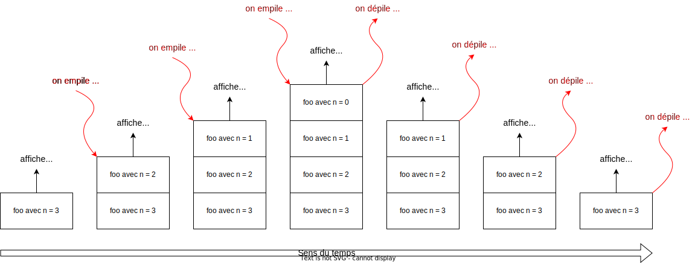

# 01-Récursivité

## 1. Motivation et introduction du concept

Un algorithme est dit récursif s'il **s'appelle lui-même** directement ou
indirectement via l'appel d'une ou de plusieurs autres fonctions qui
elles-mêmes finissent par l'appeler.

La récursivité est un concept fondamental en informatique qui met
naturellement en pratique un mode de pensée puissant qui consiste à
pouvoir découper la tâche à réaliser en sous-tâches de mêmes natures mais
plus petites qui finalement sont simples à résoudre.

Prenons par exemple le calcul de la factorielle d'un nombre entier $n$.  Par
définition pour un $n$ entier strictement positif, $n!$ est égale au
produit des entiers strictement positifs inférieurs à $n$.  Par
convention on a aussi $0! = 1$.

Par exemple, on a : $5!=1\times 2\times 3\times 4\times 5 = 120$.

Donnons le code itératif d'une fonction calculant la factorielle:

```python
  def fact(n):
    """Renvoie la factorielle de n."""
    res = 1
    for i in range(1,n+1):
      res = res * i  
    return res
```

La définition récursive se base sur le fait que $n! = n\times (n-1)!$ pour
tout $n>0$.

On obtient le code:

```python
  def fact(n):
    """Renvoie la factorielle de n (méthode récursive)."""
    if n == 0:
      res = 1
    else:
      res = n*fact(n-1)
    return res
```

Pour commencer à comprendre comment fonctionne cette fonction récursive, nous pouvons visualiser le calcul de `fact(4)` grâce à l'outil Python Tutor ci-dessous.

<iframe width="800" height="500" frameborder="0" src="https://pythontutor.com/iframe-embed.html#code=def%20fact%28n%29%3A%0A%20%20%20%20%22%22%22Renvoie%20la%20factorielle%20de%20n%20%28m%C3%A9thode%20r%C3%A9cursive%29.%22%22%22%0A%20%20%20%20if%20n%20%3D%3D%200%3A%0A%20%20%20%20%20%20res%20%3D%201%0A%20%20%20%20else%3A%0A%20%20%20%20%20%20res%20%3D%20n*fact%28n-1%29%0A%20%20%20%20return%20res%0A%0A%0Aprint%28fact%284%29%29&codeDivHeight=400&codeDivWidth=350&cumulative=false&curInstr=0&heapPrimitives=nevernest&origin=opt-frontend.js&py=3&rawInputLstJSON=%5B%5D&textReferences=false"> </iframe>

## 2. Mécanisme

Considérons la fonction `foo` ci-dessous :

```python
def foo(n):
    if n == 0:
        print("Cas de base : ", n)
    else:
        print("Début avec n = " , n)
        foo(n-1)
        print("Fin avec n = " , n)


foo(3)
```

Ce programme génère la sortie suivante : 

````pycon
Début avec n =  3
Début avec n =  2
Début avec n =  1
Cas de base :  0
Fin avec n =  1
Fin avec n =  2
Fin avec n =  3
````

L'observation de ces résultats permet de comprendre que le système, lors de l'exécution de ce programme, utilise une **pile d'exécution**. Une pile d'exécution permet d'enregistrer des informations sur les fonctions en cours d'exécution dans un programme. On parle de pile, car les exécutions successives "s'empilent" les unes sur les autres, comme une pile d'assiettes, ou de crêpes. Si nous nous intéressons à la pile d'exécution du programme étudié ci-dessus, nous obtenons le schéma suivant :



Il est important de bien comprendre que la fonction située au sommet de la pile d'exécution est en cours d'exécution. Toutes les fonctions situées "en dessous" sont mises en pause jusqu'au moment où elles se retrouveront au sommet de la pile. Quand une fonction termine son exécution, elle est automatiquement retirée du sommet de la pile (on dit que la fonction est dépilée).

La pile d'exécution permet de retenir la prochaine instruction à exécuter au moment où une fonction sera sortie de son "état de pause" (qu'elle se retrouvera au sommet de la pile d'exécution). Elle enregistre aussi **le contexte**, c'est-à-dire par exemple ici la valeur de la variable locale $n$ associée à chaque appel de la fonction.

Nous pouvons comprendre que ce sont plusieurs copies (on dira plutôt des **instances**) de la fonction `foo` qui sont présentent dans la pile, chacune ayant son propre **espace de noms** : la variable $n$ de la fonction située en haut de la pile n'est pas la même que la variable $n$ de la fonction située en-dessous.

!!! danger "Limitation propre à Python"
    Le langage Python limite à 1000 le nombre d'appels récursifs d'une fonction, autrement dit la hauteur de la pile.

    ````pycon
    RecursionError: maximum recursion depth exceeded while calling a Python object
    ````

## 3. Écrire un algorithme récursif

Lors de l'écriture d'un algorithme récursif, trois règles doivent toujours être vérifiées :

!!! success "Les trois règles de récursivité"
    1. La fonction s'appelle elle-même !
    2. La fonction comporte un "cas de base" qui correspond à une condition d'arrêt.
    3. L'algorithme conduit vers le cas de base : il n'y a pas une infinité d'appels récursifs.

La troisième règle est assurée par la **preuve de terminaison** qui se fait souvent en identifiant la construction d’une suite strictement décroissante d’entiers positifs ou nuls.

## 4. Fonction récursive et fonction itérative

La programmation récursive n'est ni meilleure, ni pire que, la programmation itérative. Toute fonction récursive peut aussi être programmée de façon itérative. Cependant, en cas de nombreux appels récursifs, la mémoire de la machine sera trop fortement sollicitée et l'exécution ralentie, voire impossible.

Le choix entre une solution récursive ou une solution itérative est donc guidé par le type de problème à résoudre car certains problèmes s'écrivent *naturellement* de façon récursive.

