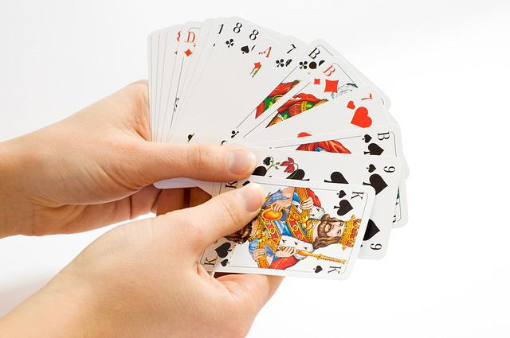

# TP : le jeu de la bataille

Dans ce TP, vous mettrez en oeuvre la POO pour créer un programme qui joue à la bataille.

!!! success "Objectifs"
    * Définir une classe et ses membres.
    * Utiliser des objets, leurs attributs, leurs méthodes.
    * Répondre à un cahier des charges.

L'énoncé au format PDF est disponible ci-dessous.

!!! danger "Critères d'évaluation"
    * Respect du cahier de charges.
    * Documentation, spécification des méthodes créées.
    * Le jeu se déroule sans erreur.
    * Bonus : tenir compte des compléments sur la POO.

Fichier Python à télécharger et à compléter : [bataille_eleves.py](../../../assets/py/bataille_eleves.py)

<iframe src="../../../../assets/pdf/TP_POO.pdf" width="100%" height="500px"> </iframe>
