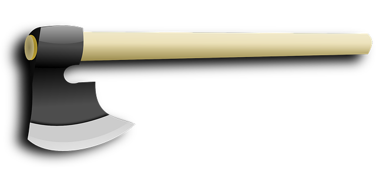

## 3.1. Du point de vue utilisateur : Interface

Nous allons maintenant étudier un autre type abstrait de données : les **dictionnaires** aussi appelés **tableaux associatifs**.

!!! info "Définition"
    Un dictionnaire est une structure de donnée permettant d'**indexer des objets par leur nom** plutôt que par un nombre.

On retrouve une structure qui ressemble, à première vue, beaucoup à un tableau (à chaque élément on associe un indice de position). Mais au lieu d'associer chaque élément à un indice de position, dans un dictionnaire, on associe chaque élément (on parle de **valeur** dans un dictionnaire) à une **clé**, on dit qu'un dictionnaire contient des **couples clé:valeur** (chaque clé est associée à une valeur).

Un dictionnaire associe une clé à une valeur. On peut voir les tableaux comme un dictionnaire où les clés sont des entiers allant de 0 à la longueur de la liste moins 1.

Mais cela peut être bien plus général :

* les clés peuvent être des mots et les valeurs un nombre. Cela permet par exemple de compter le nombre de fois où un chaque mot d'un texte apparaît.
* associer un nom (valeur) à un numéro de téléphone (clé) sans avoir besoin d'une liste allant de 0 à numéro max de téléphone.

Les clés ne doivent pas changer une fois créées, sinon la serrure fabriquée dans le dictionnaire ne fonctionne plus. On ne doit donc utiliser que des objets non modifiables pour créer des clés d'un dictionnaire Python. Comme :

* des entiers
* des réels
* des chaines de caractères
* des tuples

!!! success "Exemple"
    Exemples de couples clé:valeur :
    
    * prenom:Kevin, nom:Durand, naissance:17-05-2005. 
    * prenom, nom et naissance sont des **clés** ; Kevin, Durand et 17-05-2005 sont des **valeurs**.

Les méthodes primitives permettant de définir l'interface de la structure de dictionnaire peuvent être les suivantes :

* ``créer()`` : création d'un nouveau dictionnaire vide ;
* ``ajouter(dict, clé, valeur)`` : on associe une nouvelle valeur à une nouvelle clé ;
* ``modifier(dict, clé, valeur)`` : on modifie un couple clé:valeur en remplaçant la valeur courante par une autre valeur (la clé restant identique) ;
* ``supprimer(dict, clé)`` : on supprime une clé (et donc la valeur qui lui est associée) ;
* ``rechercher(dict, clé)`` : on recherche une valeur à l'aide de la clé associée à cette valeur.

!!! success "Exemple"
    Soit le dictionnaire D composé des couples clé:valeur suivants : prenom:Kevin, nom:Durand, naissance:17-05-2005. Pour chaque exemple ci-dessous on repart du dictionnaire d'origine :

    ```` title="Code" linenums="1"
    ajouter(D, tel, 06060606)
    modifier(D,nom,Dupont)
    supprimer(D, naissance)
    rechercher(D, prenom)
    ````

    * Ligne 1 : le dictionnaire D est maintenant composé des couples suivants : prenom:Kevin, nom:Durand, date-naissance:17-05-2005, tel:06060606 ;
    * Ligne 2 : le dictionnaire D est maintenant composé des couples suivants : prenom:Kevin, nom:Dupont, date-naissance:17-05-2005 ;
    * Ligne 3 : le dictionnaire D est maintenant composé des couples suivants : prenom:Kevin, nom:Durand ;
    * Ligne 4 : la fonction renvoie Kevin.

L'utilisation de la structure dictionnaire en Python a été étudiée en première. Il faut donc revoir le cours correspondant.

## 3.2. Du point de vue concepteur : Implémentation

L'implémentation du type abstrait dictionnaire est complexe et dépasse le cadre du programme de NSI. Cette implémentation utilise des **fonctions de hachage**.



L'utilisation des tables et des fonctions de hachages est omniprésente en informatique, il est donc utile pour votre "culture générale informatique", de connaître le principe des fonctions de hachages. Voici un texte qui vous permettra de comprendre le principe des fonctions de hachages : [c'est quoi le hachage ?](https://culture-informatique.net/cest-quoi-hachage/){ target=_blank } . Pour avoir quelques idées sur le principe des tables de hachages, je vous recommande le visionnage de cette vidéo : [les tables de hachage](https://www.youtube.com/watch?v=CkLctGYWFPA){ target=_blank }.

On peut retenir que 

!!! bug "À retenir"
    La complexité de recherche, d'ajout et de suppression d'un élément dans un dictionnaire est en $\mathcal{O}(1)$ : elle ne dépend pas du nombre d'éléments présents dans le dictionnaire.
    
    En comparaison, la complexité de l'algorithme de recherche dans un tableau non trié est $\mathcal{O}(n)$.

    La structure de dictionnaire est donc une structure très efficace ! N'hésitez pas à l'utiliser car son temps moyen d'exécution est très rapide.