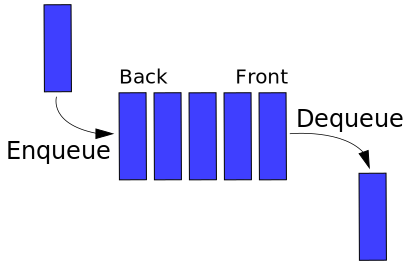

# S2-Structures de données

# 1. Interface et implémentations

Pour les différentes structures de données étudiées dans ce chapitre, on distinguera l'**interface** qui regroupe les **primitives**, fonctions et méthodes dont l'_utilisateur_ du type abstrait dispose, de l'**implémentation**, programmation effective de la structure de données dans un langage, travail réalisé par le _concepteur_.

# 2. Listes, Piles et files

## 2.1. Listes

Une **liste** est une structure de données qui permet de stocker des données et d'y accéder directement.

Une liste est une collection finie de données. On appelle tête le premier élément de la liste et queue la liste privée de son premier élément.

L'**interface** minimale  permettant de définir le type abstrait de données "liste" comporte cinq fonctions, qui sont appelées **primitives** :

* ``creer()``, qui crée une liste vide ;
* ``ajouter(element, liste)``, qui ajoute un élément en tête de liste ; ces deux première primitives peuvent parfois se regrouper en une seule ;
* ``tete(liste)``, qui renvoie la valeur de l'élément en tête de liste ;
* ``queue(liste)``, qui renvoie la liste privée de son premier élément ;
* ``est_vide(liste)``, qui renvoie vrai si la liste est vide, faux sinon.

Différentes implémentations sont possibles : avec des tuples, en utilisant la POO.

## 2.2. Piles

La **pile** est une structure de données qui permet de stocker des données et d'y accéder. Une pile se comporte comme une pile d'assiettes : on parle de mode **LIFO** (Last In, First Out, en anglais, dernier arrivé, premier sorti), c'est-à-dire que le dernier élément ajouté à la structure sera le prochain élément auquel on accédera. Les premiers éléments ayant été ajoutés devront « attendre » que tous les éléments qui ont été ajoutés après eux soient sortis de la pile. Pour gérer cette contrainte, on définit alors le sommet de la pile qui caractérise l'emplacement pour ajouter ou retirer des éléments.

L'interface suivante permet de définir le type abstrait de données **pile** : 

* ``creer()``, qui crée une pile vide ;
* ``taille(pile)``, qui permet de connaître le nombre d'éléments contenus dans la pile ;
* ``est_vide(pile)``, qui renvoie vrai si la pile est vide, faux sinon ;
* ``empiler(pile, element)``, qui ajoute un élément au sommet de la pile (qui devient le nouveau sommet) ;
* ``depiler(pile)``, qui retire et renvoie l'élément situé au sommet de la pile (le nouveau sommet devient l'élément qui suivait l'ancien sommet) ;
*  ``sommet(pile)``, qui renvoie l'élément situé au sommet de la pile (sans le retirer).

L'opération d'empilement se dit "push" en anglais, l'opération de dépilement se dit "pop".

Différentes implémentations sont possibles : avec des listes Python, utilisation de la POO, ...

## 2.3. Files

La **file**, comme la liste et la pile, permet de stocker des données et d'y accéder. La différence se situe au niveau de l'ajout et du retrait d'éléments. Le prochain élément auquel on peut accéder est le premier élément ajouté à la structure ; les nouveaux éléments viennent en bout de file : on ne pourra y accéder que lorsque tous les éléments ayant été ajoutés avant eux seront sortis de la file. On parle de mode **FIFO** (First in, First out, en anglais, premier arrivé, premier sorti), c'est-à-dire que le premier élément ayant été ajouté à la structure sera le prochain élément auquel on accédera. Les derniers éléments ajoutés devront « attendre » que tous les éléments ayant été ajoutés avant eux soient sortis de la file. Pour gérer cette contrainte, la pile est caractérisée par deux « emplacements » : **la tête** de file, sortie de la file (début de la structure), où les éléments sont retirés ; **le bout** de file, entrée de la file (fin de la structure), où les éléments sont ajoutés.

6 primitives constituent l'interface permettant de définir le type abstrait de données "file" :

* ``creer()``, qui crée une file vide ;
* ``taille(file)``, qui permet de connaître le nombre d'éléments contenus dans la file ;
* ``est_vide(file)``, qui renvoie vrai si la file est vide, faux sinon ;
* ``enfiler(file, element)``, qui ajoute un élément au bout de la file (et devient le nouveau bout de file) ;
* ``defiler(file)``, qui retire et renvoie l'élément situé à la tête de la file (la nouvelle tête devient l'élément qui suivait l'ancienne tête) ;
* ``tete(file)``, qui renvoie l'élément situé à la tête de la file (sans le retirer).

Enfiler se dit _enqueue_ en anglais et défiler se dit _dequeue_.

Différentes implémentations sont possibles : utilisation de deux piles, POO, ...

# 3. Dictionnaires

Un **dictionnaire**, ou **tableau associatif**,  est une structure de donnée permettant d'indexer des objets par leur nom plutôt que par un nombre. On dit qu'un dictionnaire contient des couples clé:valeur (chaque clé est associée à une valeur).

Les méthodes primitives permettant de définir l'interface de la structure de dictionnaire peuvent être les suivantes :

* ``créer()`` : création d'un nouveau dictionnaire vide ;
* ``ajouter(dict, clé, valeur)`` : on associe une nouvelle valeur à une nouvelle clé ;
* ``modifier(dict, clé, valeur)`` : on modifie un couple clé:valeur en remplaçant la valeur courante par une autre valeur (la clé restant identique) ;
* ``supprimer(dict, clé)`` : on supprime une clé (et donc la valeur qui lui est associée) ;
* ``rechercher(dict, clé)`` : on recherche une valeur à l'aide de la clé associée à cette valeur.

L'implémentation des dictionnaires repose sur **des fonctions et tables de hachage**. Ces techniques (hors programme) permettent de très bonnes performance : par exemple, la recherche dans un dictionnaire de fait à coût constant (ne dépend pas du nombre d'entrées dans le dictionnaire) alors que dans un tableau non trié, nous avons un coût linéaire (proportionnel au nombre de données). 