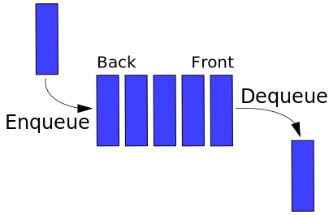

## 2.3.1. Du point de vue utilisateur : interface

!!! info "Définition"
    La **file**, comme la liste et la pile, permet de stocker des données et d'y accéder. La différence se situe au niveau de l'ajout et du retrait d'éléments.

    * Le prochain élément auquel on peut accéder est le premier élément ajouté à la structure ;
    * Les nouveaux éléments viennent en bout de file : on ne pourra y accéder que lorsque tous les éléments ayant été ajoutés avant eux seront sortis de la file.

On parle de mode **FIFO** (First in, First out, en anglais, premier arrivé, premier sorti), c'est-à-dire que le premier élément ayant été ajouté à la structure sera le prochain élément auquel on accédera. Les derniers éléments ajoutés devront « attendre » que tous les éléments ayant été ajoutés avant eux soient sortis de la file. Contrairement aux listes, on ne peut donc pas accéder à n'importe quelle valeur de la structure (pas d'index).

Pour gérer cette contrainte, la pile est caractérisée par deux « emplacements » :

* la **tête** de file, sortie de la file (début de la structure), où les éléments sont retirés ;
* le **bout** de file, entrée de la file (fin de la structure), où les éléments sont ajoutés.

On peut s'imaginer une **file d'attente**, dans un cinéma par exemple. Les premières
personnes à pouvoir acheter leur place sont les premières arrivées, et les nouveaux
arrivants se placent au bout de la file.


Une file est une collection de données. On appelle tête de file le premier élément de la structure et bout de file le dernier élément. Quand un élément est ajouté à la file, on l'ajoute en bout de file et il devient le nouveau bout de file c'est-à-dire l'élément « suivant » l'élément situé précédemment en bout de file. Quand un élément est retiré de la file, on le sélectionne à la tête de la file et la nouvelle tête est l'élément qui suivait l'ancienne tête. Lorsqu'on ajoute un élément à une file vide, celui-ci est donc à la fois la tête et le bout de la file.



6 primitives constituent l'interface permettant de définir le type abstrait de données "file" :

* ``creer()``, qui crée une file vide ;
* ``taille(file)``, qui permet de connaître le nombre d'éléments contenus dans la file ;
* ``est_vide(file)``, qui renvoie vrai si la file est vide, faux sinon ;
* ``enfiler(file, element)``, qui ajoute un élément au bout de la file (et devient le nouveau bout de file) ;
* ``defiler(file)``, qui retire et renvoie l'élément situé à la tête de la file (la nouvelle tête devient l'élément qui suivait l'ancienne tête) ;
* ``tete(file)``, qui renvoie l'élément situé à la tête de la file (sans le retirer).

Enfiler se dit _enqueue_ en anglais et défiler se dit _dequeue_.

!!! example "La file est utile dans différents types de problèmes :"
    * pour une imprimante, gestion de la file d'attente des documents à imprimer ;
    * modélisation du jeu de la bataille (on révèle la carte au-dessus du paquet et on place celles gagnées en dessous...) ;
    * gestion de mémoires tampon, pour gérer les flux de lecture et d'écriture dans un fichier, par exemple ;
    * matérialisation d'une file d'attente, pour un logiciel (visioconférence par exemple) ou un jeu (gestion des connexions des utilisateurs, des tours de jeu...),...
    * algorithme du parcours en largeur pour les arbres et les graphes, par exemple, pour trouver le plus court trajet sur une carte, ou récupérer les valeurs d'une structure dans l'ordre croissant.. (voir séquence 6).

!!! success "Exemple"
    Supposons implémenté le type abstrait **file**. Nous disposons d'une interface composée des six primitives décrites ci-dessus. On considère une file ``F`` composée des éléments suivants : 12, 14, 8, 7, 19 et 22 (la tête = premier élément entré dans la file est 22, le dernier élément entré est 12). On exécute le code suivant ligne par ligne :

    ````python title="Code" linenums="1"
        enfiler(F,42)
        defiler(F)
        defiler(F)
        taille(F)
        estVide(F)
        tete(F)
    ````

    * L'exécution de la ligne 1 ajoute l'élément 42 au bout de la file qui contient alors 42, 12, 14, 8, 7, 19, 22 ;
    * L'exécution de la ligne 2 affiche 22 et retire cet élément de la file qui contient maintenant 42, 12, 14, 8, 7, 19 ;
    * L'exécution de la ligne 3 affiche 19 et retire cet élément de la file qui contient maintenant 42, 12, 14, 8, 7 ;
    * La ligne 4 renvoie la taille de ``F`` : 5 ;
    * La file n'est pas vide, on obtient dont ``False``.

## 2.3.2. Du point de vue concepteur : implémentation(s)

L'implémentation utilisant des listes Python est possible, mais l'opération ``defiler()`` est inefficace dans ce cas (on a une complexité en $\mathcal{O}(n)$).

Nous allons tout d'abord étudier une implémentation utilisant **deux piles**.

### Implémentation utilisant deux piles

Comme le programme le suggère, il est possible d'implanter une file en utilisant deux piles. Le procédé est le suivant :

* la file est, au départ, composée de deux piles vides ;
* la première pile est une pile dite « d'entrée » et la seconde « de sortie » ;
* quand on ajoute un élément dans la file, on le place dans la pile « d'entrée » ;
* Quand on retire (ou qu'on accède) au premier élément de la file, on a deux cas :

    - soit la pile « de sortie » est vide et on dépile chaque élément de la pile
    « d'entrée » pour les empiler immédiatement dans la pile « de sortie » ;
    - soit il y a au moins un élément dans la pile « de sortie », auquel cas on ne fait rien de plus.
    - Enfin, on sélectionne le sommet de la pile « de sortie » ;

* comme il y a deux piles, la taille de la file (et le fait qu'elle soit vide ou non) doit se
baser sur les éléments contenus dans les deux piles.


Dans notre implémentation, on propose de matérialiser la file sous la forme d'un tuple contenant deux piles, crées (et manipulées) avec les méthodes du module modélisant le type abstrait de données pile en utilisant les listes Python, définit plus tôt dans la section sur les piles. Ce module, nommé ``piles.py`` sera importé dans le présent fichier. On introduit également une nouvelle méthode « transferer » qui sert à effectuer le transfert entre les piles (si nécessaire) avant de retirer ou de récupérer le premier
élément de la file.

````python
import piles

"""Implémentation du type abstrait "file" avec deux piles"""


def creer_file():
    """Retourne une file vide"""
    pile_in = piles.creer()
    pile_out = piles.creer()
    return (pile_in, pile_out)


def taille_file(file):
    """Retourne le nombre d'éléments dans la file"""
    return piles.taille(file[0]) + piles.taille(file[1])


def est_vide_file(file):
    """Retourne True si la file est vide, False sinon"""
    return piles.est_vide(file[0]) and piles.est_vide(file[1])


def enfiler(file, element):
    """Ajoute un nouvel élément à l'arrière de la file"""
    piles.empiler(file[0], element)


def transferer(file):
    """Transfère les éléments de la pile d'entrée vers la pile de sortie"""
    while piles.taille(file[0]) != 0:
        item = piles.depiler(file[0])
        piles.empiler(file[1], item)


def defiler(file):
    """Retourne l'élément situé en tête de la file et le supprime de la file"""
    if taille_file(file) == 0:
        return None
    else:
        if piles.sommet(file[1]) is None:
            transferer(file)
        return file[1].pop()


def tete_file(file):
    """Retourne l'élément situé en tête de la file"""
    if taille_file(file) == 0:
        return None
    else:
        if piles.sommet(file[1]) is None:
            transferer(file)
        return piles.sommet(file[1])

````

Cette implémentation sera testée en exercices.

### Implémentation utilisant la POO

On reprend l'idée du chaînon, mais cette fois-ci, un chaînon est lié à son élément **précédent** dans la file, et non à son élément suivant : en effet, quand un élément sort de la file, c'est le précédent qui prend la tête.

````python
""""Implémentation du type abstrait file en POO"""


class Chainon:
    def __init__(self, element=None, precedent=None):
        """element est la valeur du chainon et precedent est le chainon qui suit"""
        self.element = element
        self.precedent = precedent


class File():
    def __init__(self):
        self.front = None
        self.back = None

    def taille(self) -> int:
        """Retourne le nombre d'éléments dans la file"""
        long = 0
        chainon = self.front
        while chainon is not None:
            chainon = chainon.precedent
            long = long + 1
        return long

    def est_vide(self) -> bool:
        """Retourne True si la file est vide et False sinon"""
        return self.front is None

    def enfiler(self, element):
        """Ajoute un nouvel élément à l'arrière de la file"""
        new_back = Chainon(element, None)   # Création d'un nouveau chaînon
        if self.taille() == 0:
            # dans ce cas la file est vide et la tête est la queue
            self.front = new_back
        else:
            self.back.precedent = new_back    # On relie l'ancien dernier élément au nouveau
        self.back = new_back    # On définit le nouveau dernier élément

    def defiler(self):
        """Retourne l'élément situé en tête de la file et le supprime de la file"""
        item = self.front.element
        self.front = self.front.precedent
        return item

    def tete(self):
        """Retourne l'élément situé en tête de la file"""
        return self.front.element

    def __str__(self):
        chainon = self.front
        res = str(chainon.element)
        while chainon.precedent is not None:
            res = " <-- " + res
            chainon = chainon.precedent
            res = str(chainon.element) + res
        return res

````

La méthode **enfiler** demande un peu d'attention et doit être bien comprise. 

Exemple d'utilisation de cette interface en console :

````pycon
>>> a = File()
>>> a.taille()
0
>>> a.est_vide()
True
>>> for k in range(5):
        a.enfiler(10*k)
>>> a.est_vide()
False
>>> a.taille()
5
>>> print(a)
40 <-- 30 <-- 20 <-- 10 <-- 0
>>> a.tete()
0
>>> a.defiler()
0
>>> a.defiler()
10
>>> a.taille()
3
````

!!! info "Remarque (extrait de la documentation Python)"
    Il est également possible d'utiliser une liste comme une file, où le premier élément ajouté est le premier récupéré (« premier entré, premier sorti » ou FIFO pour first-in, first-out) ; toutefois, les listes ne sont pas très efficaces pour réaliser ce type de traitement. Alors que les ajouts et suppressions en fin de liste sont rapides, les insertions ou les retraits en début de liste sont lents (car tous les autres éléments doivent être décalés d'une position).

    Pour implémenter une file, utilisez plutôt la classe ``collections.deque`` qui a été conçue spécialement pour réaliser rapidement les opérations d'ajout et de retrait aux deux extrémités. Par exemple :
    
    ````pycon
    >>> from collections import deque
    >>> queue = deque(["Eric", "John", "Michael"])
    >>> queue.append("Terry")           # Terry arrives
    >>> queue.append("Graham")          # Graham arrives
    >>> queue.popleft()                 # The first to arrive now leaves
    'Eric'
    >>> queue.popleft()                 # The second to arrive now leaves
    'John'
    >>> queue                           # Remaining queue in order of arrival
    deque(['Michael', 'Terry', 'Graham'])
    ````

