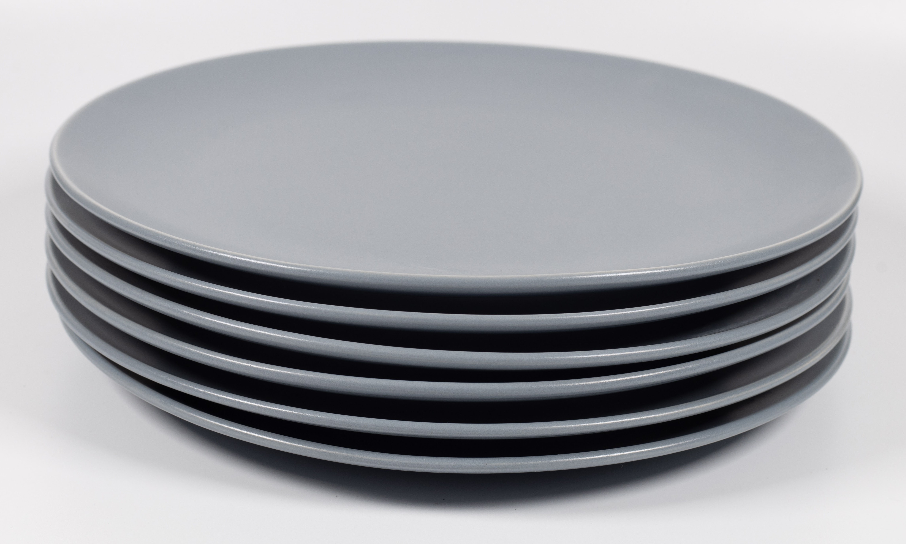

## 2.2.1. Du point de vue utilisateur : interface

!!! info "Définition"
    La **pile** est une structure de données qui permet de stocker des données et d'y accéder. Une pile se comporte comme une **pile d'assiettes** :

    * on ajoute des nouvelles assiettes au sommet de la pile ;
    * quand on veut en retirer une, on est obligé de prendre celle située au sommet.

On parle de mode **LIFO** (Last In, First Out, en anglais, dernier arrivé, premier sorti), c'est-à-dire que le dernier élément ajouté à la structure sera le prochain élément auquel on accédera. Les premiers éléments ayant été ajoutés devront « attendre » que tous les éléments qui ont été ajoutés après eux soient sortis de la pile. Contrairement aux listes, on ne peut donc pas accéder à n'importe quelle valeur de la structure (pas d'index). Pour gérer cette contrainte, on définit le **sommet** de la pile qui caractérise l'emplacement pour ajouter ou retirer des éléments.




L'interface suivante permet de définir le type abstrait de données **pile** : 

* ``creer()``, qui crée une pile vide ;
* ``taille(pile)``, qui permet de connaître le nombre d'éléments contenus dans la pile ;
* ``est_vide(pile)``, qui renvoie vrai si la pile est vide, faux sinon ;
* ``empiler(pile, element)``, qui ajoute un élément au sommet de la pile (qui devient le nouveau sommet) ;
* ``depiler(pile)``, qui retire et renvoie l'élément situé au sommet de la pile (le nouveau sommet devient l'élément qui suivait l'ancien sommet) ;
*  ``sommet(pile)``, qui renvoie l'élément situé au sommet de la pile (sans le retirer).

L'opération d'empilement se dit "push" en anglais, l'opération de dépilement se dit "pop".

!!! example "La pile est utile dans différents types de problèmes :"
    * algorithme d'un navigateur pour pouvoir mémoriser les pages web et revenir en arrière (ou ré-avancer) sur certaines pages ;
    * stocker des actions et les annuler (ou les réappliquer), sur l'ordinateur (fonction CTRL+Z, et CTRL+Y) ;
    * coder une calculatrice en notation polonaise inversée (voir exercices) ;
    * algorithme du parcours en profondeur pour les arbres et les graphes, par exemple, pour résoudre un labyrinthe, trouver un trajet sur une carte... (voir séquence 6) ;
    * écrire des versions itératives de certains algorithmes récursifs (voir séquence 1) ;
    * illustration du fonctionnement de la pile d'appels des fonctions lors de l'exécution d'un programme.

!!! success "Exemple"
    Supposons implémenté le type abstrait **pile**. Nous disposons d'une interface composée des six primitives décrites ci-dessus. On considère une pile ``P`` composée des éléments suivants : 12, 14, 8, 7, 19 et 22 (le sommet de la pile est 22). On exécute le code suivant ligne par ligne :

    ````python title="Code" linenums="1"
        depiler(P)
        empiler(P,42)
        depiler(P)
        taille(P)
        estVide(P)
    ````

    * L'exécution de la ligne 1 renvoie la valeur 22 et la pile est maintenant composée des éléments 12, 14, 8, 7 et 19 ;
    * L'exécution de la ligne 2 place l'élément 42 au sommet de la pile ;
    * L'exécution de la ligne 3 renvoie la valeur 42 et la pile est maintenant à nouveau composée des éléments 12, 14, 8, 7 et 19 ;
    * La ligne 4 renvoie la taille de ``P`` : 5 ;
    * La pile n'est pas vide, on obtient dont ``False``.

## 2.2.2. Du point de vue concepteur : implémentation(s)

### Implémentation avec listes Python

Première solution, on peut implémenter une pile en utilisant des listes Python. Cette solution est très facile car les méthodes ``append`` et ``pop`` des objets de type ``list`` correspondent exactement aux primitives **empiler** et **dépiler** de la structure pile.

````python
"""Implémentation des piles avec des listes Python"""


def creer():
    """Retourne une pile vide"""
    return []


def taille(pile):
    """Retourne le nombre d'éléments de la pile"""
    return len(pile)


def est_vide(pile):
    """Retourne True si la pile est vide, False sinon"""
    return pile == []


def empiler(pile, element):
    """Empile un nouvel élément au sommet de la pile"""
    pile.append(element)


def depiler(pile):
    """Retourne l'élément situé au sommet de la pile
    et le supprime de celle-ci"""
    if not est_vide(pile):
        return pile.pop()
    else:
        return None


def sommet(pile):
    """Retourne l'élément situé au sommet de la pile"""
    if not est_vide(pile):
        return pile[-1]
    else:
        return None

````

Cette implémentation sera testée en exercices.

### Implémentation en POO

Conformément au programme, on se limite à une version **naïve** de la POO. On pourra à titre d'exercice reprendre cette implémentation en respectant les règles plus strictes édictées dans [les compléments de cours sur la POO](../../01_langages/02_POO/POO_complements.md).

On reprend l'idée de **chaînon** utilisée pour les listes.

````python
"""Implémentation du type abstrait pile en POO"""


class Chainon:
    def __init__(self, element=None, suivant=None):
        """element est la valeur du chainon et suivant est le chainon qui suit"""
        self.element = element
        self.suivant = suivant


class Pile:
    def __init__(self):
        """Crée une pile vide"""
        self.summit = Chainon()

    def taille(self):
        """Retourne le nombre d'éléments dans la pile"""
        long = 0
        chainon = self.summit
        while chainon.element is not None:
            chainon = chainon.suivant
            long = long + 1
        return long

    def est_vide(self) -> bool:
        """Retourne True si la pile est vide et False sinon"""
        return self.summit.element is None

    def empiler(self, element):
        """Empile element qu sommet de la pile"""
        self.summit = Chainon(element, self.summit)

    def depiler(self):
        """Retourne l'élément situé au sommet de la pile
        et le supprime de celle-ci"""
        item = self.summit.element
        self.summit = self.summit.suivant
        return item

    def sommet(self):
        """Retourne la valeur du sommet de la pile"""
        return self.summit.element


````

Cette implémentation sera testée en exercices.

!!! bug "Comparaison des deux implémentations"
    On peut comparer en termes de temps d'exécution l'efficacité de ces deux implémentations.

    On utilise pour cela la bibliothèque ``timeit`` présentée dans [cet article](https://www.flallemand.fr/wp/2022/06/05/mesurer-le-temps-dexecution-dun-fragment-de-code/){ target=_blank }.

    Pour cela, on ajoute les lignes suivantes au code de la version "listes Python" :

    ````python
    import timeit

    ma_pile = creer()
    print(timeit.timeit('empiler(ma_pile,1)', number=10000000, globals=globals()))
    ````

    on obtient : 

    ````pycon
    2.2605971000011778
    ````

    et les lignes suivantes au code de la version "POO" :

    ````python
    import timeit

    ma_pile = Pile()
    print(timeit.timeit('ma_pile.empiler(1)', number=10000000, globals=globals()))
    ````

    on obtient : 

    ````pycon
    7.292327400005888
    ````

    On constate donc que la version utilisant les listes Python est beaucoup plus efficace. Cela s'explique notamment car l'implantation avec les listes Python repose sur une programmation avancée et optimisée, contrairement à l'implantation objet qui a été construite sans utiliser de structure externe.

    Néanmoins, on peut montrer que, dans les deux implémentations, les opérations d'empilement et de dépilement sont en $\mathcal{O}(1)$, ce qui signifie que le temps d'exécution ne dépend pas du nombre de données.

    L'utilisation des listes est la plus efficace. Néanmoins, l'implantation objet a pour avantage de montrer et d'assimiler le fonctionnement interne de cette structure. C'est donc un meilleur outil d'apprentissage des concepts.