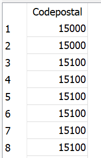

# 2. Le langage SQL

Nous avons étudié la structure d'une base de données relationnelle, nous allons maintenant apprendre à réaliser des **requêtes**, c'est-à-dire que nous allons apprendre à créer une base des données, créer des attributs, ajouter des données, modifier des données et enfin, nous allons surtout apprendre à interroger une base de données afin d'obtenir des informations.

Pour réaliser toutes ces requêtes, nous allons devoir apprendre un langage de requêtes : SQL (Structured Query Language). SQL est propre aux bases de données relationnelles.

Dans ce cours nous allons travailler avec SQLite. SQLite est un système de gestion de base de données relationnelle très répandu. Noter qu'il existe d'autres systèmes de gestion de base de données relationnelle comme MySQL ou PostgreSQL. Dans tous les cas, le langage de requête utilisé est le SQL (même si parfois on peut noter quelques petites différences). Ce qui sera vu ici avec SQLite pourra, à quelques petites modifications près, être utilisé avec, par exemple, MySQL.

Nous allons illustrer chacune des instructions SQL du programme avec la base de donnée [Cantal.db](../../../assets/BDD/Cantal.db) contenant les deux tables "etablissements" et "communes" déjà rencontrées dans la partie précédente, dont voici un extrait (les noms des attributs ont été un peu modifiés (pas d'espaces) ; la copie d'écran est faite à partir de DB Browser for SqLite). De plus, nous avons déplacé l'attribut "Codepostal" de la table "etablissement" vers la table "communes", ce qui est plus cohérent.


**Schéma relationnel** : 

* communes(^^Codecommune^^: INT, Nomdelacommune: TEXT, Populationtotale: INT, Codepostal: INT)
* etablissements(^^code^^: TEXT, nom: TEXT, statut: TEXT, #id_commune: INT, latitude: FLOAT, longitude: FLOAT)


Pour se connecter à cette base de donnée, vous pouvez utiliser le logiciel DB Browser (SqLite) ou bien Edupython (qui propose une version portable du même logiciel)

## 2.1. Requêtes d'interrogation

### Requêtes simples

Quand on désire extraire des informations d'une table, on effectue une **requête d'interrogation** à l'aide du mot clé **SELECT**. Voici un exemple de requête d'interrogation :

````SQL
SELECT Nomdelacommune, Populationtotale
FROM communes
````

Cette requête va nous permettre d'obtenir le nom de la commune et sa population pour toutes les communes présentes dans la table "communes".

Voici le résultat de cette requête dans le logiciel DB Browser for SqLite :


D'une façon générale, le mot clé **SELECT** est suivi par les attributs que l'on désire obtenir. Le mot clé **FROM** est suivi par la table concernée.

Noter qu'il est possible d'obtenir tous les attributs sans être obligé de tous les noter grâce au caractère étoile * :

````SQL
SELECT *
FROM communes
````

est équivalent à :

````SQL
SELECT  Codecommune, Nomdelacommune, Populationtotale, Codepostal
FROM communes
````

### Requêtes conditionnelles

La clause **WHERE** permet d'imposer une (ou des) condition(s) permettant de sélectionner uniquement certaines lignes.

La condition doit suivre le mot-clé **WHERE**.

````SQL
SELECT Nomdelacommune
FROM communes
WHERE Populationtotale > 2500
````

La requête ci-dessus permettra d'afficher le nom des communes dont la population est strictement supérieure à 2500 habitants.


Il est possible de combiner les conditions à l'aide d'un OR ou d'un AND :

````SQL
SELECT Nomdelacommune
FROM communes
WHERE Populationtotale > 2500 AND Populationtotale < 10000
````

Cette requête permet d'obtenir le nom des communes dont la population est comprise entre 2500 et 10000 habitants.


La requête ci-dessous permet d'afficher le nom des communes dont la population est supérieure à 5000 habitants OU dont le nom contient la lettre "Z" (noter le symbole "%" qui remplace n'importe quelle séquence de carcatères en SQL).

````SQL
SELECT Nomdelacommune
FROM communes
WHERE Populationtotale > 5000 OR Nomdelacommune LIKE "%Z%"
````


### Ordonner les résultats

La clause **ORDER BY** permet d'ordonner les résultats dans l'ordre croissant.

````SQL
SELECT Nomdelacommune, Populationtotale
FROM communes
WHERE Populationtotale > 5000 ORDER BY Populationtotale
````

Cette requête affiche le nom et la population des communes de plus de 5000 habitants dans l'ordre croissant de leur population.


Pour ordonner les résultats dans l'ordre décroissant, on ajoute **DESC**.

Si la clause **ORDER BY** porte sur un attribut de type TEXT, on aura un rangement dans l'ordre alphabétique.

````SQL
SELECT Nomdelacommune, Populationtotale
FROM communes
WHERE Populationtotale > 5000 ORDER BY Nomdelacommune DESC
````

Cette requête affiche le nom et la population des communes de plus de 5000 habitants dans l'ordre inverse de l'ordre alphabétique de leur nom.


### Éviter les doublons

Pour éviter les doublons dans les résultats d'une requête, on peut ajouter la clause DISTINCT juste après SELECT.

Considérons par exemple la relation "communes", la requête suivante a pour objectif d'afficher, dans l'ordre croissant, la liste des codes postaux des communes du Cantal :

````SQL
SELECT codepostal
FROM communes
ORDER BY codepostal
````



Nous voyons que les codes postaux sont répétés autant de fois qu'il y a de communes desservies par ce code postal.

La requête suivante, avec la clause DISTINCT, permet de n'afficher qu'une fois chacun des codes postaux considérés :

````SQL
SELECT DISTINCT codepostal
FROM communes
ORDER BY codepostal
````


### Les jointures

Une requête dans une base de donnée peut nécessiter de regrouper des données provenant de différentes tables.

!!! info "Définition"
    Une requête combinant les données de plusieurs relations (tables) est appelée une **jointure**.

Poursuivons avec l'exemple de la base de données des établissements scolaires du Cantal qui comporte deux tables, dont on rappelle ci-dessous le schéma relationnel :

* communes(^^Codecommune^^: INT, Nomdelacommune: TEXT, Populationtotale: INT, Codepostal: INT)
* etablissements(^^code^^: TEXT, nom: TEXT, statut: TEXT, #id_commune: INT, latitude: FLOAT, longitude: FLOAT)


La requête suivante permet d'obtenir la table des noms d'établissements suivis du nom de leur commune. Il faut pour cela **joindre** les informations de la table "etablissements" (pour le nom de l'établissement) avec celles de la table "communes" (pour le nom de la commune). L'élément qui permet cette **jointure** est la **clef étrangère** "id_commune" de la table "etablissements" qui fait référence à la **clef primaire** "Codecommune" de la table "communes".

````sql
SELECT etablissements.nom, communes.Nomdelacommune 
FROM etablissements JOIN communes 
ON etablissements.id_commune = communes.Codecommune
````

Résultat : 


!!! note "Remarque"
    Lorsqu'on effectue une jointure, plusieurs tables sont en jeu. Pour davantage de clarté, il est recommandé de préfixer chaque attribut par le nom de la table dont il provient. On utilise pour cela un point : "etablissements.nom" est l'attribut nommé "nom" de la relation "etablissements".

Il est possible d'ajouter à la suite de la jointure une clause WHERE afin de ne sélectionner que quelques lignes de la table obtenue :

````sql
SELECT etablissements.nom, communes.Nomdelacommune 
FROM etablissements JOIN communes 
ON etablissements.id_commune = communes.Codecommune
WHERE etablissements.nom LIKE "Collège%"
````

Résultat la table de tous les collèges avec leur commune :


## 2.2. Requêtes de mise à jour

### Ajouter une entrée

Pour ajouter une entrée, nous utilisons la clause INSERT.

Supposons par exemple qu'un nouvel établissement soit ouvert à Labrousse (code 85): il s'agit d'un lycée hôtelier public. La requête suivante permet de créer cette nouvelle entrée. Attention, l'ordre des valeurs données doit être strictement le même que l'ordre des attributs cités.

````sql
INSERT INTO etablissements
(code, nom, statut, id_commune, latitude, longitude)
VALUES
("0159999Z", "Lycée hôtelier du Cantal", "Public", 85, 44.8572222, 2.5427778)
````

### Modifier une entrée existante

Pour modifier un ou plusieurs attributs d'un p-uplet existant, on utilise la clause UPDATE.

Supposons par exemple que le nouveau lycée soit en fait un lycée Privé et que son code soit "0158888Z" :

````sql
UPDATE etablissements
SET code="0158888Z", statut="Privé"
WHERE code="0159999Z"
````

La clause WHERE permet de spécifier le ou les p-uplets à modifier.

### Supprimer une entrée

Pour supprimer un p-uplet, on utilise la clause DELETE.

Finalement, le projet de lycée hôtelier est abandonné : 

````sql
DELETE FROM etablissements
WHERE code="0158888Z"
````

!!! danger "Attention !"
    La requête DELETE, sans clause WHERE, supprimera tous les p-uplets de la relation !

## 2.3. Quelques compléments

Le langage SQL propose aussi des **fonctions d'agrégation** permettant de faire quelques calculs à partir des données d'une table. En voici quelques exemples.

### Calculer une somme

Par exemple, la somme des populations de toutes les communes du Cantal :

````sql
SELECT SUM(Populationtotale)
FROM communes
````

Résultat : 149 664.

### Calculer une moyenne

Par exemple, la population moyenne des communes du Cantal dont le code postal est 15250 (AVG = average):

````sql
SELECT AVG(Populationtotale)
FROM communes
where Codepostal=15250
````

Résultat : 1 099, 67

### Calculer un minimum ou un maximum

Les fonctions MIN et MAX fonctionnent de la même façon.

Quel est le nom et la population de la commune du Cantal la moins peuplée ?

````sql
SELECT Nomdelacommune, Populationtotale
FROM communes
WHERE Populationtotale = (SELECT MIN(Populationtotale) FROM communes)
````

Résultat : VALJOUZE, 23 habitants.

!!! note "Remarque"
    Ce dernier exemple est un peu plus compliqué que les précédents : on a en effet imbriqué deux requêtes l'une dans l'autre : on parle de requêts **composées**. La requête "SELECT MIN(Populationtotale) FROM communes" située entre parenthèses retourne la valeur minimale des populations de toutes les communes. On demande ensuite le nom de la ou des communes dont la population est cette valeur minimale. Prenez le temps de bien comprendre cet exemple.

### Compter des données

La fonction COUNT permet de compter des données.

Combien y a-t-il d'établissements scolaires dans le Cantal ?

````sql
SELECT COUNT(*)
FROM etablissements
````

Résultat : 203

Combien de communes possèdent le code postal 15250 ?

````sql
SELECT COUNT(*)
FROM communes
WHERE Codepostal=15250
````

Résultat : 9

Combien de noms d'établissements différents parmi les établissements scolaires ?

````sql
SELECT COUNT(DISTINCT nom)
FROM etablissements
````

Résultat : 88

À quelle question répond la requête suivante ?

````sql
SELECT COUNT(*)
FROM etablissements JOIN communes 
ON etablissements.id_commune=communes.Codecommune
WHERE (etablissements.nom LIKE "Collège%") AND communes.Nomdelacommune="AURILLAC"
````

??? success "Réponse"
    Combien y a-t-il de collèges à Aurillac ? Réponse : 5.

!!! example "Pour compléter ..."
    * Excellentes vidéos sur Lumni :

        * [Qu'est-ce qu'une base de données relationnelle ?](http://www.lumni.fr/video/qu-est-ce-qu-une-base-de-donnees-relationnelle){ target=_blank }
        * [Interrogation d'une base de données relationnelle](http://www.lumni.fr/video/interrogation-d-une-base-de-donnees-relationnelle){ target=_blank }

