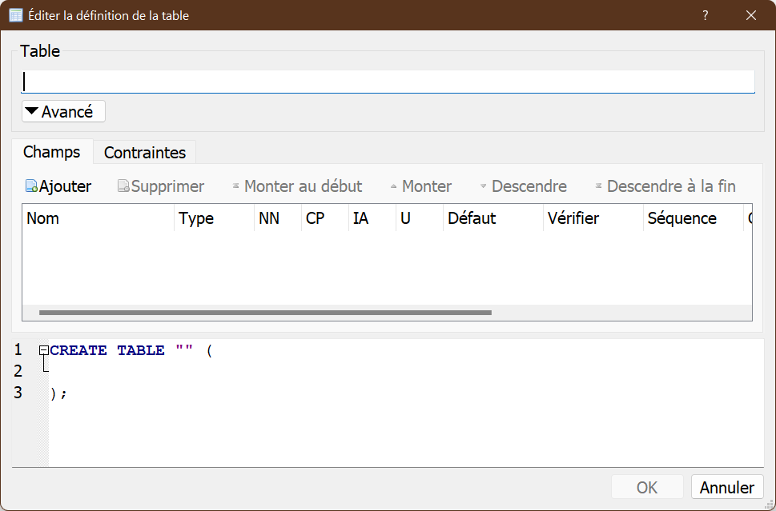
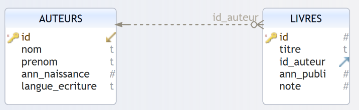

!!! success "Objectifs"
    Utiliser le logiciel "DB Browser for SqLite" et le langage SQL pour :

    * [ ] créer une base de données ;
    * [ ] ajouter des données dans une table ;
    * [ ] écrire et tester différentes requêtes.

## 1. Création d'une BDD et insertion de valeurs

Pour créer une base de données et effectuer des requêtes sur cette dernière, nous allons utiliser le logiciel "DB Browser for SQLite" : [https://sqlitebrowser.org/](https://sqlitebrowser.org/){ target=_blank }. Ce logiciel est intégré dans EduPython.

1. Ouvrez le logiciel, puis cliquez sur "Nouvelle base de données". Après avoir choisi un nom pour votre base de données (par exemple "db_livres.db"), vous devriez avoir la fenêtre suivante :

    

    Cliquez alors sur "Annuler".

    Une nouvelle base de donnée a bien été créée, mais elle ne contient encore aucune table.

    

2. Pour créer une table, cliquez sur l'onglet "Exécuter le SQL". On obtient alors :

    

    Copiez-collez le texte ci-dessous dans la fenêtre "SQL 1" :

    ```sql
    CREATE TABLE LIVRES
        (id INT, titre TEXT, auteur TEXT, ann_publi INT, note INT, PRIMARY KEY (id));
    ```

    Cliquez ensuite sur le petit triangle situé au-dessus de la fenêtre SQL 1 (ou appuyez sur F5), vous devriez avoir ceci :

    

    Comme indiqué dans la fenêtre, "Requête exécutée avec succès" !

    Quelques explications : la commande  **CREATE TABLE LIVRES** permet de créer une nouvelle table nommée "LIVRES". Elle est suivie d'un p-uplet définissant les noms et les domaines des attributs de la nouvelle table :

    - **id** est un entier ;
    - **titre** est une chaîne de caractères ;
    - **auteur** est une chaîne de caractères ;
    - **ann_pulbi** est un entier ;
    - **note** est un entier ;

    L'attribut "id" va jouer le rôle de **clé primaire**, nous avons donc ajouté dans la requête la mention **(PRIMARY KEY (id))**. Le système de gestion de base de données nous avertira si l'on tente d'attribuer 2 fois la même valeur à l'attribut "id".

3. Nous allons maintenant ajouter des données à la table **LIVRES**.

    Toujours dans l'onglet "Exécuter le SQL", après avoir effacé la fenêtre SQL 1, copiez-collez dans cette même fenêtre la requête ci-dessous :

    ```sql
    INSERT INTO LIVRES
        (id,titre,auteur,ann_publi,note)
        VALUES
        (1,"1984","Orwell",1949,10),
        (2,"Dune","Herbert",1965,8),
        (3,"Fondation","Asimov",1951,9),
        (4,"Le meilleur des mondes","Huxley",1931,7),
        (5,"Fahrenheit 451","Bradbury",1953,7),
        (6,"Ubik","K.Dick",1969,9),
        (7,"Chroniques martiennes","Bradbury",1950,8),
        (8,"La nuit des temps","Barjavel",1968,7),
        (9,"Blade Runner","K.Dick",1968,8),
        (10,"Les Robots","Asimov",1950,9),
        (11,"La Planète des singes","Boulle",1963,8),
        (12,"Ravage","Barjavel",1943,8),
        (13,"Le Maître du Haut Château","K.Dick",1962,8),
        (14,"Le monde des Ā","Van Vogt",1945,7),
        (15,"La Fin de l'éternité","Asimov",1955,8),
        (16,"De la Terre à la Lune","Verne",1865,10);
    ```

    Un message devrait vous préciser que votre requête a été exécutée avec succès :

    

    La table LIVRES contient maintenant les données souhaitées (onglet "Parcourir les données") :

    

4. Saisissez et exécutez la requête SQL suivante :

    ```sql
    SELECT id, titre, auteur, ann_publi, note
    FROM LIVRES
    ```

    Après un temps plus ou moins long, vous devriez voir s'afficher ceci :

    

5. Effectuez une requête qui permettra d'obtenir le titre et l'auteur de tous les livres présents dans la table LIVRES.

6. Saisissez et testez la requête SQL suivante :

    ```sql
    SELECT titre, ann_publi
    FROM LIVRES
    WHERE auteur='Asimov'
    ```

    À quelle question répond-elle ?

7. Écrivez et testez une requête permettant d'obtenir uniquement les titres des livres écrits par Philip K.Dick.

8. Saisissez et testez la requête SQL suivante :

    ```sql
    SELECT titre, ann_publi
    FROM LIVRES
    WHERE auteur='Asimov' AND ann_publi>1953
    ```

    À quelle question répond-elle ?

9. Écrivez une requête permettant d'obtenir les titres des livres publiés après 1945 qui ont une note supérieure ou égale à 9.

10. Écrivez une requête SQL permettant d'obtenir les titres et les années de publication des livres de K.Dick classés du plus ancien ou plus récent.

## 2. Avec deux tables

Dans la première partie, nous avons une redondance d'information dans l'attribut **auteur**, un même auteur étant répété plusieurs fois. Pour remédier à cela, nous allons maintenant créer une nouvelle base avec deux tables **AUTEURS** et **LIVRES** reliées par une **clef étrangère**.



1. Créez une nouvelle base de données que vous nommerez par exemple **db_livres_auteurs.db**, puis créez une table AUTEURS à l'aide de la requête SQL suivante :

    ```sql
    CREATE TABLE AUTEURS
    (id INT, nom TEXT, prenom TEXT, ann_naissance INT, langue_ecriture TEXT, PRIMARY KEY (id));
    ```

    Créez ensuite une deuxième table (LIVRES) :

    ```sql
    CREATE TABLE LIVRES
    (id INT, titre TEXT, id_auteur INT, ann_publi INT, note INT, PRIMARY KEY (id), FOREIGN KEY (id_auteur) REFERENCES AUTEURS(id));
    ```

    Dans la création de la table **LIVRES**, nous avons précisé que l'attribut "id_auteur" jouera le rôle de **clé étrangère** : liaison entre "id_auteur" de la table  LIVRES et "id" de la table AUTEURS (FOREIGN KEY (id_auteur) REFERENCES AUTEURS(id)).

3. Ajoutez des données à la table AUTEURS à l'aide de la requête SQL suivante :

    ```sql
    INSERT INTO AUTEURS
    (id,nom,prenom,ann_naissance,langue_ecriture)
    VALUES
    (1,"Orwell","George",1903,"anglais"),
    (2,"Herbert","Frank",1920,"anglais"),
    (3,"Asimov","Isaac",1920,"anglais"),
    (4,"Huxley","Aldous",1894,"anglais"),
    (5,"Bradbury","Ray",1920,"anglais"),
    (6,"K.Dick","Philip",1928,"anglais"),
    (7,"Barjavel","René",1911,"français"),
    (8,"Boulle","Pierre",1912,"français"),
    (9,"Van Vogt","Alfred Elton",1912,"anglais"),
    (10,"Verne","Jules",1828,"français");
    ```

    Ajoutez des données à la table LIVRES à l"aide de la requête SQL suivante :

    ```sql
    INSERT INTO LIVRES
    (id,titre,id_auteur,ann_publi,note)
    VALUES
    (1,"1984",1,1949,10),
    (2,"Dune",2,1965,8),
    (3,"Fondation",3,1951,9),
    (4,"Le meilleur des mondes",4,1931,7),
    (5,"Fahrenheit 451",5,1953,7),
    (6,"Ubik",6,1969,9),
    (7,"Chroniques martiennes",5,1950,8),
    (8,"La nuit des temps",7,1968,7),
    (9,"Blade Runner",6,1968,8),
    (10,"Les Robots",3,1950,9),
    (11,"La Planète des singes",8,1963,8),
    (12,"Ravage",7,1943,8),
    (13,"Le Maître du Haut Château",6,1962,8),
    (14,"Le monde des Ā",9,1945,7),
    (15,"La Fin de l'éternité",3,1955,8),
    (16,"De la Terre à la Lune",10,1865,10);
    ```

4. Saisissez et testez la requête SQL suivante :

    ```sql
    SELECT titre,nom, prenom
    FROM LIVRES JOIN AUTEURS 
    ON LIVRES.id_auteur = AUTEURS.id
    ```

    **Remarque** : attention, si un même nom d'attribut est présent dans les 2 tables (par exemple ici l'attribut id), il est nécessaire d'ajouter le nom de la table devant afin de pouvoir les distinguer (AUTEURS.id et LIVRES.id).

5. Écrivez une requête SQL permettant d'obtenir les titres des livres publiés après 1945 ainsi que le nom de leurs auteurs.

6. On souhaite ajouter à la base le livre de **Arthur C.Clarke** intitulé **2001 : L'Odyssée de l'espace** publié en **1968** et noté **7**. **Arthur C.Clarke** est un écrivain britannique né en 1917 et mort en 2008.

    Écrivez les requêtes nécessaires à cet ajout. Vous n'oublierez pas de définir les clefs primaires pour chacune des nouvelles entrées.

7. Écrivez et testez une requête permettant d'attribuer la note de 10 à tous les livres écrits par Asimov publiés après 1950.

8. Écrivez une requête permettant de supprimer les livres publiés avant 1945. Testez cette requête.

