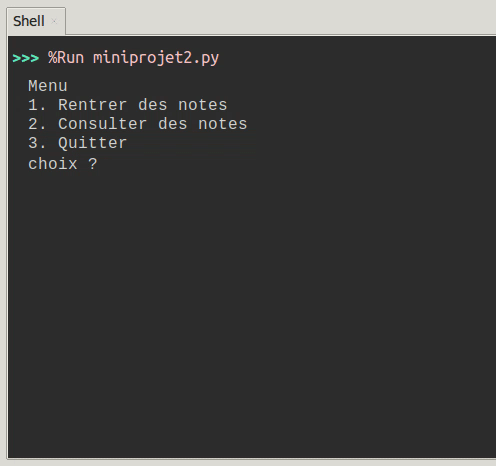

Dans ce TP, Nous allons créer et interroger une base de données ```sqlite``` avec le module ```sqlite3```  de Python.

## Création d'une table 

```python
import sqlite3

#Connexion
connexion = sqlite3.connect('mynewbase.db')

#Récupération d'un curseur
c = connexion.cursor()

# ---- début des instructions SQL

#Création de la table
c.execute("""
    CREATE TABLE IF NOT EXISTS bulletin(
    Nom TEXT,
    Prénom TEXT,
    Note INT);
    """)

# ---- fin des instructions SQL

#Validation
connexion.commit()


#Déconnexion
connexion.close()

``` 

- Le fichier ```mynewbase.db``` sera créé dans le même répertoire que le fichier source Python. Si le fichier existe déjà, il est ouvert et peut être modifié.
- ```IF NOT EXISTS``` assure de ne pas écraser une table existante qui porterait le même nom. Si une telle table existe, elle n'est alors pas modifiée.
- La nouvelle table peut être ouverte avec ```DB Browser``` pour vérifier sa structure et ses données.

## Insertion d'enregistrements dans la table

Les morceaux de code ci-dessous sont à positionner entre les balises ```# ---- début des instructions SQL```  et ```# ---- fin des instructions SQL```.

### Insertion d'un enregistrement unique

```python
c.execute('''INSERT INTO bulletin VALUES ('Simpson', 'Bart', 17)''')
``` 

Pensez à vérifier avec  ```DB Browser``` si les modifications sont effectives.

### Insertion d'un enregistrement unique avec variable

```python
data = ('Simpson', 'Maggie', 2)
c.execute('''INSERT INTO bulletin VALUES (?,?,?)''', data)
``` 

### Insertion de multiples enregistrements

```python
lst_notes = [ ('Simpson', 'Lisa', 19), ('Muntz', 'Nelson', 4), ('Van Houten', 'Milhouse', 12) ]

c.executemany('''INSERT INTO bulletin VALUES (?, ?, ?)''', lst_notes)
``` 
Les différentes valeurs sont stockées au préalable dans une liste de tuples.

### Mini-projet 1

Créer un programme qui demande à l'utilisateur un nom et une note, en boucle. Les résultats sont stockés au fur et à mesure dans une base de données. Si le nom est égal à «Q» ou «q», le programme s'arrête.

### Exemple d'injection SQL

L'injection SQL est une technique consistant à écrire du code SQL à un endroit qui n'est pas censé en recevoir.

- Créez un fichier contenant le code suivant :
```python
import sqlite3

#Connexion
connexion = sqlite3.connect('mabasecobaye.db')

#Récupération d'un curseur
c = connexion.cursor()

c.execute("""
    CREATE TABLE IF NOT EXISTS notes(
    Nom TEXT,
    Note INT);
    """)

while True :
    nom = input('Nom ? ')
    if nom in ['Q','q'] :
        break
    note = input('Note ? ')
    data = (nom, note)
    p = "INSERT INTO notes VALUES ('" + nom + "','" + note + "')"

    c.executescript(p)

#Validation
connexion.commit()

#Déconnexion
connexion.close()
``` 

- Exécutez ce fichier, rentrez quelques valeurs, quittez, et ouvrez dans ```DB Browser``` la table ```notes``` pour bien vérifier que vos valeurs ont bien été stockées.
- Lancez à nouveau le fichier, en donnant ensuite comme nom la chaîne de caractères suivante : 
```g','3'); DROP TABLE notes;--``` 
- Donnez une note quelconque (par exemple 12), quittez le programme... et allez observer l'état de la base de données. La table  ```notes``` n'existe plus !

**Explication** :  
La requête qui a été formulée est ```INSERT INTO notes VALUES ('g','3'); DROP TABLE notes;--','12')``` 

Dans un premier temps, le couple ```('g','3')``` a été inséré.  
Puis l'ordre a été donné de détruire la table ```notes```.  
Le reste du code (qui n'est pas correct) est ignoré car ```--``` est le symbole du commentaire en SQL (l'équivalent du # de Python).  

**Remarques** :  
Évidemment, ce code a été fait spécifiquement pour être vulnérable à l'injection SQL. Il suffit d'ailleurs de remplacer le ```c.executescript(p)``` par ```c.execute(p)``` pour que le code reste fonctionnel mais refuse l'injection SQL. 
Ceci dit, de nombreux serveurs sont encore attaqués par cette technique, au prix de manipulations bien sûr plus complexes que celles que nous venons de voir.

Rappelons enfin que ce genre de pratiques est interdit sur un serveur qui ne vous appartient pas.


## Lecture des enregistrements

```python
import sqlite3

#Connexion
connexion = sqlite3.connect('mynewbase.db')

#Récupération d'un curseur
c = connexion.cursor()

data = ('Simpson', )

c.execute("SELECT Prénom FROM Bulletin WHERE Nom = ?", data)
print(c.fetchall())  


#Déconnexion
connexion.close()
``` 

Ce code renvoie ```[('Homer',), ('Lisa',), ('Maggie',)]```, ou une liste vide s'il n'y a pas de résultat à la requête.

### Mini-projet 2

Reprendre le mini-projet précédent, en rendant possible à l'utilisateur de rentrer des notes ou bien de les consulter.

*Exemple :*




## Références

[^1]: Cette page est directement issue de [cette page](https://glassus.github.io/terminale_nsi/T4_Bases_de_donnees/4.2_Langage_SQL/03_python_et_SQL/#2-lecture-des-enregistrements) du site de Gilles Lassus.

