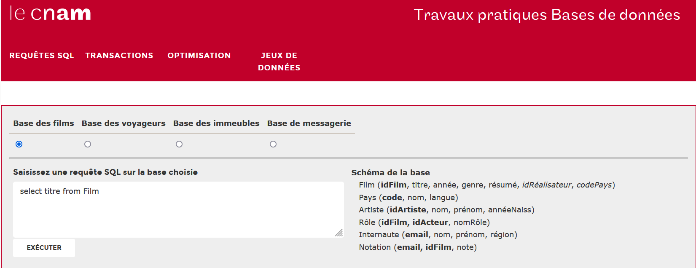

_Les exercices précédés du symbole :fontawesome-solid-computer: sont à faire sur machine, en sauvegardant le fichier si nécessaire._

_Les exercices précédés du symbole :octicons-pencil-16: doivent être résolus par écrit._


## :octicons-pencil-16: Exercice 1

Voici un extrait d'une relation référençant des films :

|id|titre|realisateur|ann_sortie|note_sur_10|
|--- |--- |--- |--- |--- |
|1|Alien, le huitième passager|Scott|1979|10|
|2|Dune|Lynch|1985|5|
|3|2001 : l'odyssée de l'espace|Kubrick|1968|9|
|4|Blade Runner|Scott|1982|10|

Listez les différents attributs de cette relation. Donnez le domaine de chaque attribut.

Pour chaque attribut dire si cet attribut peut jouer le rôle de clé primaire, vous n'oublierez pas de justifier vos réponses.

------------------------------------------------

## :octicons-pencil-16: Exercice 2

Un ski-club utilise une base de données constituée de 2 tables :

- une table ADHERENTS
- une table STATIONS 

Dans la table ADHERENTS  on trouve un attribut "ref_station" qui permet de connaître les stations de ski préférées des adhérents.

Table ADHERENTS

| num_licence | nom    | prenom  | annee_naissance | ref_station |
| ----------- | ------ | ------- | --------------- | ----------- |
| 12558       | Doe    | John    | 1988            | 5           |
| 13668       | Vect   | Alice   | 1974            | 6           |
| 1777        | Dect   | Bob     | 1967            | 3           |
| 13447       | Beau   | Tristan | 1999            | 4           |
| 1141        | Pabeau | John    | 1975            | 3           |

table STATIONS

| ref | nom              | altitude_max |
| --- | ---------------- | ------------ |
| 3   | Le grand Bornand | 2050         |
| 4   | La clusaz        | 2616         |
| 5   | Flaine           | 2510         |
| 6   | Avoriaz          | 2466         |

1. Comment appelle-t-on l'attribut ref_station de la table ADHERENTS ?
2. Écrire la requête SQL permettant d'obtenir le nom des stations ayant une altitude maxi strictement supérieure à 2500 m.
3. Écrire une requête SQL permettant d'obtenir le numéro de licence des adhérents nés après 1980 et ayant pour prénom John.
4. Donnez le résultat de la requête SQL suivante :

```sql
SELECT nom 
FROM ADHERENTS 
WHERE num_licence > 2000 OR  ref_station = 3
```
5. Donnez le résultat de la requête SQL suivante :

```sql
SELECT STATIONS.nom
FROM STATIONS
INNER JOIN ADHERENTS ON ADHERENTS.ref_station = STATIONS.ref
WHERE annee_naissance > 1975
```

-----------------------------------------------------------------

## :octicons-pencil-16: Exercice 3 : Exercices tirés des annales

1. [Métropole 2022 Jour 1](../../assets/pdf/2022_Metropole_Jour1.pdf){ target=_blank } : Exercice 2.
2. [Métropole 2022 Jour 2](../../assets/pdf/2022_Metropole_Jour2.pdf){ target=_blank } : Exercice 4.
1. [Amérique du Nord 2022 Jour 1](../../assets/pdf/2022_AmeriqueDuNord_1.pdf){ target=_blank } : Exercice 1.
1. [Amérique du Nord 2022 Jour 2](../../assets/pdf/2022_AmeriqueDuNord_2.pdf){ target=_blank } : Exercice 3.
1. [Centres étrangers 2022 Jour 1](../../assets/pdf/2022_CentresEtrangers_1.pdf){ target=_blank } : Exercice 4.
1. [Centres étrangers 2022 Jour 2](../../assets/pdf/2022_CentresEtrangers_2.pdf){ target=_blank } : Exercice 3.

Et pour s'entraîner, beaucoup d'[autres exercices dans les annales](../annales.md).

----------------------------------------------------------------

## :fontawesome-solid-computer: Exercice 4

Le CNAM (Conservatoire National des Arts et Métiers) propose en ligne des travaux pratiques sur une base de données concernant les films de cinéma. À titre d'entraînement, ouvrir cet exerciseur (cliquer sur l'image ci-dessous) et essayer de formuler les requêtes correspondant aux suggestions de la colonne de droite. Les réponses sont disponibles sur le site, mais prenez le temps de chercher, d'essayer, et de vous corriger.

[](https://deptfod.cnam.fr/bd/tp/){ target=_blank }

