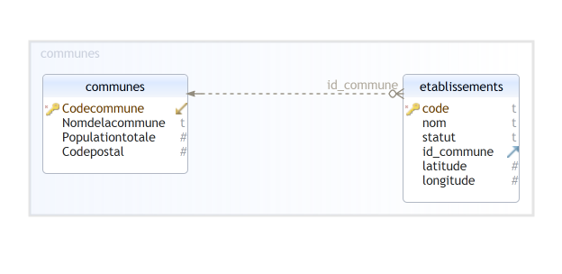

# S3 - Bases de données - L'essentiel

## 1. Modèle relationnel

### 1.1. Introduction

!!! info "Définition"
    Une base de données est ensemble d'informations structurées mémorisées sur un support persistant.

Pour organiser et structurer ces données, un système de fichiers CSV est insuffisant. On utilise plutôt un **Système de Gestion de Bases de Données** (**SGBD**) qui assure les fonctionnalités suivantes : 

!!! info "Définition"

    Un **Système de Gestion de Bases de Données** (**SGBD**) est un système informatique qui assure la gestion de l'ensemble des informations stockées dans une base de données. Il prend en charge, notamment, les deux grandes fonctionnalités suivantes:

    * Accès aux fichiers de la base, garantissant leur intégrité, contrôlant les opérations concurrentes, optimisant les recherches et mises à jour.
    * Interactions avec les applications et utilisateurs, grâce à des langages d'interrogation et de manipulation à haut niveau d'abstraction.

Un SGBD est basé sur une architecture client/serveur.

!!! note "Définitions"

    **Programme serveur**. Un SGBD est instancié sur une machine sous la forme d'un programme serveur qui gère une ou plusieurs bases de données, chacune constituée de fichiers stockés sur disque. Le programme serveur est seul responsable de tous les accès à une base, et de l'utilisation des ressources (mémoire, disques) qui servent de support à ces accès.

    **Clients (programmes)**. Les programmes (ou applications) clients se connectent au programme serveur via le réseau, lui transmettent des **requêtes** et reçoivent des données en retour. Ils ne disposent d'aucune information directe sur la base.

Les programmes clients interrogent la base de données en utilisant le langage de requêtes SQL.

### 1.2. Le modèle relationnel

!!! note "Définition"
    Le modèle relationnel est une manière de modéliser les relations existantes entre plusieurs informations, et de les ordonner entre elles

**Relation**

:   ou **Table** tableau composé d'une en-tête (première ligne) et d'un corps. Le corps contient les données sous la forme de p-uplets.

**Attribut**

:   colonne d'une relation, chaque élément d'un p-uplet est une valeur d'un attribut, un attribut est nommé : son intitulé se trouve dans la ligne d'en-tête. Les valeurs d'un attribut appartiennent à un **domaine** de valeurs spécifié.

!!! bug "Règles à respecter"
    Dans une relation, il est nécessaire de respecter les deux règles ci-dessous :

    * les valeurs des attributs doivent être **atomiques**, c'est-à-dire d'un type simple et non d'un type construit (pas de listes, de tableaux, de p-uplets, ...) ;
    * il n'y a pas de doublons : les p-uplets sont tous différents.

**Clef primaire**

:   Dans une relation, une **clef primaire** est un attribut (ou un groupes d'attributs) qui définit de manière unique chacun de p-uplets.

**Clef étrangère**

:   Soient deux relations $R$ et $S$ de clefs primaires respectives $c_R$ et $c_S$.

    Une **clef étrangère** de $S$ dans $R$ est un attribut $ce$ de $R$ dont la valeur est toujours égale exactement à une des valeurs de $c_S$.

    Autrement dit, $ce$ correspond à un et un seul p-uplet de $S$.

!!! bug "Contraintes liées au clefs"

    * **Contrainte d'unicité**: une valeur de clef ne peut apparaître qu'une fois dans une relation.
    * **Contrainte d'intégrité référentielle** : la valeur d'une clef étrangère doit toujours être également une des valeurs de la clef référencée.

**Schéma relationnel**

Le schéma relationnel d'une base de données contient les informations suivantes : 

* Les noms des différentes relations ;
* pour chaque relation, la liste des attributs avec leur domaine respectif ;
* pour chaque relation, la clef primaire et éventuellement les clefs étrangères

Exemple :

* ETABLISSEMENTS(^^code^^: TEXT, nom: TEXT, statut: TEXT, codepostal: INT, #id_commune: INT, latitude: FLOAT, longitude: FLOAT)
* COMMUNES(^^Code commune^^: INT, Nom de la commune: TEXT, Population totale: INT)

On peut le représenter graphiquement

