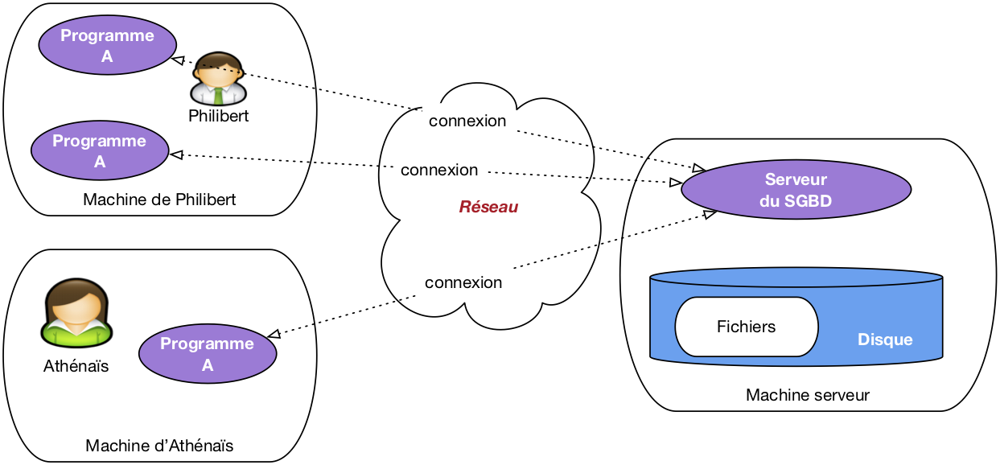

# Introduction

Une **donnée** est valeur numérisée décrivant de manière élémentaire un fait, une mesure, une réalité

_Exemple_ : le nom de l'auteur, l'âge du capitaine, le titre du livre ...

Les données décrivent des entités du monde réel, elles-mêmes **associées** les unes aux autres.

_Exemple_ : Nicolas Bouvier est un écrivain suisse auteur de récit de voyage culte "l'usage du monde" paru en 1963 : deux entités, liées par la notion d'auteur.

Une base de données est un ensemble (potentiellement volumineux, mais pas forcément) de telles informations conformes à une structure pré-définie au moment de la conception, avec, de plus, une caractéristique essentielle : on souhaite les mémoriser de manière persistante. La persistance désigne la capacité d'une base à exister indépendamment des applications qui la manipulent, ou du système qui l'héberge. On peut arrêter toutes les machines un soir, et retrouver la base de données le lendemain. Cela implique qu'une base est toujours stockée sur un support comme les disques magnétiques qui préservent leur contenu même en l'absence d'alimentation électrique.

On arrive donc à la définition suivante : 

!!! info "Définition"
    Une base de données est ensemble d'informations structurées mémorisées sur un support persistant.

Un fichier de base de données a nécessairement une structure qui permet d'une part de distinguer les données les unes des autres, et d'autre part de représenter leurs liens.

Prenons l'exemple des fichiers CSV, l'une des structures les plus simples et les plus répandues, sur lesquels nous avons [travaillé en première](../../../premiere/07_tables/tables_cours.md). Dans un fichier CSV, les données élémentaires sont représentées par des « **champs** » délimités par des virgules ou des points-virgule. Les champs sont associés les uns aux autres par le simple fait d'être placés dans une même ligne. Les lignes en revanche sont indépendantes les unes des autres. On peut placer autant de lignes que l'on veut dans un fichier, et même changer leur ordre sans que cela modifie en quoi que ce soit l'information représentée.

Voici l'exemple de nos données, représentées en CSV.

```` title='CSV'
"Bouvier" ; "Nicolas"; "L'usage du monde" ; 1963
````

On comprend bien que le premier champ est le nom, le second le prénom, etc. Il paraît donc cohérent d'ajouter de nouvelles lignes comme:

```` title='CSV'
"Bouvier"   ; "Nicolas"; "L'usage du monde" ; 1963
"Stevenson" ; "Robert-Louis"  ; "Voyage dans les Cévennes avec un âne" ; 1879
````

On a donné une structure régulière à nos informations, ce qui va permettre de les interroger et de les manipuler avec précision. On les stocke dans un fichier sur disque, et nous sommes donc en cours de constitution d'une véritable base de données. On peut en fait généraliser ce constat: une base de données est toujours un ensemble de fichiers, stockés sur une mémoire externe comme un disque, dont le contenu obéit à certaines règles de structuration.

Peut-on se satisfaire de cette solution et imaginer que nous pouvons construire des applications en nous appuyant directement sur des fichiers structurés, par exemple des fichiers CSV ? C'est la méthode illustrée par la figure ci-dessous. Dans une telle situation, chaque utilisateur applique des programmes au fichier, pour en extraire des données, pour les modifier, pour les créer.


Cette approche soulève de nombreuses difficultés, parmi lesquelles : 

* _Lourdeur d'accès aux données_. En pratique, pour chaque accès, même le plus simple, il faudrait écrire un programme adapté à la structure du fichier. La production et la maintenance de tels programmes seraient extrêmement coûteuses.
* _Risques élevés pour l'intégrité et la sécurité_. Si tout programmeur peut accéder directement aux fichiers, il est impossible de garantir la sécurité et l'intégrité des données. Quelqu'un peut très bien par exemple, en toute bonne foi, faire une fausse manœuvre qui rend le fichier illisible.
* _Pas de contrôle de concurrence_. Dans un environnement où plusieurs utilisateurs accèdent aux même fichiers, comme illustré par exemple sur la Fig. 1, des problèmes de concurrence d'accès se posent, notammment pour les mises à jour. Comment gérer par exemple la situation où deux utilisateurs souhaitent en même temps ajouter une ligne au fichier?
* _Performances_. Tant qu'un fichier ne contient que quelques centaines de lignes, on peut supposer que les performances ne posent pas de problème, mais que faire quand on atteint les Gigaoctets (1,000 Mégaoctets), ou même le Téraoctet (1,000 Gigaoctets)? Maintenir des performances acceptables suppose la mise en œuvre d'algorithmes ou de structures de données demandant des compétences très avancées, probablement hors de portée du développeur d'application qui a, de toute façon, mieux à faire.

Pour surmonter ces problèmes des systèmes complexes capable d'offrir à la fois un accès simple, sécurisé, performant au contenu d'une base, et d'accomplir le tour de force de satisfaire de tels accès pour des dizaines, centaines ou même milliers d'utilisateurs simultanés, le tout en garantissant l'intégrité de la base même en cas de panne sont mis en place. De tels systèmes sont appelés **Systèmes de Gestion de Bases de Données**, **SGBD** en bref.

!!! info "Définition"

    Un **Système de Gestion de Bases de Données** (**SGBD**) est un système informatique qui assure la gestion de l'ensemble des informations stockées dans une base de données. Il prend en charge, notamment, les deux grandes fonctionnalités suivantes:

    * Accès aux fichiers de la base, garantissant leur intégrité, contrôlant les opérations concurrentes, optimisant les recherches et mises à jour.
    * Interactions avec les applications et utilisateurs, grâce à des langages d'interrogation et de manipulation à haut niveau d'abstraction.

Avec un SGBD, les applications n'ont plus jamais accès directement aux fichiers, et ne savent d'ailleurs même pas qu'ils existent, quelle est leur structure et où ils sont situés. L'architecture classique est celle illustrée par la figure ci-dessous. Le SGBD apparaît sous la forme d'un **serveur**, c'est-à-dire d'un processus informatique prêt à communiquer avec d'autres (les « **clients** ») via le réseau. Ce serveur est hébergé sur une machine (la « machine serveur ») et est le seul à pouvoir accéder aux fichiers contenant les données, ces fichiers étant le plus souvent stockés sur le disque de la machine serveur.



Les applications utilisateurs, maintenant, accèdent à la base via le programme serveur auquel elles sont connectés. Elles transmettent des commandes (d'où le nom « d'applications clientes ») que le serveur se charge d'appliquer. Ces applications bénéficient donc des puissants algorithmes implantés par le SGBD dans son serveur, comme par exemple la capacité à gérer les accès concurrents, où à satisfaire avec efficacité des recherches portant sur de très grosses bases.

Cette architecture est à peu près universellement adoptée par tous les SGBD. Les notions suivantes, et le vocabulaire associé, sont donc très importantes à retenir.

!!! note "Définitions"

    **Programme serveur**. Un SGBD est instancié sur une machine sous la forme d'un programme serveur qui gère une ou plusieurs bases de données, chacune constituée de fichiers stockés sur disque. Le programme serveur est seul responsable de tous les accès à une base, et de l'utilisation des ressources (mémoire, disques) qui servent de support à ces accès.

    **Clients (programmes)**. Les programmes (ou applications) clients se connectent au programme serveur via le réseau, lui transmettent des **requêtes** et reçoivent des données en retour. Ils ne disposent d'aucune information directe sur la base.

Le fait que le serveur de données s'interpose entre les fichiers et les programmes clients a une conséquence extrêmement importante: ces clients, n'ayant pas accès aux fichiers, ne voient les données que sous la forme que veut bien leur présenter le serveur. Ce dernier peut donc choisir le mode de représentation qui lui semble le plus approprié : pour nous, ce sera sous forme de **tables** et nous parlerons alors de **modèle relationnel**.

Une des propriétés les plus importantes des SGBD est donc la distinction entre plusieurs niveaux d'abstraction pour la représentation des données : le niveau logique et le niveau physique.

!!! note "Définition"

    * Le **niveau physique** est celui du codage des données dans des fichiers stockés sur disque.
    * Le **niveau logique** est celui de la représentation les données dans des structures abstraites, proposées aux applications clientes, obtenues par conversion du niveau physique (pour nous ce sont des structures en tables)

La figure ci-dessous illustre les niveaux d'abstraction dans l'architecture d'un système de gestion de données. Les programmes clients ne voient que le niveau logique, c'est-à-dire des tables. Le serveur est en charge du niveau physique, de la conversion des données vers le niveau logique, et de toute la machinerie qui permet de faire fonctionner le système: mémoire, disques, algorithmes et structures de données. Tout cela est, encore une fois, invisible (et c'est tant mieux) pour les programmes clients qui peuvent se concentrer sur l'accès à des données présentées le plus simplement possible.


Précisions que les niveaux sont en grande partie indépendants, dans le sens où l'on peut modifier complètement l'organisation du niveau physique sans avoir besoin de changer qui que ce soit aux applications qui accèdent à la base. Cette indépendance logique-physique est très précieuse pour l'administration des bases de données.

Un langage est nécessaire pour interagir avec les données (insérer, modifier, détruire, déplacer, protéger, etc.). Le langage permet de construire les commandes transmises au serveur.

Le modèle relationnel s'est construit sur des bases formelles (mathématiques) rigoureuses, ce qui explique en grande partie sa robustesse et sa stabilité depuis l'essentiel des travaux qui l'ont élaboré, dans les années 70-80.

Le **langage SQL** est utilisé depuis les années 1970 dans tous les systèmes relationnels.

Le terme SQL désigne plus qu'un langage d'interrogation, même s'il s'agit de son principal aspect. La norme couvre également les mises à jour, la définition des tables, les contraintes portant sur les données, les droits d'accès. SQL est donc le langage à connaître pour interagir avec un système relationnel.

