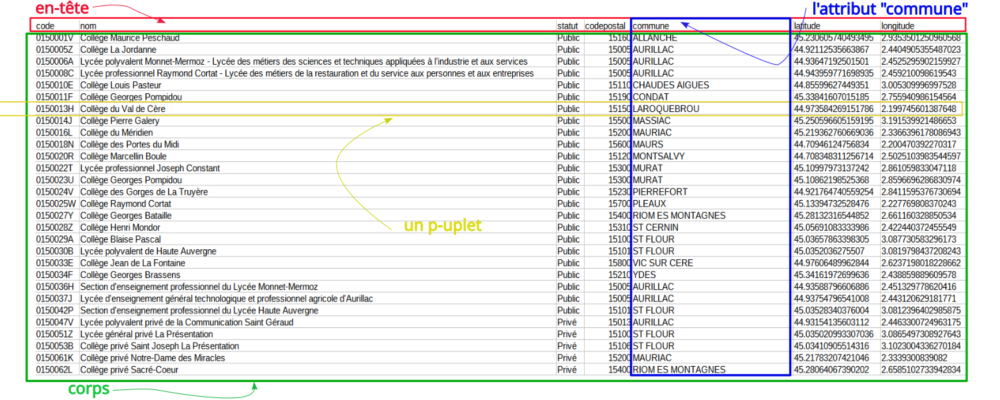
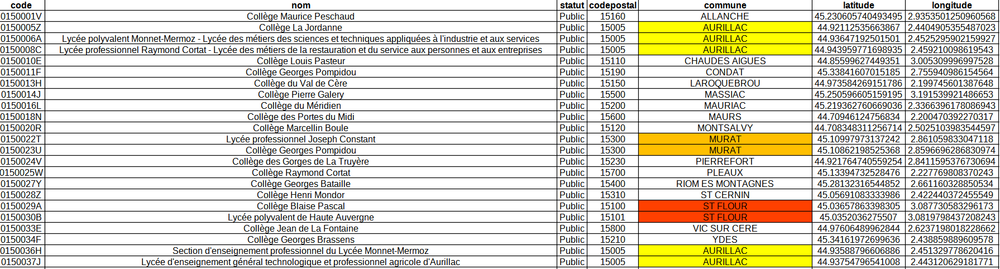
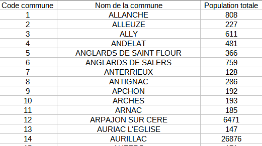
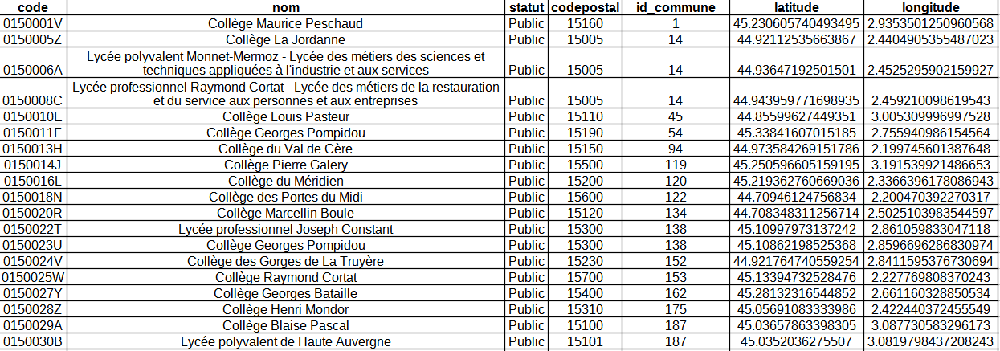
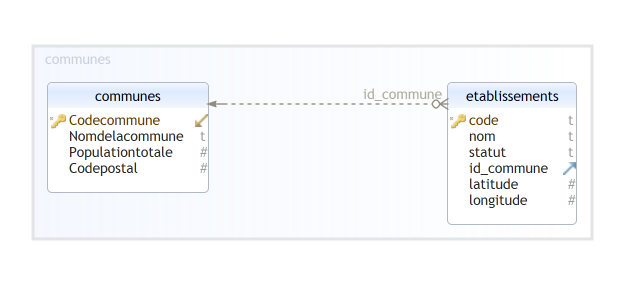

!!! note "Définition"
    Le modèle relationnel est une manière de modéliser les relations existantes entre plusieurs informations, et de les ordonner entre elles

## 1. Relation, attributs et domaines

Une **relation** peut être vue comme un tableau composé d'une en-tête (première ligne) et d'un corps.

Chaque ligne de la relation est un p-uplet et chaque colonne est un **attribut** (l'en-tête contient les intitulés des attributs).

Pour la relation ci-dessus, on retrouve les données concernant les établissement scolaires du second degré dans le Cantal.

Pour chaque attribut d'une relation, il est nécessaire de définir un **domaine** : Le domaine d'un attribut donné correspond **à un ensemble fini ou infini de valeurs admissibles**. 

Par exemple, le domaine de l'attribut "statut" correspond à l'ensemble des deux chaînes {"Public", "Privé"}. L'attribut "nom" a pour domaine l'ensemble des chaînes de caractères (noté TEXT). L'attribut "codepostal" a pour domaine l'ensemble des entiers (noté INT).

Au moment de la création d'une relation, il est nécessaire de renseigner le domaine de chaque attribut. Le SGBD s'assure qu'un élément ajouté à une relation respecte bien le domaine de l'attribut correspondant : si par exemple vous essayez d'ajouter un code postal non entier (par exemple 8.5), le SGBD signalera cette erreur et n'autorisera pas l'écriture de cette nouvelle donnée.

!!! bug "Règles à respecter"
    Dans une relation, il est nécessaire de respecter les deux règles ci-dessous :

    * les valeurs des attributs doivent être **atomiques**, c'est-à-dire d'un type simple et non d'un type construit (pas de listes, de tableaux, de p-uplets, ...) ;
    * il n'y a pas de doublons : les p-uplets sont tous différents.

Pour s'assurer qu'il n'y a pas de doublons dans une relation on ajoute en pratique un critère d'unicité sur l'un des attributs, la **clef**.

## 2. Clef primaire, clef étrangère

!!! note "Définition"
    Dans une relation, une **clef primaire** est un attribut (ou un groupes d'attributs) qui définit de manière unique chacun de p-uplets.

En d'autre termes il s'agit d'un attribut tel que **deux p-uplets sont égaux si, et seulement si, ils ont la même clef primaire**.

Par exemple, dans la table des établissements scolaires du Cantal, l'attribut "code" peut être choisi comme clef primaire car il identifie de façon unique chaque établissement. L'attribut "commune" ne peut pas être choisi comme clef primaire car plusieurs établissements existent dans une même commune.

On pourrait naïvement penser qu'il suffit de créer une unique relation et de tout mettre dedans pour avoir une base de données. En fait, une telle approche est inapplicable et il est indispensable de créer plusieurs relations, associées les unes aux autres.

Prenons l'exemple des établissements scolaires, un parcours de la table nous montre que certaines informations sont répétées plusieurs fois, comme notamment le nom de la commune : 

Cette duplication de l'information n'est pas souhaitable dans une base de donnée. La solution pour éviter cela est de travailler avec deux relations (deux tables) au lieu d'une, chacune des relations étant munie d'une clef primaire.

Nous allons pour cela considérer la table des communes du Cantal qui contient un attribut nommé "Code commune" qui peut être choisi comme clef primaire. Dans la relation des établissements, nous remplaçons le nom de la commune par la valeur du _Code commune_ correspondante (attribut _id\_commune_). Voici un extrait des deux relations obtenues :

L'attribut _id\_commune_ permet de lier les deux relations : les communes sont représentées dans la relation des établissements par leur _code_ dans la relation des communes. On dit que l'attribut _id\_commune_ est une **clef étrangère**.

!!! note "Définition"
    Soient deux relations $R$ et $S$ de clefs primaires respectives $c_R$ et $c_S$.

    Une **clef étrangère** de $S$ dans $R$ est un attribut $ce$ de $R$ dont la valeur est toujours égale exactement à une des valeurs de $c_S$.

    Autrement dit, $ce$ correspond à un et un seul p-uplet de $S$.

Dans notre exemple, l'attribut _id\_commune_ est une clef étrangère de la relation des communes dans la relation des établissements car c'est un attribut de la relation des établissements dont la valeur est toujours égale à une des valeurs de la clef primaire _Code commune_ de la relation des communes.

Deux contraintes doivent toujours être vérifiées avec les clefs : 

!!! bug "Contraintes liées au clefs"

    * **Contrainte d'unicité**: une valeur de clef ne peut apparaître qu'une fois dans une relation.
    * **Contrainte d'intégrité référentielle** : la valeur d'une clef étrangère doit toujours être également une des valeurs de la clef référencée.

Ces deux contraintes garantissent l'absence totale de redondances et d'incohérences.

## 3. Schéma relationnel

Le schéma d'une base de données est constitué d'un ensemble de relations : on parle de **schéma relationnel**. 

Le schéma relationnel d'une base de données contient les informations suivantes : 

* Les noms des différentes relations ;
* pour chaque relation, la liste des attributs avec leur domaine respectif ;
* pour chaque relation, la clef primaire et éventuellement les clefs étrangères

Nommons ETABLISSEMENTS et COMMUNES les deux relations utilisées ci-dessus. Le schéma relationnel peut s'écrire : 

* ETABLISSEMENTS(^^code^^: TEXT, nom: TEXT, statut: TEXT, codepostal: INT, #id_commune: INT, latitude: FLOAT, longitude: FLOAT)
* COMMUNES(^^Code commune^^: INT, Nom de la commune: TEXT, Population totale: INT)

Les attributs soulignés sont des clefs primaires, le # signifie que l'on a une clef étrangère.

Le schéma relationnel peut être représenté sous forme graphique (image obtenue ici avec le logiciel [DbSchema](https://dbschema.com/download.html) à partir de la base précédente légèrement modifiée : l'attribut Codepostal a été déplacé dans la relation COMMUNES) :

