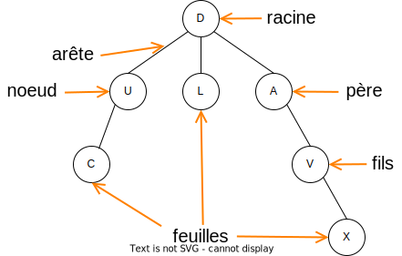
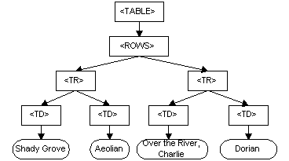
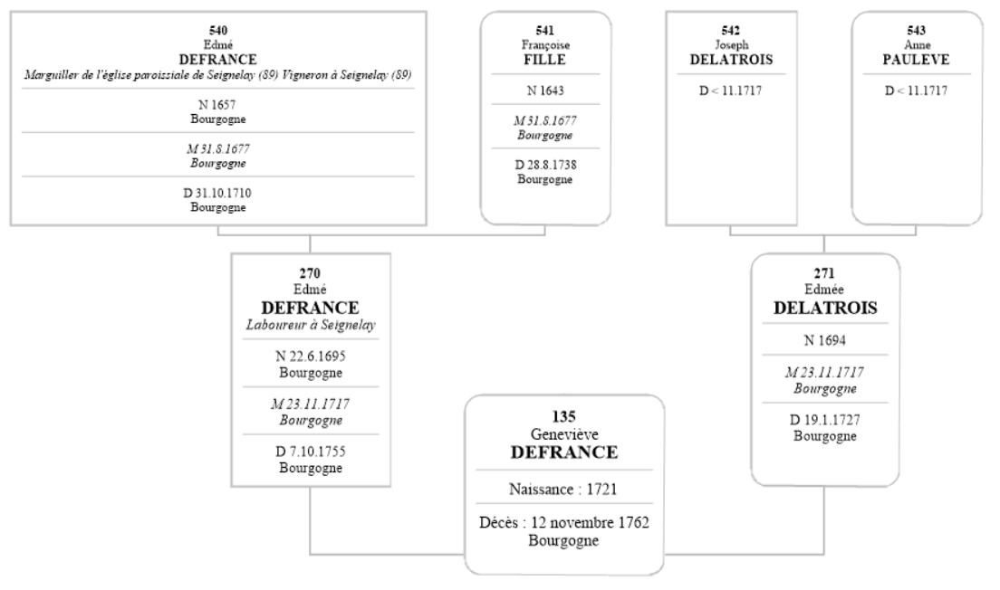
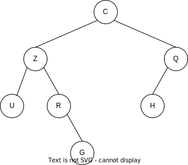
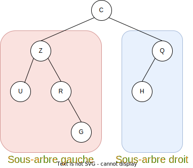
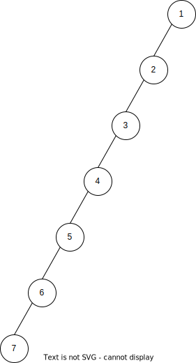
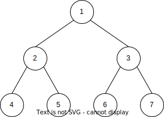
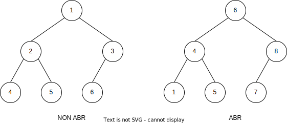

## 1. Introduction

### 1.1. Vocabulaire

!!! note "Définition"
    En informatique, un arbre est une structure de données qui peut se représenter sous forme d'une **hiérarchie** dont chaque élément est appelé **nœud**, le nœud initial étant appelé **racine**.



!!! abstract "Vocabulaire"
    * Chaque nœud a exactement un nœud **père**, sauf le nœud **racine** (situé en haut) qui n'a pas de père.
    * Un nœud peut avoir une nombre quelconque de **fils**.
    * Les nœuds qui n'ont pas de fils sont appelés des **feuilles** (situées aux extrémités des branches !).
    * Les nœuds possèdent une valeur, ou **clef**, ou encore **étiquette**.

Par exemple, dans l'arbre représenté ci-dessus :

!!! example "Exemple"
    * La racine possède l'étiquette **D**.
    * Le nœud père **D** a trois fils **U**, **L** et **A**.
    * Le nœud **V** a pour père le nœud **A**.
    * Les nœuds **C**, **L** et **X** sont des feuilles.

### 1.2. Exemples

Voici quelques exemples de situations dans lesquelles une structure de données arborescente est utile.

#### L'arborescence d'un disque dur

Déjà rencontrée dans le chapitre sur les systèmes d'exploitation en première, une arborescence de dossiers dans un disque dur peut être modélisée par un arbre.


####  Le DOM d'une page web

LE DOM (Document Object Model) est une interface de programmation pour les pages web dans laquelle une page HTML est modélisée sous la forme d'un arbre.

Par exemple, le code HTML ci-dessous sera modélisé par l'arbre en-dessous (source : [w3.org](https://www.w3.org/TR/WD-DOM/introduction.html)).

````HTML
<TABLE>
    <ROWS> 
      <TR> 
        <TD>Shady Grove</TD>
        <TD>Aeolian</TD> 
      </TR> 
      <TR>
        <TD>Over the River, Charlie</TD>
        <TD>Dorian</TD> 
      </TR> 
    </ROWS>
</TABLE>
````



#### Un arbre généalogique



### 1.3. Caractéristiques d'un arbre

Différents paramètres numériques peuvent être définis concernant un arbre.

!!! note "Définitions"
    * La **taille** d'un arbre est son nombre total de nœuds.
    * La **profondeur** d'un nœud est le nombre de nœuds de la branche allant de la racine à ce nœud, en comptant les extrémités.
    * La **hauteur** d'un arbre est la profondeur de son nœud le plus profond. Par convention, si l'arbre est vide, sa hauteur vaut 0, si l'arbre n'est composé que d'un nœud racine, sa hauteur vaut 1.

!!! example "Exemple"
    Considérons l'arbre ci-dessous :

    

    * La taille de cet arbre est égale à 7.
    * La profondeur du nœud **C** est égale à 3, celle de **X** est égale à 4.
    * La hauteur de cet arbre est égale à 4 : **X** est le nœud le plus profond.

## 2. Arbres binaires

### 2.1. Définition

!!! note "Définition"
    Un **arbre binaire** est un arbre dans lequel chaque nœud possède **au plus** deux fils au niveau inférieur, appelés _gauche_ et _droite_.

L'arbre donné en exemple ci-dessus n'est pas un arbre binaire car le nœud **D** possède 3 fils.

L'arbre ci-dessous est un arbre binaire :




### 2.2. Sous-arbres

Chaque nœud n'ayant que deux fils (au maximum), nous pouvons définir un sous-arbre gauche et un sous-arbre droit  qui sont tous les deux également des arbres binaires (éventuellement vides).



!!! example "Exemple"
    Pour l'arbre représenté ci-dessous, nous avons mis en évidence le sous-arbre gauche et le sous-arbre droit du nœud racine **C**.

    Le nœud **Q** admet comme sous-arbre gauche le nœud **H** et comme sous-arbre droit, l'arbre vide.

Cette notion de sous arbre permet de mettre en évidence la **structure récursive** d'un arbre binaire : un arbre binaire est un arbre dans lequel chaque nœud possède un arbre fils gauche et un arbre fils droit qui sont tous deux des arbres binaires.

### 2.3. Hauteur d'un arbre binaire

Nous avons défini plus haut les notions de **taille** et de **hauteur** d'un arbre.

Notons ici $n$ la taille d'un arbre binaire et $h$ sa hauteur. Ces deux entiers ne sont pas indépendants l'un de l'autre.

Un cas extrême est le cas de l'arbre filiforme dans lequel chaque nœud n'a qu'un fils. La figure ci-dessous est réalisée avec $n=7$.



Dans ce cas, nous avons $n=h$ : la hauteur de l'arbre est égale au nombre de nœuds de l'arbre.

Un autre cas "extrême" est le cas d'un **arbre complet** : il s'agit d'un arbre binaire dans lequel tous les nœuds (sauf les feuilles) ont exactement deux fils et toutes les feuilles ont la même profondeur. La figure ci-dessous représente un arbre complet à 7 nœuds.



Dans un tel arbre, le nombre de nœuds est **doublé à chaque niveau**. Si la hauteur est $h$, le nombre total de nœuds est donc égal à : 

$$n=1+2^1+2^2+2^3+\ldots+2^{h-1}$$

(on numérote les niveaux de $0$ à $h-1$)

On obtient donc le résultat suivant :

!!! danger  "Lien entre hauteur et taille d'un arbre binaire complet"
    Soit un arbre binaire complet de taille $n$ et de hauteur $h$.

    On a alors : 

    $$n=2^h-1$$

??? success "Preuve"
    Nous avons vu que $n=1+2^1+2^2+2^3+\ldots+2^{h-1}$. Cette somme est la somme des premiers termes d'une suite géométrique de raison 2.

    On peut donc utiliser la formule de calcul vue en première en Mathématiques :

    $$1+2^1+2^2+2^3+\ldots+2^{h-1} = \frac{2^h-1}{2-1}=2^h-1$$

    Pour ceux  qui n'auraient jamais vu cette formule, sa preuve n'est pas difficile : il suffit de calculer le produit $(2-1)(1+2^1+2^2+2^3+\ldots+2^{h-1})$ en développant : 

    $$(2-1)(1+2^1+2^2+2^3+\ldots+2^{h-1})= 2^1+2^2+2^3+\ldots+2^{h} -1-2^1-2^2-2^3-\ldots-2^{h-1}$$

    Tous les termes s'annulent sauf $2^{h}$ et $-1$, d'où le résultat.

Tout arbre étant situé entre ces deux cas extrêmes, nous pouvons écrire un encadrement du nombre de nœuds $n$ en fonction de la hauteur $h$, valable pour tout arbre binaire :

$$h\leqslant n\leqslant 2^h-1$$

À partir de cet encadrement de $n$, on peut déduire un encadrement de $h$. Nous avons déjà de façon évidente $h\leqslant n$. La seconde inégalité $n\leqslant 2^h-1$ est équivalente à $n+1\leqslant 2^h$.

Pour isoler $h$ dans cette inégalité, nous avons besoin de la fonction **logarithme binaire**. Le logarithme binaire d'un entier positif est son exposant quand on l'écrit sous la forme d'une puissance de 2. Par exemple $\log_2(8)=3$ car $2^3=8$ et $\log_2(2^h)=h$. Cette fonction $\log_2$ étant intuitivement croissante, nous obtenons, en l'appliquant à l'inégalité $n+1\leqslant 2^h$ : $\log_2(n+1)\leqslant h$.

Nous avons finalement l'encadrement suivant : 

!!! danger "Encadrement de la hauteur d'un arbre binaire"
    Soit un arbre binaire de taille $n$ et de hauteur $h$.

    On a alors : 

    $$\log_2(n+1)\leqslant h\leqslant n$$

Cet encadrement nous sera utile lors du calcul du coût d'exécution des algorithmes sur les arbres.

## 3. Arbres binaires de recherche

!!! note "Définition"
    Un **arbre binaire de recherche** (ABR) est un arbre binaire dont les clefs des nœuds (leur valeur) vérifient les propriétés suivantes :

    * la clef d'un nœud est **supérieure** à celle de chaque nœud de son **sous-arbre gauche**.
    * la clef d'un nœud est **inférieure** à celle du chaque nœud de son **sous-arbre droit**.

Cette définition n'a de sens que dans le cas où les clefs des nœuds sont toujours **comparables** entre elles. Dans la pratique, nous travaillerons toujours avec des clefs numériques ou alphanumériques (ordre alphabétique).

Nous supposerons toujours que toutes les clefs sont **différentes**.



!!! info "Remarque"
    Dans un ABR, pour un nœud donné, **tous** les nœuds de son sous-arbre gauche ont des clefs inférieures et **tous** les nœuds de son sous-arbre droit ont des clefs supérieures.
