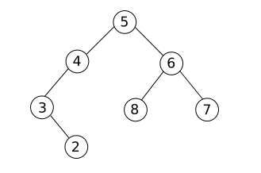

_Les exercices précédés du symbole :fontawesome-solid-computer: sont à faire sur machine, en sauvegardant le fichier si nécessaire._

_Les exercices précédés du symbole :octicons-pencil-16: doivent être résolus par écrit._

## :octicons-pencil-16: Exercice 1

On considère l'arbre binaire ci-dessous :

1. Déterminer la profondeur du nœud **6**.
2. Déterminer la hauteur de cet arbre.
3. Expliquer pourquoi cet arbre n'est pas un arbre binaire de recherche.
4. Modifier l'arbre (en conservant les mêmes clefs) pour en faire un ABR.

----------

## :octicons-pencil-16: Exercice 2

On considère l'arbre binaire ci-dessous :

1. Justifier qu'il s'agit bien d'un arbre binaire.
2. Donner la clef de la racine.
3. Donner le sous-arbre droit du nœud **A**.
4. Le nœud **C** est-il une feuille ? Justifier.
5. Donner la taille de cet arbre.
6. Donner la profondeur du nœud **B**.
7. Donner la hauteur de cet arbre.

----------

## :octicons-pencil-16: Exercice 3

Soit les valeurs suivantes : 14, 22, 8, 47, 42, 13, 1, 24, 33, 74.

Construire un arbre binaire de recherche à partir de ces valeurs. 