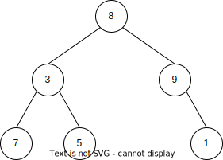
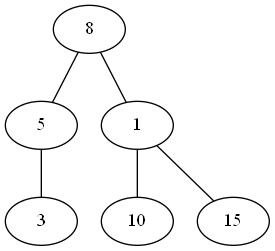

L'objectif de cette partie est d'**implémenter** la structure d'arbre binaire en Python. Nous allons pour cela utiliser la Programmation Orientée Objet et construire un module réutilisable proposant à l'utilisateur une interface (**API**) permettant de travailler avec les arbres binaires.

## 1. Arbres binaires

Une interface souhaitable devrait permettre de : 

* Créer un arbre vide ;
* Accéder au sous-arbre gauche et au sous-arbre droit d'un nœud ;
* Accéder à une clef ;
* Tester si un nœud est une feuille ;
* Tester si un arbre est vide ;
* Retourner la taille ;
* Retourner la hauteur.

De plus, il serait souhaitable de parvenir à afficher un arbre de façon visuelle.

Nous avons vu que la structure d'arbre binaire est une structure **récursive** : cette propriété est exploitée dans l'implémentation que nous allons présenter. Pour définir un arbre, il suffit de définir un nœud racine ainsi que les deux sous-arbres gauche et droite qui sont eux-même des arbres binaires. Cela revient à assimiler un arbre à sa racine associée à un lien vers ses deux fils.

Nous définissons ci-dessous un objet `ArbreBinaire` possédant trois attributs `clef`, `gauche`, `droit`. Le code ci-dessous respecte les règles de l'encapsulation du paradigme objet à la sauce Python : les attributs sont privés. La méthode `@clef.setter`, qui permet de définir la clef d'un nœud assure que chaque nœud a toujours un sous-arbre gauche **et** un sous-arbre droit, éventuellement vides, ce qui facilite le traitement des arbres dans les algorithmes suivants. On matérialise ici l'aspect récursif de la structure.

````Python
class ArbreBinaire:
    """ Implémentation de la structure d'arbre binaire """

    def __init__(self):
        self.__clef = None
        self.__gauche = None
        self.__droit = None

    @property
    def clef(self):
        return self.__clef

    @clef.setter
    def clef(self, clef):
        self.__clef = clef
        if self.__gauche is None:
            self.__gauche = ArbreBinaire()
        if self.__droit is None:
            self.__droit = ArbreBinaire()

    @property
    def gauche(self):
        return self.__gauche

    @gauche.setter
    def gauche(self, clef):
        self.__gauche.clef = clef

    @property
    def droit(self):
        return self.__droit

    @droit.setter
    def droit(self, clef):
        self.__droit.clef = clef

    def est_vide(self) -> bool:
        return self.__clef is None

    def est_feuille(self) -> bool:
        if self.est_vide():
            return False
        else:
            return self.__gauche.est_vide() and self.__droit.est_vide()

    def __str__(self):
        if self.est_vide():
            return "()"
        elif self.est_feuille():
            return f"({self.__clef}, (), ())"
        else:
            return f"({self.__clef}, {self.__gauche.__str__()}, {self.__droit.__str__()})"
````

La classe est complétée par une méthode `est_vide` permettant de tester si un arbre est vide ou non et une méthode `est_feuille` permettant de tester si un nœud est une feuille ou non (on confond un nœud avec un arbre de hauteur 1).

La dernière méthode est la méthode spéciale `__str__` qui définit la façon dont un arbre va être affiché par la fonction `print`. Ici, on a choisi un affichage sous forme de tuple du type `(clef, sous-arbre gauche, sous-arbre droit)`.

Pour créer un module, on enregistre le code ci-dessus dans un fichier nommé par exemple `structures.py`.

On peut ensuite utiliser notre nouvelle structure dans un autre fichier Python (dans le même dossier), ou dans la console interactive, en important le module :

````Python
from structures import *

a = ArbreBinaire()
a.clef = 8
a.gauche = 3
a.droit = 9
b = a.gauche
c = a.droit
b.gauche = 7
b.droit = 5
c.droit = 1
print(a)
````

On obtient en sortie :

````pycon
(8, (3, (7, (), ()), (5, (), ())), (9, (), (1, (), ())))
````

Cela correspond à l'arbre représenté ci-dessous :



On peut tester les autres méthodes dans la console :

````pycon
print(c)
>>> (9, (), (1, (), ()))
c.gauche.est_vide()
>>> True
c.est_feuille()
>>> False
c.droit.est_feuille()
>>> True
````

Nous pouvons maintenant ajouter au fichier `structures.py` les deux fonctions suivantes (en dehors de la classe `ArbreBinaire` car ce ne sont pas des méthodes) qui retournent respectivement la taille et la hauteur d'un arbre binaire.

````Python
def taille(arbre) -> int:
    """Retourne la taille de l'arbre, càd son nombre de noeuds"""
    if arbre.clef is None:
        return 0
    else:
        return 1 + taille(arbre.gauche) + taille(arbre.droit)


def hauteur(arbre) -> int:
    """Retourne la hauteur de l'arbre"""
    if arbre.clef is None:
        return 0
    else:
        return 1 + max(hauteur(arbre.gauche), hauteur(arbre.droit))
````

Prendre le temps de bien comprendre comment fonctionnent ces deux fonctions ...

````pycon
taille(a)
>>> 6
hauteur(a)
>>> 3
````

Ce module `structures` sera utilisé en exercices et plus tard dans l'année lorsque nous étudierons les algorithmes sur les arbres.

## 2. Arbres binaires de recherche (ABR)

Les ABR sont des arbres binaires. Nous pouvons donc créer une classe `ABR` semblable à la classe `ArbreBinaire` identique à la classe `ArbreBinaire` déjà créée. Nous définissons néanmoins une nouvelle classe car nous allons ajouter une méthode spécifique : l'insertion d'une clef. Cette méthode ajoute une clef à un ABR existant en s'assurant que l'arbre obtenu est toujours un ABR (le nouveau nœud est toujours une feuille).

````Python
class ABR:
    """ Implémentation de la structure d'arbre binaire de recherche """

    def __init__(self):
        self.__clef = None
        self.__gauche = None
        self.__droit = None

    @property
    def clef(self):
        return self.__clef

    @clef.setter
    def clef(self, clef):
        self.__clef = clef
        if self.__gauche is None:
            self.__gauche = ABR()
        if self.__droit is None:
            self.__droit = ABR()

    @property
    def gauche(self):
        return self.__gauche

    @gauche.setter
    def gauche(self, clef):
        self.__gauche.clef = clef

    @property
    def droit(self):
        return self.__droit

    @droit.setter
    def droit(self, clef):
        self.__droit.clef = clef

    def est_vide(self) -> bool:
        return self.__clef is None

    def est_feuille(self) -> bool:
        if self.est_vide():
            return False
        else:
            return self.__gauche.est_vide() and self.__droit.est_vide()

    def __str__(self):
        if self.est_vide():
            return "()"
        elif self.est_feuille():
            return f"({self.__clef}, (), ())"
        else:
            return f"({self.__clef}, {self.__gauche.__str__()}, {self.__droit.__str__()})"

    def insere(self, clef):
        if self.clef is None:
            self.clef = clef
        else:
            if clef < self.clef:
                self.gauche.insere(clef)
            else:
                self.droit.insere(clef)
````

Pour définir un arbre binaire de recherche valide, on utilisera toujours la méthode `insere` car elle permet de s'assurer de toujours conserver un ABR.

En l'état actuel de la classe, il est malheureusement possible de procéder à une affectation directe de clef du type `a.gauche.droit = 5` qui pourrait éventuellement casser la structure d'ABR. On s'interdira donc ce type d'affectation directe (sauf éventuellement pour le nœud racine).

Pour faciliter la vérification, nous définissons une fonction `est_ABR` qui peut s'appliquer aussi bien à un arbre binaire quelconque qu'à un ABR et qui retourne `True` si l'arbre est un ABR et `False` sinon.

````Python
def est_ABR(arbre, mini=-float("inf"), maxi=+float("inf")) -> bool:
    if arbre.clef is None:
        return True
    else:
        return est_ABR(arbre.gauche, mini, arbre.clef) and est_ABR(arbre.droit, arbre.clef, maxi) and mini < arbre.clef < maxi
````

Prendre le temps de bien comprendre cette fonction ...

Utilisation :

````Python
from structures import *

a = ABR()
a.clef = 8
a.insere(5)
a.insere(3)
a.insere(12)
a.insere(10)
a.insere(15)
print(a)
print(est_ABR(a))
# Affectation directe à proscrire :
a.droit = 1
print(a)
print(est_ABR(a))
````

Sortie :

````pycon
(8, (5, (3, (), ()), ()), (12, (10, (), ()), (15, (), ())))
True
(8, (5, (3, (), ()), ()), (1, (10, (), ()), (15, (), ())))
False
````

Le premier arbre correspond à : 


Le second à :




Le module `structure.py` est à conserver : il sera utilisé en exercices et dans les chapitres suivants.

!!! abstract "Complément"
    On peut ajouter une fonctionnalité de représentation graphique d'un arbre en utilisant la bibliothèque `graphviz`. Celle-ci doit cependant être installée séparément et la procédure doit se faire en deux étapes si vous êtes sous Windows : installation du module python (`pip install graphviz`) puis installation des exécutables en [téléchargeant l'installeur](https://gitlab.com/graphviz/graphviz/-/package_files/6164164/download){ target=_blank }. Une fois cela fait, ajouter la fonction ci-dessous au fichier `structures.py` :

    ````python
    def affiche_arbre(arbre):
        def construit_figure(arb, figure):
            if arb.clef is None:
                return
            else:
                figure.node(str(arb.clef), str(arb.clef))
                if arb.gauche.clef is not None:
                    figure.node(str(arb.gauche.clef), str(arb.gauche.clef))
                    figure.edge(str(arb.clef), str(arb.gauche.clef))
                    construit_figure(arb.gauche, figure)
                if arb.droit.clef is not None:
                    figure.node(str(arb.droit.clef), str(arb.droit.clef))
                    figure.edge(str(arb.clef), str(arb.droit.clef))
                    construit_figure(arb.droit, figure)

        fig = graphviz.Graph('arbre', format='png')
        construit_figure(arbre, fig)
        fig.render(directory="essai", view=True)
    ````

    Utilisation : 

    ````python
    from structures import *

    a = ABR()
    a.clef = 8
    a.insere(5)
    a.insere(3)
    a.insere(12)
    a.insere(10)
    a.insere(15)

    affiche_arbre(a)
    ````

    Sortie : 

    