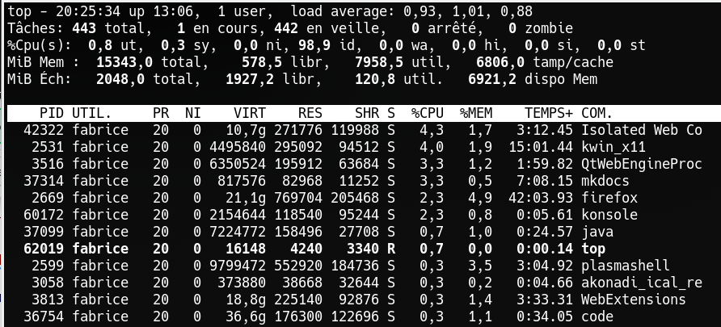
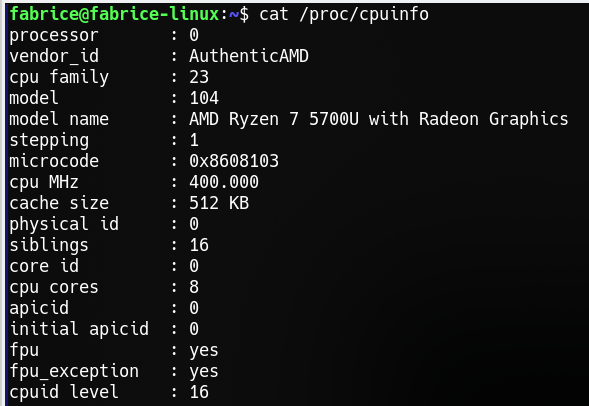

Ne disposant de salle informatique sous Linux, nous travaillerons pour ce T.P. à l'aide d'une machine virtuelle en ligne disponible à cette adresse : [Machine virtuelle en ligne](https://bellard.org/jslinux/vm.html?url=alpine-x86-xwin.cfg&mem=256&graphic=1){target="_blank"}.

{width=30%}

1. Faire un clic droit dans l'émulateur pour ouvrir le menu contextuel, cliquer sur "Keyboard mapping", puis sur "French" pour utiliser la disposition du clavier français. Démarrer ensuite une fenêtre de l'application "Terminal".

    

1. De la même façon, démarrer l'application "Top" et l'application "Browser-Dillo". Organiser les fenêtres pour les voir toutes.
1. Dans le terminal, taper la commande `vi essai.txt &` pour ouvrir l'éditeur de texte `vi` en arrière-plan.

2. Taper dans le terminal la commande `pstree -p` qui affiche l'arbre des processus en cours d'exécution ainsi que leur PID..

    Quel processus est à la racine de l'arbre affiché ?

    Reconnaître et noter les noms de quelques processus ouverts.

3. Créer un fichier `TPlinuxTNSI.odt` avec le traitement de texte LibreOffice Writer. Ce fichier sera votre compte-rendu.

    Faire une copie d'écran de l'arbre obtenu dans le terminal et coller dans la page.

6. **Observation des processus**

    * **La commande ps -aef** permet de lister tous les processus.

        Dans le terminal, taper la commande suivante : `ps -aef` (attention à l'espace après ps).

        S'affichent plusieurs informations sur les processus en cours sur votre
        ordinateur.
        
        * **PID** : numéro du processus
        * **USER** : utilisateur propriétaire du processus
        * **TIME** : durée de traitement du processus
        * **COMMAND** : nom du processus.

        6.1. Faire une copie d'écran (ou plusieurs si besoin) à coller à la suite de votre page.

        6.2. Reconnaître les processus liés à l'application `top`. Pourquoi y en a-t-il deux ?

        6.3. En vous aidant des informations affichées dans la fenêtre de `top`, donner le PID et le PPID de chacun, faire un lien père/fils et remonter dans le tableau pour suivre la branche de l'arbre. (le plus loin possible !). Faire un schéma.

        6.4. Retrouver de même l'ensemble des processus prédécesseurs du processus de l'éditeur `vi`.

        6.5. Recopier la ligne du tableau dont le PID est 1 et reconnaître le processus init.

    * **La commande top** donne beaucoup de détails, en temps réel, sur les processus qui tournent sur une machine :

        
        
        * **PID** : numéro du processus
        * **PPID** : numéro du processus père
        * **USER** nom de l'utilisateur qui a lancé le processus
        * **STAT** : Statut du processus. Valeurs possibles : 
            * **R** en cours d'exécution ; 
            * **T** processus stoppé ; 
            * **I** processus endormi (>20s) ; 
            * **S** processus endormi (<20s) ; 
            * **Z** processus zombie ; 
            * **D** processus non interruptible ; 
            * **W** processus swappé sur disque.
        * **%CPU** : consommation du CPU
        * **%VSZ** : consommation de la RAM
        * **COMMAND** : nom du processus.

        6.6. Analyser en quelques lignes ce qu'on observe à l'écran (agrandir au maximum la hauteur de la fenêtre de `top`).

        Pour en savoir plus sur la commande top, consultez la page : http://debian-facile.org/doc:systeme:top

5. Dans le navigateur Dillo, cliquer sur différents liens présents sur la page d'accueil et observer dans la fenêtre `top` comment évolue le processus. Commenter.

6. Rechercher la signification du mot **daemon** pour
    Linux. On privilégiera Wikipédia.

    De même chercher sur Wikipédia la signification de **processus zombie**
    et de **processus swappé sur disque**. Donner des éléments de
    définition pour ces trois mots ou expressions.

7. Dans le terminal, utiliser la commande **kill** qui permet
    d'arrêter le processus (kill suivi du numéro de PID) pour tuer le processus de Dillo. Quelle commande faut-il entrer ?

    Que se passe-t-il ?

    {width=20%}

7. **La commande cat /proc/cpuinfo** permet d'avoir des informations détaillées sur le processeur.

    

    Sous Linux, les détails sur chacun des processus sont stockés dans les
    sous répertoires de « /proc ». On peut ainsi explorer le contenu de
    ces fichiers pour avoir plus d'informations sur un processus en
    particulier.    
    Observer les résultats sur cette machine virtuelle.

