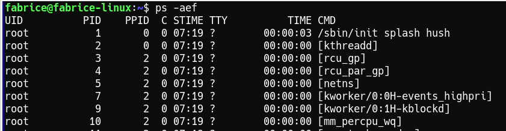
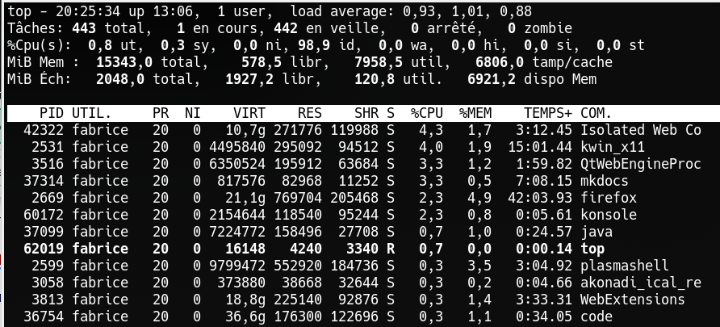
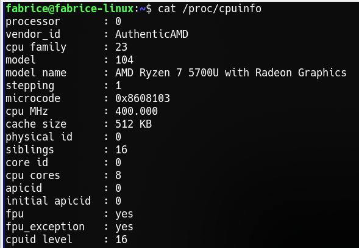

Pour ce T.P., nous travaillons avec les vieilles machines sous Linux : elles doivent être respectées (vu leur grand âge) et accepter leur lenteur !

{width=30%}

1. Ouvrir l'émulateur de terminal pour travailler en ligne de commandes.
2. Au lancement du système, il n'existe qu'un seul processus (init), 
    qui est l'ancêtre de tous les autres. On peut voir l'arborescence
    avec la commande « ***pstree »***.

    Quel processus est à la racine de l'arbre affiché ?

    Reconnaître et noter les noms de quelques processus liés aux entrées/sorties,

3. Créer un fichier `TPlinuxTNSI.odt` avec le traitement de texte LibreOffice Writer sur le bureau.

    En utilisant la touche « imprime écran », faire une copie d'écran de l'arbre obtenu dans le terminal et coller dans la page.

4. **Observation des processus**

    * **La commande ps -aef** permet de lister tous les processus.

        Dans le terminal, taper la commande suivante : `ps -aef` (attention à l'espace après ps).

        S'affichent plusieurs informations sur les processus en cours sur votre
        ordinateur du type :

        
        
        * **UID** nom de l'utilisateur qui a lancé le processus
        * **PID** : numéro du processus
        * **PPID :** numéro du processus parent
        * **C** : facteur de priorité : plus la valeur est grande, plus le processus est prioritaire
        * **STIME** : heure de lancement du processus
        * **TTY** : correspond au nom du terminal depuis lequel le processus a été lancé
        * **TIME** : durée de traitement du processus
        * **CMD** : nom du processus.

        4.1. Faire une copie d'écran (ou plusieurs si besoin) à coller à la suite de votre page.

        4.2. Reconnaître les processus liés à l'ouverture du logiciel LibreOffice.

        4.3. Donner le PID et le PPID de chacun, faire un lien père/fils et remonter dans le tableau pour suivre la branche de l'arbre. (le plus loin possible !). Faire un schéma.

        4.4. Quelle remarque peut-on faire sur le nom de l'utilisateur qui a lancé le processus ?

        4.5. Quel est le PID de la commande ps -aef ? Remonter le chemin dans l'arbre. Pourquoi passe-t-on par un processus dont le nom est « bash » ?

        4.6. Recopier la ligne du tableau dont le PID est 1 et reconnaître le processus init.

        La commande ps ne permet pas de suivre en temps réel les processus
        (affichage figé). Pour avoir un suivi en temps réel, on peut utiliser la
        commande `top`.

    * **La commande top** donne beaucoup de détails, en temps réel, sur les processus qui tournent sur une machine :

        
        
        * **PID** : numéro du processus
        * **UTIL ou USER** nom de l'utilisateur qui a lancé le processus
        * **PR** : facteur de priorité : plus la valeur est grande, plus le processus est prioritaire
        * **VIRT** : Taille virtuelle du processus, mémoire qu'il utilise réellement
        * **RES** : Quantité de mémoire physique occupée par le processus
        * **S** : Statut du processus. Valeurs possibles : 
            * **R** en cours d'exécution ; 
            * **T** processus stoppé ; 
            * **I** processus endormi (>20s) ; 
            * **S** processus endormi (<20s) ; 
            * **Z** processus zombie ; 
            * **D** processus non interruptible ; 
            * **W** processus swappé sur disque.
        * **%CPU** : consommation du CPU
        * **%MEM** : consommation de la RAM
        * **TEMPS+ ou TIME+** : temps d'utilisation CPU depuis que le processus est lancé
        * **COMMAND** : nom du processus.

        4.7. Analyser en quelques lignes ce qu'on observe à l'écran.

        4.8. Taper Ctrl Z pour arrêter.

        Pour en savoir plus sur la commande top, consultez la page : http://debian-facile.org/doc:systeme:top

5. Ouvrir le navigateur Firefox et chercher avec le moteur de recherche
    proposé par le navigateur la signification du mot **daemon** pour
    Linux. On privilégiera Wikipédia.

    De même chercher sur Wikipédia la signification de **processus zombie**
    et de **processus swappé sur disque**. Donner des éléments de
    définition pour ces trois mots ou expressions.

    Dans le terminal, taper la commande `ps -aef` pour visualiser les
    processus liés à Firefox.

    Comment est le sous arbre (suivre la trace des `PID` et `PPID` jusqu'à `init`) ? Le construire ci-dessous en notant les `PID`.

    Fermer Firefox, et retaper la commande dans le terminal, que
    remarque-t-on ?

    Réouvrir le navigateur, puis noter à quel processus il correspond dans
    la table du terminal.

    Dans le terminal, utiliser la commande **kill** qui permet
    d'arrêter le processus (kill suivi du numéro de PID) pour tuer ce processus.

    Que remarque-t-on ?

    {width=20%}

6. Pour lancer un processus en tâche de fond (en arrière-plan), on peut
    faire suivre la commande du symbole **&**. Cela ordonne au
    processus parent de "reprendre la main", sans attendre la fin du
    processus "fils"

    **Exemple**

    * Lancer la commande `xeyes` dans le terminal, les yeux apparaissent... bouger la souris, mais le terminal est « bloqué » : il attend que le processus `xeyes` soit terminé. (taper Ctrl Z pour arrêter)
    * Lancer `xeyes &`, les yeux apparaissent, et on a toujours la main dans le terminal.
    * « Tuer » ce processus avec la commande `kill` en relevant le numéro du processus avec la commande « top » et observer les processus dans le terminal.

    **Remarque** : *En utilisant `pkill`, il suffit de mettre le nom du processus au lieu de son PID.*

7. **La commande cat /proc/cpuinfo** permet d'avoir des informations détaillées sur le processeur.

    

    Sous Linux, les détails sur chacun des processus sont stockés dans les
    sous répertoires de « /proc ». On peut ainsi explorer le contenu de
    ces fichiers pour avoir plus d'informations sur un processus en
    particulier.    
    Observer les résultats sur les vieux ordinateurs du lycée et proposer une raison pour laquelle les ordinateurs utilisés sont considérés comme obsolètes et les logiciels ne sont plus mis à jour pour ce type d'appareil ?

