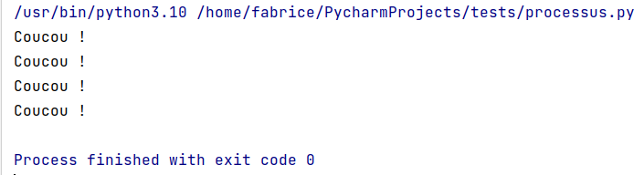
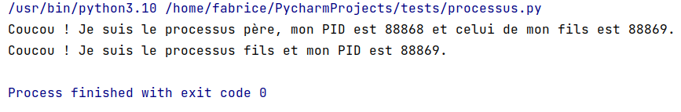
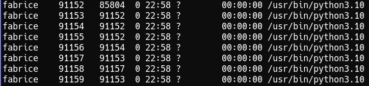

La méthode Python `fork()`, du module `os` permet de créer des **processus enfants** en utilisant les processus par lesquels elle a été appelée. Cette commande n'est disponible que lorsque Python fonctionne sous Linux.

Voici les principales propriétés de la méthode `fork()` :

* Elle ne prend aucun argument lorsqu'elle est appelée.
* Si le processus enfant est créé avec succès, le processus parent et le processus enfant exécuteront tous les deux l'instruction qui suit l'instruction `fork()`.

Lors de l'exécution de l'instruction Python `fork()`, trois types de valeurs entières sont retournées :

* Zéro ( 0 ) est **renvoyé au processus enfant** si le processus enfant est créé avec succès.
* Une valeur positive est **renvoyée au processus parent** si le processus enfant est créé avec succès. Cette valeur positive est le PID du processus enfant nouvellement créé.
* Une valeur négative est renvoyée au processus parent si une erreur se produit lors de la création du processus enfant pour une raison quelconque.

## Premier exemple

On considère le programme ci-dessous :

````python
import os
 
# Création de processus fils
os.fork()
os.fork()
 
# La ligne suivante sera exécutée par le processus père et ses deux enfants
print("Coucou !")
````

Sortie obtenue :



!!! question
    Pourquoi l'affichage s'est-il produit 4 fois ?
<!--  -->

## Deuxième exemple

On considère le programme suivant :

````python
import os
 
val = os.fork()
 
if val == 0:
    pid = os.getpid()
    print(f"Coucou ! Je suis le processus fils et mon PID est {pid}.")
elif val > 0:
    pid = os.getpid()
    print(f"Coucou ! Je suis le processus père, mon PID est {pid} et celui de mon fils est {val}.")
else:
    print("Oups ! La création de processus fils a échoué ...")
````

Sortie obtenue :



### Un exemple plus complexe

Considérons le code ci-dessous :

````python
import os
import time

print("Processus père : mon PID est", os.getpid())
for i in range(3):
    newpid = os.fork()
    print("Processus", os.getpid(), "actif")
    print("Processus", os.getpid(), i)
    if newpid == 0:
        print("Processus", os.getpid(), ": mon père est", os.getppid())
time.sleep(20)
````

Sortie partielle : 

````pycon
Processus père : mon PID est 91152
Processus 91152 actif
Processus 91152 0
Processus 91152 actif
Processus 91152 1
Processus 91153 actif
Processus 91154 actif
Processus 91152 2
Processus 91154 1
Processus 91153 0
Processus 91154 : mon père est 91152
Processus 91153 : mon père est 91152
...
````



!!! question
    Expliquer la sortie et la copie d'écran.

En exécutant plusieurs fois ce programme, nous constatons que les sorties ne se font pas toujours dans le même ordre. En général, l'ordre d'exécution ne peut pas être prévu à l'avance et plus il y a de processus, avec une durée longue, plus l'entrelacement est important. On dit que l'ordonnancement est **non déterministe**.