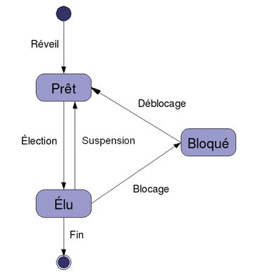
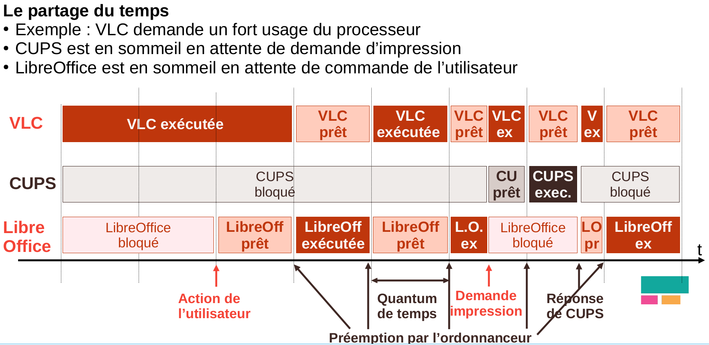
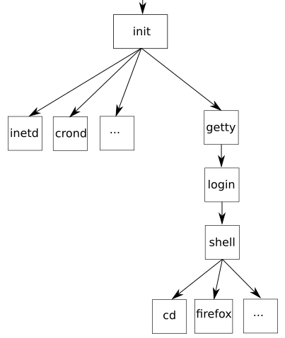
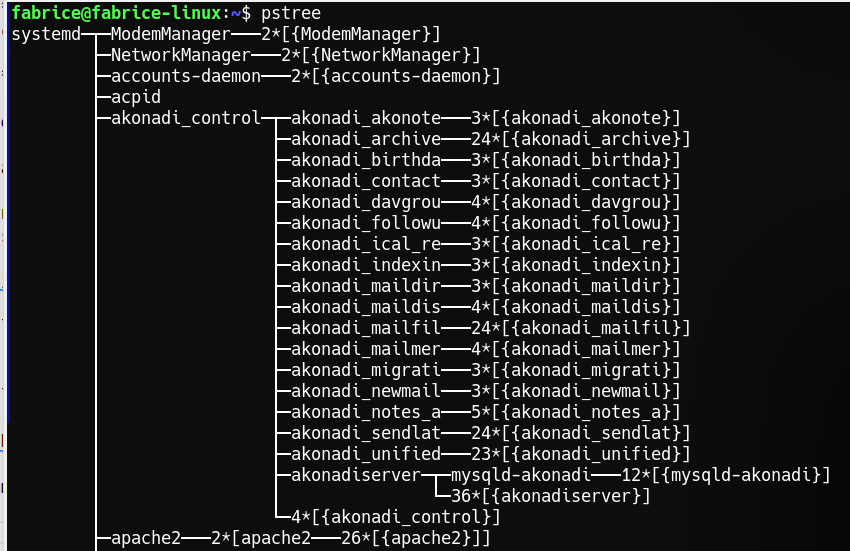
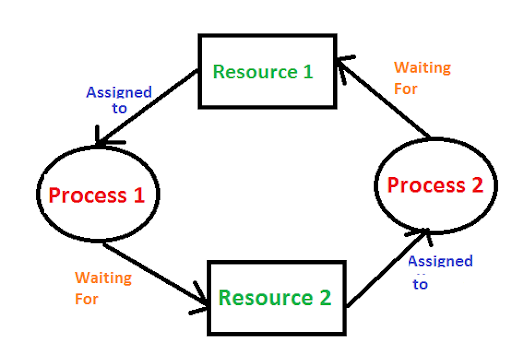

## 1. Vocabulaire

Toute machine est dotée d'un système d'exploitation qui a pour fonction
de charger les programmes depuis la mémoire de masse et de lancer leur
exécution en leur créant des **processus**, de gérer l'ensemble des
ressources, de traiter les interruptions ainsi que les entrées-sorties
et enfin d'assurer la sécurité globale du système.

!!! info "Définition d'un processus"

    Un programme écrit à l'aide d'un langage de haut de niveau (on parle
    de "code source") est transformé en langage machine afin de pouvoir
    être exécuté par un ordinateur.

    On appelle processus un programme en cours d'exécution, c'est donc une
    **instance d'exécution** du programme.

Attention, il ne faut pas confondre le code source du programme et un
processus qui correspond à l'exécution de ce programme par un
ordinateur. Pour prendre une image assez classique, si une recette de
cuisine correspond au code source du programme, le cuisinier en train de
préparer cette recette dans sa cuisine correspond à un processus.

Un processus est caractérisé par :

* l'ensemble des instructions qu'il va devoir accomplir (écrites dans le fichier exécutable obtenu par la compilation du code-source du programme)
* les ressources que le programme va mobiliser (fichier en ouverture, carte son...)
* l'état des registres du processeur.

## 2. États d'un processus

Tous les systèmes d'exploitation "modernes" (Linux, Windows, macOS,
Android, iOS...) sont capables de gérer l'exécution de plusieurs
processus en même temps. Mais pour être précis, cela n'est pas un
véritable "en même temps", mais plutôt un "chacun son tour" car un processeur ne peut gérer qu'un processus à la fois. Pour
gérer ce "chacun son tour", les systèmes d'exploitation attribuent
des "états" au processus.

!!! info "Remarque"
    De nos jours, les ordinateurs ont toujours plusieurs *coeurs*, donc plusieurs processeurs qui travaillent simultanément (véritable *en même temps*) et donc plusieurs processus qui sont vraiment traités simultanément. Cependant, le nombre de processus est toujours supérieur au nombre de processeurs et l'**ordonnancement** des processus par le système d'exploitation est bien toujours nécessaire.

Il y a trois états fondamentaux dans lesquels un
processus peut se retrouver :

1.  **prêt** (suspendu par le système d'exploitation)

2.  **élu** (en exécution)

3.  **bloqué** (en attente d'un événement quelconque pour poursuivre)

Il y a quatre transitions possibles entre ces états.

-   Lorsqu'un processus est en train de s'exécuter (qu'il utilise le
    microprocesseur), on dit que le processus est dans l'état *élu*.

-   Un processus qui se trouve dans l'état *élu* peut demander à
    accéder à une ressource pas forcément disponible instantanément (par
    exemple lire une donnée sur le disque dur). Le processus ne peut pas
    poursuivre son exécution tant qu'il n'a pas obtenu cette
    ressource. En attendant de recevoir cette ressource, il passe de
    l'état *élu* à l'état *bloqué*. (blocage)

-   Lorsque le processus finit par obtenir la ressource attendue,
    celui-ci peut potentiellement reprendre son exécution. Mais comme
    les systèmes d'exploitation permettent de gérer plusieurs processus
    "en même temps", un seul processus peut se trouver dans un état
    *élu* (le microprocesseur ne peut "s'occuper" que d'un seul
    processus à la fois). Ainsi, quand un processus passe d'un état
    *élu* à un état *bloqué*, un autre processus peut alors "prendre sa
    place" et passer dans l'état *élu*. Un processus qui quitte
    l'état *bloqué* ne repasse donc pas forcément à l'état *élu*, il peut
    attendre que "la place se libère" et passer dans l'état *prêt*
    (déblocage).

-   La transition de *élu* à *prêt* survient lorsque le processus en
    cours a épuisé la tranche de temps qui lui avait été allouée ; il
    perd alors le processeur, redevient aussitôt *prêt* (suspension).

Le va-et-vient des transitions entre *élu*
et *prêt* est issu de **l'ordonnanceur** (*scheduler*) **de
processus** du système d'exploitation qui partage le temps entre tous
les processus présents dans la mémoire. C'est le « chef d'orchestre »
qui décide quel processus tourne sur le processeur et qui « donne leur
tour » à chaque processus.

La procédure de sauvegarde des variables utilisées par le processus
permet à celui-ci d'être placé dans la file d'attente des processus du
système.

Un processus qui utilise une ressource R doit la "libérer" une fois
qu'il a fini de l'utiliser afin de la rendre disponible pour les
autres processus. Pour libérer une ressource, un processus doit
obligatoirement être dans un état "élu".

### Exemple d'ordonnancement

L'ordonnanceur (qui fait partie du système d'exploitation), divise le temps de processeur disponible en petits laps de temps (quantum de temps) et, à chaque intervalle, il peut faire passer un processus de l'état *elu* à *prêt* ou inversement.

{width=70%}

**Un bilan** : la vidéo ci-dessous permet de résumer ce qui précède et d'approfondir ces notions.

[**https://www.youtube.com/watch?v=bFqud0gcCHM**](https://www.youtube.com/watch?v=bFqud0gcCHM){target="_blank"}

## 3. Les processus sous Linux

La gestion des processus est dépendante du système d'exploitation et de
son usage.

Un processus peut appeler d'autres processus que l'on appelle
sous-processus. On appelle le processus créateur le **père** et les
processus créés, les **fils**. Les processus peuvent donc se structurer
sous la forme d'une **arborescence.**

Au lancement du système, il n'existe
qu'un seul processus (init), qui est l'ancêtre de tous les autres.

Par exemple, **init** démarre tous les processus nécessaires pour
permettre aux terminaux branchés au système d'établir une connexion et
de lancer le shell de base servant à la lecture des commandes de
l'utilisateur. (Bash est l'interpréteur par défaut de la plupart des
systèmes d'exploitation GNU/Linux)

Les commandes provenant alors des terminaux créent d'autres processus
qui se greffent à l'arbre *unique* des processus du système.

Linux crée et maintient un certain nombre d'informations sur les
processus en cours d'utilisation dans l'ordinateur.

Dans cette **table des processus**, on retrouve presque toujours :

* un identificateur unique : le **PID** (Process Identification). Ce
PID est un nombre. Le premier processus créé au démarrage du système à
pour PID 0, le second 1, le troisième 2... Le système d'exploitation
utilise un compteur qui est incrémenté de 1 à chaque création de
processus, le système utilise ce compteur pour attribuer 
les PID aux processus.

* le **PPID** (Parent Process Identification) qui permet de connaitre
le processus parent du processus.

* le **niveau de priorité** du processus ;

* l'**état du processus** (en exécution, suspendu, etc.) ;

* la table de **pointeurs sur les ressources utilisées**.

Dans un terminal Linux, la commande `ps` permet d'afficher la liste des processus actifs.

Parmi les colonnes affichées, on repère : 

* `CMD` : nom de la commande qui a créé le processus (par ordre chronologique) ;
* `PID` : Process Identification ;
* `PPID`: Parent Process Identification

La commande `pstree` permet d'afficher les processus sous forme d'arbre :

La commande `top`, quant à elle, affiche les processus en temps réel, classés par défaut par ordre décroissant de consommation de processeur.

Enfin, la commande `kill` permet de fermer un processus en le désignant par son `PID`. Dans la situation de la dernière capture d'écran, la commande `kill 2669` fermera Firefox.

## 4. Notion d'interblocage

L'exécution d'un processus nécessite un ensemble de ressources (espace
mémoire centrale, espace disque, fichier, périphériques, ...) qui lui
sont attribuées par le système d'exploitation.

!!! note "Définition"
    Un ensemble
    de processus est en **interblocage** (**deadlock**)  si chaque processus attend un évènement
    que seul un autre processus de l'ensemble peut engendrer.

!!! example "Exemple d'interblocage"

    

    * un **processus Proc1** détient une **ressource R1** et attend
    autre **ressource R2** qui est utilisée par un autre **processus
    Proc2**
    * le **processus Proc2** détient la **ressource R2** et attend la
    **ressource R1**.
    
        → On a une situation **d'interblocage** : (Proc1 attend Proc2 et Proc2 attend Proc1).

        ***Les deux processus vont attendre indéfiniment.***

Pour éviter cela, il est nécessaire :

* D'éviter l'interblocage en allouant les ressources avec précaution.
Si l'allocation d'une ressource peut conduire à un interblocage, elle
est retardée jusqu'à ce qu'il n'y ait plus de risque.

* Les détecter et y remédier.

Pour compléter et approfondir, lire les pages 218 à 225 du manuel (vous y apprendrez comment visualiser les processus sous Windows) et pages 230-231 pour l'interblocage.
