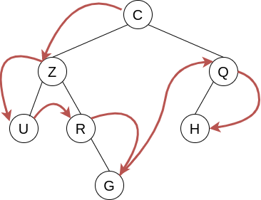
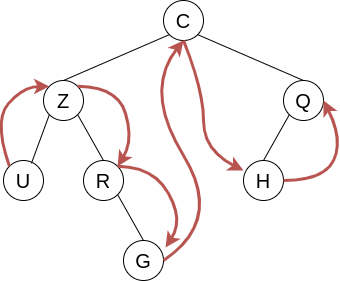
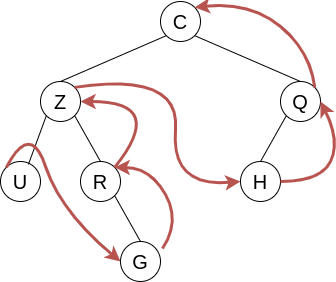
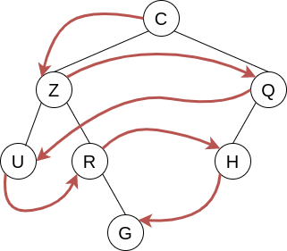
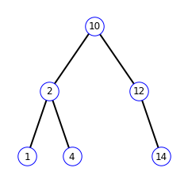
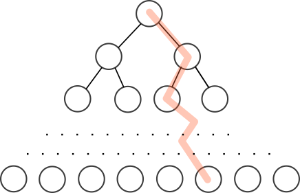

## 1. Calculer la taille et la hauteur d'un arbre binaire

Nous avons déjà rencontré ces algorithmes, sous la forme de programmes Python, dans le chapitre sur les arbres binaires. On s'intéresse ici à leur étude algorithmique.

D'une façon générale, la structure d'arbre binaire est particulièrement adaptée à la mise en œuvre d'algorithmes récursifs. Dans la suite tous les arbres sont binaires.

### Taille d'un arbre

La taille d'un arbre est son nombre total de nœuds.

!!! danger "Algorithme de calcul de la taille d'un arbre"
    <div style="width: 60%; display: block; margin: 0 auto; border-left: solid; border-color: gray; padding-left: 5px;">
    **fonction** taille(*arbre* : arbre binaire) : entier<br>
        <span style="margin-left: 20px;">**si** *arbre* est vide **alors**</span><br>
        <span style="margin-left: 40px;">**retourner** 0</span><br>
        <span style="margin-left: 20px;">**sinon**</span><br>
            <span style="margin-left: 40px;">**retourner** 1 + taille(sous-arbre gauche de *arbre*) + taille(sous-arbre droit de *arbre*)</span><br>
        <span style="margin-left: 20px;">**fin si**</span><br>
    </div>
<!--  -->

### Hauteur d'un arbre

La hauteur d'un arbre est la profondeur de son nœud le plus profond. Par convention, si l'arbre est vide, sa hauteur vaut 0, si l'arbre n'est composé que d'un nœud racine, sa hauteur vaut 1.

!!! danger "Algorithme de calcul de la hauteur d'un arbre"
    <div style="width: 65%; display: block; margin: 0 auto; border-left: solid; border-color: gray; padding-left: 5px;">
    **fonction** hauteur(*arbre* : arbre binaire) : entier<br>
        <span style="margin-left: 20px;">**si** *arbre* est vide **alors**</span><br>
        <span style="margin-left: 40px;">**retourner** 0</span><br>
        <span style="margin-left: 20px;">**sinon**</span><br>
            <span style="margin-left: 40px;">**retourner** 1 + max(hauteur(sous-arbre gauche de *arbre*), hauteur(sous-arbre droit de *arbre*))</span><br>
        <span style="margin-left: 20px;">**fin si**</span><br>
    </div>
<!--  -->

## 2. Parcourir un arbre

**Remarque** : en anglais les parcours en profondeur sont appelés *depth-first search* (DFS) et les parcours en largeur sont appelés *breadth-first search* (BFS).

Tous ces algorithmes de parcours ont en commun de visiter tous les sommets d'un arbre, mais pas dans le même ordre. La structure récursive de la structure de données *arbre binaire* permet de définir très naturellement ces algorithmes de façon récursive. Chacun des algorithmes de parcours sont définis sous forme de fonctions qui comportent deux appels récursifs et qui visitent à chaque fois un seul sommet. Si on note $n$ la taille de l'arbre (le nombre de sommets), on aura donc pour tous ces algorithmes une complexité en $\mathcal{O}(n)$.

### 2.1. Parcours en profondeur avec ordre préfixe

!!! note "Définition : ordre **préfixe**"

    On appelle parcours **préfixe** un parcours dans lequel chaque noeud est visité, **puis** chacun de ses fils : 

    * on visite la racine ;
    * ensuite on visite récursivement le sous-arbre gauche ;
    * enfin on visite récursivement le sous-arbre droit.

    Le parcours est dans l'ordre **noeud - gauche - droit**
<!--  -->

!!! example "Exemple"

    

    Ordre de parcours des sommets : C-Z-U-R-G-Q-H.
<!--  -->

!!! danger "Algorithme de parcours préfixe en pseudo-code"
    <div style="width: 65%; display: block; margin: 0 auto; border-left: solid; border-color: gray; padding-left: 5px;">
    **fonction** parcoursPrefixe(*arbre* : arbre binaire)<br>
        <span style="margin-left: 20px;">**si** *arbre* n'est pas vide **alors**</span><br>
            <span style="margin-left: 40px;">**afficher** racine de *arbre*</span><br>
            <span style="margin-left: 40px;">parcoursPrefixe(sous-arbre gauche de *arbre*)</span><br>
            <span style="margin-left: 40px;">parcoursPrefixe(sous-arbre droit de *arbre*)</span><br>
        <span style="margin-left: 20px;">**fin si**</span><br>
    </div>
<!--  -->

**Implémentation en Python** : Trois versions sont proposées ci-dessous. La première version est **récursive** et reprend à l'identique la structure de l'algorithme en pseudo-code. La seconde est également récursive et a été légèrement modifiée pour retourner les sommets visités sous forme d'une liste, ce qui peut être utile pour un traitement ultérieur. La troisième version, plus difficile, est **itérative** et retourne également les sommets visités sous forme d'une liste. Elle utilise une structure de **pile** (sous forme de liste).

=== "Version récursive avec simple affichage"

    ````Python
    def parcoursPrefixe(arbre: ArbreBinaire):
        if not arbre.estVide():
            print(arbre.getRacine())
            parcoursPrefixe(arbre.getSousArbreGauche())
            parcoursPrefixe(arbre.getSousArbreDroit())
    ````

=== "Version récursive avec retour liste"

    ````Python
    def parcoursPrefixe(arbre: ArbreBinaire, liste = []):
        if not arbre.estVide():
            liste.append(arbre.getRacine())
            parcoursPrefixe(arbre.getSousArbreGauche(), liste)
            parcoursPrefixe(arbre.getSousArbreDroit(), liste)
            return liste
    ````

=== "Version itérative avec retour liste"

    ````Python
    def parcoursPrefixe(arbre: ArbreBinaire) -> list:
        # Si l'arbre est vide, on arrête le parcours
        if arbre.estVide():
            return []
        # Liste pour stocker les valeurs des noeuds
        valeurs = []
        # Parcours de l'arbre en utilisant une pile
        pile = [arbre]
        while pile != []:
            noeud = pile.pop()
            valeurs.append(noeud.getRacine())
            # On ajoute les enfants dans la pile dans l'ordre inverse pour
            # obtenir le parcours en profondeur préfixe
            if not noeud.getSousArbreDroit().estVide():
                pile.append(noeud.getSousArbreDroit())
            if not noeud.getSousArbreGauche().estVide():
                pile.append(noeud.getSousArbreGauche())
        # Renvoie la liste des valeurs des noeuds parcourus
        return valeurs
    ````

Dérouler à la main, en mode papier-crayon, l'exécution de ces trois programmes est un très bon exercice !


### 2.1. Parcours en profondeur avec ordre infixe

!!! note "Définition : ordre infixe"

    On appelle parcours **infixe** un parcours dans lequel chaque noeud est visité **entre** les noeuds de son sous arbre gauche et ceux de son sous arbre droit : 

    * on visite récursivement le sous-arbre gauche ;
    * ensuite on visite la racine ;
    * enfin on visite récursivement le sous-arbre droit.

    Le parcours est dans l'ordre **gauche - noeud - droit**
<!--  -->

!!! example "Exemple"

    

    Ordre de parcours des sommets : U-Z-R-G-C-H-Q.

<!--  -->

!!! danger "Algorithme de parcours infixe en pseudo-code"
    <div style="width: 65%; display: block; margin: 0 auto; border-left: solid; border-color: gray; padding-left: 5px;">
    **fonction** parcoursInfixe(*arbre* : arbre binaire)<br>
        <span style="margin-left: 20px;">**si** *arbre* n'est pas vide **alors**</span><br>
            <span style="margin-left: 40px;">parcoursInfixe(sous-arbre gauche de *arbre*)</span><br>
            <span style="margin-left: 40px;">**afficher** racine de *arbre*</span><br>
            <span style="margin-left: 40px;">parcoursInfixe(sous-arbre droit de *arbre*)</span><br>
        <span style="margin-left: 20px;">**fin si**</span><br>
    </div>
<!--  -->

**Implémentation en Python** : Trois versions sont proposées ci-dessous. La première version est **récursive** et reprend à l'identique la structure de l'algorithme en pseudo-code. La seconde est également récursive et a été légèrement modifiée pour retourner les sommets visités sous forme d'une liste, ce qui peut être utile pour un traitement ultérieur. La troisième version, plus difficile, est **itérative** et retourne également les sommets visités sous forme d'une liste. Elle utilise une structure de **pile** (sous forme de liste).

=== "Version récursive avec simple affichage"

    ````Python
    def parcoursInfixe(arbre: ArbreBinaire):
        if not arbre.estVide():
            parcoursInfixe(arbre.getSousArbreGauche())
            print(arbre.getRacine())
            parcoursInfixe(arbre.getSousArbreDroit())
    ````

=== "Version récursive avec retour liste"

    ````Python
    def parcoursInfixe(arbre: ArbreBinaire, liste = []):
        if not arbre.estVide():
            parcoursInfixe(arbre.getSousArbreGauche(), liste)
            liste.append(arbre.getRacine())
            parcoursInfixe(arbre.getSousArbreDroit(), liste)
            return liste
    ````

=== "Version itérative avec retour liste"

    ````Python
    def parcoursInfixe(arbre: ArbreBinaire) -> list:
        # Si l'arbre est vide, on arrête le parcours
        if arbre.estVide():
            return []
        # Liste pour stocker les valeurs des noeuds
        valeurs = []
        # Parcours de l'arbre en utilisant une pile
        pile = []
        noeud = arbre
        while not noeud.estVide() or pile != []:
            # Si l'on a atteint une feuille, on récupère la valeur et on revient en arrière
            if noeud.estVide():
                noeud = pile.pop()
                valeurs.append(noeud.getRacine())
                noeud = noeud.getSousArbreDroit()
            else:
                # Sinon, on parcourt le sous-arbre gauche et on enregistre l'état actuel
                # pour pouvoir revenir plus tard
                pile.append(noeud)
                noeud = noeud.getSousArbreGauche()
        return valeurs
    ````

Dérouler à la main, en mode papier-crayon, l'exécution de ces trois programmes est un très bon exercice !

### 2.3. Parcours en profondeur avec ordre suffixe

!!! note "Définition : ordre suffixe"

    On appelle parcours **suffixe** (ou **postfixe**) un parcours dans lequel chaque noeud est visité **après** les noeuds de son sous arbre gauche et ceux de son sous arbre droit : 

    * on visite récursivement le sous-arbre gauche ;
    * ensuite on visite récursivement le sous-arbre droit ;
    * ensuite on visite la racine.

    Le parcours est dans l'ordre **gauche - droit - noeud**
<!--  -->

!!! example "Exemple"

    

    Ordre de parcours des sommets : U-G-R-Z-H-Q-C.
<!--  -->

!!! danger "Algorithme de parcours suffixe en pseudo-code"
    <div style="width: 65%; display: block; margin: 0 auto; border-left: solid; border-color: gray; padding-left: 5px;">
    **fonction** parcoursSuffixe(*arbre* : arbre binaire)<br>
        <span style="margin-left: 20px;">**si** *arbre* n'est pas vide **alors**</span><br>
            <span style="margin-left: 40px;">parcoursSuffixe(sous-arbre gauche de *arbre*)</span><br>
            <span style="margin-left: 40px;">parcoursSuffixe(sous-arbre droit de *arbre*)</span><br>
            <span style="margin-left: 40px;">**afficher** racine de *arbre*</span><br>
        <span style="margin-left: 20px;">**fin si**</span><br>
    </div>
<!--  -->

!!! question "Exercice"

    Voici deux arbres binaires. Pour chacun d'entre eux, indiquer l'ordre de parcours des sommets pour chacun de types de parcours en profondeur définis ci-dessus.

    
<!--  -->

**Implémentation en Python** : Trois versions sont proposées ci-dessous. La première version est **récursive** et reprend à l'identique la structure de l'algorithme en pseudo-code. La seconde est également récursive et a été légèrement modifiée pour retourner les sommets visités sous forme d'une liste, ce qui peut être utile pour un traitement ultérieur. La troisième version, plus difficile, est **itérative** et retourne également les sommets visités sous forme d'une liste. Elle utilise une structure de **pile** (sous forme de liste).

=== "Version récursive avec simple affichage"

    ````Python
    def parcoursSuffixe(arbre: ArbreBinaire):
        if not arbre.estVide():
            parcoursSuffixe(arbre.getSousArbreGauche())
            parcoursSuffixe(arbre.getSousArbreDroit())
            print(arbre.getRacine())
    ````

=== "Version récursive avec retour liste"

    ````Python
    def parcoursSuffixe(arbre: ArbreBinaire, liste = []):
        if not arbre.estVide():
            parcoursSuffixe(arbre.getSousArbreGauche(), liste)
            parcoursSuffixe(arbre.getSousArbreDroit(), liste)
            liste.append(arbre.getRacine())
            return liste
    ````

=== "Version itérative avec retour liste"

    ````Python
    def parcoursSuffixe(arbre: ArbreBinaire) -> list:
        # Si l'arbre est vide, on arrête le parcours
        if arbre.estVide():
            return []
        # Liste pour stocker les valeurs des noeuds
        valeurs = []
        # Parcours de l'arbre en utilisant une pile
        pile = [arbre]
        while pile != []:
            # On dépile et on note l'élément en haut de la pile
            noeud = pile.pop()
            valeurs.append(noeud.getRacine())
            # On empile les sous arbres gauche et droits s'ils existent
            # Droit sera traité avant Gauche car on parcours à l'envers
            if not noeud.getSousArbreGauche().estVide():
                pile.append(noeud.getSousArbreGauche())
            if not noeud.getSousArbreDroit().estVide():
                pile.append(noeud.getSousArbreDroit())
        # On remet à l'endroit
        valeurs.reverse()
        return valeurs
    ````

Dérouler à la main, en mode papier-crayon, l'exécution de ces trois programmes est un très bon exercice !

### 2.4. Parcours en largeur d'abord

!!! note "Définition : parcours en largeur d'abord"

    On appelle **parcours en largeur d'abord** un parcours dans lequel les noeuds sont visités **par ordre de niveaux croissant**, de **gauche à droite**.
<!--  -->

!!! example "Exemple"

    

    Ordre de parcours des sommets : C-Z-Q-U-R-H-G.
<!--  -->

Le parcours en largeur est simple à comprendre visuellement, mais il est plus difficile à traduire par un algorithme, car il n'exploite pas la définition récursive des arbres binaires.

Nous utiliserons une **file** pour effectuer le parcours en largeur d'un arbre binaire.

!!! danger "Algorithme de parcours en largeur en pseudo-code"
    <div style="width: 65%; display: block; margin: 0 auto; border-left: solid; border-color: gray; padding-left: 5px;">
    **fonction** parcoursLargeur(arbre : arbre binaire)<br>
        <span style="margin-left: 20px;">créer une liste de résultats vide</span><br>
        <span style="margin-left: 20px;">**si** arbre n'est pas vide **alors**</span><br>
            <span style="margin-left: 40px;">créer une file vide</span><br>
            <span style="margin-left: 40px;">ajouter arbre à la file</span><br>
            <span style="margin-left: 40px;">**tant que** la file n'est pas vide **faire**</span><br>
                <span style="margin-left: 60px;">noeud $\leftarrow$ défiler le premier élément de la file</span><br>
                <span style="margin-left: 60px;">ajouter l'étiquette de noeud à la liste de résultats</span><br>
                <span style="margin-left: 60px;">**si** noeud a un fils gauche **alors**</span><br>
                    <span style="margin-left: 80px;">ajouter le fils gauche de noeud à la file</span><br>
                <span style="margin-left: 60px;">**fin si**</span><br>
                <span style="margin-left: 60px;">**si** noeud a un fils droit **alors**</span><br>
                    <span style="margin-left: 80px;">ajouter le fils droit de noeud à la file</span><br>
                <span style="margin-left: 60px;">**fin si**</span><br>
            <span style="margin-left: 40px;">**fin tant que**</span><br>
        <span style="margin-left: 20px;">**fin si**</span><br>
        <span style="margin-left: 20px;">retourner la liste de résultats</span><br>
    </div>
<!--  -->

Traduction en Python :

````Python
def parcoursLargeur(arbre: ArbreBinaire()) -> list:
    valeurs = []
    if not arbre.estVide():
        file = []
        file.append(arbre)
        while file != []:
            noeud = file.pop(0)
            valeurs.append(noeud.getRacine())
            if not noeud.getSousArbreGauche().estVide():
                file.append(noeud.getSousArbreGauche())
            if not noeud.getSousArbreDroit().estVide():
                file.append(noeud.getSousArbreDroit())
    return valeurs
````

Une fois encore, dérouler à la main, en mode papier-crayon, l'exécution de ce programme est un très bon exercice !

## 3. Insertion d'une clef dans un arbre de recherche

On s'intéresse maintenant aux arbres binaires de recherche.

Nous avons déjà utilisé cette structure de données dans la séquence 4 sur les arbres. Notre module `structures.py` définit la structure d'arbre binaire de recherche par une classe `ABR` qui possède une **méthode** `insere` qui insère une clef dans l'arbre en préservant la structure ABR.

Voici en pseudo-code l'algorithme utilisé par cette méthode. L'insertion d'une clef va se faire au niveau d'une feuille, donc au bas de l'arbre. Il n'est pourtant pas nécessaire de descendre manuellement dans l'arbre jusqu'au bon endroit car nous exploitons la structure à la fois récursive et ordonnée d'un ABR : il suffit de distinguer dans lequel des deux sous-arbres gauche et droit doit se trouver la future clef, et d'appeler récursivement la fonction d'insertion dans le sous-arbre en question.

!!! danger "Algorithme de parcours en largeur en pseudo-code"
    <div style="width: 65%; display: block; margin: 0 auto; border-left: solid; border-color: gray; padding-left: 5px;">
    **fonction** insere(*arbre* : ABR, *valeur*)<br>
        <span style="margin-left: 20px;">**si** *arbre* est vide **alors**</span><br>
            <span style="margin-left: 40px;">**définir** la racine de *arbre* avec *valeur* comme clef</span><br>
            <span style="margin-left: 40px;">**retourner** *arbre*</span><br>
        <span style="margin-left: 20px;">**sinon**</span><br>
            <span style="margin-left: 40px;">*clef* $\leftarrow$ clef de la racine de *arbre*</span><br>
            <span style="margin-left: 40px;">**si** *valeur* est inférieure ou égale à *clef*</span><br>
                <span style="margin-left: 60px;">sous-arbre gauche de *arbre* $\leftarrow$ insere(sous-arbre gauche de *arbre*, valeur)</span><br>
            <span style="margin-left: 40px;">**sinon**</span><br>
                <span style="margin-left: 60px;">sous-arbre droit de *arbre* $\leftarrow$ insere(sous-arbre droit de *arbre*, valeur)</span><br>
            <span style="margin-left: 40px;">**fin si**</span><br>
        <span style="margin-left: 20px;">**fin si**</span><br>
        <span style="margin-left: 20px;">**retourner** *arbre*</span><br>
    </div>
<!--  -->

!!! question "Exercice"

    On considère l'ABR représenté ci-dessous. Dérouler à la main l'exécution de l'algorithme ci-dessus pour insérer la valeur 3 dans cet arbre, puis la valeur 11.

    
<!--  -->

## 4. Recherche d'une clef dans un arbre de recherche

Notre module `structure.py`, dans sa version définitive, comporte une fonction `appartient_ABR` qui teste l'appartenance d'un élément donné en argument à un ABR donné en argument et renvoie un booléen.

Voici le code Python de cette fonction.

````Python
def appartientABR(element, arbre) -> bool:
    """teste l'appartenance d'un élément à un ABR"""
    if arbre is None:
        return False
    elif element == arbre.getRacine():
        return True
    else:
        if arbre.getRacine() is not None:
            if element < arbre.getRacine():
                return appartientABR(element, arbre.getSousArbreGauche())
            else:
                return appartientABR(element, arbre.getSousArbreDroit())
````

Cette fonction exploite à la fois la structure récursive et la structure ordonnée d'un ABR afin de n'effectuer qu'**un appel récursif** à chaque passage.

**Déterminons une évaluation de sa complexité temporelle**, dans le pire des cas, **dans le cas particulier d'un arbre équilibré**.

On note $n$ la taille de l'arbre, c'est-à-dire son nombre de noeuds. Au départ, nous avons donc $n$ noeuds à explorer. Après chaque examen d'un noeud, le nombre de noeuds restant à explorer est divisé par 2.



Dans le **pire des cas**, il faudra parcourir tous les étages de l'arbre pour trouver la clef (qui est alors une feuille) ou pour constater qu'elle n'est pas dans l'arbre. On va donc parcourir au total $h$ noeuds, où $h$ est la hauteur de l'arbre. 

Or, [nous avons vu que pour un arbre complet](../../04_arbres/arbres.md#23-hauteur-dun-arbre-binaire), nous avons la relation : $n=2^h-1$ équivalente à $2^h=n+1$ et donc $h=\log_2(n+1)$.

La complexité de la recherche d'une valeur dans un ABR est donc en $\mathcal{O}(log_2(n))$. Il s'agit d'une complexité très performante : par exemple, pour un arbre de taille 10000, 14 étapes suffiront.

!!! important "À retenir"

    La complexité temporelle de la recherche d'une valeur dans un ABR équilibré est de l'ordre de $\log_2(n)$.
<!--  -->

**Remarque** : 

* Cet algorithme est à rapprocher de l'algorithme de **recherche dichotomique** d'une valeur dans un tableau trié, étudié en première.