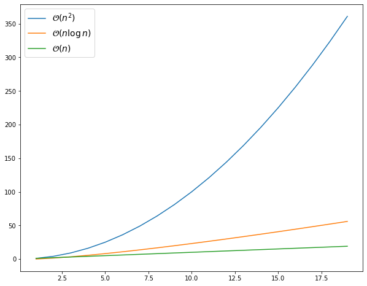

## 1. Le principe

La méthode "diviser pour régner" (*divide and conquer* en anglais) consiste à **diviser** un problème complexe en plusieurs sous-problèmes **plus simples**, puis à résoudre ces sous-problèmes séparément avant de les **combiner** pour obtenir la solution finale du problème initial. Cette méthode permet souvent de simplifier les calculs et de trouver des solutions plus rapidement que si on essayait de résoudre le problème dans son ensemble. Elle est utilisée dans de nombreux domaines, tels que l'informatique, les mathématiques et les sciences de l'ingénieur.

Cette méthode peut par exemple permettre de paralléliser le traitement des sous-problèmes, ce qui peut accélérer encore davantage la recherche de solutions.

Les inconvénients : la nécessité de décomposer un problème complexe en sous-problèmes, ce qui peut prendre du temps et nécessiter une certaine expertise. De plus, il peut être difficile de combiner les solutions des sous-problèmes pour obtenir une solution finale pour le problème initial. En conséquence, la méthode "diviser pour régner" peut ne pas être adaptée à tous les types de problèmes et peut ne pas être la plus efficace dans certains cas.

## 2. Exemple

**Nous avons déjà rencontré cette méthode** : recherche dichotomique dans une ABR et tous les algorithmes de type "dichotomie" (rencontrés en mathématiques par exemple).

L'**algorithme de tri fusion** (merge sort en anglais) est un algorithme de tri utilisé pour trier des éléments dans un ordre croissant ou décroissant. Il fonctionne en divisant récursivement la liste d'éléments à trier en sous-listes plus petites jusqu'à ce qu'il ne reste plus qu'une seule valeur dans chaque sous-liste. Ces sous-listes sont ensuite fusionnées en une seule liste triée en comparant les valeurs de chaque sous-liste et en plaçant les valeurs plus petites en premier.

Il s'agit d'une utilisation classique de la méthode "diviser pour régner" : à chaque étape, on appelle récursivement la même fonction, mais avec une liste dont la taille a été **divisée** par deux.

Voici une description de cet algorithme en pseudo-code :

```` title="Pseudo code"
fonction tri_fusion(liste : tableau d'entiers) -> tableau d'entiers
    si longueur(liste) <= 1
        retourner liste
    sinon
        milieu = longueur(liste) / 2
        liste_gauche = tri_fusion(liste[1...milieu])
        liste_droite = tri_fusion(liste[milieu+1...longueur(liste)])
        retourner fusionner(liste_gauche, liste_droite)

fonction fusionner(liste_gauche : tableau d'entiers, liste_droite : tableau d'entiers) -> tableau d'entiers
    // Initialiser les indices des sous-listes et de la liste originale
    i = 0
    j = 0
    liste_fus = []

    // Fusionner les deux sous-listes en comparant les éléments de chaque liste
    tant que i < longueur(liste_droite) et j < longueur(liste_gauche)
        si liste_droite[i] <= liste_gauche[j]
            ajouter liste_droite[i] à liste_fus
            i = i + 1
        sinon
            ajouter liste_gauche[j] à liste_fus
            j = j + 1

    // Copier les éléments restants de la liste_droite (s'il y en a)
    tant que i < longueur(liste_droite)
        ajouter liste_droite[i] à liste_fus
        i = i + 1

    // Copier les éléments restants de la liste_gauche (s'il y en a)
    tant que j < longueur(liste_gauche)
        ajouter liste_gauche[j] à liste_fus
        j = j + 1

    // Retourner la liste fusionnée
    retourner liste_fus
````

!!! Question "Exercice"

    Dérouler à la main l'exécution de cet algorithme avec la liste [5, 2, 4, 6, 1, 3]. Présenter ce déroulement sous forme d'un arbre.

<!--  -->

Pour utiliser cet algorithme, on peut appeler la fonction `tri_fusion` en lui passant la liste d'entiers à trier.

**Implémentation** en Python :

````Python
def tri_fusion(liste):
    if len(liste) <= 1:
        return liste
    else:
        milieu = len(liste) // 2
        liste_gauche = tri_fusion(liste[:milieu])
        liste_droite = tri_fusion(liste[milieu:])
        return fusionner(liste_gauche, liste_droite)


def fusionner(liste_gauche, liste_droite):
    # Initialiser les indices des sous-listes et de la liste originale
    i = 0
    j = 0
    liste_fus =  []

    # Fusionner les deux sous-listes en comparant les éléments de chaque liste
    while i < len(liste_droite) and j < len(liste_gauche):
        if liste_droite[i] <= liste_gauche[j]:
            liste_fus.append(liste_droite[i])
            i = i + 1
        else:
            liste_fus.append(liste_gauche[j])
            j = j + 1
    # Copier les éléments restants de la liste_droite (s'il y en a)
    while i < len(liste_droite):
        liste_fus.append(liste_droite[i])
        i = i + 1

    # Copier les éléments restants de la liste_gauche (s'il y en a)
    while j < len(liste_gauche):
        liste_fus.append(liste_gauche[j])
        j = j + 1

    # Retourner la liste fusionnée
    return liste_fus
````

Test du programme en console :

````pycon
>>> liste = [5, 2, 4, 6, 1, 3]
>>> tri_fusion(liste)
>>> print(liste)
[1, 2, 3, 4, 5, 6]
````

**Visualisation** de l'exécution avec Python Tutor : 

<iframe width="100%" height="800" frameborder="0" src="https://pythontutor.com/iframe-embed.html#code=def%20tri_fusion%28liste%29%3A%0A%20%20%20%20if%20len%28liste%29%20%3C%3D%201%3A%0A%20%20%20%20%20%20%20%20return%20liste%0A%20%20%20%20else%3A%0A%20%20%20%20%20%20%20%20milieu%20%3D%20len%28liste%29%20//%202%0A%20%20%20%20%20%20%20%20liste_gauche%20%3D%20tri_fusion%28liste%5B%3Amilieu%5D%29%0A%20%20%20%20%20%20%20%20liste_droite%20%3D%20tri_fusion%28liste%5Bmilieu%3A%5D%29%0A%20%20%20%20%20%20%20%20return%20fusionner%28liste_gauche,%20liste_droite%29%0A%0A%0Adef%20fusionner%28liste_gauche,%20liste_droite%29%3A%0A%20%20%20%20%23%20Initialiser%20les%20indices%20des%20sous-listes%20et%20de%20la%20liste%20originale%0A%20%20%20%20i%20%3D%200%0A%20%20%20%20j%20%3D%200%0A%20%20%20%20liste_fus%20%3D%20%20%5B%5D%0A%0A%20%20%20%20%23%20Fusionner%20les%20deux%20sous-listes%20en%20comparant%20les%20%C3%A9l%C3%A9ments%20de%20chaque%20liste%0A%20%20%20%20while%20i%20%3C%20len%28liste_droite%29%20and%20j%20%3C%20len%28liste_gauche%29%3A%0A%20%20%20%20%20%20%20%20if%20liste_droite%5Bi%5D%20%3C%3D%20liste_gauche%5Bj%5D%3A%0A%20%20%20%20%20%20%20%20%20%20%20%20liste_fus.append%28liste_droite%5Bi%5D%29%0A%20%20%20%20%20%20%20%20%20%20%20%20i%20%3D%20i%20%2B%201%0A%20%20%20%20%20%20%20%20else%3A%0A%20%20%20%20%20%20%20%20%20%20%20%20liste_fus.append%28liste_gauche%5Bj%5D%29%0A%20%20%20%20%20%20%20%20%20%20%20%20j%20%3D%20j%20%2B%201%0A%20%20%20%20%23%20Copier%20les%20%C3%A9l%C3%A9ments%20restants%20de%20la%20liste_droite%20%28s'il%20y%20en%20a%29%0A%20%20%20%20while%20i%20%3C%20len%28liste_droite%29%3A%0A%20%20%20%20%20%20%20%20liste_fus.append%28liste_droite%5Bi%5D%29%0A%20%20%20%20%20%20%20%20i%20%3D%20i%20%2B%201%0A%0A%20%20%20%20%23%20Copier%20les%20%C3%A9l%C3%A9ments%20restants%20de%20la%20liste_gauche%20%28s'il%20y%20en%20a%29%0A%20%20%20%20while%20j%20%3C%20len%28liste_gauche%29%3A%0A%20%20%20%20%20%20%20%20liste_fus.append%28liste_gauche%5Bj%5D%29%0A%20%20%20%20%20%20%20%20j%20%3D%20j%20%2B%201%0A%0A%20%20%20%20%23%20Retourner%20la%20liste%20fusionn%C3%A9e%0A%20%20%20%20return%20liste_fus%0A%0A%23%20Cr%C3%A9er%20une%20liste%20d'entiers%20%C3%A0%20trier%0Aliste%20%3D%20%5B5,%202,%204,%206,%201,%203%5D%0A%0A%23%20Trier%20la%20liste%20en%20utilisant%20l'algorithme%20de%20tri%20fusion%0Aliste%20%3D%20tri_fusion%28liste%29%0A%0A%23%20Afficher%20la%20liste%20tri%C3%A9e%0Aprint%28liste%29%20%20%23%20Affiche%20%3A%20%5B1,%202,%203,%204,%205,%206%5D%0A&codeDivHeight=400&codeDivWidth=350&cumulative=false&curInstr=0&heapPrimitives=nevernest&origin=opt-frontend.js&py=3&rawInputLstJSON=%5B%5D&textReferences=false"> </iframe>

### Complexité de l'algorithme

L'aspect "dichotomique" de l'algorithme correspond à une complexité en $\log_2 n$, où $n$ est la taille de la liste à trier. Cependant, la fonction de fusion de deux listes triées est, elle en $\mathcal{O}(n)$.

Au final, on a donc le résultat suivant :

!!! important "Complexité de l'algorithme de tri fusion"

    La complexité (temporelle) de l'algorithme de tri fusion est en $\mathcal{O}(n\log n)$, où $n$ est la taille de la liste à trier.

    Il s'agit donc d'une complexité **quasi-linéaire**.

<!--  -->

Comme nous l'avons vu dans les rappels d'algorithmique, une telle complexité est bien meilleure qu'une complexité quadratique et moins bonne qu'une complexité linéaire, comme illustré ci-dessous.



Pour rappel, les algorithmes de tri étudiés en première (tri par insertion et tri pas sélection) sont de coût quadratique dans le pire des cas.