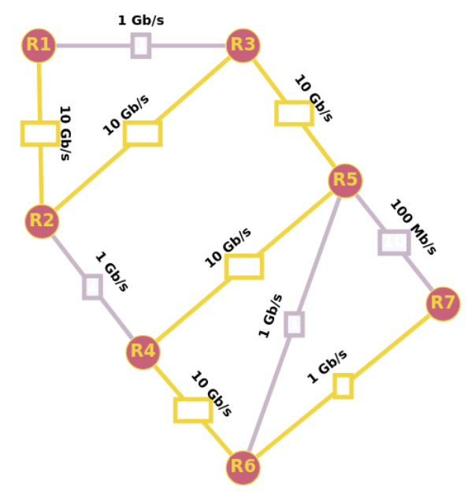

## 1. Introduction aux protocoles de routage

Les protocoles de routage sont des **algorithmes** utilisés par les équipements réseau pour acheminer les données d'un point à un autre dans un réseau informatique. Ils permettent de déterminer **la meilleure route à suivre** pour atteindre la destination finale et de transmettre les données de manière efficace et fiable.

Il existe plusieurs types de protocoles de routage, qui peuvent être classés selon leur mode de fonctionnement :

* **Les protocoles de routage statiques** : dans ce cas, les routes sont configurées manuellement par l'administrateur réseau et ne sont pas modifiées par la suite. Le protocole de routage statique est généralement utilisé dans les petits réseaux ou lorsque la topologie du réseau est stable.

* **Les protocoles de routage dynamiques** : dans ce cas, les routes sont déterminées de manière automatique grâce à l'échange de messages entre les équipements réseau. Les protocoles de routage dynamiques sont utilisés dans les réseaux de grande envergure ou lorsque la topologie du réseau est souvent modifiée.

* **Les protocoles de routage hybrides** : il s'agit d'une combinaison des protocoles de routage statiques et dynamiques, avec une utilisation mixte de routes configurées manuellement et de routes déterminées de manière automatique.

Les protocoles de routage sont utilisés dans tous les types de réseaux, qu'il s'agisse de réseaux locaux (LAN), de réseaux étendus (WAN) ou de réseaux privés virtuels (VPN). Ils jouent un rôle crucial dans la communication entre différents équipements réseau et dans la connectivité globale d'un réseau.

*On s'intéresse ici seulement à deux exemples de protocoles de routages dynamiques : le protocole RIP et le protocole OSPF.*

!!! note "Définition : protocole de routage"
    Un protocole de routage est un algorithme utilisé par les équipements réseau pour acheminer les données d'un point à un autre dans un réseau informatique.
<!--  -->

## 2. Protocoles de routage dynamiques : généralités

Le **protocole de routage dynamique** est un type de protocole de routage où les routes sont déterminées de manière automatique par les équipements réseau en échangeant des informations de routage entre eux. Cela signifie que les équipements réseau sont capables de mettre à jour leurs **tables de routage** en fonction des changements dans la topologie du réseau.

!!! note "Définition : table de routage"
    Une table de routage est une liste des routes configurées sur un équipement réseau. Elle contient les informations de routage nécessaires pour acheminer les données vers une destination spécifique.
<!--  -->

Il existe plusieurs protocoles de routage dynamiques, tels que RIP (Routing Information Protocol) et OSPF (Open Shortest Path First). Chacun de ces protocoles utilise des algorithmes différents pour déterminer la route optimale à suivre pour atteindre une destination. Par exemple, RIP utilise le **nombre de sauts** comme critère de sélection, tandis que OSPF utilise le **coût** de la route.

Le protocole de routage dynamique présente plusieurs avantages par rapport au protocole de routage statique :

- Flexibilité : les équipements réseau sont capables de s'adapter aux changements de topologie du réseau en mettant à jour leurs tables de routage en temps réel, ce qui permet une meilleure tolérance aux erreurs et une meilleure robustesse.

- Scalabilité : les protocoles de routage dynamiques sont adaptés aux réseaux de grande envergure, car ils permettent une gestion automatisée des routes dans tout le réseau.

- Robustesse : en cas de problème sur une route, les protocoles de routage dynamiques peuvent trouver une route alternative pour atteindre la destination, ce qui réduit les temps de panne.

## 3. Zoom sur le protocole RIP

Le protocole RIP (Routing Information Protocol) est un protocole de routage dynamique qui utilise l'algorithme à *vecteur de distance* pour déterminer la route optimale à suivre pour atteindre une destination. Dans le protocole RIP, chaque équipement réseau possède une table de routage qui contient la liste des destinations et le nombre de sauts (ou "hops") nécessaires pour atteindre ces destinations. L'objectif est de minimiser le nombre de sauts pour atteindre une destination.

Pour mettre à jour ses informations de routage, un équipement réseau envoie périodiquement toutes les 30 secondes (par défaut) un message de diffusion à tous ses voisins, contenant la liste des routes qu'il connaît. Les équipements réseau voisins reçoivent ce message et mettent à jour leurs propres tables de routage en fonction des informations reçues. Si un équipement réseau reçoit une route plus courte pour atteindre une destination que celle enregistrée dans sa table de routage, il met à jour sa table de routage en conséquence.

Plus précisément : 

!!! danger "Algorithme à vecteur de distance"
    
    1. Chaque équipement réseau maintient une table de routage composée d’une adresse destination, de l’adresse du routeur qui permet de l’atteindre (**passerelle** ou **gateway**) depuis le routeur de la table de routage et de la distance (nombre de sauts) pour atteindre la destination via ce routeur.
    2. Chaque équipement réseau échange régulièrement un **vecteur de distances** avec ses voisins immédiats. Il s'agit d'une liste des routes qu'il connaît, avec le nombre de sauts pour atteindre chaque destination.
    3. Lorsqu'un équipement réseau reçoit un vecteur de distance de l'un de ses voisins, il met à jour sa propre table de routage en y ajoutant la distance (nombre de sauts) depuis son propre équipement jusqu'au voisin. Si la distance est inférieure à celle indiquée dans sa propre table de routage, l'équipement réseau met à jour sa table de routage en conséquence.
    4. Lorsqu'un équipement réseau souhaite envoyer un paquet à une destination, il regarde dans sa table de routage et choisit la route qui nécessite le moins de sauts pour atteindre la destination. Si plusieurs routes ont le même nombre de sauts, l'équipement réseau en choisit une au hasard.
    5. Si l'équipement réseau ne trouve pas de route vers la destination dans sa table de routage, il envoie le paquet à un équipement réseau "par défaut" (généralement le routeur de l'opérateur de réseau), qui essaiera à son tour de trouver une route vers la destination.
    6. Si un routeur ne reçoit pas pendant 3 minutes d'information de la part d'un routeur qui lui avait auparavant communiqué sa table de routage, ce routeur est considéré comme en panne, et toutes les routes passant par lui sont affectées de la distance infinie : 16.
<!--  -->

!!! example "Exemple"
    
    

    Dans l’exemple ci-dessus, le routeur A reçoit le vecteur transmis par le routeur B.

    * Pour le routeur 11, la table de routage du routeur A contient déjà une distance à 0 donc cette entrée de la table de routage reste inchangée.
    * Pour le routeur 27, la table de routage du routeur A contient une route avec une distance de 6. La distance de 2 incrémentée de 1, pour compter le routeur B qui sera en plus à traverser, est plus intéressante. L’entrée de la table de routage du réseau 27 est mise à jour avec une distance à 3 et le prochain routeur traversé qui devient le routeur B.
    * Pour le réseau 30, la table de routage du routeur A ne contenait pas de route donc l’entrée est ajoutée avec l’incrémentation de la distance de 1 et le prochain routeur qui est alors B.
    * Pour le réseau 33, la table de routage du routeur A contient une route avec une distance de 4 donc la distance incrémentée de 1 n’étant pas inférieure à 4, la table de routage du routeur A n’est pas mise à jour.
    * Pour le réseau 35, la table de routage du routeur A contient une route avec une distance de 3 donc la distance incrémentée de 1 n’étant pas inférieure à 3, la table de routage du routeur A n’est pas mise à jour.

Le protocole RIP a l'avantage d'être simple à configurer et à utiliser, mais il présente plusieurs inconvénients :

- le protocole RIP est limité à un maximum de 15 sauts pour atteindre une destination, ce qui le rend peu adapté aux réseaux de grande envergure. C'est pour cette raison que la *distance infinie* (16) est utilisée pour indiquer que la route n'est pas accessible.
- le protocole RIP ne tient pas compte de la charge du réseau, ni de la qualité du lien. Il est donc possible que des routes moins optimales soient utilisées, ce qui peut entraîner des problèmes de performance.
- avec ce protocole, les routeurs n'ont pas connaissance de la topologie du réseau. Ils ne peuvent donc pas détecter les boucles de routage et peuvent donc être amenés à envoyer des paquets en boucle.

## 4. Zoom sur le protocole OSPF

### 4.1. Principe

Le protocole OSPF (Open Shortest Path First) est un protocole de routage dynamique qui utilise l'algorithme à *état de lien* pour déterminer la route optimale à suivre pour atteindre une destination. Dans le protocole OSPF, chaque équipement réseau possède une table de routage qui contient la liste des destinations et le **coût** de la route pour atteindre ces destinations.

Pour mettre à jour ses informations de routage, un équipement réseau envoie périodiquement des messages à ses voisins, contenant des informations sur les routes qu'il connaît. Les équipements réseau voisins reçoivent ces messages et mettent à jour leurs propres tables de routage en fonction des informations reçues. Si un équipement réseau reçoit une route plus courte pour atteindre une destination que celle enregistrée dans sa table de routage, il met à jour sa table de routage en conséquence.

Plus précisément :

!!! danger "Algorithme à état de lien"
    
    1. Chaque équipement réseau maintient une table de routage, qui indique le coût de la route vers chaque réseau connu. Le coût de la route est généralement défini en fonction du type de lien utilisé pour relier les équipements réseau (par exemple, un lien Ethernet a un coût inférieur à un lien Modem).
    2. Chaque équipement réseau échange régulièrement des informations d'état de lien avec ses voisins immédiats. Ces informations comprennent le coût de chaque lien et les réseaux atteignables par chaque voisin.
    3. Lorsqu'un équipement réseau reçoit des informations d'état de lien d'un de ses voisins, il met à jour sa propre table de routage en y ajoutant le coût de la route depuis son propre équipement jusqu'au voisin. Si le coût est inférieur à celui indiqué dans sa propre table de routage, l'équipement réseau met à jour sa table de routage en conséquence.
    4. Lorsqu'un équipement réseau souhaite envoyer un paquet à une destination, il regarde dans sa table de routage et choisit la route qui a le coût le plus faible pour atteindre la destination. Si plusieurs routes ont le même coût, l'équipement réseau en choisit une au hasard.
    5. Si l'équipement réseau ne trouve pas de route vers la destination dans sa table de routage, il envoie le paquet à un équipement réseau "par défaut" (généralement le routeur de l'opérateur de réseau), qui essaiera à son tour de trouver une route vers la destination.

Le protocole OSPF a l'avantage de s'adapter rapidement en cas de changements de topologie du réseau, grâce à son algorithme à état de lien qui permet de mettre à jour les informations de routage de manière ciblée. Il est également adapté aux réseaux de grande envergure.

Dans ce protocole, chaque routeur possède la connaissance de la topologie du réseau. Il est donc possible de détecter les boucles de routage et de les éviter.

Ce protocole permet une gestion automatisée des routes dans le réseau et offre une meilleure tolérance aux erreurs et une meilleure robustesse que le protocole RIP. Cependant, il nécessite une configuration plus complexe et peut entraîner une consommation de ressources supérieure.

### 4.2. Calcul du coût d'une route

On peut classer les différents types de liaisons en fonction de leur débit théorique :

| Type de liaison | Débit théorique |
|-----------------|-----------------|
| Modem           | 56 Kbit/s       |
| Bluetooth       | 3 Mbit/s        |
| Ethernet        | 10 Mbit/s       |
| Wifi            | 54 Mbit/s       |
| 4G              | 100 Mbit/s      |
| Fast Ethernet   | 100 Mbit/s      |
| FFTH (fibre)    | 10 Gbit/s        |
| 5G              | 20 Gbit/s        |

Le coût d'une route est défini en fonction du débit théorique de la liaison utilisée pour relier les équipements réseau. Plus le débit est élevé, plus le coût de la route est faible.

L'idée du protocole OSPF est de **pondérer** chaque trajet entre routeurs (comptant simplement pour «1» dans le protocole RIP) par **une valeur de coût inversement proportionnelle au débit** de transfert.

Par exemple, si le débit $d$ est exprimé en $bits/s$, on peut calculer le coût de chaque liaison par la formule :

$$
\text{coût} = \frac{10^8}{d}
$$

Cette formule de calcul peut être différente suivant les exercices et sera systématiquement redonnée. La valeur du débit étant au dénominateur, la valeur du coût sera **inversement proportionnelle** au débit.

Avec cette convention, une route entre deux routeurs reliés en Fast Ethernet (100 Mbits/s) aura un coût de 1, une liaison wifi de 54 Mbits/s aura un coût de 1,85 environ et une liaison fibre optique de 10 Gbits/s aura un coût de 0,01.

### 4.3. Lien avec les graphes

Le protocole OSPF utilise un algorithme de routage qui s'appuie sur les graphes. En effet, le réseau peut être modélisé par un graphe étiqueté et non orienté, où chaque routeur est un sommet et chaque lien est une arête.

Les étiquettes des arêtes sont les coûts des routes entre les routeurs.

Pour calculer le plus court chemin du routeur en question à toutes les destinations possibles, l’algorithme utilisé est celui de **Dijkstra**. Ainsi, chaque routeur a la vue des plus courts chemins en termes de coûts partant de lui-même.

!!! example "Exemple : Un cas simple"
    On considère le réseau représenté par le graphe ci-dessous et la table d'état des liens commune à tous les routeurs à un instant donné.

    

    L’algorithme de Dijkstra évalue le coût de chaque route entre A et D. La route A-B-C-D a un coût de $1 + 1 + 2 = 4$. La route A-E-D qui serait choisie par le protocole RIP a un coût de $50 + 1 = 51$ donc l’algorithme de Dijkstra choisira la route A-B-C-D. 
    
    Sur un réseau de petite taille, la route choisie par l’algorithme Dijkstra peut être trouvée à la main comme dans l’exemple ci-dessus.

Pour les cas plus complexes, on utilise l'algorithme de Dijkstra. La vidéo ci-dessous permet d'en comprendre le fonctionnement.

<iframe title="Algorithme de Dijkstra" src="https://tube-sciences-technologies.apps.education.fr/videos/embed/f3448934-c01b-431c-9667-9ec2df2cfd04" allowfullscreen="" sandbox="allow-same-origin allow-scripts allow-popups" width="560" height="315" frameborder="0"></iframe>

!!! example "Exemple : Un cas plus complexe"

    On considère un réseau modélisé par le graphe étiqueté ci-dessous :

    

    Nous cherchons à déterminer le chemin le plus rapide entre R1 et R7. L'application [graphonline](http://graphonline.ru/fr?graph=BPTnrZPMWqlGXaGe){target=_blank} permet de le faire visuellement via le menu *Algorithmes / plus court chemin avec l'algorithme de Djisktra*.

    

    Contrairement à RIP, le chemin qu'OSPF nous indiquera sera $R1 \rightarrow R2 \rightarrow R3 \rightarrow R5 \rightarrow R4 \rightarrow R6 \rightarrow R7$. Ce chemin n'est clairement pas le plus efficace en termes de sauts mais est le plus rapide en termes de débit car il n'exploite pratiquement que des liaisons à 10 Gb/s.

    Application "à la main" de l'algorithme de Dijkstra sur cet exemple. On utilise ici un calcul du coût en utilisant la formule $c = \frac{10^9}{d}$ avec $d$ le débit en $bits/s$. Ainsi :

    * 1 Gb/s sera affecté du poids 1
    * 10 Gb/s sera affecté du poids 0.1
    * 100 Mb/s sera affecté du poids 10

    Nous dressons un tableau. A chaque nouvelle ligne, on calcule le coût total vers les destinations possibles et on ne retient que le plus petit (en gras) que l'on marque sur une nouvelle ligne.

    Pour empêcher les retours, une fois une destination choisie (en gras), on désactive tout le reste de la colonne (avec des x).

    | R1 | R2 | R3 | R4 | R5 | R6 | R7 | Choix |
    |----|----|----|----|----|----|----|----|
    | **0-R1**  |  - | -  | -  | -  | -  | -  | R1 (0) |
    | x  | **0,1-R1**  | 1-R1  | -  | -  | -  | -  | R2 (0,1) |
    | x  | x  | **0,2-R2**  | 1,1-R2  | -  | -  | -  | R3 (0,2) |
    | x  | x  | x  | -  | **0,3-R3**  | -  | -  | R5 (0,3) |
    | x  | x  | x  | **0,4-R5**  | x  | 1,3-R5  | 10,3-R5  | R4 (0,4) |
    | x  | x  | x  | x  | x  | **0,5-R4**  | -  | R6 (0,5) |
    | x  | x  | x  | x  | x  | x  | **1,5-R6**  | R7 (1,5) |
    
    Dans le tableau, on indique des couples distance-origine : ainsi 0,5-R4 dans la colonne R6 signifie que R6 est à une distance minimum de 0,5 du départ en provenance de R4. On peut ainsi reconstituer l'itinéraire optimal en partant de R7 et en remontant à l'envers en utilisant le champ origine :

    $$R1 \rightarrow R2 \rightarrow R3 \rightarrow R5 \rightarrow R4 \rightarrow R6 \rightarrow R7$$
    
    avec un poids total minimum de 1,5.
<!--  -->

!!! question "Exercice"
    On reprend le graphe ci-dessus, mais la liaison R4-R5 est maintenant indisponible. Déterminer le chemin le plus rapide entre R1 et R7 en appliquant l'algorithme de Dijkstra.

## Conclusion

Dans ce cours, nous avons étudié les protocoles de routage, qui permettent de déterminer comment acheminer les paquets de données d'une source à une destination à travers un réseau.

Les protocoles de routage dynamique permettent une gestion automatisée des routes dans le réseau, en échangeant des informations de routage avec les équipements voisins. Nous avons vu deux protocoles de routage dynamique courants : le protocole RIP (Routing Information Protocol), qui se base sur le nombre de sauts pour choisir la route la plus courte et le protocole OSPF (Open Shortest Path First), qui se base sur le coût de la route pour choisir la route la plus courte.

Le protocole OSPF est plus efficace que le protocole RIP : si une route choisie par le protocole RIP est plus courte en termes de sauts, elle peut contenir un lien avec une bande passante très faible. Par contre, les calculs de plus courts chemins du protocole OSPF sont plus lourds et les formats de messages ainsi que les échanges sont plus complexes que le protocole RIP.

Ce dernier n’est plus utilisé aujourd’hui, mais il est relativement simple, ce qui permet de l’étudier en classe terminale

Dans l'avenir, il est probable que les protocoles de routage évoluent pour s'adapter aux nouvelles technologies et aux besoins croissants en matière de connectivité et de mobilité. Par exemple, les protocoles de routage pourront prendre en compte des considérations de qualité de service, de sécurité et de respect de l'environnement.